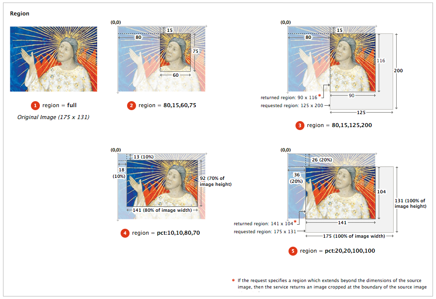
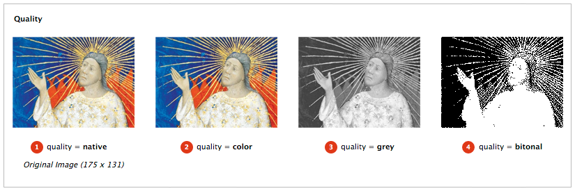
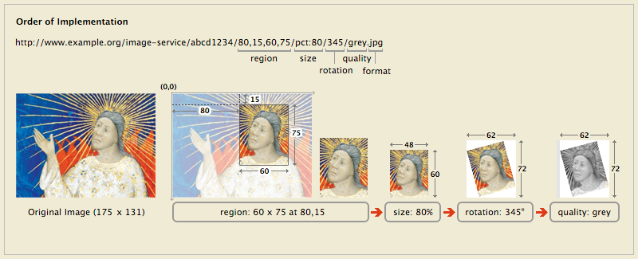

<style>
.usage { margin: 0px; padding-top: 0px; padding-bottom: 2px; font-style: italic; }
dd ul li { margin: 0px; padding: 0px; }
dd ul { margin: 0px; padding-top: 0px; padding-bottom: 0px }
dt {font-weight: bold;}

.examplelist li {
  margin-bottom: 8px;
}

.examplelist li code {
  background: #eee;
  border: 1px dashed #bbb;
  padding: 3px;  
}

.CodeRay {background: #eee; border: 1px dashed #bbb; padding-left: 5px ; margin-left: 30px;}
.string {color: #209020;}
.comment {font-style: italic; color: #909090;}
.key {color: #202090;}
.integer {color: #902020;}
.error {color: red; font-weight: bold; font-size: +1;}

pre {
  margin-top: 8px; 
  margin-bottom: 8px;
}

.urltemplate { 
  background: #eee; 
  border: 1px dashed #bbb; 
  padding-left: 5px ; 
  margin-left: 30px;
  margin-right: 30px; 
  padding-top: 5px; 
  padding-bottom: 5px; 
}


body { line-height: 1.1;}

.specbody { 
  margin-left: 10px;
  margin-right: 10px;
}

.names { margin-top: 2px;}
.names li { padding-top: 0px; line-height: 1.1; list-style: none;}

p { margin-top: 8px; margin-bottom: 8px;}

.sub-pages-container .presentation-api .names li {
  line-height: 1.1;
  padding-left: 0;
}

.specbody h2 {
  color: #2f353e;
  font-family: 'Raleway', Arial, sans-serif;
  font-weight: 300;
  letter-spacing: 1px;
  margin-top: 10px;
}

.specbody h3 {
  margin-top: 10px;
}

.specbody h4 {
  margin-top: 10px;
}

.mytoc ol {
  margin: 0px;
  margin-top: 2px;
}

dt {
  margin-top: 8px;
}

.rfc {
  color: #d55;
  font-variant: small-caps;
  font-style: normal;
  font-size: 1.2em;
}

.legend { 
  width: 50%;
}

table {
  border: 1px solid black;
}

tr {
  border: 1px solid #666;
}

td, th {
  border: 1px solid #666;
  padding: 3px;
}

</style>

<div class="specbody">

## Status of this Document

__This version:__ {{ page.major }}.{{ page.minor }}.{{ page.patch }}-{{ page.pre }}

__Latest stable version:__ {{ site.image_api.latest.major }}.{{ site.image_api.latest.minor }}.{{ site.image_api.latest.patch }}

_Copyright © 2012-2014 Editors and contributors. Published by the IIIF under the CC-BY license._

**Editors**

  * Michael Appleby, _Yale University_
  * Robert Sanderson, _Stanford University_
  * Jon Stroop, _Princeton University_
  * Simeon Warner, _Cornell University_
  {: .names}

## Abstract

This document describes an image delivery API proposed by the International Image Interoperability Framework (IIIF) group. The IIIF image API specifies a web service that returns an image in response to a standard http or https request. The URI can specify the region, size, rotation, quality characteristics and format of the requested image. A URI can also be constructed to request basic technical information about the image to support client applications. The IIIF API was conceived of to facilitate systematic reuse of image resources in digital image repositories maintained by cultural heritage organizations. The API could be adopted by any image repository or service, and can be used to retrieve static images in response to a properly constructed URI.

Please send feedback to [iiif-discuss@googlegroups.com][1]

## Table of Contents

  1. [Audience](#audience)
  2. [URI Syntax](#url-syntax)
      1. [Image Request URI Syntax](#image-request-url-syntax)
      2. [Image Information Request URI Syntax](#image-information-request-url-syntax)
  3. [Identifier](#identifier)
  4. [Image Request Parameters](#image-request-parameters)  
      1. [Region](#region)
      2. [Size](#size)
      3. [Rotation](#rotation)
      4. [Quality](#quality)
      5. [Format](#format)
      6. [Order of Implementation](#order-of-implementation)
      7. [Canonical URI Syntax](#canonical-uri-syntax)
  5. [Information Requests](#information-requests)
      1. [Image Information Request](#image-information-request)
      2. [Information Request Extensions](#information-request-extensions)
  6. [Compliance Levels](#compliance-levels)
  7. [Server Responses](#server-responses)
      1. [Successful Responses](#successful-responses)
      2. [Error Conditions](#error-conditions)
  8. [Authentication](#authentication)
  9. [URI Encoding and Decoding](#url-encoding-and-decoding)
  10. [Security Considerations](#security-considerations)

## Appendices

  1. [Implementation Notes](#a-implementation-notes)
  2. [Versioning](#b-versioning)
  3. [Acknowledgments](#c-acknowledgments)
  4. [Change Log](#d-change-log)

##  1. Audience and Scope

This document is intended for developers building applications that share digital image assets. This includes:

  * Developers building digital image repositories who would like to offer services for easily sharing digital images with other repositories, web applications, or other software that uses images from the web.
  * Developers building web applications or software that want to retrieve images from compliant repositories.
  * A specifically targeted audience are developers and managers of digital image repositories, web applications and image tools at cultural heritage institutions, like museums, libraries and archives.

This specification concerns the use of the images by a client, but not management of the images by the server. It therefore covers how to respond to the requests given in a particular URI syntax. It does not cover methods of implementation such as rotation algorithms, transcoding, color management, compression, or how to respond to URIs that do not conform to the specified syntax. This allows flexibility for implementation in domains with particular constraints or specific community practices, while supporting interoperability in the general case. 

## 2. URI Syntax

The IIIF Image API can be called in two ways: 

 * Request an image, which may be part of a larger image 
 * Request a description of the image characteristics and functionality available for that image

Both convey the request's information in the path segments of the URI, rather than as query parameters. This makes responses easier to cache, either at the server or by standard web-caching infrastructure. It also permits a minimal implementation using pre-computed files in a matching directory structure.

There are four parameters shared by the requests, and other IIIF specifications:

| Name | Description |
| ---- | ----------- |
| scheme | Indicates the use of the http or https protocol in calling the service. |
| server | The host server on which the service resides. |
| prefix | The path on the host server to the service. This prefix is optional, but may be useful when the host server supports multiple services. The prefix _may_{: .rfc} contain multiple path segments, delimited by slashes, but all other special characters _must_{: .rfc} be encoded. See [Section 9 - URI Encoding and Decoding](#url-encoding-and-decoding) for more information. |
| identifier | The identifier of the requested image, expressed as a string. This may be an ark, URN, filename, or other identifier. Special characters _must_{: .rfc} be URI encoded. |
{: .image-api-table}

The combination of these parameters forms the image’s Base URI and identifies the underlying image content. It is constructed according to the following URI Template ([RFC6570][26]):

```
{scheme}://{server}{/prefix}/{identifier}
```
{: .urltemplate}

The behavior of HTTP requests on the Base URI is not defined by this specification, but is reserved for use in future IIIF specifications.  To allow for extensions, this specification does not define the server behavior when it receives requests that do not match either the Base URI or one of the described URI syntaxes below.


###  2.1. Image Request URI Syntax

The IIIF Image API URI for requesting an image _must_{: .rfc} conform to the following URI Template:

```
{scheme}://{server}{/prefix}/{identifier}/{region}/{size}/{rotation}/{quality}.{format}
```
{: .urltemplate}

For example:

```
http://www.example.org/image-service/abcd1234/full/full/0/native.jpg
```
{: .urltemplate}

The sections of the Image Request URI include region, size, rotation, quality and format parameters defining the characteristics of the returned image. These are described in detail in [Section 4 - Image Request Parameters](#image-request-parameters).

###  2.2. Image Information Request URI Syntax

The URI for requesting image information _must_{: .rfc} conform to the following URI Template:

```
{scheme}://{server}{/prefix}/{identifier}/info.json
```
{: .urltemplate}

For example:

```
http://www.example.org/image-service/abcd1234/info.json
```
{: .urltemplate}

For each image made available, the server, prefix and identifier components of the information request _must_{: .rfc} be identical to those for the image request described above.

##  3. Identifier

The API places no restrictions on the form of the identifiers that a server may use or support, although the identifier _must_{: .rfc} be expressed as a string. All special characters (e.g. ? or #) _must_{: .rfc} be URI encoded to avoid unpredictable client behaviors. The URI syntax relies upon slash (/) separators so any slashes in the identifier _must_{: .rfc} be URI encoded (aka. percent-encoded, replace / with %2F ). See discussion in [Section 9 - URI Encoding and Decoding](#url-encoding-and-decoding).

##  4. Image Request Parameters

All parameters described below are required for compliant construction of a IIIF image API URI. The sequence of parameters in the URI _must_{: .rfc} be in the order described below. The order of the parameters is also intended as the order of the operations by which the service should manipulate the image content. Thus, the image content is first extracted as a region of the source image, then scaled to the requested size, rotated and transformed into the color depth and format. This resulting image content is returned as the representation for the URI. Image and region dimensions in pixels are always given as an integer numbers. Intermediate calculations may use floating point numbers and the rounding method is implementation specific. Some parameters, notably percentages, may be specified with floating point numbers. These should have at most 10 decimal digits and consist only of decimal digits and “.” with a leading zero if less than 1.

###  4.1. Region

The region parameter defines the rectangular portion of the source image to be returned. Region can be specified by pixel coordinates, percentage or by the value “full”, which specifies that the entire region of the source image should be returned.

| Form |  Description |
| ------------------------ | ------------ |
| full                     | The complete image is returned, without any cropping. |
| x,y,w,h                  | The region of the source image to be returned is defined in terms of absolute pixel values. The value of x represents the number of pixels from the 0 position on the horizontal axis. The value of y represents the number of pixels from the 0 position on the vertical axis. Thus the x,y position 0,0 is the upper left-most pixel of the image. w represents the width of the region and h represents the height of the region in pixels.  |
| pct:x,y,w,h              | The region to be returned is specified as a sequence of percentages of the source image’s dimensions. Thus, x represents the number of pixels from the 0 position on the horizontal axis, calculated as a percentage of the source image’s width. w represents the width of the region calculated as a percentage of the source image’s width. The same applies to y and h respectively. These may be floating point numbers. |
{: .image-api-table}

If the request specifies a region which extends beyond the dimensions of the source image, then the service should return an image cropped at the boundary of the source image.

If the requested region's height or width is zero, or if the region is entirely outside the bounds of the source image, then the server _must_{: .rfc} return a 400 (bad request) status code.

Examples:

  1. `http://www.example.org/image-service/abcd1234/full/full/0/native.jpg`
  2. `http://www.example.org/image-service/abcd1234/80,15,60,75/full/0/native.jpg`
  3. `http://www.example.org/image-service/abcd1234/80,15,125,200/full/0/native.jpg`
  4. `http://www.example.org/image-service/abcd1234/pct:10,10,80,70/full/0/native.jpg`
  5. `http://www.example.org/image-service/abcd1234/pct:20,20,100,100/full/0/native.jpg`
  {: .examplelist}



###  4.2. Size

The size parameter determines the dimensions to which the extracted region is to be scaled.

| Form | Description |
|----------------|-----------------------|
| full           | The extracted region is not scaled, and is returned at its full size. |
| w,             | The extracted region should be scaled so that its width is exactly equal to w, and the height will be a calculated value that maintains the aspect ratio of the requested region. |
| ,h             | The extracted region should be scaled so that its height is exactly equal to h, and the width will be a calculated value that maintains the aspect ratio of the requested region. |
| pct:n          | The width and height of the returned image is scaled to n% of the width and height of the extracted region. The aspect ratio of the returned image is the same as that of the extracted region. |
| w,h            | The width and height of the returned image are exactly w and h. The aspect ratio of the returned image _may_{: .rfc} be different than the extracted region, resulting in a distorted image. |
| !w,h           | The image content is scaled for the best fit such that the resulting width and height are less than or equal to the requested width and height. The exact scaling _may_{: .rfc} be determined by the service provider, based on characteristics including image quality and system performance. The dimensions of the returned image content are calculated to maintain the aspect ratio of the extracted region. |
{: .image-api-table}

If the resulting height or width is zero, then the server _must_{: .rfc} return a 400 (bad request) status code.

The image server _may_{: .rfc} support scaling beyond the full size of the extracted region.

Examples:

  1. `http://www.example.org/image-service/abcd1234/full/full/0/native.jpg`
  2. `http://www.example.org/image-service/abcd1234/full/100,/0/native.jpg`
  3. `http://www.example.org/image-service/abcd1234/full/,100/0/native.jpg`
  4. `http://www.example.org/image-service/abcd1234/full/pct:50/0/native.jpg`
  5. `http://www.example.org/image-service/abcd1234/full/150,75/0/native.jpg`
  6. `http://www.example.org/image-service/abcd1234/full/!150,75/0/native.jpg`
  {: .examplelist}


###  4.3. Rotation

The rotation value represents the number of degrees of clockwise rotation from the original, and may be any floating point number from 0 to 360. Initially most services will only support 0, 90, 180 or 270 as valid values.

| Form | Description |
| ---- | ----------- |
| n    | The degrees of clockwise rotation from the original, from 0 up to 360. |
{: .image-api-table}

Examples:

  1. `http://www.example.org/image-service/abcd1234/full/full/0/native.jpg`
  2. `http://www.example.org/image-service/abcd1234/full/full/90/native.jpg`
  3. `http://www.example.org/image-service/abcd1234/full/full/180/native.jpg`
  4. `http://www.example.org/image-service/abcd1234/full/full/270/native.jpg`
  5. `http://www.example.org/image-service/abcd1234/full/full/22.5/native.jpg`
  {: .examplelist}


In most cases a rotation will change the width and height dimensions of the returned image file. The service _should_{: .rfc} return an image file that contains all of the image contents requested in the region and size parameters, even if the dimensions of the returned image file are different than specified in the size parameter. The image contents _should_{: .rfc} NOT be scaled as a result of the rotation, and there _should_{: .rfc} be no additional space between the corners of the rotated image contents and the bounding box of the returned image file.

For non-90-degree rotations the API does not specify the background color.

###  4.4. Quality

The quality parameter determines whether the image is delivered in color, greyscale or black and white.  

| Quality | Parameter Returned |
| ------- | ------------------ |
| native  | The image is returned using the server's default quality (e.g. color, grey or bitonal as below) for the image. |
| color   | The image is returned in full color. |
| grey    | The image is returned in greyscale, where each pixel is black, white or any shade of grey in between. |
| bitonal | The image returned is bitonal, where each pixel is either black or white. |
{: .image-api-table}

Examples:

  1. `http://www.example.org/image-service/abcd1234/full/600,/0/native.jpg`
  2. `http://www.example.org/image-service/abcd1234/full/600,/0/color.jpg`
  3. `http://www.example.org/image-service/abcd1234/full/600,/0/grey.jpg`
  4. `http://www.example.org/image-service/abcd1234/full/600,/0/bitonal.jpg`
  {: .examplelist}



###  4.5. Format

The format of the returned image is expressed as an extension at the end of the URI.  The list of supported formats is given in the `formats` property of the Image Information document.

| Extension | MIME Type |
| --------- | --------- |
| jpg | image/jpeg |
| tif | image/tiff |
| png | image/png |
| gif | image/gif |
| jp2 | image/jp2 |
| pdf | application/pdf |
{: .image-api-table}

Examples:

  1. `http://www.example.org/image-service/abcd1234/full/600,/0/native.jpg`
  2. `http://www.example.org/image-service/abcd1234/full/600,/0/native.png`
  3. `http://www.example.org/image-service/abcd1234/full/600,/0/native.tif`
  {: .examplelist}

### 4.6. Order of Implementation

The sequence of parameters in the URI is intended to express the order in which image manipulations are made against the original. This is important to consider when implementing the service because applying the same parameters in a different sequence will often result in a different image being delivered. The order is critical so that the application calling the service reliably receives the output it expects.

The parameters should be interpreted as if the the sequence of image manipulations were:

`Region THEN Size THEN Rotation THEN Quality THEN Format`



### 4.7. Canonical URI Syntax

There are several reasons why a canonical URI syntax is desirable:

  * It enables static, file-system based implementations, which will have only a single URI at which the content is available.
  * Caching becomes significantly more efficient, both client and server side, when the URIs used are the same between systems and sessions.
  * Response times can be improved by avoiding redirects from a requested non-canonical URI syntax to the canonical syntax by using the canonical form directly

In order to support the above requirements, clients should construct the image request URIs using to following canonical parameter values where possible.

| Parameter | Canonical value |
| --------- | --------------- |
| region    | "full" if the whole image is requested, otherwise the x,y,w,h description of the region. |
| size      | "full" if the native size is requested, otherwise the pixel dimensions w,h. |
| rotation  | An integer if possible, and trimming any trailing zeros in a decimal value. |
| quality   | "native" unless a quality that is different from the native quality is requested. |
| format    | Explicit format string required |
{: .image-api-table}

When the client requests an image, the server _may_{: .rfc} add a link header that indicates the canonical URI for that request:

```
Link: <http://iiif.example.com/server/full/full/0/native.jpg>;rel="canonical"
```
{: .urltemplate}

##  5. Information Request

The Image Information document contains both metadata about the image, such as maximum available height and width, and functionality available for it, such as the formats in which it may be retrieved.  The service _must_{: .rfc} return this information about the image. The request for technical information _must_{: .rfc} conform to the URI Template:

```
{scheme}://{server}{/prefix}/{identifier}/info.json
```
{: .urltemplate}

The syntax for the response is [JSON-LD][37]. The content-type of the response _must_{: .rfc} be either "application/json" (regular JSON), or "application/ld+json" (JSON-LD).  If the client explicitly wants the JSON-LD content-type, then it must specify this in an Accept header, otherwise the server must return the regular JSON content-type.

If the regular JSON content-type is returned, then it is _recommended_{: .rfc} that the server provide a link header to the context document. The syntax for the link header is below, and further [described in section 6.8 of the JSON-LD specification][38]. If the client requests "application/ld+json", the link header _may_{: .rfc} still be included but _must_{: .rfc} be ignored. The entity body is identical regardless of the content-type, including the @context field.

```
Link: <http://iiif.io/api/image/{{ site.image_api.latest.major }}/context.json>; rel="http://www.w3.org/ns/json-ld#context"; type="application/ld+json"
```
{: .urltemplate}

Servers _should_{: .rfc} send the Access-Control-Allow-Origin header with the value \* in response to information requests. The syntax is shown below and is described int the [CORS][41] specification. This header is required in order to allow the JSON responses to be used by Web applications hosted on different servers.
 
```
Access-Control-Allow-Origin: *
```
{: .urltemplate}

### 5.1. Image Information


The JSON in the response will include the following properties:

| Property | Required? | Description |
| -------- | --------- | ----------- |
| @context | Required | The context document that describes the semantics of the terms used in the document. This must be the URI: [http://iiif.io/api/image/{{ site.image_api.latest.major }}.{{ site.image_api.latest.minor }}/context.json] for version {{ site.image_api.latest.major }}.{{ site.image_api.latest.minor }} of the IIIF Image API. This document allows the response to be interpreted as RDF, using the [JSON-LD][29] serialization. |
| @id | Required | The Base URI of the image (as defined in [Section 2 - URI Syntax](#url-syntax)), including scheme, server, prefix and identifier without a trailing slash. |
| width | Required | The width of the source image. |
| height | Required | The height of the source image. | 
| protocol | Required | The URI "http://iiif.io/api/image" which can be used to determine that the document describes an image service which is a version of the IIIF Image API. |
| profile | Required | URI indicating the compliance level supported. Values as described in [Section 8 - Compliance Levels](#compliance-levels) |
| scale_factors | Optional | Some image servers support the creation of multiple resolution levels for a single image in order to optimize the efficiency in delivering images of different sizes. The scale_factors property expresses a set of resolution scaling factors. For example, a scale factor of 4 indicates that the service can efficiently deliver images at 25% of the height and width of the source image. |
| sizes | Optional | A set of dimensions that the server has available, expressed in the "w,h" syntax. This may be used to let a client know the sizes that are available when the server does not support requests for arbitrary sizes, or simply as a hint that requesting an image of this size may result in a faster response. |
| tile_width | Optional | Some image servers efficiently support delivery of predefined tiles enabling easy assembly of portions of the image. It is assumed that the same tile sizes are used for all scale factors supported. The tile_width element expresses the width of the predefined tiles. |
| tile_height | Optional | The tile_height element expresses the height of the predefined tiles. See description of tile_width. |
| formats | Optional | The set of image format parameter values available for the image. |
| qualities | Optional | The set of image quality parameter values available for the image. |
| supports | Optional | The set of additional features supported beyond those declared in the compliance document referenced in `profile` |
{: .image-api-table}

The set of features that may be specified in the `supports` property are:

| Feature Name | Description |
| -------- | ----------- |
| cors |  CORS HTTP headers are provided on all responses  |
| region_by_pct |  Regions of images may be requested by percentage  |
| region_by_px |   Regions of images may be requested by pixel dimensions  |
| rotation_arbitrary |   Rotation of images may be requested by degrees other than multiples of 90  |
| rotation_by_90s |   Rotation of images may be requested by degrees in multiples of 90  |
| size_by_forced_wh |   Size of images may be requested in the form "!w,h"  |
| size_by_h |   Size of images may be requested in the form ",h"  |
| size_by_pct |   Size of images may be requested in the form "pct:n"  |
| size_by_w |   Size of images may be requested in the form "w,"  |
| size_by_wh |   Size of images may be requested in the form "w,h"  |
{: .image-api-table}

If a property is not present in either the profile document or the `supports` property, then a client _must_{: .rfc} assume that the feature is not supported. 


The JSON response should conform to the format shown in the following example:

```javascript
{ 
  "@context" : "http://iiif.io/api/image/{{ site.image_api.latest.major }}/context.json", 
  "@id" : "http://www.example.org/image-service/abcd1234/1E34750D-38DB-4825-A38A-B60A345E591C", 
  "protocol" : "http://iiif.io/api/image",

  "width" : 6000, 
  "height" : 4000, 
  "scale_factors" : [ 1, 2, 4 ], 
  "sizes" : [ "150,100", "360,240", "3600,2400" ], 
  "tile_width" : 1024, 
  "tile_height" : 1024, 
  "formats" : [ "jpg", "png" ], 
  "qualities" : [ "native", "grey" ], 

  "profile" : "http://iiif.io/api/image/{{ site.image_api.latest.major }}/level1.json",
  "supports" : [
      "cors", "region_by_pct", "region_by_px", 
      "rotation_arbitrary", "rotation_by_90s",
      "size_by_forced_wh", "size_by_h", "size_by_pct", "size_by_w", "size_by_wh"
  ]
}
```

### 5.2 Extensions

Local additions to the image information document _may_{: .rfc} be specified in two ways:

1.  Extra properties _may_{: .rfc} be added to the document to provide information not defined in this specification. Clients _must_{: .rfc} ignore properties that are not understood.
2.  URIs _may_{: .rfc} be added to the supports list to cover features not defined in this specification, and similarly clients _must_{: .rfc} ignore URIs that are not understood.

```javascript
{
  "@context" : "http://iiif.io/api/image/{{ site.image_api.latest.major }}/context.json",
  // ...
  "documentation" : "http://www.example.com/my/documentation.html",
  // ...
  "supports" : ["http://www.example.com/my/feature.html", "cors"]
}
```

##  6. Compliance Levels

The Image Information document _must_{: .rfc} specify the extent to which the API is supported by including a compliance level URI in the `profile` property.  This URI links to a description of the highest compliance level for which all requirements are met.  This description is an instance of a Capabilities document, and _must_{: .rfc} be one of those given in [Image API Compliance][43].  A server _may_{: .rfc} declare different compliance levels for different images.

The compliance profile URI _may_{: .rfc} also be given in the HTTP Link header ([RFC5988][31]) with the parameter `rel=“profile”`, and thus a complete header might look like:

```
Link: <http://iiif.io/api/image/{{ site.image_api.latest.major }}/level1.json>;rel="profile"
```
{: .urltemplate}


##  7. Server Responses

###  7.1. Successful Responses

Servers may transmit HTTP responses with 200 (Successful) or 3xx (Redirect) status codes when the request has been successfully processed. If the status code is 200, then the entity-body _must_{: .rfc} be the requested image or information response. If the status code is 301, 302, 303, or 304, then the entity-body is unrestricted, but it is _recommended_{: .rfc} to be empty. If the status code is 301, 302, or 303 then the Location HTTP Header _must_{: .rfc} be set containing the URI of the image that fulfills the request. This enables servers to have a single canonical URI to promote caching of responses. Status code 304 is handled exactly as per the HTTP specification. Clients should therefore expect to encounter all of these situations and not assume that the entity-body of the initial response necessarily contains the image data.

###  7.2. Error Conditions

The order in which servers parse requests and detect errors is not specified. A request will fail on the first error encountered and return an appropriate http status code, with common codes given in the list below. It is recommended that the body of the error response includes a human-readable description of the error in either plain text or html.

| Error Code | Description |
| ---------- | ----------- |
| 400 Bad Request | This response is used when it is impossible for the server to fulfil the request, as the syntax of the request is incorrect.  For example, this would be used if the size parameter does not match any of the specified syntaxes. |
| 401 Unauthorized | Authentication is required and not provided. See Section 7 below for details. |
| 403 Forbidden | The user, authenticated or not, is not permitted to perform the requested operation. |
| 404 Not Found | The image resource specified by [identifier] does not exist, or the value of one or more of the parameters is not supported for this image. |
| 500 Internal Server Error | The server encountered an unexpected error that prevented it from fulfilling the request. |
| 501 Not Implemented | A valid IIIF request that is not implemented by this server. |
| 503 Service Unavailable | Used when the server is busy/temporarily unavailable due to load/maintenance issues. An alternative to connection refusal with the option to specify a back-off period. |
{: .image-api-table}

##  8. Authentication

This API does not specify whether the image server will support authentication or what mechanism it might use. In the case of "401 Unauthorized" HTTP error response, the content of the WWW-Authenticate header will depend on the authentication mechanism supported by the server. If the server supports HTTP Basic or Digest authentication then the header should follow [RFC2617][30], for example:

```
WWW-Authenticate: Basic realm="Images"
```
{: .urltemplate}

##  9. URI Encoding and Decoding

The URI syntax of this API relies upon slash (/) separators which _must_{: .rfc} NOT be encoded. Clients _must_{: .rfc} percent-encode special characters (the to-encode set below: percent and gen-delims of [RFC3986][32] except the colon) within the components of requests. For example, any slashes within the identifier part of the URI _must_{: .rfc} be percent-encoded. Encoding is necessary only for the identifier because other components will not include special characters.

```
to-encode = "/" / "?" / "#" / "[" / "]" / "@" / "%"
```
{: .urltemplate}

Upon receiving an API request, a server _must_{: .rfc} first split the URI path on slashes and then decode any percent-encoded characters in each component.

Additionally, if identifiers include any characters outside the US-ASCII set then the encoding to octets must be defined consistently on client and server, and the octets _must_{: .rfc} be percent-encoded. Percent-encoding other characters introduces no ambiguity but is unnecessary.

| Parameters | URI path |
| ---------- | -------- |
| identifier=id1 region=full size=full rotation=0 quality=native | id1/full/full/0/native |
| identifier=id1 region=0,10,100,200 size=pct:50 rotation=90 quality=native format=png | id1/0,10,100,200/pct:50/90/native.png |
| identifier=id1 region=pct:10,10,80,80 size=50, rotation=22.5 quality=color format=jpg | id1/pct:10,10,80,80/50,/22.5/color.jpg |
| identifier=bb157hs6068 region=full size=full rotation=270 quality=grey format=jpg | bb157hs6068/full/full/270/grey.jpg |
| identifier=ark:/12025/654xz321 region=full size=full rotation=0 quality=native | ark:%2F12025%2F654xz321/full/full/0/native |
| identifier=urn:foo:a123,456 region=full size=full rotation=0 quality=native | urn:foo:a123,456/full/full/0/native |
| identifier=urn:sici:1046-8188(199501)13:1%3C69:FTTHBI%3E2.0.TX;2-4 region=full size=full rotation=0 quality=native | urn:sici:1046-8188(199501)13:1%253C69:FTTHBI%253E2.0.TX;2-4/full/full/0/native |
| identifier=http://example.com/?54#a region=full size=full rotation=0 quality=native | http:%2F%2Fexample.com%2F%3F54%23a/full/full/0/native |
{: .image-api-table}

Servers which are incapable of processing arbitrarily encoded identifiers _should_{: .rfc} make their best efforts to expose only image identifiers for which typical clients will not encode any of the characters, and thus it is _recommended_{: .rfc} to limit characters in identifiers to letters, numbers and the underscore character.

##  10. Security Considerations

This API defines a URI syntax and the semantics associated with its components. The composition of URIs has few security considerations except possible exposure of sensitive information in URIs or revealing of browse/view behavior of users.

Server applications implementing this API must consider possible denial-of-service attacks, and authentication vulnerabilities based on DNS spoofing. Applications must be careful to parse incoming requests (URIs) in ways that avoid overflow or injection attacks.

Early sanity checking of URI’s (lengths, trailing GET, invalid characters, out-of-range parameters) and rejection with appropriate response codes is recommended.

## Appendices

###  A. Implementation Notes

  * For use cases that enable the saving of the image, it is _recommended_{: .rfc} to use the HTTP Content-Disposition header ([RFC6266][33]) to provide a convenient filename that distinguishes the image, based on the identifier and parameters provided.
  * This specification makes no assertion about the rights status of requested images or metadata, whether or not authentication has been accomplished. Please see the IIIF Metadata API for rights information.
  * This API does not specify how image servers fulfill requests, what quality the returned images will have for different parameters, or how parameters may affect performance. See the compliance document for more discussion.
  * Image identifiers that include the slash (/ %2F) or backslash (\ %5C) characters may cause problems with some HTTP servers. Apache servers from version 2.2.18 support the "AllowEncodedSlashes NoDecode" (link to ) configuration directive which will correctly pass these characters to client applications without rejecting or decoding them. Servers using older versions of Apache and local identifiers which include these characters will need to use a workaround such as internally translating or escaping slash and backslash to safe value (perhaps by double URI-encoding them).
  * As described in [Section 4.3 - Rotation](#rotation), in order to retain the size of the requested image contents, rotation will change the width and height dimensions of the returned image file. A formula for calculating the dimensions of the returned image file for a given rotation can be found here.

## B. Versioning

Starting with version 2.0, this specification follows [Semantic Versioning][25] with version numbers of the form "MAJOR.MINOR.PATCH" where: 

  * MAJOR version increment indicates incompatible API changes.
  * MINOR version increment indicates addition of functionality in a backwards-compatible manner.
  * PATCH version increment indicates backwards-compatible bug fixes.

This versioning system will be implemented in the following ways:

  * URIs for compliance and context will be updated with major versions only, and otherwise edited in place.
  * URIs for the specifications will be updated with major and minor versions, with patch versions edited in place.
  * The protocol URI does not change with versioning.

##  C. Acknowledgments

The production of this document was generously supported by a grant from the [Andrew W. Mellon Foundation][34].

Many thanks to  Ben Albritton, Michael Appleby, Matthieu Bonicel, Kevin Clarke, Tom Cramer, Ian Davis, Neil Jefferies, Scotty Logan, Sean Martin, Roger Mathisen, Lynn McRae, Willy Mene, Mark Patton, Petter Rønningsen, Stuart Snydman, and Brian Tingle for your thoughtful contributions to the effort and written feedback.  Thanks also to the members of the IIIF for their continuous engagement, innovative ideas and feedback. 

__TODO: Link to the community page__ [link]

##  D. Change Log

| Date | Editor |  Description |
| ---- | ------ | ------------ |
| 2013-09-17 | ssnydman | Version 1.1 released. |
| 2013-09-04 | ssnydman | Added @context to Image Information Request table in section 5. |
| 2013-06-26 | ssnydman | Changed quality parameter definitions in section 4.4. |
| 2013-06-17 | ssnydman | Draft release 1.1. [View change log][35]. |
| 2012-08-10 | ssnydman | Release 1.0 |
| 2012-07-13 | rsanderson | Incorporates responses to RFC feedback |
| 2012-03-09 | ssnydman | Initial release |
| 2012-04-13 | ssnydman | 0.2 after internal review and IIIF April Meeting |
| 2012-05-02 | ssnydman | RFC version |
{: .image-api-table}

</div>

   [1]: mailto:iiif-discuss%40googlegroups.com
   [25]: http://semver.org/
   [26]: http://tools.ietf.org/html/rfc6570
   [28]: http://library.stanford.edu/iiif/image-api/1.1/context.json
   [29]: http://www.json-ld.org/
   [30]: http://www.ietf.org/rfc/rfc2617
   [31]: http://tools.ietf.org/html/rfc5988
   [32]: http://www.ietf.org/rfc/rfc3986
   [33]: http://www.ietf.org/rfc/rfc6266
   [34]: http://www.mellon.org/
   [35]: http://iiif.io/change-log.html
   [36]: http://iiif.io/api/image/1.1/
   [37]: http://www.w3.org/TR/json-ld/
   [38]: http://www.w3.org/TR/json-ld/#interpreting-json-as-json-ld
   [39]: http://iiif.io#capabilities-request
   [40]: http://iiif.io#url-syntax-capabilities-request
   [41]: http://www.w3.org/TR/cors/
   [42]: http://www.w3.org/TR/json-ld/#the-context
   [43]: http://iiif.io/api/image/{{ site.image_api.latest.major }}
   


