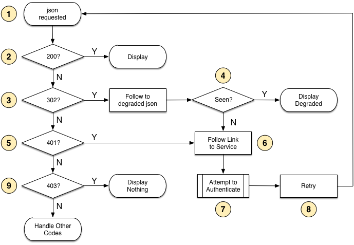

## Status of this Document
{:.no_toc}

__This Version:__ {{ page.major }}.{{ page.minor }}.{{ page.patch }}-{{ page.pre }}

__Beta Specification for Trial Use__
This is a work in progress. We are actively seeking implementations and feedback.  No section should be considered final, and the absence of any content does not imply that such content is out of scope, or may not appear in the future.  Please send any feedback to [iiif-discuss@googlegroups.com][iiif-discuss].
{: .alert}

**Editors:**

  * Michael Appleby, _Yale University_
  * Tom Crane, _Digirati_
  * Robert Sanderson, _Stanford University_
  * Jon Stroop, _Princeton University_
  * Simeon Warner, _Cornell University_
  {: .names}

_Copyright © 2012-2015 Editors and contributors. Published by the IIIF Consortium under the [CC-BY][cc-by] license._

----

## Table of Contents
{:.no_toc}

* Table of Discontent (will be replaced by macro)
{:toc}


## 1. Introduction

While open access to content is generally desirable, there are many situations in which users must authenticate and be authorized to interact with resources.  Privacy and regulation may restrict the ability to openly share content, or business models may require limiting access.

Authentication systems that span multiple domains are complex, particularly when the interaction is via a JavaScript application served from a domain other than the domain hosting the authentication service. Details such as passive mixed content (the mixture of HTTP and HTTPS), cross origin resource sharing (enabling the ability to request data from different domains), and the desire to avoid unnecessary authentication popups provide further challenges in this space.

This specification describes a framework in which existing authentication systems may be used to meet these needs. This framework provides discovery mechanisms for services that are modeled after the components of the OAuth2 workflow. It is agnostic about the details of the authentication protocol and underlying business logic for authorization.

Some access to content is generally better than no access. In the case of images, grayscale instead of color, a version with a watermark, a version with more compression, or a smaller size is likely better than no image at all. Providing this functionality is more complex than traditional yes-or-no access controls, and serving the correct image and associated image information for the degraded version is necessary to prevent web caches from providing incorrect content. The same notion of degraded access might apply for other types of resources.

Please send feedback to [iiif-discuss@googlegroups.com][iiif-discuss]

### 1.1. Terminology

This specification distinguishes between Content Resources, such as images or videos, and Description Resources which conform to IIIF specifications, such as [Image API][image-api] image information (info.json) and [Presentation API][prezi-api] collection or manifest resources.  The reason for this distinction is that contemporary web browsers require different authentication methods to be used for resources that are requested and rendered by the browser (e.g. images), versus resources that are directly requested by JavaScript and processed (e.g. JSON via XMLHttpRequest).

The key words _MUST_, _MUST NOT_, _REQUIRED_, _SHALL_, _SHALL NOT_, _SHOULD_, _SHOULD NOT_, _RECOMMENDED_, _MAY_, and _OPTIONAL_ in this document are to be interpreted as described in [RFC 2119][rfc-2119].

### 1.2. Authentication for Content Resources

Content Resources, such as images, are generally secondary resources embedded in a web page or application. In the case of web pages, images are embedded via the HTML `img` tag, and are retrieved via additional HTTP requests by the browser. When a user cannot load a web page, it is possible — and a generally accepted behavior — to redirect the user to another page and offer the opportunity to authenticate. This redirection is not possible for embedded Content Resources, and the user is simply presented with a broken image icon. Instead, authentication must be accomplished via cookies.

### 1.3. Authentication for Description Resources

A different authentication pattern, using a token, is required for IIIF JSON-based Description Resources, such as Presentation API manifests or annotations, services for managing content, Image API image information documents (info.json) and so forth.  These resources are typically requested via XMLHttpRequest, which cannot send cookies across domains.


## 2. Authentication Services

Authentication services follow the pattern described in the IIIF [Linking to External Services][ext-services] note, and are referenced in one or more `service` blocks from the descriptions of the resources that are protected. There is a primary login service profile for authenticating users, and it has related services nested within its description.  The related services include a mandatory access token service, and optional client identity and logout services.

### 2.1. Login Service

In order to have the client prompt the user to login, it must display part of the content provider's user interface. The login service is a link to that user interface.

#### 2.1.1. Service Description

The Description Resource _MUST_ include a service using the following template:


{
  // ...
  "service" : {
    "@context": "http://iiif.io/api/auth/{{ page.major }}/context.json",
    "@id": "https://authentication.example.org/login",
    "profile": "http://iiif.io/api/auth/{{ page.major }}/login",
    "label": "Login to Example Service",
    "service": [
      // Related services ...
    ]
  }
}


Where the `@id` field _MUST_ be present and contains the URI that the client should load to allow the user to authenticate. The `@context` field _MUST_ be present with the value `http://iiif.io/api/auth/{{ page.major }}/context.json`, specifying the context to resolve the keys into RDF if necessary. The value of `profile` _MUST_ be `http://iiif.io/api/auth/{{ page.major }}/login`, allowing clients to understand the use of the service. The `label` property _SHOULD_ be present and its value is to be shown to the user to initiate the loading of the authentication service.  The `service` field _MUST_ be present and will contain related services described below.

#### 2.1.2. Interaction

If the client identity service, described below, is present in the description, then the client _MUST_ include the authorization code in the URL as a query parameter named `code` when making its request to the service.

User-interactive clients, such as web browsers, _MUST_ present the results of an HTTP `GET` request on the service's URI in a separate tab or window with a URL bar to help prevent spoofing attacks.

With out-of-band knowledge, authorized non-user driven clients _MAY_ use POST to send the pre-authenticated user's information to the service.  As the information required depends on authorization business logic, the details are not specified by this API.  In these situations, use of the client identity service is strongly _RECOMMENDED_.

The response from the service _MUST_ ensure that there is a cookie available for the access token service to retrieve to determine the user information provided by the authentication system.  The response _SHOULD_ contain javascript that will attempt to close the tab or window, in order to trigger the next step in the workflow.  For more information about the process, see [Step 3][user-auths] in the workflow.


### 2.2. Access Token Service

The access token service provides the client with a token to identify the user on future requests.

#### 2.2.1. Service Description

The login service description _MUST_ include a `service` following the template below:


{
  // ...
  "service" : {
    "@context": "http://iiif.io/api/auth/{{ page.major }}/context.json",
    "@id": "https://authentication.example.org/login",
    "profile": "http://iiif.io/api/auth/{{ page.major }}/login",
    "label": "Login to Example Service",
    "service": [
      {
        "@id": "https://authentication.example.org/token",
        "profile": "http://iiif.io/api/auth/{{ page.major }}/token"
      }
    ]
  }
}


The `@id` field _MUST_ be present, and its value _MUST_ be the URI from which the client can request the token. The `profile` property _MUST_ be present and its value _MUST_ be `http://iiif.io/api/auth/{{ page.major }}/token` to distinguish it from other services. There is no requirement to have a `label` property for this service, as it does not need to be presented to a user. There is no requirement for a duplicate `@context` field.

#### 2.2.2. JSON Interaction

Non-browser clients that can send cookies _SHOULD_ request the access token service's URI directly, with all of the cookies sent to or established by the login service.

If an authorization code was obtained using the client identity service, described below, then this _MUST_ be passed to the access token service as well.  The authorization code is passed to the access token service as the value of a query parameter called `code`. An example URL:

```
https://authentication.example.org/token?code=AUTH_CODE_HERE
```
{: .urltemplate}

The response from the token service _MUST_ be JSON with the following structure:


{
  "accessToken": "TOKEN_HERE",
  "tokenType": "Bearer",
  "expiresIn": 3600
}


Where the value of the `accessToken` field is the token to be passed back in future requests, `tokenType` is always `Bearer`, and `expiresIn` is the number of seconds in which the token will cease to be valid.  If there is no timeout for the token, then `expiresIn` may be omitted from the response.

Once obtained, the token value _MUST_ be passed back to the server on all future requests via XMLHttpRequests by adding an `Authorization` request header, with the value `Bearer TOKEN_HERE`.  The token _SHOULD_ be added to all requests for resources from the same domain and subdomains that have a reference to the service, regardless of which API is being interacted with. It _MUST NOT_ be sent to other domains.

The service _SHOULD_ also ensure that the client has a cookie that allows the user to access content resources, such as images that cannot be retrieved via XMLHttpRequest.

For example, a request for the image information in the Image API would look like:

```
GET /iiif/identifier/info.json HTTP/1.1
Authorization: Bearer TOKEN_HERE
```
{: .urltemplate}

#### 2.2.3. JSONP Interaction

Browser based clients _MUST_ use [JSONP][jsonp] callbacks to retrieve the access token; see below for the rationale for this.  The request _MUST_ have a `callback` parameter added to the URL from the `@id` field, and if an authorization code is required, that _MUST_ be present in a `code` parameter.  An example URL:

```
https://authentication.example.org/token?callback=callback_function&code=AUTH_CODE_HERE
```
{: .urltemplate}

The response from the token service _MUST_ be JavaScript with the Content-Type `application/javascript`, with a body that has the requested callback function wrapping the JSON description:


callback_function(
  {
    "accessToken": "TOKEN_HERE",
    "tokenType": "Bearer",
    "expiresIn": 3600
  }
);


<!-- :( -->
The use of JSONP is necessary because cookies are not allowed to be sent to systems that do not have the `Access-Control-Allow-Credentials` response header set.  Systems that do have `Access-Control-Allow-Credentials` must not also have `Access-Control-Allow-Origin` set to `*`, as this would expose the system to attacks on other protected resources.  Simply echoing the requester's origin back would not mitigate this concern, as the effect would be the same as having a value of `*`, and the response could not be cached.


### 2.3. Logout Service

Once the user has authenticated, the client will need to know if and where the user can go to logout.

#### 2.3.1. Service Description

If the authentication system supports users intentionally logging out, there _SHOULD_ be a logout service associated with the login service following the template below:


{
  // ...
  "service" : {
    "@context": "http://iiif.io/api/auth/{{ page.major }}/context.json",
    "@id": "https://authentication.example.org/login",
    "profile": "http://iiif.io/api/auth/{{ page.major }}/login",
    "label": "Login to Example Service",
    "service" : [
      {
        "@id": "https://authentication.example.org/token",
        "profile": "http://iiif.io/api/auth/{{ page.major }}/token"
      },
      {
        "@id": "https://authentication.example.org/logout",
        "profile": "http://iiif.io/api/auth/{{ page.major }}/logout",
        "label": "Logout from Example Service"
      }
    ]
  }
}


The same semantics and requirements for the fields as the login service apply to the logout service.  The value of the `profile` property _MUST_ be `http://iiif.io/api/auth/{{ page.major }}/logout`.

#### 2.3.2. Interaction

The client _SHOULD_ present the results of the an HTTP `GET` request on the service's URI in a separate tab or window with a URL bar.  At the same time, the client _SHOULD_ discard any access token that it has received from the corresponding service. The server _SHOULD_ reset the user's logged in status when this request is made.


### 2.4. Client Identity Service

The client identity service allows software clients to authenticate themselves and receive an authorization code to use with the associated access token and login services.

#### 2.4.1. Service Description

The login service description _MAY_ include a client identity service description following this template:


{
  // ...
  "service" : {
    "@context": "http://iiif.io/api/auth/{{ page.major }}/context.json",
    "@id": "https://authentication.example.org/login",
    "profile": "http://iiif.io/api/auth/{{ page.major }}/login",
    "label": "Login to Example Service",
    "service" : [
      {
        "@id": "https://authentication.example.org/token",
        "profile": "http://iiif.io/api/auth/{{ page.major }}/token"
      },
      {
        "@id": "https://authentication.example.org/clientId",
        "profile": "http://iiif.io/api/auth/{{ page.major }}/clientId"
      }
    ]
  }
}


The `@id` field _MUST_ be present, and its value _MUST_ be the URI at which the client can obtain an authorization code. The `profile` property _MUST_ be present and its value _MUST_ be `http://iiif.io/api/auth/{{ page.major }}/clientId` to distinguish it from other services. There is no requirement to have a `label` property for this service, as it does not need to be presented to a user. There is no requirement to have a duplicate `@context` property for the service.

#### 2.4.2. Interaction

The client _MUST_ POST a document containing its client id and a pre-established client secret key.  It will receive in response an authorization code to use when requesting the access token for the user.

The request body _MUST_ be JSON and _MUST_ conform to the following template:


{
  "clientId" : "CLIENT_ID_HERE",
  "clientSecret" : "CLIENT_SECRET_HERE"
}


The body of the response from the server _MUST_ be JSON and _MUST_ conform to the following template:


{
  "authorizationCode" : "AUTH_CODE_HERE"
}



### 2.5. Error Conditions

The response from the client identity service or the access token service may be an error.  The response _MUST_ be in JSON with the following template.  In the case of the JSONP request for the access token service, it _MUST_ be wrapped in the callback function.


{
  "error": "ERROR_TYPE_HERE",
  "description": ""
}


Where `ERROR_TYPE_HERE` _MUST_ be one of the types in the following table:  

| Type | Description |
| ---- | ----------- |
| `invalidRequest`      | The service could not process the information sent in the body of the request |
| `missingCredentials`  | The request did not have the credentials required |
| `invalidCredentials`  | The request had credentials that are not valid for the service |
| `invalidClient`       | The client identity provided is unknown to the service |
| `invalidClientSecret` | The client secret provided is not the secret expected by the service |
{: .api-table}

The `description` property is _OPTIONAL_ and may give additional information to client developers for debugging the interaction. This information _SHOULD NOT_ be presented to end users.

In cases other than when JSONP is requested, the service _MUST_ use the appropriate HTTP status code for the response.

### 2.6. Example JSON Response

The example below is a complete image information response for an example image with three of the four possible services referenced.


{
  "@context" : "http://iiif.io/api/image/2/context.json",
  "@id" : "https://www.example.org/images/image1",
  "protocol" : "http://iiif.io/api/image",
  "width" : 600,
  "height" : 400,
  "sizes" : [
    {"width" : 150, "height" : 100},
    {"width" : 600, "height" : 400}
  ],
  "profile" : [
    "http://iiif.io/api/image/2/level2.json",
    {
      "formats" : [ "gif", "pdf" ],
      "qualities" : [ "color", "gray" ],
      "supports" : [
          "canonicalLinkHeader", "rotationArbitrary"
      ]
    }
  ],
  "service" : {
    "@context": "http://iiif.io/api/auth/{{ page.major }}/context.json",
    "@id": "https://authentication.example.org/login",
    "profile": "http://iiif.io/api/auth/{{ page.major }}/login",
    "label": "Login to Example Service",
    "service": [
      {
        "@id": "https://authentication.example.org/clientId",
        "profile": "http://iiif.io/api/auth/{{ page.major }}/clientId"
      },
      {
        "@id": "https://authentication.example.org/token",
        "profile": "http://iiif.io/api/auth/{{ page.major }}/token"
      }
    ]
  }
}


## 3. Workflow

The following workflow steps through the basic interactions for authenticating and requesting access to resources using the IIIF authentication services.  It assumes no prior interactions with the services. This section makes extensive use of the [terminology](#terminology) defined in the introduction.

### 3.1. Step 1: Request Description Resource

The first step for the client is to request the desired Description Resource, such as an image information document (info.json), or a [Presentation API][prezi-api] manifest, collection, or annotation list.  The response will dictate the client's next step, which is likely to be to present the user with a login service in a new browser tab or window.

The response from the server _MUST_ include the service descriptions, as shown above, and any required properties such as `@context` and `@id`, thus allowing a client to present something to the user, regardless of whether the user is authenticated or not.

If a server does not support degraded access to the resource, and wishes to require authentication, it _MUST_ return a response with a 401 (Unauthorized) HTTP status code. This response _MUST NOT_ include a `WWW-Authenticate` header, and if basic authentication is required, then it _MUST_ be delivered from a different URI listed in the `@id` field of the login service block.

If a server supports degraded access for users that are not authenticated, then it _MUST_ use a different identifier for the degraded resource from that of the higher quality version. When the higher quality resource is requested and the user is not authorized to access it, the server _MUST_ issue a 302 (Found) HTTP status response to redirect to the degraded version.

### 3.2. Step 2: Obtain Client Authorization Code (Optional)

In cases where the server requires client software to be registered, there _MUST_ be a client identity service in the response.  The client _MUST_ use the service to obtain an authorization code prior to requesting an access token for the user.

### 3.3. Step 3: User Authenticates

After receiving the response, the client will have a URL for a login service where the user can authenticate.  The client _MUST_ present this URL to the user in a separate tab or window with a URL bar, not in an iFrame or otherwise imported into the client user interface, in order to help prevent spoofing attacks.

After the authentication process has taken place, the login service _MUST_ ensure that the client has a cookie that identifies the user and will be visible to the access token service. It _SHOULD_ also contain JavaScript to try and automatically close the tab or window. The tab or window closing is the trigger for the client to request the access token for the user.

### 3.4. Step 4: Obtain Access Token

The client requests an access token from the access token service. If [step 2](#step-2-obtain-client-authorization-code-optional) was performed, the client authorization code _MUST_ also be sent.  The access token _MUST_ be added by the client to all future requests for Description Resources that have the same access token service, by including it in an `Authorization` header.

The server _MUST_ ensure that the client has a cookie which _MUST_ be included in requests for Content Resources, such as images or video.

If the access token service responds with an error condition, the client _SHOULD_ allow the user to attempt to login again.

### 3.5. Step 5: Re-request Description Resource

Now with the access token added in the `Authorization` header, the client retries the request for the Description Resource to determine whether the user is now successfully authenticated and authorized. Clients _SHOULD_ store the URIs of login services that have been accessed by the user and not prompt the user to login again when they are already authenticated.

If there is a logout service described in the Description Resource then the client _SHOULD_ provide a logout link. The client _SHOULD_ present this URL to the user in a separate tab or window with a URL bar to help prevent spoofing attacks.

If the user is successfully authenticated but not authorized, or business logic on the server dictates that authorization will never be possible, then the server _MUST_ respond to Description Resource requests with the 403 (Forbidden) HTTP status code.

### 3.6. Step 6: Request Content Resource (Optional)

Now that the client has the access cookie from [step 4](#step-4-obtain-access-token), it may then make futher requests for access-controlled, non-degraded Content Resources. Requests for Content Resources do not rely on the `Authorization` header because JavaScript clients are unable to set this for resources included via HTML.

If the server supports degraded access and the user is authenticated but not authorized for the higher quality version of the Content Resource, or business logic dictates that authorization will never be possible, then the server _SHOULD_ respond to requests with the 302 (Found) HTTP status code and the `Location` header set to the degraded version's URI.

## 4. Workflow from the Server Perspective

<table class="ex_table">
  <tbody>
    <tr>
      <td>
        
        <p><strong>1</strong> Server Authentication Workflow</p>
      </td>
    </tr>
  </tbody>
</table>

When the server receives a request for a Description Resource, (1), it first must determine if the user is authorized to access the resource or any content described by that resource, given the current credentials (if any) passed to it via the `Authorization` header.  If the user is authorized, then the server returns a 200 status response with the full information (2).  If not, and there is a description of a degraded resource available, the server returns a 302 status response redirecting the client to the degraded version (3).  If the server does not have a degraded version and the client is authenticated but not authorized to access the resource, it returns a 403 status response to tell the client that it should not continue trying (4).  Finally, if the client is not authenticated, the server returns a 401 status response with a JSON representation that contains the service link to where the user can authenticate (5).

## 5. Workflow from the Client Perspective

<table class="ex_table">
  <tbody>
    <tr>
      <td>
        
        <p><strong>2</strong> Client Authentication Workflow</p>
      </td>
    </tr>
  </tbody>
</table>

The client first requests the desired Description Resource (1).  If the response is a 200 with the expected information, the client does not need to authenticate and should proceed to use the resource as expected (2).  If not, and the response is a 302 redirect, then the client follows the redirect to retrieve a new resource (3).  If the client has seen that resource already, by comparing its URI with those in a list of seen URIs, then the user is not authorized to access the requested version, and it should use the degraded version from the current response (4).  Otherwise, if it has not seen the response before, or the initial response is a 401 status with a link to the service (5), the client follows the link to the login service in a newly created tab or window (6) and records that it has seen the URI.  The user must then attempt to authenticate using the service (7), and the client waits until the tab or window is closed, either automatically or manually by the user.  Once the tab or window is closed, the client retrieves an access token for the user and retries the request for the original Description Resource (8), and proceeds back to make the same tests.  Finally, if the client receives a 403 response from the server, the user cannot gain authorization to interact with the resource and there is no degraded version available, and hence the client should not render anything beyond an error message.

## Appendices

### A. Implementation Notes

 * Care is required to implement this specification in a way that does not expose credentials thus compromising the security of the resources intended to be protected, or other resources within the same security domain.
 * Services using authentication should use HTTPS, and thus clients should also be run from pages served via HTTPS.
 * Implementations must not reuse the access cookie value as the access token value, as it could be copied across domains when the access token is obtained from a malicious client.


### B. Versioning

Starting with version 0.9.0, this specification follows [Semantic Versioning][semver]. See the note [Versioning of APIs][versioning] for details regarding how this is implemented.

###  C. Acknowledgments

The production of this document was generously supported by a grant from the [Andrew W. Mellon Foundation][mellon].

Many thanks to the members of the [IIIF Community][iiif-community] for their continuous engagement, innovative ideas and feedback.

###  D. Change Log

| Date       | Description |
| ---------- | ----------- |
| 2015-10-30 | Version 0.9.1 (Alchemical Key); add missing @context, clarifications | 
| 2015-07-28 | Version 0.9.0 (Alchemical Key); beta specification for review |
{: .api-table}

[jsonp]: http://en.wikipedia.org/wiki/JSONP "JSONP"
[cc-by]: http://creativecommons.org/licenses/by/4.0/ "Creative Commons &mdash; Attribution 4.0 International"
[cors-spec]: http://www.w3.org/TR/cors/ "Cross-Origin Resource Sharing"
[iiif-discuss]: mailto:iiif-discuss@googlegroups.com "Email Discussion List"
[client-auth-img]: img/auth-flow-client.png
[server-auth-img]: img/auth-flow-server.png
[semver]: http://semver.org/spec/v2.0.0.html "Semantic Versioning 2.0.0"
[iiif-community]: /community.html "IIIF Community"
[versioning]: /api/annex/notes/semver.html "Versioning of APIs"
[mellon]: http://www.mellon.org/ "The Andrew W. Mellon Foundation"
[change-log]: /api/image/2.0/change-log.html "Change Log for Version 2.0"
[rfc-2119]: http://tools.ietf.org/html/rfc2119
[prezi-api]: /api/presentation/
[image-api]: /api/image/
[ext-services]: /api/annex/services/
[user-auths]: #step-3-user-authenticates


