## Status of this Document
{:.no_toc}

__This Version:__ {{ page.major }}.{{ page.minor }}.{{ page.patch }}-{{ page.pre }}

__Latest Stable Version:__ [{{ site.image_api.stable.major }}.{{ site.image_api.stable.minor }}.{{ site.image_api.stable.patch }}][stable-version]

__Previous Version:__ [1.1][prev-version]

**Editors:**

  * **[Michael Appleby](https://orcid.org/0000-0002-1266-298X)** [](https://orcid.org/0000-0002-1266-298X), [_Yale University_](http://www.yale.edu/)
  * **[Robert Sanderson](https://orcid.org/0000-0003-4441-6852)** [](https://orcid.org/0000-0003-4441-6852), [_Stanford University_](http://www.stanford.edu/)
  * **[Stuart Snydman](https://profiles.stanford.edu/stuart-snydman)**, [_Stanford University_](http://www.stanford.edu/)
  * **[Jon Stroop](https://orcid.org/0000-0002-0367-1243)** [](https://orcid.org/0000-0002-0367-1243), [_Princeton University Library_](https://library.princeton.edu/)
  * **[Simeon Warner](https://orcid.org/0000-0002-7970-7855)** [](https://orcid.org/0000-0002-7970-7855), [_Cornell University_](https://www.cornell.edu/)
  {: .names}



----

## Abstract
{:.no_toc}

This document describes an image delivery API proposed by the International Image Interoperability Framework (IIIF) group. The IIIF Image API specifies a web service that returns an image in response to a standard HTTP or HTTPS request. The URI can specify the region, size, rotation, quality characteristics and format of the requested image. A URI can also be constructed to request basic technical information about the image to support client applications. This API was conceived of to facilitate systematic reuse of image resources in digital image repositories maintained by cultural heritage organizations. It could be adopted by any image repository or service, and can be used to retrieve static images in response to a properly constructed URI.

Please send feedback to [iiif-discuss@googlegroups.com][iiif-discuss]

## Table of Contents
{:.no_toc}

* Table of Discontent (will be replaced by macro)
{:toc}

##  1. Audience and Scope
{: #audience-and-scope}

This document is intended for architects and developers building applications that share and consume digital images, particularly from cultural heritage institutions, museums, libraries and archives. Target applications include:

  * Digital image repositories and distributed content networks.
  * Image focused web applications, such as pan/zoom viewers, book-readers, etc.
  * Client applications using image content for analysis or comparison.

This specification concerns image requests by a client, but not management of the images by the server. It covers how to respond to the requests given in a particular URI syntax, but does not cover methods of implementation such as rotation algorithms, transcoding, color management, compression, or how to respond to URIs that do not conform to the specified syntax. This allows flexibility for implementation in domains with particular constraints or specific community practices, while supporting interoperability in the general case.

## 2. URI Syntax
{: #uri-syntax}

The IIIF Image API can be called in two ways:

 * Request an image, which may be part of a larger image.
 * Request a description of the image characteristics and functionality available for that image.

Both convey the request's information in the path segments of the URI, rather than as query parameters. This makes responses easier to cache, either at the server or by standard web-caching infrastructure. It also permits a minimal implementation using pre-computed files in a matching directory structure.

There are four parameters shared by the requests, and other IIIF specifications:

| Name   | Description |
| ------ | ----------- |
| scheme | Indicates the use of the HTTP or HTTPS protocol in calling the service. |
| server | The host server on which the service resides. |
| prefix | The path on the host server to the service. This prefix is optional, but may be useful when the host server supports multiple services. The prefix _MAY_ contain multiple path segments, delimited by slashes, but all other special characters _MUST_ be encoded. See [URI Encoding and Decoding][uri-encoding-and-decoding] for more information. |
| identifier | The identifier of the requested image. This may be an ark, URN, filename, or other identifier. Special characters _MUST_ be URI encoded. |
{: .api-table}

The combination of these parameters forms the image’s Base URI and identifies the underlying image content. It is constructed according to the following URI Template ([RFC6570][rfc-6570]):

``` none
{scheme}://{server}{/prefix}/{identifier}
```
{: .urltemplate}

When the base URI is dereferenced, the interaction _SHOULD_ result in the Image Information document.  It is _RECOMMENDED_ that the response be a 303 status redirection to the Image Information document's URI.  Implementations _MAY_ also exhibit other behavior for the base URI beyond the scope of this specification in response to HTTP request headers and methods.

To allow for extensions, this specification does not define the server behavior when it receives requests that do not match either the Base URI or one of the described URI syntaxes below.

###  2.1. Image Request URI Syntax
{: #image-request-uri-syntax}

The IIIF Image API URI for requesting an image _MUST_ conform to the following URI Template:

``` none
{scheme}://{server}{/prefix}/{identifier}/{region}/{size}/{rotation}/{quality}.{format}
```
{: .urltemplate}

For example:

``` none
http://www.example.org/image-service/abcd1234/full/full/0/default.jpg
```
{: .urltemplate}

The parameters of the Image Request URI include region, size, rotation, quality and format, which define the characteristics of the returned image. These are described in detail in [Image Request Parameters][image-request-parameters].

###  2.2. Image Information Request URI Syntax
{: #image-information-request-uri-syntax}

The URI for requesting image information _MUST_ conform to the following URI Template:

``` none
{scheme}://{server}{/prefix}/{identifier}/info.json
```
{: .urltemplate}

For example:

``` none
http://www.example.org/image-service/abcd1234/info.json
```
{: .urltemplate}

The scheme, server, prefix and identifier components of the information request _MUST_ be identical to those for the image request described above for the image content that the Image Information document describes.  The Image Information document is described in detail in the [Image Information][image-information] section.

##  3. Identifier
{: #identifier}

The API places no restrictions on the form of the identifiers that a server may use or support. All special characters (e.g. ? or #) _MUST_ be URI encoded to avoid unpredictable client behaviors. The URI syntax relies upon slash (/) separators so any slashes in the identifier _MUST_ be URI encoded (also called "percent encoded"). See the additional discussion in [URI Encoding and Decoding][uri-encoding-and-decoding].

##  4. Image Request Parameters
{: #image-request-parameters}

All parameters described below are required for compliant construction of a IIIF Image API URI. The sequence of parameters in the URI _MUST_ be in the order described below. The order of the parameters is also intended as a mnemonic for the order of the operations by which the service should manipulate the image content. Thus, the requested image content is first extracted as a region of the complete image, then scaled to the requested size, mirrored and/or rotated, and finally transformed into the color quality and format. This resulting image content is returned as the representation for the URI. Image and region dimensions in pixels are always given as an integer numbers. Intermediate calculations may use floating point numbers and the rounding method is implementation specific. Some parameters, notably percentages, may be specified with floating point numbers. These should have at most 10 decimal digits and consist only of decimal digits and "." with a leading zero if less than 1.0.

###  4.1. Region
{: #region}

The region parameter defines the rectangular portion of the full image to be returned. Region can be specified by pixel coordinates, percentage or by the value "full", which specifies that the entire image should be returned.

| Form |  Description |
| ------------------------ | ------------ |
| `full`                   | The complete image is returned, without any cropping. |
| x,y,w,h                  | The region of the full image to be returned is defined in terms of absolute pixel values. The value of x represents the number of pixels from the 0 position on the horizontal axis. The value of y represents the number of pixels from the 0 position on the vertical axis. Thus the x,y position 0,0 is the upper left-most pixel of the image. w represents the width of the region and h represents the height of the region in pixels.  |
| pct:x,y,w,h              | The region to be returned is specified as a sequence of percentages of the full image's dimensions, as reported in the Image Information document. Thus, `x` represents the number of pixels from the 0 position on the horizontal axis, calculated as a percentage of the reported width. `w` represents the width of the region, also calculated as a percentage of the reported width. The same applies to y and h respectively. These may be floating point numbers. |
{: .api-table}

If the request specifies a region which extends beyond the dimensions reported in the Image Information document, then the service _SHOULD_ return an image cropped at the image's edge, rather than adding empty space.

If the requested region's height or width is zero, or if the region is entirely outside the bounds of the reported dimensions, then the server _SHOULD_ return a 400 status code.

Examples:

<table class="ex_table">
  <tbody>
    <tr>
      <td>
        
        <p><strong>1</strong> size=full</p>
        <p><code>.../full/full/0/default.jpg</code></p>
      </td>
      <td>
        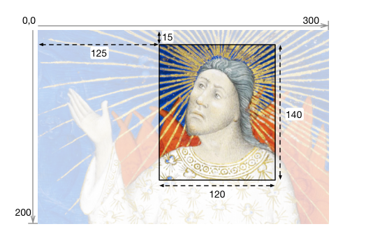
        <p><strong>2</strong> region=125,15,120,140</p>
        <p><code>.../125,15,120,140/full/0/default.jpg</code></p>
      </td>
    </tr>
    <tr>
      <td>
        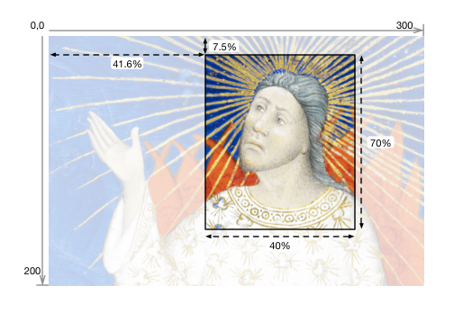
        <p><strong>3</strong> region=pct:41.6,7.5,40,70</p>
        <p><code>.../pct:41.6,7.5,40,70/full/0/default.jpg</code></p>
      </td>
      <td>
        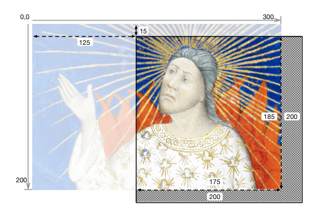
        <p><strong>4</strong> region=125,15,200,200</p>
        <p><code>.../125,15,200,200/full/0/default.jpg</code></p>
        <p><em>N.B. Returned image is 175,185 px</em></p>
      </td>
    </tr>
    <tr>
      <td>
        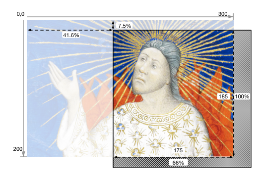
        <p><strong>5</strong> region=pct:41.6,7.5,66.6,100</p>
        <p><code>.../pct:41.6,7.5,66.6,100/full/0/default.jpg</code></p>
        <p><em>N.B. Returned image is 175,185 px</em></p>
      </td>
      <td></td>
    </tr>
  </tbody>
</table>


###  4.2. Size
{: #size}

The size parameter determines the dimensions to which the extracted region is to be scaled.

| Form | Description |
|----------------|-----------------------|
| `full`         | The extracted region is not scaled, and is returned at its full size. |
| w,             | The extracted region should be scaled so that its width is exactly equal to w, and the height will be a calculated value that maintains the aspect ratio of the extracted region. |
| ,h             | The extracted region should be scaled so that its height is exactly equal to h, and the width will be a calculated value that maintains the aspect ratio of the extracted region. |
| pct:n          | The width and height of the returned image is scaled to n% of the width and height of the extracted region. The aspect ratio of the returned image is the same as that of the extracted region. |
| w,h            | The width and height of the returned image are exactly w and h. The aspect ratio of the returned image _MAY_ be different than the extracted region, resulting in a distorted image. |
| !w,h           | The image content is scaled for the best fit such that the resulting width and height are less than or equal to the requested width and height. The exact scaling _MAY_ be determined by the service provider, based on characteristics including image quality and system performance. The dimensions of the returned image content are calculated to maintain the aspect ratio of the extracted region. |
{: .api-table}

If the resulting height or width is zero, then the server _SHOULD_ return a 400 (bad request) status code.

The image server _MAY_ support scaling above the full size of the extracted region.

Examples:

<table class="ex_table">
  <tbody>
    <tr>
      <td>
        
        <p><strong>1</strong> size=full</p>
        <p><code>.../full/full/0/default.jpg</code></p>
      </td>
      <td>
        
        <p><strong>2</strong> size=150,</p>
        <p><code>.../full/150,/0/default.jpg</code></p>
      </td>
      <td>
        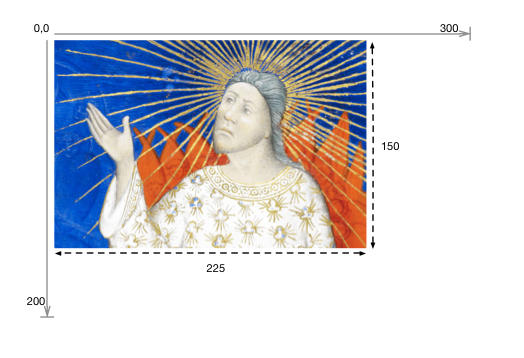
        <p><strong>3</strong> size=,150</p>
        <p><code>.../full/,150/0/default.jpg</code></p>
      </td>
    </tr>
    <tr>
      <td>
        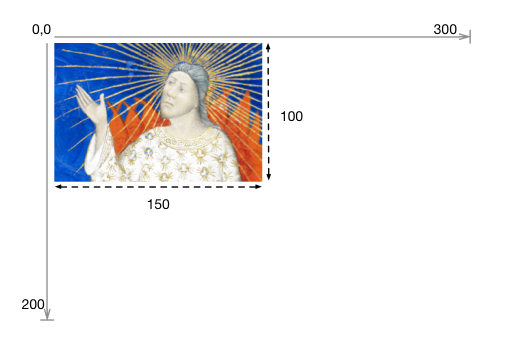
        <p><strong>4</strong> size=pct:50</p>
        <p><code>.../full/pct:50/0/default.jpg</code></p>
      </td>
      <td>
        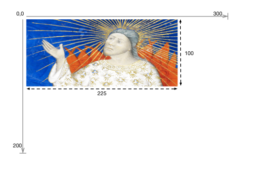
        <p><strong>5</strong> size=225,100</p>
        <p><code>.../full/225,100/0/default.jpg</code></p>
      </td>
      <td>
        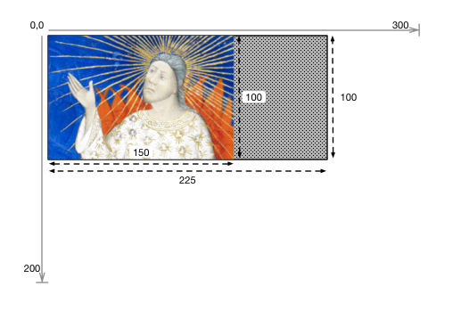
        <p><strong>6</strong> size=!225,100</p>
        <p><code>.../full/!225,100/0/default.jpg</code></p>
        <p><em>N.B. Returned image is 150,100 px</em></p>
      </td>
    </tr>
  </tbody>
</table>

###  4.3. Rotation
{: #rotation}

The rotation parameter specifies mirroring and rotation. A leading exclamation mark ("!") indicates that the image should be mirrored by reflection on the vertical axis before any rotation is applied. The numerical value represents the number of degrees of clockwise rotation, and may be any floating point number from 0 to 360.

| Form | Description |
| ---- | ----------- |
| n    | The degrees of clockwise rotation from 0 up to 360.     |
| !n   | The image should be mirrored and then rotated as above. |
{: .api-table}

A rotation value that is out of range or unsupported _SHOULD_ result in a 400 status code.

In most cases a rotation will change the width and height dimensions of the returned image. The service _SHOULD_ return an image that contains all of the image contents requested in the region and size parameters, even if the dimensions of the returned image file are different than specified in the size parameter. The image contents _SHOULD NOT_ be scaled as a result of the rotation, and there _SHOULD_ be no additional space between the corners of the rotated image contents and the bounding box of the returned image content.

For rotations which are not multiples of 90 degrees, it is _RECOMMENDED_ that the client request the image in a format that supports transparency, such as PNG, and that the server return the image with a transparent background.  There is no facility in the API for the client to request a particular background color or other fill pattern.

Examples:

<table class="ex_table">
  <tbody>
    <tr>
      <td>
        
        <p><strong>1</strong> rotation=0</p>
        <p><code>.../full/full/0/default.jpg</code></p>
      </td>
      <td>
        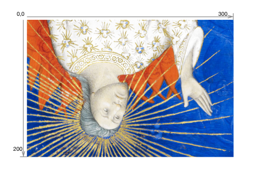
        <p><strong>2</strong> rotation=180</p>
        <p><code>.../full/full/180/default.jpg</code></p>
      </td>
    </tr>
    <tr>
      <td>
        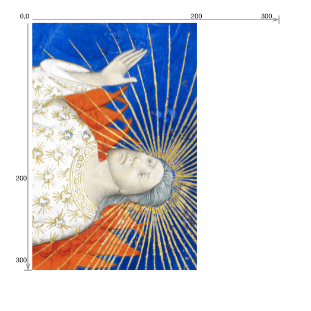
        <p><strong>3</strong> rotation=90</p>
        <p><code>.../full/full/90/default.jpg</code></p>
      </td>
      <td>
        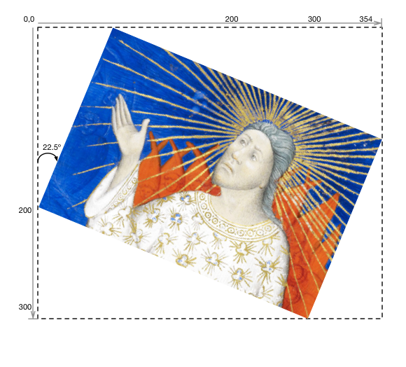
        <p><strong>4</strong> rotation=22.5</p>
        <p><code>.../full/full/22.5/default.png</code></p>
      </td>
    </tr>
    <tr>
      <td>
        
        <p><strong>5</strong> rotation=!0</p>
        <p><code>.../full/full/!0/default.jpg</code></p>
      </td>
      <td>
        
        <p><strong>6</strong> rotation=!180</p>
        <p><code>.../full/full/!180/default.jpg</code></p>
      </td>
    </tr>
  </tbody>
</table>

###  4.4. Quality
{: #quality}

The quality parameter determines whether the image is delivered in color, grayscale or black and white.

| Quality   | Parameter Returned |
| --------- | ------------------ |
| `color`   | The image is returned in full color. |
| `gray`    | The image is returned in grayscale, where each pixel is black, white or any shade of gray in between. |
| `bitonal` | The image returned is bitonal, where each pixel is either black or white. |
| `default` | The image is returned using the server's default quality (e.g. color, gray or bitonal) for the image. |
{: .api-table}

The `default` quality exists to support [level 0 compliant implementations][compliance-quality] that may not know the qualities of individual images in their collections. It also provides a convenience for clients that know the values for all other parameters of a request except the quality (e.g. `.../full/120,/90/{quality}.png` to request a thumbnail) in that a preliminary image information request that would only serve to find out which qualities are available can be avoided.

A quality value that is unsupported _SHOULD_ result in a 400 status code.

Examples:

<table class="ex_table">
  <tbody>
    <tr>
      <td>
        
        <p><strong>1</strong> quality=default</p>
        <p><code>.../full/full/0/default.jpg</code></p>
      </td>
      <td>
        
        <p><strong>2</strong> quality=color</p>
        <p><code>.../full/full/0/color.jpg</code></p>
      </td>
    </tr>
    <tr>
      <td>
        
        <p><strong>3</strong> quality=gray</p>
        <p><code>.../full/full/0/gray.jpg</code></p>
      </td>
      <td>
        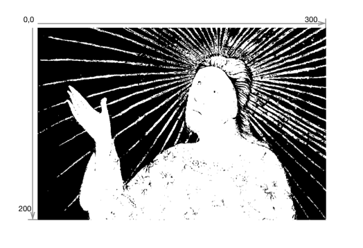
        <p><strong>4</strong> quality=bitonal</p>
        <p><code>.../full/full/0/bitonal.jpg</code></p>
      </td>
    </tr>
  </tbody>
</table>

###  4.5. Format
{: #format}

The format of the returned image is expressed as an extension at the end of the URI.

| Extension | MIME Type |
| --------- | --------- |
| `jpg`     | image/jpeg |
| `tif`     | image/tiff |
| `png`     | image/png |
| `gif`     | image/gif |
| `jp2`     | image/jp2 |
| `pdf`     | application/pdf |
| `webp`    | image/webp |
{: .api-table}

A format value that is unsupported _SHOULD_ result in a 400 status code.

Examples:

  1. `.../full/full/0/default.jpg`
  2. `.../full/full/0/default.png`
  3. `.../full/full/0/default.tif`
  {: .examplelist}

### 4.6. Order of Implementation
{: #order-of-implementation}

The sequence of parameters in the URI is intended as a mnemonic for the order in which image manipulations are made against the full image content. This is important to consider when implementing the service because applying the same parameters in a different sequence will often result in a different image being delivered. The order is critical so that the application calling the service reliably receives the output it expects.

The parameters should be interpreted as if the the sequence of image manipulations were:

`Region THEN Size THEN Rotation THEN Quality THEN Format`

If the rotation parameter includes mirroring ("!"), the mirroring is applied before the rotation.

<table class="ex_table">
  <tbody>
    <tr>
      <td>
        
        <p><strong>1</strong> region=125,15,120,140 size=90, rotation=!345 quality=gray</p>
        <p><code>.../125,15,120,140/90,/!345/gray.jpg</code></p>
      </td>
    </tr>
  </tbody>
</table>

### 4.7. Canonical URI Syntax
{: #canonical-uri-syntax}

There are many ways in which the same image can be described using the different forms of the parameters.  While it is useful for clients to be able to express their requests in a convenient form, there are several reasons why a canonical URI syntax is desirable:

  * It enables static, file-system based implementations, which will have only a single URI at which the content is available.
  * Caching becomes significantly more efficient, both client and server side, when the URIs used are the same between systems and sessions.
  * Response times can be improved by avoiding redirects from a requested non-canonical URI syntax to the canonical syntax by using the canonical form directly.

In order to support the above requirements, clients _SHOULD_ construct the image request URIs using the following canonical parameter values where possible.  Image servers _MAY_ redirect the client to the canonical URI from a non-canonical equivalent.

| Parameter | Canonical value |
| --------- | --------------- |
| region    | "full" if the whole image is requested,<br/>otherwise the `x,y,w,h` syntax. |
| size      | "full" if the default size is requested,<br/>the `w,` syntax for images that should be scaled maintaining the aspect ratio,<br/>and the `w,h` syntax for explicit sizes that change the aspect ratio. |
| rotation  | "!" if the image is mirrored, followed by an integer if possible, and trimming any trailing zeros in a decimal value, and a leading 0 if the value is below 1. |
| quality   | "default" if the server's default quality is requested,<br/>otherwise the quality string. |
| format    | The explicit format string is always required. |
{: .api-table}

When the client requests an image, the server _MAY_ add a link header to the response that indicates the canonical URI for that request:

``` none
Link: <http://iiif.example.com/server/full/full/0/default.jpg>;rel="canonical"
```
{: .urltemplate}

The server _MAY_ include this link header on the Image Information response, however it is unnecessary as it is included in the JSON representation retrieved.

##  5. Information Request
{: #information-request}

The Image Information document contains both metadata about the image, such as full height and width, and functionality available for it, such as the formats in which it may be retrieved.  The service _MUST_ return this information about the image. The request for the information _MUST_ conform to the URI Template:

``` none
{scheme}://{server}{/prefix}/{identifier}/info.json
```
{: .urltemplate}

The syntax for the response is [JSON-LD][json-ld-w3c]. The content-type of the response _MUST_ be either "application/json" (regular JSON),

``` none
Content-Type: application/json
```
{: .urltemplate}

or "application/ld+json" (JSON-LD).

``` none
Content-Type: application/ld+json
```
{: .urltemplate}

If the client explicitly wants the JSON-LD content-type, then it _MUST_ specify this in an Accept header, otherwise the server _MUST_ return the regular JSON content-type.

If the regular JSON content-type is returned, then it is _RECOMMENDED_ that the server provide a link header to the context document. The syntax for the link header is below, and further [described in section 6.8 of the JSON-LD specification][json-as-json-ld]. If the client requests "application/ld+json", the link header _MAY_ still be included but _MUST_ be ignored. The entity body is identical regardless of the content-type, including the `@context` field.

``` none
Link: <http://iiif.io/api/image/{{ page.major }}/context.json>
            ; rel="http://www.w3.org/ns/json-ld#context"
            ; type="application/ld+json"
```
{: .urltemplate}

Servers _SHOULD_ send the `Access-Control-Allow-Origin` header with the value `*` in response to information requests. The syntax is shown below and is described in the [CORS][cors-spec] specification. This header is required in order to allow the JSON responses to be used by Web applications hosted on different servers.

``` none
Access-Control-Allow-Origin: *
```
{: .urltemplate}

A recipe for enabling these behaviors is provided in the [Apache HTTP Server Implementation Notes][apache-notes-conditional-content-type].


### 5.1. Image Information
{: #image-information}

The JSON at the top level of the response will include the following properties:

| Property   | Required? | Description |
| ---------- | --------- | ----------- |
| `@context` | Required | The context document that describes the semantics of the terms used in the document. This must be the URI: `http://iiif.io/api/image/{{ page.major }}/context.json` for version {{ page.major }}.{{ page.minor }} of the IIIF Image API. This document allows the response to be interpreted as RDF, using the [JSON-LD][json-ld-org] serialization. |
| `@id` | Required | The Base URI of the image as defined in [URI Syntax][uri-syntax], including scheme, server, prefix and identifier without a trailing slash. |
| `protocol` | Required | The URI `http://iiif.io/api/image` which can be used to determine that the document describes an image service which is a version of the IIIF Image API. |
| `width` | Required | The width in pixels of the full image content, given as an integer. |
| `height` | Required | The height in pixels of the full image content, given as an integer. |
| `profile` | Required | An array of profiles, indicated by either a URI or an object describing the features supported.  The first entry in the array _MUST_ be a compliance level URI, as defined below. |
| `sizes` | Optional | A set of height and width pairs the client should use in the `size` parameter to request complete images at different sizes that the server has available. This may be used to let a client know the sizes that are available when the server does not support requests for arbitrary sizes, or simply as a hint that requesting an image of this size may result in a faster response. A request constructed with the `w,h` syntax using these sizes _MUST_ be supported by the server, even if arbitrary width and height are not. |
| `tiles` | Optional | A set of descriptions of the parameters to use to request regions of the image (tiles) that are efficient for the server to deliver. Each description gives a width, optionally a height for non-square tiles, and a set of scale factors at which tiles of those dimensions are available. |
| `service` | Optional | The `service` property provides a hook for additional information to be included in the image description, for example the physical size of the object depicted.  Please see the [Service Profiles][service-profiles] annex for more information. |
{: .api-table}

The objects in the `sizes` list have the properties in the following table. Images requested using these sizes _SHOULD_ have a region parameter of "full" and rotation of "0". The full URL for an image with "default" quality in "jpg" format would be: `{base_url}/{identifier}/full/{width},{height}/0/default.jpg`

| Property   | Required? | Description |
| ---------- | --------- | ----------- |
| `width` | Required | The width of the image to be requested. |
| `height` | Required | The height of the image to be requested. |
{: .api-table}

The objects in the `tiles` list have the properties in the following table. The `width` and `height` should be used to fill the region parameter and the `scaleFactors` to complete the size parameter of the image URL. This is described in detail in the [Implementation Notes][a-implementation-notes].

The `width` of a tile, or the combination of `width` and `height` if `height` is specified, _MUST_ be unique among the members of the `tiles` list.

| Property   | Required? | Description |
| ---------- | --------- | ----------- |
| `scaleFactors` | Required | The set of resolution scaling factors for the image's predefined tiles, expressed as an integer by which to divide the full size of the image. For example, a scale factor of 4 indicates that the service can efficiently deliver images at 1/4 or 25% of the height and width of the full image. A particular scale factor value _SHOULD_ appear only once in the `tiles` list. |
| `width` | Required | The width of the predefined tiles to be requested. |
| `height` | Optional | The height of the predefined tiles to be requested.  If it is not specified in the JSON, then it defaults to the same as `width`, resulting in square tiles. |
{: .api-table}

The objects in the `profiles` list have the properties in the following table.  The `@context`, `@id` and `@type` properties are _REQUIRED_ when the profile is dereferenced from a URI, but _SHOULD NOT_ be included in the Image Information response.

| Property    | Required? | Description |
| ----------- | --------- | ----------- |
| `@context`  | Optional  | The string "http://iiif.io/api/image/{{ page.major }}/context.json". This should be included only if the profile's URI is dereferenced. |
| `@id`       | Optional  | The URI of the profile. |
| `@type`     | Optional  | The string "iiif:ImageProfile". |
| `formats`   | Optional  | The set of image format parameter values available for the image.  If not specified then clients should assume only formats declared in the compliance level document.|
| `qualities` | Optional  | The set of image quality parameter values available for the image.  If not specified then clients should assume only qualities declared in the compliance level document.|
| `supports`  | Optional  | The set of features supported for the image.  If not specified then clients should assume only features declared in the compliance level document. |
{: .api-table}

The set of features that may be specified in the `supports` property of an Image profile are:

| Feature Name | Description |
| ------------ | ----------- |
| `baseUriRedirect` | The base URI of the service will redirect to the Image Information document. |
| `canonicalLinkHeader` | The canonical image URI HTTP link header is provided on image responses. |
| `cors` |  The CORS HTTP header is provided on all responses.  |
| `jsonldMediaType` | The JSON-LD media type is provided when JSON-LD is requested. |
| `mirroring` | The image may be rotated around the vertical axis, resulting in a left-to-right mirroring of the content. |
| `profileLinkHeader` | The profile HTTP link header is provided on image responses. |
| `regionByPct` |  Regions of images may be requested by percentage.  |
| `regionByPx` |   Regions of images may be requested by pixel dimensions.  |
| `rotationArbitrary` |   Rotation of images may be requested by degrees other than multiples of 90.  |
| `rotationBy90s` |   Rotation of images may be requested by degrees in multiples of 90.  |
| `sizeAboveFull` | Size of images may be requested larger than the "full" size. |
| `sizeByWhListed` | Size of images given in the `sizes` field of the Image Information document may be requested using the `w,h` syntax. |
| `sizeByForcedWh` |   Size of images may be requested in the form "!w,h".  |
| `sizeByH` |   Size of images may be requested in the form ",h".  |
| `sizeByPct` |   Size of images may be requested in the form "pct:n".  |
| `sizeByW` |   Size of images may be requested in the form "w,".  |
| `sizeByWh` |   Size of images may be requested in the form "w,h".  |
{: .api-table}

The set of features, formats and qualities supported is the union of those declared in all of the external profile documents and any embedded profile objects.  If a feature is not present in either the profile document or the `supports` property of an embedded profile, then a client _MUST_ assume that the feature is not supported.

Servers _SHOULD_ support requests for images with parameters specified by the `sizes` and `tiles` fields for all combinations of `qualities` and `formats` supported.

If any of `formats`, `qualities`, or `supports` have no additional values beyond those specified in the referenced compliance level, then the property _SHOULD_ be omitted from the response rather than being present with an empty list.

URIs _MAY_ be added to the supports list of a profile to cover features not defined in this specification. Clients _MUST_ ignore URIs that are not recognized.

The JSON response is structured as shown in the following example. The order of the keys in the response _SHOULD_ follow the order in the example.

``` json-doc
{
  "@context" : "http://iiif.io/api/image/{{ page.major }}/context.json",
  "@id" : "http://www.example.org/image-service/abcd1234/1E34750D-38DB-4825-A38A-B60A345E591C",
  "protocol" : "http://iiif.io/api/image",
  "width" : 6000,
  "height" : 4000,
  "sizes" : [
    {"width" : 150, "height" : 100},
    {"width" : 600, "height" : 400},
    {"width" : 3000, "height": 2000}
  ],
  "tiles": [
    {"width" : 512, "scaleFactors" : [1,2,4,8,16]}
  ],
  "profile" : [
    "http://iiif.io/api/image/{{ page.major }}/level2.json",
    {
      "formats" : [ "gif", "pdf" ],
      "qualities" : [ "color", "gray" ],
      "supports" : [
          "canonicalLinkHeader", "rotationArbitrary", "profileLinkHeader", "http://example.com/feature/"
      ]
    }
  ],
  "service" : {
    "@context": "http://iiif.io/api/annex/service/physdim/1/context.json",
    "profile": "http://iiif.io/api/annex/service/physdim",
    "physicalScale": 0.0025,
    "physicalUnits": "in"
  }
}
```

Using the [supplied JSON-LD frame][annex-frames] will result in the correct structure.


##  6. Compliance Levels
{: #compliance-levels}

The Image Information document _MUST_ specify the extent to which the API is supported by including a compliance level URI as the first entry in the `profile` property. This URI links to a description of the highest compliance level for which all requirements are met. The URI _MUST_ be one of those listed in the [Image API Compliance][compliance] document. This description contains the set of features required by the profile, as discussed in [Image Information][image-information]. A server _MAY_ declare different compliance levels for images with different identifiers.

The compliance level URI _MAY_ also be given in the HTTP Link header ([RFC5988][rfc-5988]) with the parameter `rel="profile"`, and thus a complete header might look like:

``` none
Link: <http://iiif.io/api/image/{{ page.major }}/level1.json>;rel="profile"
```
{: .urltemplate}

A recipe for setting this header on the Apache HTTP Server is shown in the [Apache HTTP Server Implementation Notes][apache-notes-set-compliance-link-header].

##  7. Server Responses
{: #server-responses}

###  7.1. Successful Responses
{: #successful-responses}

Servers may transmit HTTP responses with 200 (Successful) or 3xx (Redirect) status codes when the request has been successfully processed. If the status code is 200, then the entity-body _MUST_ be the requested image or information document. If the status code is 301, 302, 303, or 304, then the entity-body is unrestricted, but it is _RECOMMENDED_ to be empty. If the status code is 301, 302, or 303 then the Location HTTP Header _MUST_ be set containing the URI of the image that fulfills the request. This enables servers to have a single canonical URI to promote caching of responses. Status code 304 is handled exactly as per the HTTP specification. Clients _SHOULD_ expect to encounter all of these situations and _MUST NOT_ assume that the entity-body of the initial response necessarily contains the image data.

###  7.2. Error Conditions
{: #error-conditions}

The order in which servers parse requests and detect errors is not specified. A request is likely to fail on the first error encountered and return an appropriate HTTP status code, with common codes given in the list below. It is _RECOMMENDED_ that the body of the error response includes a human-readable description of the error in either plain text or html.

| Status Code | Description |
| ---------- | ----------- |
| 400 Bad Request | This response is used when it is impossible for the server to fulfil the request, as the syntax of the request is incorrect.  For example, this would be used if the size parameter does not match any of the specified syntaxes. |
| 401 Unauthorized | Authentication is required and not provided. See the [Authentication][authentication] section for details. |
| 403 Forbidden | The user, authenticated or not, is not permitted to perform the requested operation. |
| 404 Not Found | The image resource specified by [identifier] does not exist, or the value of one or more of the parameters is not supported for this image. |
| 500 Internal Server Error | The server encountered an unexpected error that prevented it from fulfilling the request. |
| 501 Not Implemented | A valid IIIF request that is not implemented by this server. |
| 503 Service Unavailable | Used when the server is busy/temporarily unavailable due to load/maintenance issues. An alternative to connection refusal with the option to specify a back-off period. |
{: .api-table}

##  8. Authentication
{: #authentication}

This API does not specify whether the image server will support authentication or what mechanism it might use. In the case of "401 Unauthorized" HTTP response, the content of the WWW-Authenticate header will depend on the authentication mechanism supported by the server. If the server supports HTTP Basic or Digest authentication then the header _SHOULD_ follow [RFC2617][rfc-2617], for example:

``` none
WWW-Authenticate: Basic realm="Images"
```
{: .urltemplate}

##  9. URI Encoding and Decoding
{: #uri-encoding-and-decoding}

The URI syntax of this API relies upon slash (/) separators which _MUST NOT_ be encoded. Clients _MUST_ percent-encode special characters (the to-encode set below: percent and gen-delims of [RFC3986][rfc-3986] except the colon) plus any characters outside the US-ASCII set within the components of requests. For example, any slashes within the identifier part of the URI _MUST_ be percent-encoded. Encoding is necessary only for the identifier because other components will not include special characters. Percent-encoding other characters introduces no ambiguity but is unnecessary.

``` none
to-encode = "/" / "?" / "#" / "[" / "]" / "@" / "%"
```
{: .urltemplate}

| Parameters | URI path |
| ---------- | -------- |
| identifier=id1 region=full size=full rotation=0 quality=default | `id1/full/full/0/default` |
| identifier=id1 region=0,10,100,200 size=pct:50 rotation=90 quality=default format=png | `id1/0,10,100,200/pct:50/90/default.png` |
| identifier=id1 region=pct:10,10,80,80 size=50, rotation=22.5 quality=color format=jpg | `id1/pct:10,10,80,80/50,/22.5/color.jpg` |
| identifier=bb157hs6068 region=full size=full rotation=270 quality=gray format=jpg | `bb157hs6068/full/full/270/gray.jpg` |
| identifier=ark:/12025/654xz321 region=full size=full rotation=0 quality=default | `ark:%2F12025%2F654xz321/full/full/0/default` |
| identifier=urn:foo:a123,456 region=full size=full rotation=0 quality=default | `urn:foo:a123,456/full/full/0/default` |
| identifier=urn:sici:1046-8188(199501)13:1%3C69:FTTHBI%3E2.0.TX;2-4 region=full size=full rotation=0 quality=default | `urn:sici:1046-8188(199501)13:1%253C69:FTTHBI%253E2.0.TX;2-4/full/full/0/default` |
| identifier=http://example.com/?54#a region=full size=full rotation=0 quality=default | `http:%2F%2Fexample.com%2F%3F54%23a/full/full/0/default` |
{: .api-table}

Servers which are incapable of processing arbitrarily encoded identifiers _SHOULD_ make their best efforts to expose only image identifiers for which clients will not encode any of the characters, and thus it is _RECOMMENDED_ to limit characters in identifiers to letters, numbers and the underscore character.

##  10. Security Considerations
{: #security-considerations}

This API defines a URI syntax and the semantics associated with its components. The composition of URIs has few security considerations except possible exposure of sensitive information in URIs or revealing of browse/view behavior of users.

Server applications implementing this API _SHOULD_ consider possible denial-of-service attacks, and authentication vulnerabilities based on DNS spoofing. Applications _MUST_ be careful to parse incoming requests (URIs) in ways that avoid overflow or injection attacks.

Early sanity checking of URIs (lengths, trailing GET, invalid characters, out-of-range parameters) and rejection with appropriate response codes is _RECOMMENDED_.

## 11. Appendices
{: #appendices}

### A. Implementation Notes

  * For use cases that enable the saving of the image, it is _RECOMMENDED_ to use the HTTP `Content-Disposition` header ([RFC6266][rfc-6266]) to provide a convenient filename that distinguishes the image, based on the identifier and parameters provided.
  * This specification makes no assertion about the rights status of requested images or any other descriptive metadata, whether or not authentication has been accomplished. Please see the [IIIF Presentation API][prezi-api] for rights and other information.
  * Additional [Apache HTTP Server implementation notes][apache-notes] are available.
  * When requesting sizes using the `w,` canonical syntax, if a particular height is desired, the following algorithm can be used:

``` python
    # Calculate request width for `w,` syntax from desired height
    request_width = image_width * desired_height / image_height
```

  * When requesting image tiles, the [Region][region] and [Size][size] parameters must be calculated to take account of partial tiles along the right and lower edges for a full imagine that is not an exact multiple of the scaled tile size. The algorithm below is shown as Python code and assumes integer inputs and integer arithmetic throughout (ie. remainder discarded on division). Inputs are: size of full image content `(width,height)`, scale factor `s`, tile size `(tw,th)`, and tile coordinate `(n,m)` counting from `(0,0)` in the upper-left corner. Note that the rounding method is implementation dependent.


``` python
    # Calculate region parameters /xr,yr,wr,hr/
    xr = n * tw * s
    yr = m * th * s
    wr = tw * s
    if (xr + wr > width):
        wr = width - xr
    hr = th * s
    if (yr + hr > height):
        hr = height - yr
    # Calculate size parameters /ws,hs/
    ws = tw
    if (xr + tw*s > width):
        ws = (width - xr + s - 1) / s  # +s-1 in numerator to round up
    hs = th
    if (yr + th*s > height):
        hs = (height - yr + s - 1) / s
```

  * As described in [Rotation][rotation], in order to retain the size of the requested image contents, rotation will change the width and height dimensions of the image returned. A formula for calculating the dimensions of the image returned for a given starting size and rotation is given below. Note that the rounding method is implementation dependent and that some languages require conversion of the angle from degrees to radians.

``` python
    # (w,h) are size parameters, n is rotation angle
    w_returned = abs(w*cos(n)) + abs(h*sin(n))
    h_returned = abs(h*cos(n)) + abs(w*sin(n))
```

### B. Versioning

Starting with version 2.0, this specification follows [Semantic Versioning][semver]. See the note [Versioning of APIs][versioning] for details regarding how this is implemented.

###  C. Acknowledgments

The production of this document was generously supported by a grant from the [Andrew W. Mellon Foundation][mellon].

Many thanks to  Ben Albritton, Matthieu Bonicel, Anatol Broder, Kevin Clarke, Tom Cramer, Ian Davis, Neil Jefferies, Scotty Logan, Sean Martin, Roger Mathisen, Lynn McRae, Willy Mene, Mark Patton, Petter Rønningsen, and Brian Tingle for your thoughtful contributions to the effort and written feedback.  Thanks also to the members of the [IIIF Community][iiif-community] for their continuous engagement, innovative ideas and feedback.

###  D. Change Log

| Date       | Description |
| ---------- | ----------- |
| 2014-09-11 | Version 2.0 (Voodoo Bunny) released [View change log][change-log] |
| 2014-08-12 | Version 2.0-final-draft (Voodoo Bunny) RFC  |
| 2014-07-01 | Version 2.0-draft2 (Voodoo Bunny) RFC  |
| 2014-06-01 | Version 2.0-draft (Voodoo Bunny) RFC   |
| 2013-09-17 | Version 1.1 released [View change log][change-log11] |
| 2013-09-04 | Added @context to Image Information Request table in section 5 |
| 2013-06-26 | Changed quality parameter definitions in section 4.4 |
| 2013-06-17 | Draft release 1.1                      |
| 2012-08-10 | Release 1.0                            |
| 2012-07-13 | Incorporates responses to RFC feedback |
| 2012-03-09 | Initial release                        |
| 2012-04-13 | 0.2 after internal review and IIIF April Meeting |
| 2012-05-02 | RFC version |
{: .api-table}

[change-log11]: {{ site.url }}{{ site.baseurl }}/api/image/1.1/change-log/ "Change Log for Version 1.1"
[change-log]: {{ site.url }}{{ site.baseurl }}/api/image/2.0/change-log/ "Change Log for Version 2.0"
[compliance]: {{ site.url }}{{ site.baseurl }}/api/image/2.0/compliance/ "Image API Compliance"
[compliance-quality]: {{ site.url }}{{ site.baseurl }}/api/image/2.0/compliance/#quality "Image API Compliance: Quality"
[cors-spec]: http://www.w3.org/TR/cors/ "Cross-Origin Resource Sharing"
[iiif-discuss]: mailto:iiif-discuss@googlegroups.com "Email Discussion List"
[json-as-json-ld]: http://www.w3.org/TR/json-ld/#interpreting-json-as-json-ld "JSON-LD 1.0: 6.8 Interpreting JSON as JSON-LD"
[json-ld-org]: http://www.json-ld.org/ "JSON for Linking Data"
[json-ld-w3c]: http://www.w3.org/TR/json-ld/ "JSON-LD 1.0"
[mellon]: http://www.mellon.org/ "The Andrew W. Mellon Foundation"
[rfc-2617]: http://tools.ietf.org/html/rfc2617 "HTTP Authentication: Basic and Digest Access Authentication"
[rfc-3986]: http://tools.ietf.org/html/rfc3986 "Uniform Resource Identifier (URI): Generic Syntax"
[rfc-5988]: http://tools.ietf.org/html/rfc5988 "Web Linking"
[rfc-6266]: http://tools.ietf.org/html/rfc6266 "Use of the Content-Disposition Header Field in the Hypertext Transfer Protocol (HTTP)"
[rfc-6570]: http://tools.ietf.org/html/rfc6570 "URI Template"
[semver]: http://semver.org/spec/v2.0.0.html "Semantic Versioning 2.0.0"
[iiif-community]: {{page.webprefix}}/community/ "IIIF Community"
[versioning]: {{ site.url }}{{ site.baseurl }}/api/annex/notes/semver/ "Versioning of APIs"
[prezi-api]: {{ site.url }}{{ site.baseurl }}/api/presentation/{{ site.presentation_api.stable.major }}.{{ site.presentation_api.stable.minor }}/ "Presentation API"

[service-profiles]: {{ site.url }}{{ site.baseurl }}/api/annex/services/ "Services Annex Document"
[annex-frames]: {{ site.url }}{{ site.baseurl }}/api/annex/notes/jsonld/ "JSON-LD Frames Implementation Notes"
[apache-notes]: {{ site.url }}{{ site.baseurl }}/api/annex/notes/apache/ "Apache HTTP Server Implementation Notes"
[apache-notes-conditional-content-type]: {{ site.url }}{{ site.baseurl }}/api/annex/notes/apache/#conditional-content-types "Apache HTTP Server Implementation Notes: Conditional Content Types"
[apache-notes-set-compliance-link-header]: {{ site.url }}{{ site.baseurl }}/api/annex/notes/apache/#set-compliance-link-header "Apache HTTP Server Implementation Notes: Set Compliance Link Header"
[audience-and-scope]: #audience-and-scope "1. Audience and Scope"
[uri-syntax]: #uri-syntax "2. URI Syntax"
[image-request-uri-syntax]: #image-request-uri-syntax "2.1. Image Request URI Syntax"
[image-information-request-uri-syntax]: #image-information-request-uri-syntax "2.2. Image "Information Request URI"
[identifier]: #identifier "3. Identifier"
[image-request-parameters]: #image-request-parameters "4. Image Request Parameters "
[region]: #region "4.1. Region"
[size]: #size "4.2. Size"
[rotation]: #rotation "4.3. Rotation"
[quality]: #quality "4.4. Quality"
[format]: #format "4.5. Format"
[order-of-implementation]: #order-of-implementation "4.6. Order of Implementation"
[canonical-uri-syntax]: #canonical-uri-syntax "4.7. Canonical URI Syntax"
[information-request]: #information-request "5. Information Request"
[image-information]: #image-information "5.1. Image Information"
[extensions]: #extensions "5.2 Extensions"
[compliance-levels]: #compliance-levels "6. Compliance Levels"
[server-responses]: #server-responses "7. Server Responses"
[successful-responses]: #successful-responses "7.1. Successful Responses"
[error-conditions]: #error-conditions "7.2. Error Conditions"
[authentication]: #authentication "8. Authentication"
[uri-encoding-and-decoding]: #uri-encoding-and-decoding "9. URI Encoding and Decoding"
[security-considerations]: #security-considerations "10. Security Considerations"
[appendices]: #appendices "11. Appendices"
[a-implementation-notes]: #a-implementation-notes "A. Implementation Notes"
[b-versioning]: #b-versioning "B. Versioning"
[c-acknowledgments]: #c-acknowledgments "C. Acknowledgments"
[d-change-log]: #d-change-log "D. Change Log"
[prev-version]: {{ page.webprefix }}/api/image/1.1/ "Previous Version"
[stable-version]: {{ page.webprefix }}/api/image/{{ site.image_api.stable.major }}.{{ site.image_api.stable.minor }}/ "Stable Version"


