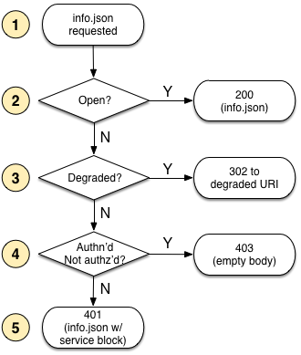
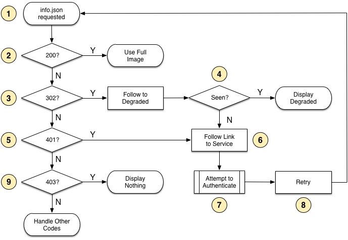

## Status of this Document
{:.no_toc}

__This Version:__ {{ page.major }}.{{ page.minor }}.{{ page.patch }}-{{ page.pre }}

__Latest Stable Version:__ [{{ site.image_api.latest.major }}.{{ site.image_api.latest.minor }}.{{ site.image_api.latest.patch }}][stable-version]

__Previous Version:__ [2.0][prev-version]

**Editors:**

  * Michael Appleby, _Yale University_
  * Tom Crane, _Digirati_
  * Robert Sanderson, _Stanford University_
  * Jon Stroop, _Princeton University_
  * Simeon Warner, _Cornell University_
  {: .names}

_Copyright © 2012-2014 Editors and contributors. Published by the IIIF under the [CC-BY][cc-by] license._

----

## Abstract
{:.no_toc}


Please send feedback to [iiif-discuss@googlegroups.com][iiif-discuss]

## Table of Contents
{:.no_toc}

* Table of Discontent (will be replaced by macro)
{:toc}


## 1 Introduction

Images are generally secondary resources in a web page or application. In the case of web pages, images are embedded in the HTML `img` tag, and are retrieved via additional HTTP requests. When a user cannot load a web page, it is possible — and a generally accepted behavior — to redirect the user to another page and offer the opportunity to authenticate. This is not an option for secondary resources such as images, and the user is instead simply presented with the much-hated broken image icon.

Authentication systems that span multiple domains are also complex, particularly when the interaction is via a Javascript client served from yet another domain, rather than from where the authentication challenge must be performed. Details such as passive mixed content (the mixture of HTTP and HTTPS), cross origin resource sharing (enabling the ability to request data from different domains), and the desire not degrade the user experience with unnecessary authentication popups provide further challenges in this space.  

Some access is generally better than no access. A grayscale version instead of color; a version of the image with a watermark; a version with more compression; or a smaller size is likely better than no image at all. Providing this functionality is more complex than traditional yes-or-no access controls, and serving the correct image and associated image information for the degraded version is necessary to prevent web caches from providing incorrect content.

No new authentication systems are proposed in this specification, nor roles for authorization business logic. Instead, it is expected that authentication requirements and processes are handled outside of any IIIF-specific context, but within a larger workflow described below. This workflow is agnostic to the details of the authentication protocol, and relies on distinct services that are modeled after the components of the OAuth2 workflow.

## 2 Authentication Services

As noted above, the client needs to know where the user can authenticate, and once authenticated, where she can logout.  These service enpoints are referenced in the Image Information json response, in `service` blocks. There are four service profiles relevant to IIIF authentication: one for the user to log in, another to log out, a third client-focused service that returns an authorization token for the client to use on requests, and an optional client identity service to restrict access to only known client systems that have pre-registered with a secret key.


### 2.1 Login Service

In order to have the client prompt the user to log in, the info.json _MUST_ include a service using the following template:

```json
{
  "service" : {
    "@id": "http://authentication.example.org/login",
    "profile": "http://iiif.io/api/image/2/auth/login",
    "label": "Login to Example Service"
  }
}
```
{: .urltemplate}

Where the `@id` field _MUST_ be present and contains the URI that the client should load to allow the user to authenticate, the `profile` field is fixed and _MUST_ have the above URI as a value, allowing clients to understand the use of the service, and the _OPTIONAL_ `label` is the text suggested to be presented to the user to initiate the loading of the authentication service.

The service _MUST_ set a Cookie for the Access Token Service to retrieve to determine the user information provided by the authentication system.

### 2.2 Logout Service

Once the user has authenticated, the client will need to know where they can log out. If there is a login service as above, there _MUST_ be the equivalent logout service in the same Image Information response, with the same semantics and requirements for the fields as the login service.  Note especially the change in the profile URI to distinguish the logout service from the login service.

```json
{
  "service" : {
    "@id": "http://authentication.example.org/logout",
    "profile": "http://iiif.io/api/image/2/auth/logout",
    "label": "Logout from Example Service"
  }
}
```
{: .urltemplate}


### 2.3 Client Identity Service

The Client Identity Service is optional to support, but if present in the Image Information response, clients _MUST_ use it to request an authorization code to use with the Access Token Service.  The client _MUST_ POST a document containing a client id and a pre-established client secret key.  It will receive in response an authorization code to use when requesting the Access Token for the user.

The service block _MUST_ follow this template:

```json
{
  "service" : {
    "@id": "http://authentication.example.org/clientId",
    "profile": "http://iiif.io/api/image/2/auth/clientId"
  }
}
```
{: .urltemplate}

The request _MUST_ use HTTP POST and _MUST_ carry a body with the following JSON template:

```json
{
  "client_id" : "CLIENT_ID_HERE",
  "client_secret" : "CLIENT_SECRET_HERE"
}
```
{: .urltemplate}

The response from the server _MUST_ be JSON using the following template:

```json
{
  "authorization_code" : "AUTH_CODE_HERE",
}
```
{: .urltemplate}


### 2.4 Access Token Service

The final service provides the client with a token to identify the user on future requests.  The `@id` field _MUST_ be present, containing the URI from which the client can request the token, and it _MUST_ have the profile URI to distinguish it from the previous services.  The cookie established via the login service _MUST_ be passed to this service.  The service _SHOULD_ delete the cookie from the login service and create a new cookie that allows the user to access the image content.

```json
{
  "service" : {
    "@id": "http://authentication.example.org/token",
    "profile": "http://iiif.io/api/image/2/auth/token",
  }
}
```
{: .urltemplate}

For browser based clients, this _MUST_ be done via the [JSONP][jsonp] pattern as credentials are not allowed to be passed to open systems via XMLHttpRequest.  Other systems _SHOULD_ request the URI directly.  If an authorization code was obtained using the Client Identity Service, then this _MUST_ be passed to the Access Token Service as well.  The code is passed using a query parameter to the service called `code` with the authorization code as the value.

Once obtained, the token _MUST_ be passed back to the server on all future requests for Image Information documents by adding an `Authorization` request header, with the value `Bearer TOKEN_HERE`.  Other systems or services on the same domain _MAY_ also use this token for providing access to restricted content or services, such as creating and managing images or other content.

For example:
```
GET /iiif/identifier/info.json HTTP/1.1
Authorization: Bearer TOKEN_HERE
```
{. urltemplate}

#### 2.4.1 JSONP Request

Browser based clients _MUST_ use JSONP callbacks to retrieve the access token, as Cookies are not allowed to be sent to systems that do not have the `Access-Control-Allow-Credentials` response header set, and they also must not have `Access-Control-Allow-Origin` set to `*`, as required by the Image API.  The workaround of simply echoing the requester's origin back would expose the system to attacks on other resources than the Image Service.

The request _MUST_ have a callback parameter added to the URL from the `@id` field, and if an authorization code is required, that _MUST_ be present in a `code` parameter.
```
http://authentication.example.org/token?callback=callback_function&code=AUTH_CODE_HERE
```
{ .urltemplate}

The response from the token service _MUST_ be javascript with the requested callback_function wrapping a JSON object:

```javascript
callback_function(
{
  "access_token": "TOKEN_HERE",
  "token_type": "Bearer",
  "expires_in": 3600
}
);
```

#### 2.4.2 Regular Request

Non-browser clients do not have the same restrictions, and likely do not have a javascript implementation to execute the callback function.  Instead, they should simply request the URL directly using HTTP GET, potentially with the added authorization code parameter if required.

Thus the client would GET:
```
http://authentication.example.org/token?code=AUTH_CODE_HERE
```
{ .urltemplate}

The response from the token service _MUST_ be JSON with the following template:

```json
{
  "access_token": "xyz123abc456",
  "token_type": "Bearer",
  "expires_in": 3600
}
```

### 2.5 Error Conditions

The response from the Client Identity Service or the Access Token Service may be an error.  The response _MUST_ be in JSON with the following template.  In the case of the JSONP request for the Access Token Service, it _MUST_ be wrapped in the callback function.

```json
{
  "error": "ERROR_CODE_HERE",
  "error_description": "",
  "error_uri": ""
}
```
{: .urltemplate}

Where `ERROR_CODE_HERE` is one of:  `invalid_request`, `invalid_client`, `invalid_secret`
The description and uri fields are optional and may give additional information to the user or client to determine how to avoid the error condition.


## 3 Workflow

### 3.1 Step 1: Request Image Information 

The first step for the client is to request the Image Information for the desired image.  The response will dictate its next step, and likely be to present the user with a login service in a new browser window.

When a client requests the Image Information for its desired image, the response _MUST_ include the service blocks described above and the required [Image Information properties](#image-information) (`@context`, `@id`, `protocol`, `width`, `height`), thus allowing a client to draw a placeholder at the appropriate aspect-ratio, regardless of whether the user is authenticated or not.

If a server does not support degraded access, and wishes to require authentication for access to its images, it _MUST_ return the requested Image Information response with a 401 (Unauthorized) HTTP status code. This response _MUST NOT_ include a `WWW-Authenticate` header, and if basic authentication is required, then it _MUST_ be delivered from a different URI listed in the `@id` field of the login service block.

If the user is authenticated but not authorized, or business logic on the server dictates that authorization will never be possible, then the server _MUST_ respond to requests with the 403 (Forbidden) HTTP status code.

If a server supports degraded access to its images while the user is not authenticated, then it _MUST_ use a different identifier for the degraded image from that of the higher quality image. When the full Image Information is requested and the user is not authorized to use it, the server _MUST_ issue a 302 (Found) HTTP status response to redirect to the Image Information for the degraded image. 

If server supports degraded access and the user is authenticated but not authorized for the higher quality image, or business logic on the server dictates that authorization will never be possible, then the server _MUST_ respond to requests with the 301 (Moved Permanently) HTTP status code and the Location header set to the degraded image's Image Information URI.

### 3.2 Step 2: Obtain Client Authorization Code?

If the image provider requires clients to be registered, there _MUST_ be a client identity service in the Image Information response.  The client _MUST_ use it to obtain an authorization code prior to requesting an Access Token for the user, as described in section 2.3

### 3.3 Step 3: User Authenticates

After receiving the response from the Image Information request, the client will likely have a URL for a Login service for the user to authenticate.  The client _MUST_ present this URL to the user in a separate window with a URL bar to help prevent spoofing attacks.  It _SHOULD NOT_ be in an iframe or otherwise imported into the client user interface.

After the authentication process has taken place, the resulting page _MUST_ set a cookie that will be retrieved by the Access Token service to identify the user. It _SHOULD_ also contain javascript to try and automatically close the window. The window closing is the trigger for the client to request the Access Token for the user.

### 3.4 Step 4: Obtain Access Token

The client requests an access token from the referenced service, potentially also sending the authorization code obtained in Step 2 if necessary.  The access token is added to all future requests for Image Information documents from the same domain by including it in an Authorization header.  The token service _SHOULD_ also delete the cookie that referenced the user's authentication information and set a new cookie or otherwise start a session to allow access to the image content without requiring that the access token be added to the image pixel requests.

### 3.5 Step 5: Re-request Image Information

Finally the client retries the request for the Image Information, with the access token added in the Authorization header, to determine if the user is now successfully authenticated and authorized to view the image.

Clients _SHOULD_ store the URIs of authentication systems that have been accessed by the user, and not redisplay them, regardless of whether they are present in the Image Information response as the user has already been authenticated by that service.


## 4 Workflow from the Server Perspective

<table class="ex_table">
  <tbody>
    <tr>
      <td>
        
        <p><strong>1</strong> Server Authentication Workflow</p>
      </td>
    </tr>
  </tbody>
</table>

When the server receives a request for the Image Information document, (1), it first must determine if the image content is available, given the current credentials (if any) passed to it via the Authorization header.  If the user is authorized, then the server returns a 200 status response with the image information document (2).  If not, and there is a degraded image available, the server returns a 302 status response redirecting the client to the Image Information document for the degraded image (3).  If the server does not have a degraded image and the client is authenticated but not authorized to see the image, it returns a 403 status response to tell the client that it should not continue trying (4).  Finally, if the client is not authenticated, the server returns a 401 status response with an Image Information document that contains the service link to where the user can authenticate (5).    

## 5 Workflow from the Client Perspective

<table class="ex_table">
  <tbody>
    <tr>
      <td>
        
        <p><strong>2</strong> Client Authentication Workflow</p>
      </td>
    </tr>
  </tbody>
</table>

The client MUST first request the Image Information document for the image that the user wishes to interact with (1).  If the response is a 200 with the expected information, the client does not need to authenticate and should proceed to interact with the image service (2).  If not, and the response is a 302 redirect, then the client follows the redirect to retrieve a new Image Information document (3).  If the client has seen that document already, by comparing its URI with those in a list of seen URIs, then the user is not authorized to see the image, and it should display the degraded image described in the current response (4).  Otherwise if it has not seen the response before, or the initial response is a 401 status with a link to the service (5), the client follows the link to the login service in a newly created window (6) and records that it has seen the URI.  The user must then attempt to authenticate using the service (7), and the client waits until the window is closed, either automatically or manually by the user.  Once the window is closed, the client retrieves an access token for the user and retries the request for the full Image Information document (8), and proceeds back to make the same tests.  Finally, if the client receives a 403 response from the server, it should display no image as the user cannot gain authorization to interact with the image and there is no degraded version available.


## Appendices

### A. Versioning

Starting with version 2.0, this specification follows [Semantic Versioning][semver]. See the note [Versioning of APIs][versioning] for details regarding how this is implemented.

###  B. Acknowledgments

The production of this document was generously supported by a grant from the [Andrew W. Mellon Foundation][mellon].

Many thanks to  Ben Albritton, Matthieu Bonicel, Anatol Broder, Kevin Clarke, Tom Cramer, Ian Davis, Neil Jefferies, Scotty Logan, Sean Martin, Roger Mathisen, Lynn McRae, Willy Mene, Mark Patton, Petter Rønningsen, and Brian Tingle for your thoughtful contributions to the effort and written feedback.  Thanks also to the members of the [IIIF Community][iiif-community] for their continuous engagement, innovative ideas and feedback.

###  C. Change Log

| Date       | Description |
| ---------- | ----------- |
| 2014-08-12 | Version 2.0-final-draft (Voodoo Bunny) RFC [View change log][change-log] |

{: .image-api-table}

[jsonp]: http://en.wikipedia.org/wiki/JSONP "JSONP"
[cc-by]: http://creativecommons.org/licenses/by/4.0/ "Creative Commons &mdash; Attribution 4.0 International"
[change-log11]: /api/image/1.1/change-log.html "Change Log for Version 1.1"
[change-log]: /api/image/2.0/change-log.html "Change Log for Version 2.0"
[compliance]: /api/image/2.0/compliance.html "Image API Compliance"
[compliance-quality]: /api/image/2.0/compliance.html#quality "Image API Compliance: Quality"
[cors-spec]: http://www.w3.org/TR/cors/ "Cross-Origin Resource Sharing"
[iiif-discuss]: mailto:iiif-discuss@googlegroups.com "Email Discussion List"
[json-as-json-ld]: http://www.w3.org/TR/json-ld/#interpreting-json-as-json-ld "JSON-LD 1.0: 6.8 Interpreting JSON as JSON-LD"
[json-ld-org]: http://www.json-ld.org/ "JSON for Linking Data"
[json-ld-w3c]: http://www.w3.org/TR/json-ld/ "JSON-LD 1.0"
[mellon]: http://www.mellon.org/ "The Andrew W. Mellon Foundation"
[rfc-2617]: http://tools.ietf.org/html/rfc2617 "HTTP Authentication: Basic and Digest Access Authentication"
[rfc-3986]: http://tools.ietf.org/html/rfc3986 "Uniform Resource Identifier (URI): Generic Syntax"
[rfc-5988]: http://tools.ietf.org/html/rfc5988 "Web Linking"
[rfc-6266]: http://tools.ietf.org/html/rfc6266 "Use of the Content-Disposition Header Field in the Hypertext Transfer Protocol (HTTP)"
[rfc-6570]: http://tools.ietf.org/html/rfc6570 "URI Template"
[semver]: http://semver.org/spec/v2.0.0.html "Semantic Versioning 2.0.0"
[iiif-community]: /community.html "IIIF Community"
[versioning]: /api/annex/notes/semver.html "Versioning of APIs"
[prezi-api]: /api/presentation/{{ site.presentation_api.latest.major }}.{{ site.presentation_api.latest.minor }}/ "Presentation API"

[service-profiles]: /api/annex/services/ "Services Annex Document"
[annex-frames]: /api/annex/notes/frames.html "JSON-LD Frames Implementation Notes"
[apache-notes]: /api/annex/notes/apache.html "Apache HTTP Server Implementation Notes"
[apache-notes-conditional-content-type]: /api/annex/notes/apache.html#conditional-content-types "Apache HTTP Server Implementation Notes: Conditional Content Types"
[apache-notes-set-compliance-link-header]: /api/annex/notes/apache.html#set-compliance-link-header "Apache HTTP Server Implementation Notes: Set Compliance Link Header" 
[audience-and-scope]: #audience-and-scope "1. Audience and Scope"
[uri-syntax]: #uri-syntax "2. URI Syntax"
[image-request-uri-syntax]: #image-request-uri-syntax "2.1. Image Request URI Syntax"
[image-information-request-uri-syntax]: #image-information-request-uri-syntax "2.2. Image "Information Request URI"
[identifier]: #identifier "3. Identifier"
[image-request-parameters]: #image-request-parameters "4. Image Request Parameters "
[region]: #region "4.1. Region"
[size]: #size "4.2. Size"
[rotation]: #rotation "4.3. Rotation"
[quality]: #quality "4.4. Quality"
[format]: #format "4.5. Format"
[order-of-implementation]: #order-of-implementation "4.6. Order of Implementation"
[canonical-uri-syntax]: #canonical-uri-syntax "4.7. Canonical URI Syntax"
[information-request]: #information-request "5. Information Request"
[image-information]: #image-information "5.1. Image Information"
[extensions]: #extensions "5.2 Extensions"
[compliance-levels]: #compliance-levels "6. Compliance Levels"
[server-responses]: #server-responses "7. Server Responses"
[successful-responses]: #successful-responses "7.1. Successful Responses"
[error-conditions]: #error-conditions "7.2. Error Conditions"
[authentication]: #authentication "8. Authentication"
[uri-encoding-and-decoding]: #uri-encoding-and-decoding "9. URI Encoding and Decoding"
[security-considerations]: #security-considerations "10. Security Considerations"
[appendices]: #appendices "11. Appendices"
[a-implementation-notes]: #a-implementation-notes "A. Implementation Notes"
[b-versioning]: #b-versioning "B. Versioning"
[c-acknowledgments]: #c-acknowledgments "C. Acknowledgments"
[d-change-log]: #d-change-log "D. Change Log"
[prev-version]: http://iiif.io/api/image/1.1/ "Previous Version"
[stable-version]: http://iiif.io/api/image/{{ site.image_api.latest.major }}.{{ site.image_api.latest.minor }}/ "Stable Version"

[client-auth-img]: img/auth-flow-client.png
[server-auth-img]: img/auth-flow-server.png


