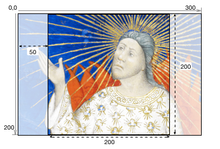
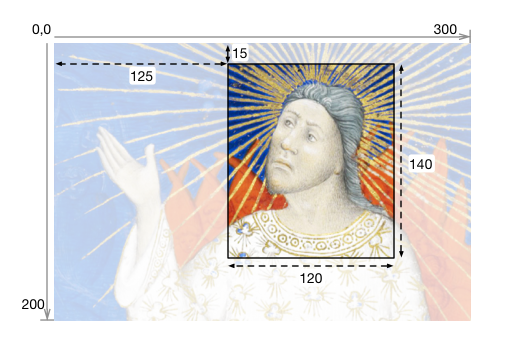
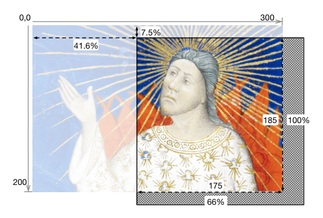
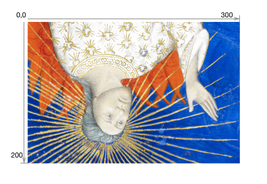
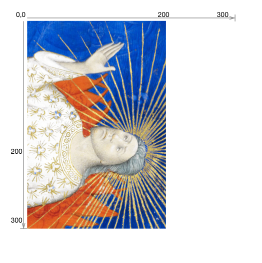

## Status of this Document
{:.no_toc}

__This Version:__ {{ page.major }}.{{ page.minor }}.{{ page.patch }}-{{ page.pre }}

__Latest Stable Version:__ [{{ site.image_api.stable.major }}.{{ site.image_api.stable.minor }}.{{ site.image_api.stable.patch }}][image-api]

__Previous Version:__ [2.1.1][image21]

**Editors:**

  * **[Michael Appleby](https://orcid.org/0000-0002-1266-298X)** [](https://orcid.org/0000-0002-1266-298X), [_Yale University_](http://www.yale.edu/)
  * **[Tom Crane](https://orcid.org/0000-0003-1881-243X)** [](https://orcid.org/0000-0003-1881-243X), [_Digirati_](http://digirati.com/)
  * **[Robert Sanderson](https://orcid.org/0000-0003-4441-6852)** [](https://orcid.org/0000-0003-4441-6852), [_J. Paul Getty Trust_](http://www.getty.edu/)
  * **[Jon Stroop](https://orcid.org/0000-0002-0367-1243)** [](https://orcid.org/0000-0002-0367-1243), [_Princeton University Library_](https://library.princeton.edu/)
  * **[Simeon Warner](https://orcid.org/0000-0002-7970-7855)** [](https://orcid.org/0000-0002-7970-7855), [_Cornell University_](https://www.cornell.edu/)
  {: .names}



__Status Warning__
This is a work in progress and may change without any notices. Implementers should be aware that this document is not stable. Implementers are likely to find the specification changing in incompatible ways. Those interested in implementing this document before it reaches beta or release stages should join the [mailing list][iiif-discuss] and take part in the discussions, and follow the [emerging issues][github-milestone-image-3] on Github.
{: .warning}

----

## Table of Contents
{:.no_toc}

* Table of Discontent (will be replaced by macro)
{:toc}

## 1. Introduction

This document describes an image delivery API defined by the International Image Interoperability Framework (IIIF, pronounced "Triple-Eye-Eff") Consortium. The IIIF Image API specifies a web service that returns an image in response to a standard HTTP or HTTPS request. The URI can specify the region, size, rotation, quality characteristics and format of the requested image. A URI can also be constructed to request basic technical information about the image to support client applications. This API was conceived of to facilitate systematic reuse of image resources in digital image repositories maintained by cultural heritage organizations. It could be adopted by any image repository or service, and can be used to retrieve static images in response to a properly constructed URI.

Please send feedback to [iiif-discuss@googlegroups.com][iiif-discuss].

### 1.1. Audience and Scope

This document is intended for architects and developers building applications that share and consume digital images, particularly from cultural heritage institutions, museums, libraries and archives. Target applications include:

  * Digital image repositories and distributed content networks.
  * Image focused web applications, such as pan/zoom viewers, book-readers, etc.
  * Client applications using image content for analysis or comparison.

This specification concerns image requests by a client, but not management of the images by the server. It covers how to respond to requests that follow a particular URI syntax, but does not cover methods of implementation such as rotation algorithms, transcoding, color management, compression, or how to respond to URIs that do not conform to the specified syntax. This allows flexibility for implementation in domains with particular constraints or specific community practices, while supporting interoperability in the general case.

Implementations may use a pre-generated set of files served as static web resources and still enable rich user experiences. Dynamic image server implementations may provide additional functionality beyond the base [level of compliance][image30-compliance-levels].

### 1.2. Terminology

The term **underlying image content** is used to refer to the source image data. No assumptions are made about its format or structure. It might be derived from one or more source images but could also be dynamically generated.

The term **full image** is used to refer to the entire area of the underlying image content, with the pixel dimensions given in the [image information][image30-information] document, and which is imagined as the starting point for [image requests][image30-requests].

The key words _MUST_, _MUST NOT_, _REQUIRED_, _SHALL_, _SHALL NOT_, _SHOULD_, _SHOULD NOT_, _RECOMMENDED_, and _OPTIONAL_ in this document are to be interpreted as described in [RFC 2119][org-rfc-2119].

## 2. URI Syntax

The IIIF Image API can be called in two ways:

 * Request an image, derived from the underlying image content.
 * Request information about the image service, including characteristics, functionality available, and related services.

Both convey the request's information in the path segments of the URI, rather than as query parameters. This makes responses easier to cache, either at the server or by standard web-caching infrastructure. It also permits a minimal implementation using pre-computed files in a matching directory structure.

There are four parameters shared by the requests, and other IIIF specifications:

| Name   | Description |
| ------ | ----------- |
| scheme | Indicates the use of the HTTP or HTTPS protocol in calling the service. |
| server | The host server on which the service resides. The parameter may also include a port number. |
| prefix | The path on the host server to the service. This prefix is optional, but may be useful when the host server supports multiple services. The prefix _MAY_ contain multiple path segments, delimited by slashes, but all other special characters _MUST_ be encoded. See [URI Encoding and Decoding][image30-uri-encoding-and-decoding] for more information. |
| identifier | The identifier of the requested image. This may be an ark, URN, filename, or other identifier. Special characters _MUST_ be URI encoded. |
{: .api-table}

The combination of these parameters forms the image service’s base URI and identifies the underlying image content. It is constructed according to the following URI template ([RFC6570][org-rfc-6570]):

``` none
{scheme}://{server}{/prefix}/{identifier}
```
{: .urltemplate}

When the base URI is dereferenced, the interaction _SHOULD_ result in the image information document. It is _RECOMMENDED_ that the response be a 303 status redirection to the image information document's URI. Implementations _MAY_ also exhibit other behavior for the base URI beyond the scope of this specification in response to HTTP request headers and methods.

To allow for extensions, this specification does not define the server behavior when it receives requests that do not match either the base URI or one of the described URI syntaxes below.

###  2.1. Image Request URI Syntax

The IIIF Image API URI for requesting an image _MUST_ conform to the following URI template:

``` none
{scheme}://{server}{/prefix}/{identifier}/{region}/{size}/{rotation}/{quality}.{format}
```
{: .urltemplate}

For example:

``` none
https://example.org/image-service/abcd1234/full/max/0/default.jpg
```
{: .urltemplate}

The parameters of the Image Request URI include region, size, rotation, quality and format, which define the characteristics of the returned image. These are described in detail in [Image Requests][image30-requests].

###  2.2. Image Information Request URI Syntax

The URI for requesting image information _MUST_ conform to the following URI template:

``` none
{scheme}://{server}{/prefix}/{identifier}/info.json
```
{: .urltemplate}

For example:

``` none
https://example.org/image-service/abcd1234/info.json
```
{: .urltemplate}

The scheme, server, prefix and identifier components of the information request _MUST_ be identical to those for the image request described above for the image content that the image information document describes. The image information document is described in detail in the [Image Information][image30-information] section.

##  3. Identifier

The API places no restrictions on the form of the identifiers that a server may use or support. All special characters (e.g. `?` or `#`) _MUST_ be URI encoded to avoid unpredictable client behaviors. The URI syntax relies upon slash (`/`) separators so any slashes in the identifier _MUST_ be URI encoded (also called "percent encoded"). See the additional discussion in [URI Encoding and Decoding][image30-uri-encoding-and-decoding].

##  4. Image Requests

All parameters described below are required for compliant construction of a IIIF Image API URI. The sequence of parameters in the URI _MUST_ be in the order described below. The order of the parameters is also intended as a mnemonic for the order of the operations by which the service should manipulate the image content. Thus, the requested image content is first extracted as a region of the full image, then scaled to the requested size, mirrored and/or rotated, and finally transformed into the requested color quality and format. This resulting image is returned as the representation for the URI.

Size and region parameters in pixels _MUST_ be non-negative integers. Size and region parameters in percentages and the rotation parameter _MUST_ be positive floating point numbers or integers. For details of the representation of floating point numbers in IIIF URIs, see the [Canonical URI Syntax][image30-canonical-uri-syntax] section.

Servers _SHOULD_ support [CORS][image30-cors-response] on image responses.

### 4.1. Region

The region parameter defines the rectangular portion of the underlying image content to be returned. Region can be specified by pixel coordinates, percentage or by the value `full`, which specifies that the full image should be returned.

| Form |  Description |
| ------------------- | ------------ |
| `full`              | The full image is returned, without any cropping. |
| `square`            | The region is defined as an area where the width and height are both equal to the length of the shorter dimension of the full image. The region may be positioned anywhere in the longer dimension of the full image at the server's discretion, and centered is often a reasonable default.|
| _`x,y,w,h`_         | The region of the full image to be returned is specified in terms of absolute pixel values. The value of _`x`_ represents the number of pixels from the 0 position on the horizontal axis. The value of _`y`_ represents the number of pixels from the 0 position on the vertical axis. Thus the _`x,y`_ position 0,0 is the upper left-most pixel of the image. _`w`_ represents the width of the region and _`h`_ represents the height of the region in pixels.  |
| _`pct:x,y,w,h`_     | The region to be returned is specified as a sequence of percentages of the full image's dimensions, as reported in the image information document. Thus, _`x`_ represents the number of pixels from the 0 position on the horizontal axis, calculated as a percentage of the reported width. _`w`_ represents the width of the region, also calculated as a percentage of the reported width. The same applies to _`y`_ and _`h`_ respectively. |
{: .api-table}

If the request specifies a region which extends beyond the dimensions of the full image as reported in the image information document, then the service _SHOULD_ return an image cropped at the image's edge, rather than adding empty space.

If the requested region's height or width is zero, or if the region is entirely outside the bounds of the reported dimensions, then the server _SHOULD_ return a 400 (Bad Request) status code.

Examples:

<table class="ex_table">
  <tbody>
    <tr>
      <td>
        
        <p><strong>1</strong> region=full</p>
        <p><code>.../full/max/0/default.jpg</code></p>
      </td>
      <td>
        
        <p><strong>2</strong> region=square</p>
        <p><code>.../square/max/0/default.jpg</code></p>
      </td>
    </tr>
    <tr>
      <td>
        
        <p><strong>3</strong> region=125,15,120,140</p>
        <p><code>.../125,15,120,140/max/0/default.jpg</code></p>
      </td>
      <td>
        
        <p><strong>4</strong> region=pct:41.6,7.5,40,70</p>
        <p><code>.../pct:41.6,7.5,40,70/max/0/default.jpg</code></p>
      </td>
    </tr>
    <tr>
      <td>
        
        <p><strong>5</strong> region=125,15,200,200</p>
        <p><code>.../125,15,200,200/max/0/default.jpg</code></p>
        <p><em>N.B. Returned image is 175,185 px</em></p>
      </td>
      <td>
        
        <p><strong>6</strong> region=pct:41.6,7.5,66.6,100</p>
        <p><code>.../pct:41.6,7.5,66.6,100/max/0/default.jpg</code></p>
        <p><em>N.B. Returned image is 175,185 px</em></p>
      </td>
    </tr>
  </tbody>
</table>


###  4.2. Size

The size parameter specifies the dimensions to which the extracted region, which might be the complete image, is to be scaled. With the exception of the _`w,h`_ form, the returned image maintains the aspect ratio of the extracted region as closely as possible.

| Form      | Description |
| --------- | ----------- |
| `max`     | The extracted region is returned at the maximum size available. The resulting image will have the pixel dimensions of the extracted region, unless it is constrained to a smaller size by `maxWidth`, `maxHeight`, or `maxArea` as defined in the [Technical Properties][image30-technical-properties] section. |
| _`w,`_    | The extracted region should be scaled so that the width of the returned image is exactly equal to _`w`_. |
| _`,h`_    | The extracted region should be scaled so that the height of the returned image is exactly equal to _`h`_. |
| _`pct:n`_ | The width and height of the returned image is scaled to _`n`_ percent of the width and height of the extracted region. |
| _`w,h`_   | The width and height of the returned image are exactly _`w`_ and _`h`_. The aspect ratio of the returned image _MAY_ be significantly different than the extracted region, resulting in a distorted image. |
| _`!w,h`_  | The extracted region is scaled so that the width and height of the returned image are not greater than _`w`_ and _`h`_, while maintaining the aspect ratio. The returned image _MUST_ be as large as possible but not larger than the extracted region, _`w`_ or _`h`_, or server-imposed limits. |
{: .api-table}

The pixel dimensions of the scaled region _MUST NOT_ be greater than the pixel dimensions of the extracted region, or be less than 1 pixel. Requests that would generate images of these sizes are errors that _SHOULD_ result in a 400 (Bad Request) status code.

Examples:

<table class="ex_table">
  <tbody>
    <tr>
      <td>
        
        <p><strong>1</strong> size=max</p>
        <p><code>.../full/max/0/default.jpg</code></p>
        <p><em>N.B. Assuming that the image has a <code>maxWidth</code> of 200px</em></p>
      </td>
      <td>
        
        <p><strong>2</strong> size=150,</p>
        <p><code>.../full/150,/0/default.jpg</code></p>
      </td>
    </tr>
    <tr>
      <td>
        
        <p><strong>3</strong> size=,150</p>
        <p><code>.../full/,150/0/default.jpg</code></p>
      </td>
      <td>
        
        <p><strong>4</strong> size=pct:50</p>
        <p><code>.../full/pct:50/0/default.jpg</code></p>
      </td>
    </tr>
    <tr>
      <td>
        
        <p><strong>5</strong> size=225,100</p>
        <p><code>.../full/225,100/0/default.jpg</code></p>
      </td>
      <td>
        
        <p><strong>6</strong> size=!225,100</p>
        <p><code>.../full/!225,100/0/default.jpg</code></p>
        <p><em>N.B. Returned image is 150,100 px</em></p>
      </td>
    </tr>
  </tbody>
</table>

###  4.3. Rotation

The rotation parameter specifies mirroring and rotation. A leading exclamation mark ("!") indicates that the image should be mirrored by reflection on the vertical axis before any rotation is applied. The numerical value represents the number of degrees of clockwise rotation, and may be any floating point number from 0 to 360.

| Form   | Description |
| ------ | ----------- |
| _`n`_  | The degrees of clockwise rotation from 0 up to 360.     |
| _`!n`_ | The image should be mirrored and then rotated as above. |
{: .api-table}

A rotation value that is out of range or unsupported _SHOULD_ result in a 400 (Bad Request) status code.

In most cases, rotation will change the width and height dimensions of the returned image. The service _SHOULD_ return an image that contains all of the image contents requested in the region and size parameters, even if the dimensions of the returned image file are different than specified in the size parameter. The image contents _SHOULD NOT_ be scaled as a result of the rotation, and there _SHOULD_ be no additional space between the corners of the rotated image contents and the bounding box of the returned image.

For rotations which are not multiples of 90 degrees, it is _RECOMMENDED_ that the client request the image in a format that supports transparency, such as `png`, and that the server return the image with a transparent background. There is no facility in the API for the client to request a particular background color or other fill pattern.

Examples:

<table class="ex_table">
  <tbody>
    <tr>
      <td>
        
        <p><strong>1</strong> rotation=0</p>
        <p><code>.../full/max/0/default.jpg</code></p>
      </td>
      <td>
        
        <p><strong>2</strong> rotation=180</p>
        <p><code>.../full/max/180/default.jpg</code></p>
      </td>
    </tr>
    <tr>
      <td>
        
        <p><strong>3</strong> rotation=90</p>
        <p><code>.../full/max/90/default.jpg</code></p>
      </td>
      <td>
        
        <p><strong>4</strong> rotation=22.5</p>
        <p><code>.../full/max/22.5/default.png</code></p>
      </td>
    </tr>
    <tr>
      <td>
        
        <p><strong>5</strong> rotation=!0</p>
        <p><code>.../full/max/!0/default.jpg</code></p>
      </td>
      <td>
        
        <p><strong>6</strong> rotation=!180</p>
        <p><code>.../full/max/!180/default.jpg</code></p>
      </td>
    </tr>
  </tbody>
</table>

###  4.4. Quality

The quality parameter determines whether the image is delivered in color, grayscale or black and white.

| Quality   | Parameter Returned |
| --------- | ------------------ |
| `color`   | The image is returned with all of its color information. |
| `gray`    | The image is returned in grayscale, where each pixel is black, white or any shade of gray in between. |
| `bitonal` | The image returned is bitonal, where each pixel is either black or white. |
| `default` | The image is returned using the server's default quality (e.g. `color`, `gray` or `bitonal`) for the image. |
{: .api-table}

The `default` quality exists to support [level 0 compliant implementations][image30-compliance-quality] that may not know the qualities of individual images in their collections. It also provides a convenience for clients that know the values for all other parameters of a request except the quality (e.g. `.../full/120,80/90/{quality}.png` to request a thumbnail) in that a preliminary image information request that would only serve to find out which qualities are available can be avoided.

A quality value that is unsupported _SHOULD_ result in a 400 (Bad Request) status code.

Examples:

<table class="ex_table">
  <tbody>
    <tr>
      <td>
        
        <p><strong>1</strong> quality=default</p>
        <p><code>.../full/max/0/default.jpg</code></p>
      </td>
      <td>
        
        <p><strong>2</strong> quality=color</p>
        <p><code>.../full/max/0/color.jpg</code></p>
      </td>
    </tr>
    <tr>
      <td>
        
        <p><strong>3</strong> quality=gray</p>
        <p><code>.../full/max/0/gray.jpg</code></p>
      </td>
      <td>
        
        <p><strong>4</strong> quality=bitonal</p>
        <p><code>.../full/max/0/bitonal.jpg</code></p>
      </td>
    </tr>
  </tbody>
</table>

###  4.5. Format

The format of the returned image is expressed as a suffix, mirroring common filename extensions, at the end of the URI.

| Extension | MIME Type |
| --------- | --------- |
| `jpg`     | image/jpeg |
| `tif`     | image/tiff |
| `png`     | image/png |
| `gif`     | image/gif |
| `jp2`     | image/jp2 |
| `pdf`     | application/pdf |
| `webp`    | image/webp |
{: .api-table}

A format value that is unsupported _SHOULD_ result in a 400 (Bad Request) status code.

Examples:

  1. `.../full/max/0/default.jpg`
  2. `.../full/max/0/default.png`
  3. `.../full/max/0/default.tif`
  {: .examplelist}

### 4.6. Order of Implementation

The sequence of parameters in the URI is intended as a mnemonic for the order in which image manipulations are made against the underlying image content. This is important to consider when implementing the image service because applying the same parameters in a different sequence will often result in a different image being delivered.

The parameters should be interpreted as if the sequence of image manipulations were:

`Region THEN Size THEN Rotation THEN Quality THEN Format`

If the rotation parameter includes mirroring (`!`), the mirroring is applied before the rotation.

<table class="ex_table">
  <tbody>
    <tr>
      <td>
        
        <p><strong>1</strong> region=125,15,120,140 size=90, rotation=!345 quality=gray</p>
        <p><code>.../125,15,120,140/90,/!345/gray.jpg</code></p>
      </td>
    </tr>
  </tbody>
</table>

### 4.7. Canonical URI Syntax

It is possible to request the same image using different combinations of parameters. While it is useful for clients to be able to express their requests in a convenient form, there are several reasons why a canonical URI syntax is desirable:

  * It enables static, file-system based implementations, which will have only a single URI at which the content is available.
  * Caching becomes significantly more efficient, both client and server side, when the URIs used are the same between systems and sessions.
  * Response times can be improved by avoiding redirects from a requested non-canonical URI syntax to the canonical syntax by using the canonical form directly.

In order to support the above requirements, clients _SHOULD_ construct image request URIs using the following canonical parameter values where possible. Image servers _MAY_ redirect the client to the canonical URI from a non-canonical equivalent.

| Parameter | Canonical value |
| --------- | --------------- |
| region    | `full` if the full image is requested<br/>otherwise the _`x,y,w,h`_ syntax. |
| size      | `max` if the maximum size is requested,<br/>otherwise the _`w,h`_ syntax. |
| rotation  | `!` if the image is mirrored, followed by an integer if possible, otherwise a floating point value. |
| quality   | `default` if the server's default quality is requested,<br/>otherwise the quality string. |
| format    | An explicit format string is always required. |
{: .api-table}

Size and region parameters given as percentages and the rotation parameter allow positive floating point number values. Integer values _SHOULD_ be used where possible. When floating point values are used, they _MUST_ consist only of decimal digits and "." (e.g. 0.9 not +0.9), _SHOULD_ be represented with a leading 0 if less than 1 (e.g. 0.9 not .9), and _SHOULD NOT_ include trailing zeros (e.g. 0.9 not 0.90). Intermediate calculations may use floating point numbers and the rounding method is implementation specific.

When the client requests an image, the server _MAY_ add a link header to the response that indicates the canonical URI for that request:

``` none
Link: <http://iiif.example.com/server/full/400,300/0/default.jpg>;rel="canonical"
```
{: .urltemplate}

The server _MAY_ also include this link header on the image information response, however it is unnecessary as it is included in the JSON representation retrieved.

### 4.8. Extensions

The IIIF Image API is extensible within the [Image Request URI Syntax][image30-information-request-uri-syntax] through the addition of new parameter patterns for the [region][image30-region], [size][image30-size] and [rotation][image30-rotation] parameters, or new values for the [quality][image30-quality] and [format][image30-format] parameters. Request information beyond the scope of the existing parameters could be passed to an image server as query parameters. Extension features _SHOULD_ be described in the image information document following the guidelines in the [Extra Functionality][image30-extra-functionality] section.


##  5. Image Information

Servers _MUST_ support requests for image information. The response is a JSON document that includes technical properties about the full image and may also contain rights and licensing properties, and services related to it.

### 5.1. Image Information Request

The request for the image information _MUST_ conform to the URI template:

``` none
{scheme}://{server}{/prefix}/{identifier}/info.json
```
{: .urltemplate}

The syntax for the response is [JSON-LD][org-w3c-json-ld]. The content-type of the response _MUST_ be either `application/json` (regular JSON),

``` none
Content-Type: application/json
```
{: .urltemplate}

or `application/ld+json` (JSON-LD).

``` none
Content-Type: application/ld+json;profile="http://iiif.io/api/image/3/context.json"
```
{: .urltemplate}

If the server receives a request with one of the content types above in the Accept header, it _SHOULD_ respond with that content type following the rules of [content negotiation][org-rfc-7231-conneg]. Otherwise, it _MUST_ respond with the `application/json` content type.

Servers should also support [CORS][image30-cors-response] on image information responses.

### 5.2. Technical Properties

The JSON response has several technical properties that describe the available functionality for the image content.

| Property   | Required? | Description |
| ---------- | --------- | ----------- |
| `@context` | Required | The `@context` property _SHOULD_ appear as the very first key-value pair of the JSON representation. Its value _MUST_ be either the URI `http://iiif.io/api/image/{{ page.major }}/context.json` or a JSON array with the URI `http://iiif.io/api/image/{{ page.major }}/context.json` as the last item. The `@context` tells Linked Data processors how to interpret the image information. If extensions are used then their context definitions _SHOULD_ be included in this top-level `@context` property. |
| `id` | Required | The base URI of the image as defined in [URI Syntax][image30-uri-syntax], including scheme, server, prefix and identifier without a trailing slash. |
| `type` | Required | The type for the Image API. The value _MUST_ be the string `ImageService3`. |
| `protocol` | Required | The URI `http://iiif.io/api/image` which can be used to determine that the document describes an image service which is a version of the IIIF Image API. |
| `profile` | Required | A string indicating the highest [compliance level][image30-compliance-levels] which is fully supported by the service. The value _MUST_ be one of `level0`, `level1`, or `level2`. |
| `width` | Required | The width in pixels of the full image, given as an integer. |
| `height` | Required | The height in pixels of the full image, given as an integer. |
| `maxWidth`  | Optional | The maximum width in pixels supported for this image. Clients _MUST NOT_ expect requests with a width greater than this value to be supported. `maxWidth` _MUST_ be specified if `maxHeight` is specified. |
| `maxHeight` | Optional  | The maximum height in pixels supported for this image. Clients _MUST NOT_ expect requests with a height greater than this value to be supported. If `maxWidth` is specified and `maxHeight` is not, then clients should infer that `maxHeight = maxWidth`.  |
| `maxArea`   | Optional  | The maximum area in pixels supported for this image. Clients _MUST NOT_ expect requests with a width\*height greater than this value to be supported. |
{: .api-table}

The `width` and `height` properties give the size of the full image and are required in order to construct tile requests.

The `maxWidth`, `maxHeight`, and `maxArea` parameters provide a way for image servers to express limits on the sizes supported for the image. If `maxWidth` alone, or `maxWidth` and `maxHeight` are specified then clients should expect requests with larger linear dimensions to be rejected. If `maxArea` is specified then clients should expect requests with larger pixel areas to be rejected. The `maxWidth / maxHeight`  and `maxArea` parameters are independent, servers may implement either or both limits. Servers _MUST_ ensure that sizes specified by any `sizes` or `tiles` properties are within any size limits expressed. Clients _SHOULD NOT_ make requests that exceed size limits expressed.

``` json-doc
{
  "@context": "http://iiif.io/api/image/{{ page.major }}/context.json",
  "id": "https://example.org/image-service/abcd1234/1E34750D-38DB-4825-A38A-B60A345E591C",
  "type": "ImageService3",
  "protocol": "http://iiif.io/api/image",
  "profile": "level2",
  "width": 6000,
  "height": 4000,
  "maxHeight": 2000,
  "maxWidth": 3000,
  "maxArea": 4000000
}
```

### 5.3. Sizes

The JSON response _MAY_ have the `sizes` property, which is used to describe preferred `height` and `width` combinations for representations of the full image.

| Property   | Required? | Description |
| ---------- | --------- | ----------- |
| `sizes` | Optional | An array of JSON objects with the `height` and `width` properties. These sizes specify preferred values to be provided in the _`w,h`_ syntax of the size request parameter for scaled versions of the full image. In the case of servers that do not support requests for arbitrary sizes, these may be the only sizes available. A request constructed with the _`w,h`_ syntax using these sizes _MUST_ be supported by the server, even if arbitrary width and height are not. |
{: .api-table}

The JSON objects in the `sizes` array have the properties in the following table. Image requests for these sizes _SHOULD_ have a region parameter of `full`, size parameter in the canonical _`w,h`_ form, and rotation of `0`. Thus, the full URL for an image with `default` quality in `jpg` format would be: `{scheme}://{server}/{prefix}/{identifier}/full/{width},{height}/0/default.jpg`

| Property   | Required? | Description |
| ---------- | -------- | ----------- |
| `type`     | Optional | The type of the object. If present, the value _MUST_ be the string `Size`. |
| `width`    | Required | The width in pixels of the image to be requested, given as an integer. |
| `height`   | Required | The height in pixels of the image to be requested, given as an integer. |
{: .api-table}

``` json-doc
{
  "@context": "http://iiif.io/api/image/{{ page.major }}/context.json",
  "id": "https://example.org/image-service/abcd1234/1E34750D-38DB-4825-A38A-B60A345E591C",
  "type": "ImageService3",
  "protocol": "http://iiif.io/api/image",
  "profile": "level2",
  "width": 6000,
  "height": 4000,
  "sizes": [
    { "width": 150, "height": 100 },
    { "width": 600, "height": 400 },
    { "width": 3000, "height": 2000 }
  ]
}
```

### 5.4. Tiles

The JSON response _MAY_ have the `tiles` property which describes a set of image regions that have a consistent height and width, over a series of resolutions, that can be stitched together visually.

| Property   | Required? | Description |
| ---------- | --------- | ----------- |
| `tiles` | Optional | An array of JSON objects describing the parameters to use to request regions of the image (tiles) that are efficient for the server to deliver. Each description gives a width, optionally a height for non-square tiles, and a set of scale factors at which tiles of those dimensions are available. |
{: .api-table}

The JSON objects in the `tiles` array have the properties in the following table. The `width` and `height` should be used to fill the size parameter, and be used together with the `scaleFactors` to compute the region parameter of the image requests. This is described in detail in the [Implementation Notes][image30-implementation-notes].


| Property | Required? | Description |
| ---------- | -------- | ----------- |
| `type`    | Optional | The type of the object. If present, the value _MUST_ be the string `Tile`. |
| `scaleFactors` | Required | The set of resolution scaling factors for the image's predefined tiles, expressed as positive integers by which to divide the full size of the image. For example, a scale factor of 4 indicates that the service can efficiently deliver images at 1/4 or 25% of the height and width of the full image. A particular scale factor value _SHOULD_ appear only once in the `tiles` array. |
| `width` | Required | The width in pixels of the predefined tiles to be requested, given as an integer. |
| `height` | Optional | The height in pixels of the predefined tiles to be requested, given as an integer. If it is not specified in the JSON, then it defaults to the same as `width`, resulting in square tiles. |
{: .api-table}

Objects in the `tiles` array _MUST_ each have a unique combination of `width` and `height`, where `height` = `width` if it is not explicitly specified.

``` json-doc
{
  "@context": "http://iiif.io/api/image/{{ page.major }}/context.json",
  "id": "https://example.org/image-service/abcd1234/1E34750D-38DB-4825-A38A-B60A345E591C",
  "type": "ImageService3",
  "protocol": "http://iiif.io/api/image",
  "profile": "level2",
  "width": 6000,
  "height": 4000,
  "tiles": [
    { "width": 512, "scaleFactors": [ 1, 2, 4, 8, 16 ] }
  ]
}
```

### 5.5. Rights Related Properties

The rights and licensing properties, `requiredStatement`, `rights` and `logo`, have the same semantics and requirements as those in the [Presentation API][prezi3].

| Property | Required? | Description |
| ------------- | --------- | ----------- |
| `requiredStatement` | Optional  | Text that _MUST_ be shown when content obtained from the Image API service is displayed or used. It might include copyright or ownership statements, or a simple acknowledgement of the providing institution. The value of this property _MUST_ be a JSON object, that has the `label` and `value` properties. The values of both `label` and `value` must be JSON objects, as described in the [Language of Property Values][prezi3-languages] section of the Presentation API. The `value` property _MAY_ contain simple HTML as described in the [HTML Markup in Property Values][prezi3-html] section of the Presentation API. Given the wide variation of potential client user interfaces, it will not always be possible to display this statement to the user in the client’s initial state. If initially hidden, clients _MUST_ make the method of revealing it as obvious as possible. |
| `rights` | Optional | A string that identifies a license or rights statement that applies to the content of this image. The value of this property _MUST_ be drawn from the set of [Creative Commons][org-cc-licenses] licenses, the [RightsStatements.org][org-rs-terms] rights statements, or those added via the [Registry of Known Extensions][annex-registry] mechanism. The inclusion of this property is informative, and for example could be used to display an icon representing the rights assertions. If displaying rights information directly to the user is the desired interaction, or a publisher-defined label is needed, then it is _RECOMMENDED_ to include the information using the `requiredStatement` property. |
| `logo` | Optional | A small external image resource that represents an individual or organization associated with this image. This could be the logo of the owning or hosting institution. The value of this property _MUST_ be an array of JSON objects, each of which _MUST_ have an `id` and _SHOULD_ have at least one of `type` and `format`. The logo _MUST_ be clearly rendered when the resource is displayed or used, without cropping, rotating or otherwise distorting the image. It is _RECOMMENDED_ that a IIIF Image API service be available for this image for other manipulations such as resizing. |
{: .api-table}

It is _RECOMMENDED_ that logos with IIIF Image API services do not, themselves, have `logo` properties. When clients render logos specified with an IIIF Image API service, they _MAY_ ignore any `logo` property on in the included logo.

When both the Image and Presentation APIs express `requiredStatement` or `logo` properties, then clients _MUST_ display both unless they are identical.

``` json-doc
{
  "@context": "http://iiif.io/api/image/{{ page.major }}/context.json",
  "id": "https://example.org/image-service/abcd1234/1E34750D-38DB-4825-A38A-B60A345E591C",
  "type": "ImageService3",
  "protocol": "http://iiif.io/api/image",
  "profile": "level2",
  "width": 6000,
  "height": 4000,
  "requiredStatement": {
    "label": { "en": [ "Attribution" ] },
    "value": { "en": [ "Provided by Example Organization" ] }
  },
  "logo": [
    {
      "id": "https://example.org/logos/institution1.jpg",
      "type": "Image"
    }
  ],
  "rights": "http://rightsstatements.org/vocab/InC-EDU/1.0/"
}
```


### 5.6. Extra Functionality

The JSON response _MAY_ also contain properties that describe additional functionality available via the image service.

| Property   | Required? | Description |
| ---------- | --------- | ----------- |
| `extraQualities` | Optional | An array of strings that can be used as the quality parameter, in addition to the ones specified in the referenced profile. |
| `extraFormats` | Optional | An array of strings that can be used as the format parameter, in addition to the ones specified in the referenced profile. |
| `extraFeatures` | Optional | An array of strings identifying features supported by the service, in addition to the ones specified in the referenced profile. These strings are defined either in the [table][image30-features-table] below or by [registering an extension][registry-image-extensions]. |
{: .api-table}

The following features are defined for use in the `extraFeatures` property:

| Feature Name | Description |
| ------------ | ----------- |
| `baseUriRedirect` | The base URI of the service will redirect to the image information document. |
| `canonicalLinkHeader` | The canonical image URI HTTP link header is provided on image responses. |
| `cors` |  The CORS HTTP headers are provided on all responses.  |
| `jsonldMediaType` | The JSON-LD media type is provided when requested. |
| `mirroring` | The image may be rotated around the vertical axis, resulting in a left-to-right mirroring of the content. |
| `profileLinkHeader` | The profile HTTP link header is provided on image responses. |
| `regionByPct` | Regions of the full image may be requested by percentage.  |
| `regionByPx` | Regions of the full image may be requested by pixel dimensions.  |
| `regionSquare` | A square region may be requested, where the width and height are equal to the shorter dimension of the full image. |
| `rotationArbitrary` | Image rotation may be requested using values other than multiples of 90 degrees. |
| `rotationBy90s` | Image rotation may be requested in multiples of 90 degrees. |
| `sizeByConfinedWh` | Image size may be requested in the form _`!w,h`_. |
| `sizeByH` | Image size may be requested in the form _`,h`_.  |
| `sizeByPct` | Images size may be requested in the form _`pct:n`_.  |
| `sizeByW` | Image size may be requested in the form _`w,`_.  |
| `sizeByWh` | Image size may be requested in the form _`w,h`_.  |
{: .api-table #features-table}

A server that supports neither `sizeByW` or `sizeByWh` is only required to serve the image sizes listed under the `sizes` property or implied by the `tiles` property of the image information document, allowing for a static file implementation.

The set of features, formats and qualities supported is the union of those declared in the external profile document and those added by the `extraQualities`, `extraFormats`, and `extraFeatures` properties. If a feature is not present in either the profile document or the `extraFeatures` property, then a client _MUST_ assume that the feature is not supported.

Additional strings used in the `extraQualities`, `extraFormats`, and `extraFeatures` properties, or additional properties used in the image information, that are not defined in this specification _SHOULD_ be mapped to RDF predicates using further context documents. These extensions _SHOULD_ be added to the top level `@context` property (see [Technical Properties][image30-technical-properties]). The JSON-LD 1.1 functionality of predicate specific context definitions, known as [scoped contexts][org-w3c-json-ld-scoped-contexts], _MUST_ be used to minimize cross-extension collisions. Extensions intended for community use _SHOULD_ be [registered in the extensions registry][annex-registry], but registration is not mandatory.

### 5.7. Linking Properties

The JSON response _MAY_ contain linking properties that reference external resources, including services that make additional functionality available to a viewer. The linking properties have the same semantics and requirements as those in the [Presentation API][prezi3].

| Property   | Required? | Description |
| ---------- | --------- | ----------- |
| `partOf`   | Optional  | A link to another resource that references this image service, for example a link to a Canvas or Manifest. The value _MUST_ be an array of JSON objects. Each item _MUST_ have the `id` and `type` properties, and _SHOULD_ have the `label` property. |
| `seeAlso`  | Optional  | A link to an external, machine-readable resource that is related to this resource, such as an XML or RDF description. Properties of the external resource should be given to help the client select between multiple descriptions (if provided), and to make appropriate use of the document. The URI of the document _MUST_ identify a single representation of the data in a particular format. The value _MUST_ be an array of JSON objects. Each item _MUST_ have the `id` and `type` properties, and _SHOULD_ have the `label`, `format` and `profile` properties. |
| `service`  | Optional  | A reference to an external service that the client might interact with directly to gain additional information or functionality, for example a link to an authentication service. The value _MUST_ be an array of JSON objects. Each object will have properties depending on the service’s definition, but _MUST_ have either the `id` or `@id` and `type` or `@type` properties. Each object _SHOULD_ have a `profile` property. See the [Service Registry][annex-services] for known service types. |
{: .api-table}

The JSON objects in `partOf`, `seeAlso`, and `service` have the properties indicated in the following table.

| Property   | Required?                 | Description |
| ---------- | ------------------------- | ----------- |
| `id`       | Required | The URI of the external resource. |
| `type`     | Required | The type or class of this resource.  Recommendations for basic types such as image, text or audio are [given in the Presentation API][prezi3-type]. |
| `label`    | Recommended | A human-readable label for this resource. The `label` property can be fully internationalized, and each language can have multiple values. This pattern is described in more detail in [the languages section of the Presentation API][prezi3-languages]. |
| `format`   | Recommended for `seeAlso` | The specific media type (often called a MIME type) for this content resource, for example “image/jpeg”. This is important for distinguishing different formats of the same overall type of resource, such as distinguishing text in XML from plain text. The value must be a string, and it should be the value of the Content-Type header returned when this resource is dereferenced. |
| `profile`  | Recommended for `seeAlso`, `service` | A schema or named set of functionality available from this resource. The profile can further clarify the `type` and/or `format` of an external resource. The value must be a string, either taken from the [Registry of Profiles][annex-registry] or a URI. |
{: .api-table}

``` json-doc
{
  "@context": [
    "http://iiif.io/api/presentation/{{ page.major }}/context.json",
    "http://iiif.io/api/image/{{ page.major }}/context.json"
  ],
  "id": "https://example.org/image-service/abcd12345/1E34750D-38DB-4825-A38A-B60A345E591C",
  "type": "ImageService3",
  "protocol": "http://iiif.io/api/image",
  "profile": "level2",
  "width": 6000,
  "height": 4000,
  "seeAlso": [
    {
      "id": "https://example.org/image1.xml",
      "label": { "en": [ "Technical image metadata" ] },
      "type": "Dataset",
      "format": "text/xml",
      "profile": "https://example.org/profiles/imagedata"
    }
  ],
  "partOf": [
    {
      "id": "https://example.org/manifest/1",
      "type": "Manifest",
      "label": { "en": [ "A Book" ] }
    }
  ]
}
```

### 5.8. Complete Response

The following shows an image information response including all of the required and optional properties.

``` json-doc
{
  "@context": [
    "http://example.org/extension/context1.json",
    "http://iiif.io/api/image/{{ page.major }}/context.json"
  ],
  "id": "https://example.org/image-service/abcd1234/1E34750D-38DB-4825-A38A-B60A345E591C",
  "type": "ImageService3",
  "protocol": "http://iiif.io/api/image",
  "profile": "level1",
  "width": 6000,
  "height": 4000,
  "sizes": [
    { "width": 150, "height": 100 },
    { "width": 600, "height": 400 },
    { "width": 3000, "height": 2000 }
  ],
  "tiles": [
    { "width": 512, "scaleFactors": [ 1, 2, 4 ] },
    { "width": 1024, "height": 2048, "scaleFactors": [ 8, 16 ] }
  ],
  "requiredStatement": {
    "label": {
      "en": [ "Attribution" ],
      "cy": [ "Priodoliad" ]
    },
    "value": {
      "en": [ "<span>Provided by <b>Example Organization</b></span>" ],
      "cy": [ "<span>Darparwyd gan <b>Enghraifft Sefydliad</b></span>" ]
    }
  },
  "logo": [
    {
      "id": "https://example.org/image-service/logo/square/200,200/0/default.png",
      "type": "Image",
      "service": [
        {
          "id": "https://example.org/image-service/logo",
          "type": "ImageService3",
          "profile": "level2"
        }
      ]
    }
  ],
  "rights": "http://rightsstatements.org/vocab/InC-EDU/1.0/",
  "extraFormats": [ "gif", "pdf" ],
  "extraQualities": [ "color", "gray" ],
  "extraFeatures": [ "canonicalLinkHeader", "rotationArbitrary", "profileLinkHeader" ],
  "service": [
    {
      "id": "https://example.org/service/example",
      "type": "Service",
      "profile": "https://example.org/docs/example-service.html"
    }
  ]
}
```

##  6. Compliance Level and Profile Document

The image information document _MUST_ specify the extent to which the API is supported by including the compliance level as the value of the `profile` property. The compliance level _MUST_ be one of those listed in the [Image API Compliance][image30-compliance] document and shown in the table below. The compliance level _SHOULD_ be the highest compliance level for which all requirements are met. The compliance levels each correspond with a profile document that describes the set of features required by that level, as discussed in the [Image Information][image30-information] section. A server _MAY_ declare different compliance levels for images with different identifiers.

| Compliance level | Profile document URI                                    |
| ---------------- | ------------------------------------------------------- |
| `level0`         | `http://iiif.io/api/image/{{ page.major }}/level0.json` |
| `level1`         | `http://iiif.io/api/image/{{ page.major }}/level1.json` |
| `level2`         | `http://iiif.io/api/image/{{ page.major }}/level2.json` |
{: .api-table}

The compliance level _MAY_ also be given in a HTTP `Link` header ([RFC5988][org-rfc-5988]), using the profile document URI with the parameter `rel="profile"`, on both Image and Image Information responses. A complete header might look like:

``` none
Link: <http://iiif.io/api/image/{{ page.major }}/level1.json>;rel="profile"
```
{: .urltemplate}

A recipe for setting this header on the Apache HTTP Server is shown in the [Apache HTTP Server Implementation Notes][notes-apache-set-compliance-link-header].

## 7. Server Responses

### 7.1. CORS

Servers _SHOULD_ support reuse of Image API resources by following the relevant requirements of the [CORS specification][org-w3c-cors], including the `Access-Control-Allow-Origin` header and the preflight request pattern. A recipe for enabling these behaviors is provided in the [Apache HTTP Server Implementation Notes][notes-apache-conditional-content-type].

### 7.2. Successful Responses

Servers may transmit HTTP responses with 200 (Successful) or 3xx (Redirect) status codes when the request has been successfully processed. If the status code is 200, then the entity-body _MUST_ be the requested image or information document. If the status code is 301, 302, 303, or 304, then the entity-body is unrestricted, but it is _RECOMMENDED_ to be empty. If the status code is 301, 302, or 303 then the Location HTTP Header _MUST_ be set containing the URI of the image that fulfills the request. This enables servers to have a single canonical URI to promote caching of responses. Status code 304 is handled exactly as per the HTTP specification. Clients _SHOULD_ expect to encounter all of these situations and _MUST NOT_ assume that the entity-body of the initial response necessarily contains the image data.

### 7.3. Error Conditions

The order in which servers parse requests and detect errors is not specified. A request is likely to fail on the first error encountered and return an appropriate HTTP status code, with common codes given in the list below. It is _RECOMMENDED_ that the body of the error response includes a human-readable description of the error in either plain text or html.

| Status Code | Description |
| ---------- | ----------- |
| 400 Bad Request | The server cannot fulfill the request, as the syntax of the request issued by the client is incorrect. |
| 401 Unauthorized | Authentication is required and not provided. See the [Authentication][image30-authentication] section for details. |
| 403 Forbidden | The user, authenticated or not, is not permitted to perform the requested operation. |
| 404 Not Found | The image resource specified by [identifier][image30-identifier] does not exist, the value of one or more of the parameters is not supported for this image service, or the requested size is greater than the limits specified. |
| 500 Internal Server Error | The server encountered an unexpected error that prevented it from fulfilling the request. |
| 501 Not Implemented | The server received a valid IIIF request that is not implemented. |
| 503 Service Unavailable | The server is busy/temporarily unavailable due to load/maintenance issues. |
{: .api-table}

### 7.4. HTTP Versions

Implementations that anticipate the need to respond to many concurrent requests from the same client _SHOULD_ make the API available via [HTTP/2][org-rfc-7540] in order to avoid repeatedly opening and closing connections. This also avoids the browser-imposed limit on the number of concurrent connections per site via [HTTP 1.1][org-rfc-7230].

##  8. Authentication

Images are generally secondary resources in a web page or application. In the case of web pages, images are embedded in the HTML `img` tag, and are retrieved via additional HTTP requests. When a user cannot load a web page, it is possible — and a generally accepted behavior — to redirect the user to another page and offer the opportunity to authenticate. This is not an option for secondary resources such as images, and the user is instead simply presented with a broken image icon.

No new authentication mechanisms are proposed, nor roles for authorization business logic. Instead, it is expected that authentication requirements and processes are handled outside of any IIIF-specific context, but within a IIIF-aware access control workflow. Please see the [IIIF Authentication specification][auth1].

##  9. URI Encoding and Decoding

The URI syntax of this API relies upon slash (`/`) separators which _MUST NOT_ be encoded. Clients _MUST_ percent-encode special characters (the to-encode set below: percent and gen-delims of [RFC3986][org-rfc-3986] except the colon) plus any characters outside the US-ASCII set within the components of requests. For example, any slashes within the identifier part of the URI _MUST_ be percent-encoded. Encoding is necessary only for the identifier because other components will not include special characters. Percent-encoding other characters introduces no ambiguity but is unnecessary.

``` none
to-encode = "/" / "?" / "#" / "[" / "]" / "@" / "%"
```
{: .urltemplate}

| Parameters | URI path |
| ---------- | -------- |
| identifier=id1 region=full size=max rotation=0 quality=default | `id1/full/max/0/default` |
| identifier=id1 region=0,10,100,200 size=pct:50 rotation=90 quality=default format=png | `id1/0,10,100,200/pct:50/90/default.png` |
| identifier=id1 region=pct:10,10,80,80 size=50, rotation=22.5 quality=color format=jpg | `id1/pct:10,10,80,80/50,/22.5/color.jpg` |
| identifier=bb157hs6068 region=full size=max rotation=270 quality=gray format=jpg | `bb157hs6068/full/max/270/gray.jpg` |
| identifier=ark:/12025/654xz321 region=full size=max rotation=0 quality=default | `ark:%2F12025%2F654xz321/full/max/0/default` |
| identifier=urn:foo:a123,456 region=full size=max rotation=0 quality=default | `urn:foo:a123,456/full/max/0/default` |
| identifier=urn:sici:1046-8188(199501)13:1%3C69:FTTHBI%3E2.0.TX;2-4 region=full size=max rotation=0 quality=default | `urn:sici:1046-8188(199501)13:1%253C69:FTTHBI%253E2.0.TX;2-4/full/max/0/default` |
| identifier=https://example.com/?54#a region=full size=max rotation=0 quality=default | `http:%2F%2Fexample.com%2F%3F54%23a/full/max/0/default` |
{: .api-table}

Servers which are incapable of processing arbitrarily encoded identifiers _SHOULD_ make their best efforts to expose only image identifiers for which clients will not encode any of the characters, and thus it is _RECOMMENDED_ to limit characters in identifiers to letters, numbers and the underscore character.

##  10. Security Considerations

This API defines a URI syntax and the semantics associated with its components. The composition of URIs has few security considerations except possible exposure of sensitive information in URIs or revealing of browse/view behavior of users.

Server applications implementing this API should consider possible denial-of-service attacks, and authentication vulnerabilities based on DNS spoofing. Applications must be careful to parse and sanitize incoming requests (URIs) in ways that avoid overflow, injection, and directory traversal attacks.

Early sanity checking of URIs (lengths, trailing GET, invalid characters, out-of-range parameters) and rejection with appropriate response codes is recommended.

## 11. Appendices

### A. Versioning

Starting with version 2.0, this specification follows [Semantic Versioning][org-semver]. See the note [Versioning of APIs][notes-versioning] for details regarding how this is implemented.

###  B. Acknowledgments

The production of this document was generously supported by a grant from the [Andrew W. Mellon Foundation][org-mellon].

Many thanks to the members of the [IIIF community][iiif-community] for their continuous engagement, innovative ideas and feedback.

###  C. Change Log

| Date       | Description |
| ---------- | ----------- |
| 2018-04-18 | Version 3.0 ALPHA [View change log][image30-change-log] |
| 2017-06-09 | Version 2.1.1 [View change log][image211-change-log] |
| 2016-05-12 | Version 2.1 (Crowned Eagle) [View change log][image21-change-log] |
| 2014-09-11 | Version 2.0 (Voodoo Bunny) [View change log][image20-change-log] |
| 2013-09-17 | Version 1.1 (unnamed) [View change log][image11-change-log] |
| 2012-08-10 | Version 1.0 (unnamed) |
{: .api-table}



