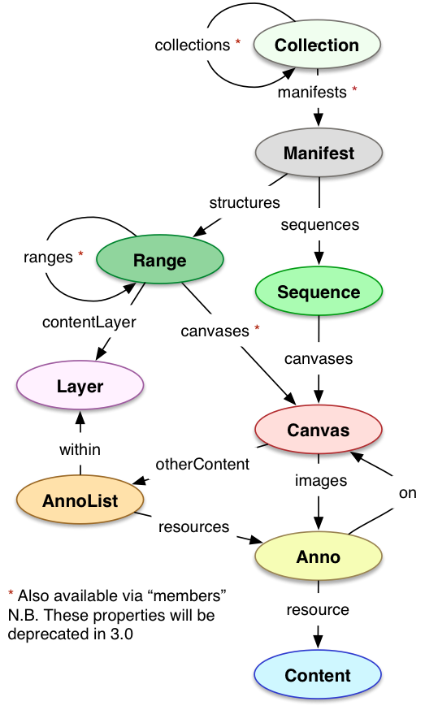

## Status of this Document
{:.no_toc}
__This Version:__ {{ page.major }}.{{ page.minor }}.{{ page.patch }}-{{ page.pre }}

__Latest Stable Version:__ [{{ site.presentation_api.stable.major }}.{{ site.presentation_api.stable.minor }}.{{ site.presentation_api.stable.patch }}][stable-version]

__Previous Version:__ [2.0][prev-version]

**Editors**

  * **[Michael Appleby](https://orcid.org/0000-0002-1266-298X)** [](https://orcid.org/0000-0002-1266-298X), [_Yale University_](http://www.yale.edu/)
  * **[Tom Crane](https://orcid.org/0000-0003-1881-243X)** [](https://orcid.org/0000-0003-1881-243X), [_Digirati_](http://digirati.com/)
  * **[Robert Sanderson](https://orcid.org/0000-0003-4441-6852)** [](https://orcid.org/0000-0003-4441-6852), [_J. Paul Getty Trust_](http://www.getty.edu/)
  * **[Jon Stroop](https://orcid.org/0000-0002-0367-1243)** [](https://orcid.org/0000-0002-0367-1243), [_Princeton University Library_](https://library.princeton.edu/)
  * **[Simeon Warner](https://orcid.org/0000-0002-7970-7855)** [](https://orcid.org/0000-0002-7970-7855), [_Cornell University_](https://www.cornell.edu/)
  {: .names}



----

## Table of Contents
{:.no_toc}

* Table of Discontent (will be replaced by macro)
{:toc}

##  1. Introduction
{: #introduction}

Access to image-based resources is fundamental to many research disciplines, scholarship and the transmission of cultural knowledge. Digital images are a container for much of the information content in the Web-based delivery of museum objects, books, newspapers, letters, manuscripts, maps, scrolls, single sheet collections, and digital surrogates of textiles, realia and ephemera.  Collections of born-digital images can also benefit from a standardized method to structure their layout and presentation, such as slideshows, image carousels, web comics, and more.

This document describes how the structure and layout of a complex image-based object can be made available in a standard manner. Many different styles of viewer can be implemented that consume the information to enable a rich and dynamic experience, consuming content from across collections and hosting institutions.

An object may comprise a series of pages, surfaces or other views; for example the single view of a painting, the two sides of a photograph, four cardinal views of a statue, or the many pages of an edition of a newspaper or book. The primary requirements for the Presentation API are to provide an order for these views, the resources needed to display a representation of the view, and the descriptive information needed to allow the user to understand what is being seen.

The principles of [Linked Data][linked-data] and the [Architecture of the Web][web-arch] are adopted in order to provide a distributed and interoperable system. The [Shared Canvas data model][shared-canvas] and [JSON-LD][json-ld] are leveraged to create an easy-to-implement, JSON-based format.

Please send feedback to [iiif-discuss@googlegroups.com][iiif-discuss]

### 1.1. Objectives and Scope
{: #objectives-and-scope}

The objective of the IIIF (pronounced "Triple-Eye-Eff") Presentation API is to provide the information necessary to allow a rich, online viewing environment for primarily image-based objects to be presented to a human user, likely in conjunction with the [IIIF Image API][image-api]. This is the sole purpose of the API and therefore the descriptive information is given in a way that is intended for humans to read, but not semantically available to machines. In particular, it explicitly does __not__ aim to provide metadata that would drive discovery of the digitized objects.

The following are within the scope of the current document:

  * The display of digitized images associated with a particular physical object, or born-digital compound object.
  * Navigation between the pages, surfaces or views of the object.
  * The display of text, and resources of other media types, associated with the object or its pages – this includes descriptive information about the object, labels that can aid navigation such as numbers associated with individual pages, copyright or attribution information, etc.

The following are __not__ within scope:

  * The discovery or selection of interesting digitized objects is not directly supported; however hooks to reference further resources are available.
  * Search within the object is described by the [IIIF Content Search API][search-api].

Note that in the following descriptions, "object" (or "physical object") is used to refer to a physical object that has been digitized or a born-digital compound object, and "resources" refer to the digital resources that are the result of that digitization or digital creation process.


###  1.2. Motivating Use Cases
{: #motivating-use-cases}

There are many different types of digitized or digital compound objects, from ancient scrolls to modern newspapers, from medieval manuscripts to online comics, and from large maps to small photographs. Many of them bear texts, sometimes difficult to read either due to the decay of the physical object or lack of understanding of the script or language.  These use cases are described in a separate [document][use-case-doc].

Collectively the use cases require a model in which one can characterize the object (via the _manifest_ resource), the order in which individual surfaces or views are presented (the _sequence_ resource), and the individual surfaces or views (_canvas_ resources). Each canvas may have images and/or other content resources associated with it (_content_ resources) to allow the view to be rendered. An object may also have parts; for example, a book may have chapters where several pages may be associated with a single chapter (a _range_ resource) or there may be groups of content resource above the page level, such as all of the texts that make up a single edition of a book (a _layer_ resource).  These resource types, along with their properties, make up the IIIF Presentation API.

### 1.3. Terminology
{: #terminology}

The key words _MUST_, _MUST NOT_, _REQUIRED_, _SHALL_, _SHALL NOT_, _SHOULD_, _SHOULD NOT_, _RECOMMENDED_, _MAY_, and _OPTIONAL_ in this document are to be interpreted as described in [RFC 2119][rfc-2119].


##  2. Resource Type Overview
{: #resource-type-overview}

This section provides an overview of the resource types (or classes) that are used in the specification.  They are each presented in more detail in [Section 5][resource-structure].


### 2.1. Basic Types
{: #basic-types}

This specification makes use of the following primary resource types:

{: .h400px}
{: .floatRight}

##### Manifest
{: #overview-manifest}

The overall description of the structure and properties of the digital representation of an object. It carries information needed for the viewer to present the digitized content to the user, such as a title and other descriptive information about the object or the intellectual work that it conveys. Each manifest describes how to present a single object such as a book, a photograph, or a statue.

##### Sequence
{: #overview-sequence}

The order of the views of the object. Multiple sequences are allowed to cover situations when there are multiple equally valid orders through the content, such as when a manuscript's pages are rebound or archival collections are reordered.

##### Canvas
{: #overview-canvas}

A virtual container that represents a page or view and has content resources associated with it or with parts of it. The canvas provides a frame of reference for the layout of the content. The concept of a canvas is borrowed from standards like PDF and HTML, or applications like Photoshop and Powerpoint, where the display starts from a blank canvas and images, text and other resources are "painted" on to it.

##### Content
{: #overview-content}

Content resources such as images or texts that are associated with a canvas.

### 2.2. Additional Types


{: .floatRight .clearRight}

##### Collection
{: #overview-collection}

An ordered list of manifests, and/or further collections.  Collections allow easy advertising and browsing of the manifests in a hierarchical structure, potentially with its own descriptive information.  They can also provide clients with a means to locate all of the manifests known to the publishing institution.

##### Annotation
{: #overview-annotation}

Content resources and commentary are associated with a canvas via an annotation.  This provides a single, coherent method for aligning information, and provides a standards based framework for distinguishing parts of resources and parts of canvases.  As annotations can be added later, it promotes a distributed system in which publishers can align their content with the descriptions created by others.

##### AnnotationList
{: #overview-annotationlist}

An ordered list of annotations, typically associated with a single canvas.

##### Layer
{: #overview-layer}

An ordered list of annotation lists.  Layers allow higher level groupings of annotations to be recorded. For example, all of the English translation annotations of a medieval French document could be kept separate from the transcription or an edition in modern French.

##### Range
{: #overview-range}

An ordered list of canvases, and/or further ranges.  Ranges allow canvases, or parts thereof, to be grouped together in some way. This could be for textual reasons, such as to distinguish books, chapters, verses, sections, non-content-bearing pages, the table of contents or similar. Equally, physical features might be important such as quires or gatherings, sections that have been added later and so forth.


##  3. Resource Properties
{: #resource-properties}

This specification defines properties in five distinct areas. Most of the properties may be associated with any of the resource types described above, and may have more than one value.  The property relates to the resource that it is associated with, so a `description` property on a manifest is a description of the object, whereas a `description` property on a canvas is a description of that particular page or view of the object.

The requirements for the use of the properties are summarized in [Appendix B][appendixB].

Other properties are allowed, either via custom extensions or endorsed by the IIIF. If a client discovers properties that it does not understand, then it _MUST_ ignore them.  Other properties _SHOULD_ consist of a prefix and a name in the form "`prefix:name`" to ensure it does not collide with a property defined by IIIF specifications.  [Services][annex] _SHOULD_ be used for extensions if at all possible, and a [JSON-LD context document][ld-exts] should be added that defines the semantics of the new properties.

####  3.1. Descriptive Properties
{: #descriptive-properties}

##### label
A human readable label, name or title for the resource. This property is intended to be displayed as a short, textual surrogate for the resource if a human needs to make a distinction between it and similar resources, for example between pages or between a choice of images to display.

 * A collection _MUST_ have at least one label.
 * A manifest _MUST_ have at least one label, such as the name of the object or title of the intellectual work that it embodies.
 * A sequence  _MAY_ have one or more labels, and if there are multiple sequences in a single manifest then they _MUST_ each have at least one label.
 * A canvas _MUST_ have at least one label, such as the page number or short description of the view.
 * A content resource _MAY_ have one or more labels, and if there is a choice of content resource for the same canvas, then they _SHOULD_ each have at least one label.
 * A range _MUST_ have at least one label.
 * A layer _MUST_ have at least one label.
 * Other resource types _MAY_ have labels.

##### metadata
A list of short descriptive entries, given as pairs of human readable label and value to be displayed to the user. The value _SHOULD_ be either simple HTML, including links and text markup, or plain text, and the label _SHOULD_ be plain text. There are no semantics conveyed by this information, and clients _SHOULD NOT_ use it for discovery or other purposes. This list of descriptive pairs _SHOULD_ be able to be displayed in a tabular form in the user interface. Clients _SHOULD_ have a way to display the information about manifests and canvases, and _MAY_ have a way to view the information about other resources. The client _SHOULD_ display the pairs in the order provided by the description. A pair might be used to convey the author of the work, information about its creation, a brief physical description, or ownership information, amongst other use cases. The client is not expected to take any action on this information beyond displaying the label and value. An example pair of label and value might be a label of "Author" and a value of "Jehan Froissart".

 * A collection _SHOULD_ have one or more metadata pairs associated with it.
 * A manifest _SHOULD_ have one or more metadata pairs associated with it describing the object or work.
 * Other resource types _MAY_ have one or more metadata pairs.


##### description
A longer-form prose description of the object or resource that the property is attached to, intended to be conveyed to the user as a full text description, rather than a simple label and value. It _MAY_ be in simple HTML or plain text.  It can duplicate any of the information from the `metadata` fields, along with additional information required to understand what is being displayed. Clients _SHOULD_ have a way to display the descriptions of manifests and canvases, and _MAY_ have a way to view the information about other resources.

 * A collection _SHOULD_ have one or more descriptions.
 * A manifest _SHOULD_ have one or more descriptions.
 * Other resource types _MAY_ have one or more description.


##### thumbnail
A small image that depicts or pictorially represents the resource that the property is attached to, such as the title page, a significant image or rendering of a canvas with multiple content resources associated with it.  It is _RECOMMENDED_ that a [IIIF Image API][image-api] service be available for this image for manipulations such as resizing. If a resource has multiple thumbnails, then each of them _SHOULD_ be different.

 * A collection _SHOULD_ have exactly one thumbnail image, and _MAY_ have more than one.
 * A manifest _SHOULD_ have exactly one thumbnail image, and _MAY_ have more than one.
 * A sequence _MAY_ have one or more thumbnails and _SHOULD_ have at least one thumbnail if there are multiple sequences in a single manifest.
 * A canvas _MAY_ have one or more thumbnails and _SHOULD_ have at least one thumbnail if there are multiple images or resources that make up the representation.
 * A content resource _MAY_ have one or more thumbnails and _SHOULD_ have at least one thumbnail if it is an option in a choice of resources.
 * Other resource types _MAY_ have one or more thumbnails.

####  3.2. Rights and Licensing Properties
{: #rights-and-licensing-properties}

The following properties ensure that the interests of the owning or publishing institutions are conveyed regardless of the viewing environment, and a client _MUST_ make these properties clearly available to the user. Given the wide variation of potential client user interfaces, it will not always be possible to display all or any of the properties to the user in the client's initial state. If initially hidden, the method of revealing them _MUST_ be obvious, such as a button or scroll bars.

##### attribution
Text that _MUST_ be shown when the resource it is associated with is displayed or used. For example, this could be used to present copyright or ownership statements, or simply an acknowledgement of the owning and/or publishing institution. Clients _SHOULD_ try to match the language preferred by the user, and if the preferred language is unknown or unavailable, then the client may choose which value to display.  If there are multiple values of the same or unspecified language, then all of those values _MUST_ be displayed.

 * Any resource type _MAY_ have one or more attribution labels.

##### license
A link to an external resource that describes the license or rights statement under which the resource may be used. The rationale for this being a URI and not a human readable label is that typically there is one license for many resources, and the text is too long to be displayed to the user along with the object. If displaying the text is a requirement, then it is _RECOMMENDED_ to include the information using the `attribution` property instead.

 * Any resource type _MAY_ have one or more licenses associated with it.

##### logo
A small image that represents an individual or organization associated with the resource it is attached to.  This could be the logo of the owning or hosting institution. The logo _MUST_ be clearly rendered when the resource is displayed or used, without cropping, rotating or otherwise distorting the image. It is _RECOMMENDED_ that a [IIIF Image API][image-api] service be available for this image for manipulations such as resizing.

 * Any resource type _MAY_ have one or more logos associated with it.

####  3.3. Technical Properties
{: #technical-properties}

##### @id
The URI that identifies the resource. It is _RECOMMENDED_ that an HTTP URI be used for all resources. Recommended HTTP URI patterns for the different classes of resource are given below.  URIs from any [registered scheme][iana-uri-schemes] _MAY_ be used, and implementers may find it convenient to use a [UUID URN][rfc-4122] of the form: `"urn:uuid:uuid-goes-here-1234"`.  Resources that do not require URIs _MAY_ be assigned [blank node identifiers][rdf11-blank-nodes]; this is the same as omitting `@id`.

 * A collection _MUST_ have exactly one id, and it _MUST_ be the http(s) URI at which it is published.
 * A manifest _MUST_ have exactly one id, and it _MUST_ be the http(s) URI at which it is published.
 * A sequence _MAY_ have an id and _MUST NOT_ have more than one.
 * A canvas _MUST_ have exactly one id, and it _MUST_ be an http(s) URI.  The canvas's JSON representation _SHOULD_ be published at that URI.
 * A content resource _MUST_ have exactly one id unless it is embedded in the response, and it _MUST_ be the http(s) URI at which the resource is published.
 * A range _MUST_ have exactly one id, and it _MUST_ be an http(s) URI.
 * A layer _MUST_ have exactly one id, and it _MUST_ be an http(s) URI.
 * An annotation list _MUST_ have exactly one id, and it _MUST_ be the http(s) URI at which it is published.
 * An annotation _SHOULD_ have exactly one id, _MUST NOT_ have more than one, and the annotation's representation _SHOULD_ be published at that URI.

##### @type
The type of the resource.  For the resource types defined by this specification, the value of `@type` will be described in the sections below.  For content resources, the type may be drawn from other vocabularies. Recommendations for basic types such as image, text or audio are also given in the sections below.

 * All resource types _MUST_ have at least one type specified.

This requirement applies only to the types described in [Section 2][type-overview]. Services, Thumbnails and other resources will have their own requirements.

##### format
The specific media type (often called a MIME type) of a content resource, for example "image/jpeg". This is important for distinguishing text in XML from plain text, for example.

 * A content resource _MAY_ have exactly one format, and if so, it _MUST_ be the value of the `Content-Type` header returned when the resource is dereferenced.
 * Other resource types _MUST NOT_ have a format.

This is different to the `formats` property in the [Image API][image-api], which gives the extension to use within that API.  It would be inappropriate to use in this case, as `format` can be used with any content resource, not just images.

##### height
The height of a canvas or image resource. For images, the value is in pixels. For canvases, the value does not have a unit. In combination with the width, it conveys an aspect ratio for the space in which content resources are located.

 * A canvas _MUST_ have exactly one height.
 * Content resources _MAY_ have exactly one height, given in pixels, if appropriate.
 * Other resource types _MUST NOT_ have a height.

##### width
The width of a canvas or image resource. For images, the value is in pixels. For canvases, the value does not have a unit. In combination with the height, it conveys an aspect ratio for the space in which content resources are located.

 * A canvas _MUST_ have exactly one width.
 * Content resources _MAY_ have exactly one width, given in pixels, if appropriate.
 * Other resource types _MUST NOT_ have a width.

##### viewingDirection
The direction that a sequence of canvases _SHOULD_ be displayed to the user. Possible values are specified in the table below.

 * A manifest _MAY_ have exactly one viewing direction, and if so, it applies to all of its sequences unless the sequence specifies its own viewing direction.
 * A sequence _MAY_ have exactly one viewing direction.
 * A range or layer _MAY_ have exactly one viewing direction.
 * Other resource types _MUST NOT_ have a viewing direction.

> | Value | Description |
| ----- | ----------- |
| `left-to-right` | The object is displayed from left to right. The default if not specified. |
| `right-to-left` | The object is displayed from right to left. |
| `top-to-bottom` | The object is displayed from the top to the bottom. |
| `bottom-to-top` | The object is displayed from the bottom to the top. |
{: .api-table}

##### viewingHint
A hint to the client as to the most appropriate method of displaying the resource. This specification defines the values specified in the table below. Other values _MAY_ be given, and if they are, they _MUST_ be URIs.

 * Any resource type _MAY_ have one or more viewing hints.

> | Value | Description |
| ----- | ----------- |
| `individuals` | Valid on collection, manifest, sequence and range. When used as the viewingHint of a collection, the client should treat each of the manifests as distinct individual objects. For manifest, sequence and range, the canvases referenced are all distinct individual views, and _SHOULD NOT_ be presented in a page-turning interface. Examples include a gallery of paintings, a set of views of a 3 dimensional object, or a set of the front sides of photographs in a collection. |
| `paged` | Valid on manifest, sequence and range. Canvases with this `viewingHint` represent pages in a bound volume, and _SHOULD_ be presented in a page-turning interface if one is available.  The first canvas is a single view (the first recto) and thus the second canvas represents the back of the object in the first canvas. |
| `continuous` | Valid on manifest, sequence and range.  A canvas with this `viewingHint` is a partial view and an appropriate rendering might display either the canvases individually, or all of the canvases virtually stitched together in the display.  Examples when this would be appropriate include long scrolls, rolls, or objects designed to be displayed adjacent to each other.  If this `viewingHint` is present, then the resource _MUST_ also have a `viewingDirection` which will determine the arrangement of the canvases. Note that this does not allow for both sides of a scroll to be included in the same manifest with this `viewingHint`.  To accomplish that, the manifest should be "individuals" and have two ranges, one for each side, which are "continuous".  |
| `multi-part` | Valid only for collections. Collections with this `viewingHint` consist of multiple manifests that each form part of a logical whole. Clients might render the collection as a table of contents, rather than with thumbnails. Examples include multi-volume books or a set of journal issues or other serials. |
| `non-paged` | Valid only for canvases. Canvases with this `viewingHint` _MUST NOT_ be presented in a page turning interface, and _MUST_ be skipped over when determining the page sequence. This viewing hint _MUST_ be ignored if the current sequence or manifest does not have the 'paged' viewing hint. |
| `top` | Valid only for ranges. A Range with this `viewingHint` is the top-most node in a hierarchy of ranges that represents a structure to be rendered by the client to assist in navigation. For example, a table of contents within a paged object, major sections of a 3d object, the textual areas within a single scroll, and so forth.  Other ranges that are descendants of the "top" range are the entries to be rendered in the navigation structure.  There _MAY_ be multiple ranges marked with this hint. If so, the client _SHOULD_ display a choice of multiple structures to navigate through. |
| `facing-pages` | Valid only for canvases. Canvases with this `viewingHint`, in a sequence or manifest with the "paged" viewing hint, _MUST_ be displayed by themselves, as they depict both parts of the opening.  If all of the canvases are like this, then page turning is not possible, so simply use "individuals" instead. |
{: .api-table}


##### navDate
A date that the client can use for navigation purposes when presenting the resource to the user in a time-based user interface, such as a calendar or timeline.  The value _MUST_ be an `xsd:dateTime` literal in UTC, expressed in the form "YYYY-MM-DDThh:mm:ssZ".  If the exact time is not known, then "00:00:00" _SHOULD_ be used. Similarly, the month or day _SHOULD_ be 01 if not known.  There _MUST_ be at most one `navDate` associated with any given resource.  More descriptive date ranges, intended for display directly to the user, _SHOULD_ be included in the `metadata` property for human consumption.  

 * A collection or manifest _MAY_ have exactly one navigation date associated with it.
 * Other resource types _MUST NOT_ have navigation dates.

####  3.4. Linking Properties
{: #linking-properties}

##### related
A link to an external resource intended to be displayed directly to the user, and is related to the resource that has the `related` property. Examples might include a video or academic paper about the resource, a website, an HTML description, and so forth. A label and the format of the related resource _SHOULD_ be given to assist clients in rendering the resource to the user.

 * Any resource type _MAY_ have one or more external resources related to it.

##### rendering
A link to an external resource intended for display or download by a human user. This property can be used to link from a manifest, collection or other resource to the preferred viewing environment for that resource, such as a viewer page on the publisher's web site. Other uses include a rendering of a manifest as a PDF or EPUB with the images and text of the book, or a slide deck with images of the museum object. A label and the format of the rendering resource _MUST_ be supplied to allow clients to present the option to the user.

 * Any resource type _MAY_ have one or more external rendering resources.


##### service
A link to a service that makes more functionality available for the resource, such as from an image to the base URI of an associated [IIIF Image API][image-api] service. The service resource _SHOULD_ have additional information associated with it in order to allow the client to determine how to make appropriate use of it, such as a `profile` link to a service description. It _MAY_ also have relevant information copied from the service itself. This duplication is permitted in order to increase the performance of rendering the object without necessitating additional HTTP requests. Please see the [Service Profiles][annex] document for known services.

 * Any resource type _MAY_ have one or more links to an external service.

##### seeAlso
A link to a machine readable document that semantically describes the resource with the `seeAlso` property, such as an XML or RDF description.  This document could be used for search and discovery or inferencing purposes, or just to provide a longer description of the resource. The `profile` and `format` properties of the document _SHOULD_ be given to help the client to make appropriate use of the document.

 * Any resource type _MAY_ have one or more external descriptions related to it.

##### within
A link to a resource that contains the current resource, such as annotation lists within a layer. This also allows linking upwards to collections that allow browsing of the digitized objects available.

 * Collections or annotation lists that serve as [pages][paging] _MUST_ be within exactly one paged resource.
 * Other resource types, including collections or annotation lists not serving as pages, _MAY_ be within one or more containing resources.

##### startCanvas
A link from a sequence or range to a canvas that is contained within the sequence.  On seeing this relationship, a client _SHOULD_ advance to the specified canvas when beginning navigation through the sequence/range.  This allows the client to begin with the first canvas that contains interesting content rather than requiring the user to skip past blank or empty canvases manually.

 * A sequence or a range _MAY_ have exactly one canvas as its start canvas.
 * Other resource types _MUST NOT_ have a start canvas.

##### contentLayer
A link from a range to a layer that includes the annotations of content resources for that range.  Clients might use this to present content to the user from a different canvas when interacting with the range, or to jump to the next part of the range within the same canvas.  

 * A range _MAY_ have exactly one layer as its content layer.
 * Other resource types _MUST NOT_ have a content layer.

####  3.5. Paging Properties
{: #paging-properties}

##### first
A link from a resource with pages, such as a collection or layer, to its first page resource, another collection or an annotation list respectively. The page resource _SHOULD_ be referenced by just its URI (from `@id`) but _MAY_ also have more information associated with it as an object.

 * A collection _MAY_ have exactly one collection as its first page.
 * A layer _MAY_ have exactly one annotation list as its first page.
 * Other resource types _MUST NOT_ have a first page.

##### last
A link from a resource with pages to its last page resource. The page resource _SHOULD_ be referenced by just its URI (from `@id`) but _MAY_ also have more information associated with it as an object.

 * A collection _MAY_ have exactly one collection as its last page.
 * A layer _MAY_ have exactly one annotation list as its last page.
 * Other resource types _MUST NOT_ have a last page.

##### total
The total number of leaf resources, such as annotations within a layer, within a list of pages. The value _MUST_ be a non-negative integer.

 * A collection _MAY_ have exactly one total, which _MUST_ be the total number of collections and manifests in its list of pages.
 * A layer _MAY_ have exactly one total, which _MUST_ be the total number of annotations in its list of pages.
 * Other resource types _MUST NOT_ have a total.

##### next
A link from a page resource to the next page resource that follows it in order. The resource _SHOULD_ be referenced by just its URI (from `@id`) but _MAY_ also have more information associated with it as an object.

 * A collection _MAY_ have exactly one collection as its next page.
 * An annotation list _MAY_ have exactly one annotation list as its next page.
 * Other resource types _MUST NOT_ have next pages.

##### prev
A link from a page resource to the previous page resource that precedes it in order. The resource _SHOULD_ be referenced by just its URI (from `@id`) but _MAY_ also have more information associated with it as an object.

 * A collection _MAY_ have exactly one collection as its previous page.
 * An annotation list _MAY_ have exactly one annotation list as its previous page.
 * Other resource types _MUST NOT_ have previous pages.

##### startIndex
The 0 based index of the first included resource in the current page, relative to the parent paged resource. The value _MUST_ be a non-negative integer.

 * A collection _MAY_ have exactly one startIndex, which _MUST_ be the index of its first collection or manifest relative to the order established by its paging collection.
 * An annotation list _MAY_ have exactly one startIndex, which _MUST_ be the index of its first annotation relative to the order established by its paging layer.
 * Other resource types _MUST NOT_ have a startIndex.

##  4. JSON-LD Considerations
{: #json-ld-considerations}

This section describes features applicable to all of the Presentation API content.  For the most part, these are features of the JSON-LD specification that have particular uses within the API.

### 4.1. URI Representation
{: #uri-representation}

Resource descriptions _SHOULD_ be embedded within higher-level descriptions, and _MAY_ also be available via separate requests from http(s) URIs linked in the responses. These URIs are in the `@id` property for the resource. Links to resources _MAY_ be either given as just the URI if there is no additional information associated with them, or as a JSON object with the `@id` property. Other URI schemes _MAY_ be used if the resource is not able to be retrieved via HTTP. Both options provide the same URI, however the second pattern associates additional information with the resource:

``` json-doc
// Option A, plain string
{"seeAlso": "http://example.org/descriptions/book1.xml"}
```

``` json-doc
// Option B, object with @id property
{"seeAlso": {"@id": "http://example.org/descriptions/book1.xml", "format": "text/xml"}}
```

### 4.2. Repeated Properties
{: #repeated-properties}

Many of the properties in the API _MAY_ be repeated. This is done by giving a list of values, using either of the representations described above, rather than a single string.

``` json-doc
{
  "seeAlso": [
    "http://example.org/descriptions/book1.md",
    "http://example.org/descriptions/book1.csv",
    {"@id": "http://example.org/descriptions/book1.xml", "format": "text/xml"}
  ]
}
```

### 4.3. Language of Property Values
{: #language-of-property-values}

Language _MAY_ be associated with strings that are intended to be displayed to the user with the following pattern of `@value` plus the [RFC 5646][rfc5646] code in `@language`, instead of a plain string.  For example:

``` json-doc
{"description": {"@value": "Here is a longer description of the object", "@language": "en"}}
```

This pattern may be used in `label`, `description`, `attribution` and the `label` and `value` fields of the `metadata` construction.

Note that [RFC 5646][rfc5646] allows the script of the text to be included after a hyphen, such as `ar-latn`, and clients should be aware of this possibility. This allows for full internationalization of the user interface components described in the response, as the labels as well as values may be translated in this manner; examples are given below.

In the case where multiple values are supplied, clients _MUST_ use the following algorithm to determine which values to display to the user.  

* If none of the values have a language associated with them, the client _MUST_ display all of the values.
* Else, the client should try to determine the user's language preferences, or failing that use some default language preferences. Then:
  * If any of the values have a language associated with them, the client _MUST_ display all of the values associated with the language that best matches the language preference.
  * If all of the values have a language associated with them, and none match the language preference, the client _MUST_ select a language and display all of the values associated with that language.
  * If some of the values have a language associated with them, but none match the language preference, the client _MUST_ display all of the values that do not have a language associated with them.


### 4.4. HTML Markup in Property Values
{: #html-markup-in-property-values}

Minimal HTML markup _MAY_ be included in the `description`, `attribution` and `metadata` properties.  It _MUST NOT_ be used in `label` or other properties. This is included to allow manifest creators to add links and simple formatting instructions to blocks of text. The content _MUST_ be well-formed XML and therefore must be wrapped in an element such as `p` or `span`.  There _MUST NOT_ be whitespace on either side of the HTML string, and thus the first character in the string _MUST_ be a '<' character and the last character _MUST_ be '>', allowing a consuming application to test whether the value is HTML or plain text using these.  To avoid a non-HTML string matching this, it is _RECOMMENDED_ that an additional whitespace character be added to the end of the value.

In order to avoid HTML or script injection attacks, clients _MUST_ remove:

  * Tags such as `script`, `style`, `object`, `form`, `input` and similar.
  * All attributes other than `href` on the `a` tag, `src` and `alt` on the `img` tag.
  * CData sections.
  * XML Comments.
  * Processing instructions.

Clients _SHOULD_ allow only `a`, `b`, `br`, `i`, `img`, `p`, and `span` tags. Clients _MAY_ choose to remove any and all tags, therefore it _SHOULD NOT_ be assumed that the formatting will always be rendered.

``` json-doc
{"description": {"@value": "<p>Some <b>description</b></p>", "@language": "en-latn"}}
```

### 4.5. Linked Data Context and Extensions
{: #linked-data-context-and-extensions}

The top level resource in the response _MUST_ have the `@context` property, and it _SHOULD_ appear as the very first key/value pair of the JSON representation. This tells Linked Data processors how to interpret the information. The IIIF Presentation API context, below, _MUST_ occur exactly once per response, and be omitted from any embedded resources. For example, when embedding a sequence within a manifest, the sequence _MUST NOT_ have the `@context` field.

``` json-doc
{"@context": "http://iiif.io/api/presentation/{{ page.major }}/context.json"}
```

Any additional fields beyond those defined in this specification _SHOULD_ be mapped to RDF predicates using further context documents. In this case, the enclosing object _MUST_ have its own `@context` property, and it _SHOULD_ be the first key/value pair of that object. This is _REQUIRED_ for `service` links that embed any information beyond a `profile`.  These contexts _SHOULD NOT_ redefine `profile`.  As the top level resource _MUST_ have the IIIF Presentation API context, if there are any additional contexts needed, the value will become an array of URI strings:

``` json-doc
{
  "@context": [
    "http://iiif.io/api/presentation/{{ page.major }}/context.json",
    "http://example.org/extension/context.json"
  ]
}
```

##  5. Resource Structure
{: #resource-structure}

This section provides detailed description of the resource types used in this specification. [Section 2][type-overview] provides an overview of the resource types and figures illustrating allowed relationships between them, and [Appendix B][appendixb] provides summary tables of the property requirements.

###  5.1. Manifest
{: #manifest}

Recommended URI pattern:

``` none
{scheme}://{host}/{prefix}/{identifier}/manifest
```
{: .urltemplate}

The manifest response contains sufficient information for the client to initialize itself and begin to display something quickly to the user. The manifest resource represents a single object and any intellectual work or works embodied within that object. In particular it includes the descriptive, rights and linking information for the object. It then embeds the sequence(s) of canvases that should be rendered to the user.

The identifier in `@id` _MUST_ always be able to be dereferenced to retrieve the JSON description of the manifest, and thus _MUST_ use the http(s) URI scheme.

Along with the descriptive information, there is a `sequences` section, which is a list of JSON-LD objects. Each object describes a [Sequence][sequence], discussed in the next section, that represents the order of the parts of the work, each represented by a [Canvas][canvas].  The first such sequence _MUST_ be included within the manifest as well as optionally being available from its own URI. Subsequent sequences _MUST_ only be referenced with their identifier (`@id`), class (`@type`) and `label` and thus _MUST_ be dereferenced by clients in order to process them if the user selects to view that sequence.

There _MAY_ also be a `structures` section listing one or more [Ranges][range] which describe additional structure of the content, such as might be rendered as a table of contents.

The example below includes only the manifest-level information, however actual implementations _MUST_ embed the first sequence, canvas and content information. It includes examples in the descriptive metadata of how to associate multiple entries with a single field and how to be explicit about the language of a particular entry.

``` json-doc
{
  // Metadata about this manifest file
  "@context": "http://iiif.io/api/presentation/2/context.json",
  "@id": "http://example.org/iiif/book1/manifest",
  "@type": "sc:Manifest",

  // Descriptive metadata about the object/work
  "label": "Book 1",
  "metadata": [
    {"label": "Author", "value": "Anne Author"},
    {"label": "Published", "value": [
        {"@value": "Paris, circa 1400", "@language": "en"},
        {"@value": "Paris, environ 1400", "@language": "fr"}
      ]
    },
    {"label": "Notes", "value": ["Text of note 1", "Text of note 2"]},
    {"label": "Source",
     "value": "<span>From: <a href=\"http://example.org/db/1.html\">Some Collection</a></span>"}
  ],
  "description": "A longer description of this example book. It should give some real information.",
  "thumbnail": {
    "@id": "http://example.org/images/book1-page1/full/80,100/0/default.jpg",
    "service": {
      "@context": "http://iiif.io/api/image/2/context.json",
      "@id": "http://example.org/images/book1-page1",
      "profile": "http://iiif.io/api/image/2/level1.json"
    }
  },

  // Presentation Information
  "viewingDirection": "right-to-left",
  "viewingHint": "paged",
  "navDate": "1856-01-01T00:00:00Z",

  // Rights Information
  "license": "http://rightsstatements.org/vocab/NoC-NC/1.0/",
  "attribution": "Provided by Example Organization",

  "logo": {
    "@id": "http://example.org/logos/institution1.jpg",
    "service": {
        "@context": "http://iiif.io/api/image/2/context.json",
        "@id": "http://example.org/service/inst1",
        "profile": "http://iiif.io/api/image/2/level2.json"
    }
  },

  // Links
  "related":{
    "@id": "http://example.org/videos/video-book1.mpg",
    "format": "video/mpeg"
  },
  "service": {
    "@context": "http://example.org/ns/jsonld/context.json",
    "@id": "http://example.org/service/example",
    "profile": "http://example.org/docs/example-service.html"
  },
  "seeAlso": {
    "@id": "http://example.org/library/catalog/book1.xml",
    "format": "text/xml",
    "profile": "http://example.org/profiles/bibliographic"
  },
  "rendering": {
    "@id": "http://example.org/iiif/book1.pdf",
    "label": "Download as PDF",
    "format": "application/pdf"
  },
  "within": "http://example.org/collections/books/",

  // List of sequences
  "sequences": [
      {
        "@id": "http://example.org/iiif/book1/sequence/normal",
        "@type": "sc:Sequence",
        "label": "Current Page Order"
        // sequence's page order should be included here, see below...
      }
      // Any additional sequences can be referenced here...
  ]
}
```

###  5.2. Sequence
{: #sequence}

Recommended URI pattern:

``` none
{scheme}://{host}/{prefix}/{identifier}/sequence/{name}
```
{: .urltemplate}

The sequence conveys the ordering of the views of the object. The default sequence (and typically the only sequence) _MUST_ be embedded within the manifest, and _MAY_ also be available from its own URI.  The default sequence _MAY_ have a URI to identify it. Any additional sequences _MUST_ be referred to from the manifest, not embedded within it, and thus these additional sequences _MUST_ have an HTTP URI.

The {name} parameter in the URI structure _MUST_ distinguish it from any other sequences that may be available for the physical object. Typical default names for sequences are "normal" or "basic".

Sequences _MAY_ have their own descriptive, rights and linking metadata using the same fields as for manifests. The `label` property _MAY_ be given for sequences and _MUST_ be given if there is more than one referenced from a manifest. After the metadata, the set of pages in the object, represented by canvas resources, are listed in order in the `canvases` property.  There _MUST_ be at least one canvas given.

Sequences _MAY_ have a `startCanvas` with a single value containing the URI of a canvas resource that is contained within the sequence.  This is the canvas that a viewer _SHOULD_ initialize its display with for the user.  If it is not present, then the viewer _SHOULD_ use the first canvas in the sequence.

In the manifest example above, the sequence is referenced by its URI and contains only the basic information of `label`, `@type` and `@id`. The default sequence should be written out in full within the manifest file, as below but _MUST NOT_ have the `@context` property.

``` json-doc
{
  // Metadata about this sequence
  "@context": "http://iiif.io/api/presentation/2/context.json",
  "@id": "http://example.org/iiif/book1/sequence/normal",
  "@type": "sc:Sequence",
  "label": "Current Page Order",

  "viewingDirection": "left-to-right",
  "viewingHint": "paged",
  "startCanvas": "http://example.org/iiif/book1/canvas/p2",

  // The order of the canvases
  "canvases": [
    {
      "@id": "http://example.org/iiif/book1/canvas/p1",
      "@type": "sc:Canvas",
      "label": "p. 1"
      // ...
    },
    {
      "@id": "http://example.org/iiif/book1/canvas/p2",
      "@type": "sc:Canvas",
      "label": "p. 2"
      // ...
    },
    {
      "@id": "http://example.org/iiif/book1/canvas/p3",
      "@type": "sc:Canvas",
      "label": "p. 3"
      // ...
    }
  ]
}
```

###  5.3. Canvas
{: #canvas}

Recommended URI pattern:

``` none
{scheme}://{host}/{prefix}/{identifier}/canvas/{name}
```
{: .urltemplate}

The canvas represents an individual page or view and acts as a central point for laying out the different content resources that make up the display. Canvases _MUST_ be identified by a URI and it _MUST_ be an HTTP(s) URI. If following the recommended URI pattern, the {name} parameter _MUST_ uniquely distinguish the canvas from all other canvases in the object. The URI of the canvas _SHOULD NOT_ contain a fragment (a `#` followed by further characters), as this would make it impossible to refer to a segment of the canvas's area using the `#xywh=` syntax.

Every canvas _MUST_ have a `label` to display, and a `height` and a `width` as integers. A canvas is a two-dimensional rectangular space with an aspect ratio that represents a single logical view of some part of the object, and the aspect ratio is given with the height and width properties. This allows resources to be associated with specific parts of the canvas, rather than the entire space. Content _MUST NOT_ be associated with space outside of the canvas's dimensions, such as at coordinates below 0,0 or greater than the height or width.

It is _RECOMMENDED_ that if there is (at the time of implementation) a single image that depicts the page, then the dimensions of the image are used as the dimensions of the canvas for simplicity. If there are multiple full images, then the dimensions of the largest image should be used. If the largest image's dimensions are less than 1200 pixels on either edge, then the canvas's dimensions _SHOULD_ be double those of the image. Clients _MUST_ be aware that this is not always the case, such as in the examples presented, and instead _MUST_ always scale images into the space represented by the canvas.  The dimensions of the canvas _SHOULD_ be the same scale as the physical object, and thus images _SHOULD_ depict only the object.  This can be accomplished by cropping the image, or associating only a segment of the image with the canvas. The physical dimensions of the object may be available via a service, either embedded within the description or requiring an HTTP request to retrieve them.

Image resources, and only image resources, are included in the `images` property of the canvas. These are linked to the canvas via annotations, as described in [Image Resources][image-resources]. Other content, such as transcriptions, video, audio or commentary, is provided via external annotation lists referenced in the `otherContent` property, as described in [Annotation Lists][annotation-lists]. The value of both of these properties _MUST_ be a list, even if there is only one entry. Both are optional, as there may be no additional information associated with the canvas. Note that the items in the `otherContent` list may be either objects with an `@id` property or strings. In the case of a string, this is the URI of the annotation list and the type of "sc:AnnotationList" can be inferred.

In a sequence with the `viewingHint` value of "paged" and presented in a book viewing user interface, the first canvas _SHOULD_ be presented by itself -- it is typically either the cover or first recto page. Thereafter, the canvases represent the sides of the leaves, and hence may be presented with two canvases displayed as an opening of the book.  If there are canvases which are in the sequence but would break this ordering, then they _MUST_ have the `viewingHint` property with a value of "non-paged".  Similarly if the first canvas is not a single up, it _MUST_ be marked as "non-paged" or an empty canvas added before it.

Canvases _MAY_ be dereferenced separately from the manifest via their URIs, and the following representation information should be returned. This information should be embedded within the sequence, as per previously.

``` json-doc
{
  // Metadata about this canvas
  "@context": "http://iiif.io/api/presentation/2/context.json",
  "@id": "http://example.org/iiif/book1/canvas/p1",
  "@type": "sc:Canvas",
  "label": "p. 1",
  "height": 1000,
  "width": 750,
  "thumbnail" : {
    "@id" : "http://example.org/iiif/book1/canvas/p1/thumb.jpg",
    "@type": "dctypes:Image",
    "height": 200,
    "width": 150
  },
  "images": [
    {
      "@type": "oa:Annotation"
      // Link from Image to canvas should be included here, as below
    }
  ],
  "otherContent": [
    {
      // Reference to list of other Content resources, _not included directly_
      "@id": "http://example.org/iiif/book1/list/p1",
      "@type": "sc:AnnotationList"
    }
  ]

}
```

###  5.4. Image Resources
{: #image-resources}

Recommended URI pattern:

``` none
{scheme}://{host}/{prefix}/{identifier}/annotation/{name}
```
{: .urltemplate}

Association of images with their respective canvases is done via annotations. Although normally annotations are used for associating commentary with the thing the annotation's text is about, the [Open Annotation][openanno] model allows any resource to be associated with any other resource, or parts thereof, and it is reused for both commentary and painting resources on the canvas.

Annotations _MAY_ have their own URIs, conveyed by adding an `@id` property to the JSON object, and if so _SHOULD_ be HTTP URIs. The content of the annotation _SHOULD_ be returned if the URI is dereferenced. Annotations _MAY_ be dereferenced separately from their annotation lists, sequences and manifests; some systems may do this and identifiers should be given using the recommended pattern if possible.

Each association of an image _MUST_ have the `motivation` field and the value _MUST_ be "sc:painting". This is in order to distinguish it from comment annotations about the canvas, described in further detail below.  Note that all resources which are to be displayed as part of the representation are given the motivation of "sc:painting", regardless of whether they are images or not.  For example, a transcription of the text in a page is considered "painting" as it is a representation of the object, whereas a comment about the page is not.

The image itself is linked in the `resource` property of the annotation. The image _MUST_ have an `@id` field, with the value being the URI at which the image can be obtained. If a IIIF Image service is available for the image, then the URL _MAY_ be the complete URL to a particular size of the image content, such as `http://example.org/image1/full/1000,/0/default.jpg`. It _SHOULD_ have an `@type` of "dctypes:Image". Its media type _MAY_ be listed in `format`, and its height and width _MAY_ be given as integer values for `height` and `width` respectively.

If a [IIIF Image API][image-api] service is available for the image, then a link to the service's base URI _SHOULD_ be included. The base URI is the URI up to the identifier, but not including the trailing slash character or any of the subsequent parameters. A reference to the Image API context document _MUST_ be included and the conformance level profile of the service _SHOULD_ be included. Additional fields from the Image Information document _MAY_ be included in this JSON object to avoid requiring it to be downloaded separately. See the [annex][annex] on using external services for more information.

Although it seems redundant, the URI of the canvas _MUST_ be repeated in the `on` field of the Annotation. This is to ensure consistency with annotations that target only part of the resource, described in more detail below.

Additional features of the [Open Annotation][openanno] data model _MAY_ also be used, such as selecting a segment of the canvas or content resource, or embedding the comment or transcription within the annotation. These additional features are described in the following section.  The use of advanced features sometimes results in situations where the resource is not an image, but instead a `SpecificResource`, a `Choice` or other non content object. Implementations should check the type of the resource and not assume that it is always an image.

Only the annotations that associate images or parts of images are included in the canvas in the `images` property.  Other annotations, including both those that paint resources on the canvas and those that comment about the canvas, are included by referencing annotation lists, discussed in the following section.

``` json-doc
{
  "@context": "http://iiif.io/api/presentation/2/context.json",
  "@id": "http://example.org/iiif/book1/annotation/p0001-image",
  "@type": "oa:Annotation",
  "motivation": "sc:painting",
  "resource": {
    "@id": "http://example.org/iiif/book1/res/page1.jpg",
    "@type": "dctypes:Image",
    "format": "image/jpeg",
    "service": {
      "@context": "http://iiif.io/api/image/2/context.json",
      "@id": "http://example.org/images/book1-page1",
      "profile": "http://iiif.io/api/image/2/level2.json"
    },
    "height":2000,
    "width":1500
  },
  "on": "http://example.org/iiif/book1/canvas/p1"
}
```

###  5.5. Annotation List
{: #annotation-list}

Recommended URI pattern:

``` none
{scheme}://{host}/{prefix}/{identifier}/list/{name}
```
{: .urltemplate}

For some objects, there may be more than just images available to represent the page. Other resources could include the full text of the object, musical notations, musical performances, diagram transcriptions, commentary annotations, tags, video, data and more. These additional resources are included in annotation lists, referenced from the canvas they are associated with.

Annotation Lists are separate resources that _SHOULD_ be dereferenced when encountered.  They are collections of annotations, where each annotation targets the Canvas or part thereof.  The separation from the manifest representation is intended to allow clients to quickly display the images to the user, and then populate the display with further content and commentary when the user navigates to a particular canvas. It also allows the annotation list to be generated dynamically, while the manifest is static and more easily cached.

The {name} parameter in the URI pattern _MUST_ uniquely distinguish it from all other lists, and is typically the same name as the canvas. As a single canvas may have multiple lists of additional resources, perhaps divided by type, this _MUST NOT_ be assumed however, and the URIs must be followed rather than constructed _a priori_.

The annotation list _MUST_ have an http(s) URI given in `@id`, and the JSON representation _MUST_ be returned when that URI is dereferenced.  They _MAY_ have any of the other fields defined in this specification.

The annotations, as described above, are given in a `resources` list. The resource linked by the annotation _MUST_ be something other than an image if the motivation is `sc:painting`, these are recorded in the `images` property of the canvas. The canvas URI _MUST_ be repeated in the `on` field, as above.

The format of the resource _SHOULD_ be included and _MUST_ be the media type that is returned when the resource is dereferenced. The type of the content resource _SHOULD_ be taken from this [list in the Open Annotation specification][openannotypes], or a similar well-known resource type ontology. For resources that are displayed as part of the rendering (such as images, text transcriptions, performances of music from the manuscript and so forth) the motivation _MUST_ be "sc:painting". The content resources _MAY_ also have any of the other fields defined in this specification, including commonly `label`, `description`, `metadata`, `license` and `attribution`.

Note well that Annotation Lists _MUST NOT_ be embedded within the manifest.

``` json-doc
{
  "@context": "http://iiif.io/api/presentation/2/context.json",
  "@id": "http://example.org/iiif/book1/list/p1",
  "@type": "sc:AnnotationList",

  "resources": [
    {
      "@type": "oa:Annotation",
      "motivation": "sc:painting",
      "resource":{
        "@id": "http://example.org/iiif/book1/res/music.mp3",
        "@type": "dctypes:Sound",
        "format": "audio/mpeg"
      },
      "on": "http://example.org/iiif/book1/canvas/p1"
    },
    {
      "@type": "oa:Annotation",
      "motivation": "sc:painting",
      "resource":{
        "@id": "http://example.org/iiif/book1/res/tei-text-p1.xml",
        "@type": "dctypes:Text",
        "format": "application/tei+xml"
      },
      "on": "http://example.org/iiif/book1/canvas/p1"
    }
    // ... and so on
  ]
}
```

###  5.6. Range
{: #range}

Recommended URI pattern:

``` none
{scheme}://{host}/{prefix}/{identifier}/range/{name}
```
{: .urltemplate}

It may be important to describe additional structure within an object, such as newspaper articles that span pages, the range of non-content-bearing pages at the beginning of a work, or chapters within a book. These are described using ranges in a similar manner to sequences. Ranges _MUST_ have URIs and they _SHOULD_ be http(s) URIs. The intent of adding a range to the manifest is to allow the client to display a structured hierarchy to enable the user to navigate within the object without merely stepping through the current sequence.  The rationale for separating ranges from sequences is that there is likely to be overlap between different ranges, such as the physical structure of a book compared to the textual structure of the work.  An example would be a newspaper with articles that are continued in different sections, or simply a section that starts half way through a page.

Ranges are linked or embedded within the manifest in a `structures` field.  It is a flat list of objects, even if there is only one range.

Ranges have three list based properties to express membership:

##### ranges
References to ranges within the current range.  Each included range _MUST_ be referenced via a string containing the range's URI.

##### canvases
References to canvases, or rectangular parts of a canvas, within the current range.  Each included canvas _MUST_ be referenced via a string containing the canvas's URI.

##### members
A combined list of both ranges and canvases.  If the range contains both other ranges and canvases, and the ordering of the different types of resource is significant, the range _SHOULD_ instead use the `members` property.  The property's value is an array of canvases, parts of canvases or other ranges.  Each item in the array _MUST_ be an object, and it _MUST_ have the `@id`, `@type`, and `label` properties.


A range will typically include one or more canvases or, unlike sequences, parts of canvases. The part must be rectangular, and is given using the `xywh=` fragment approach. This allows for selecting, for example, the areas within two newspaper pages where an article is located. An empty range, with no member resources, is allowed but discouraged. The reason for the empty range could be described in the `label` property, or in the `description` property for more discursive text.

In order to present a table of the different ranges to allow a user to select one, every range _MUST_ have a label and the top most range in the table _SHOULD_ have a `viewingHint` with the value "top". A range that is the top of a hierarchy does not need to list all of the canvases in the sequence, and _SHOULD_ only give the list of ranges below it.  Ranges _MAY_ also have any of the other properties defined in this specification, including the `startCanvas` relationship to the first canvas within the range to start with, if it is not the first listed in `canvases` or `members`.

Ranges _MAY_ also link to a layer, described in the next section, that has the content of the range using the `contentLayer` linking property. The referenced layer will contain one or more annotation lists, each of which contains annotations that target the areas of canvases within the range, and provide the content resources. This allows, for example, the range representing a newspaper article that is split across multiple pages to be linked with the text of the article. Rendering clients might use this to display all of the article text, regardless of which canvas is being viewed.

``` json-doc
{
  "@context": "http://iiif.io/api/presentation/2/context.json",
  "@id": "http://example.org/iiif/book1/manifest",
  "@type": "sc:Manifest",
  // Metadata here ...

  "sequences": [
    // Sequences here ...
  ],

  "structures": [
    {
      "@id": "http://example.org/iiif/book1/range/r0",
      "@type": "sc:Range",
      "label": "Table of Contents",
      "viewingHint": "top",
      "members": [
        {
          "@id": "http://example.org/iiif/book1/canvas/cover",
          "@type": "sc:Canvas",
          "label": "Front Cover"
        },
        {
          "@id": "http://example.org/iiif/book1/range/r1",
          "@type": "sc:Range",
          "label": "Introduction",
          "contentLayer": "http://example.org/iiif/book1/layer/introTexts"
        },
        {
          "@id": "http://example.org/iiif/book1/canvas/backCover",
          "@type": "sc:Canvas",
          "label": "Back Cover"
        }
      ]
    },
    {
      "@id": "http://example.org/iiif/book1/range/r1",
      "@type": "sc:Range",
      "label": "Introduction",
      "ranges": ["http://example.org/iiif/book1/range/r1-1"],
      "canvases": [
        "http://example.org/iiif/book1/canvas/p1",
        "http://example.org/iiif/book1/canvas/p2",
        "http://example.org/iiif/book1/canvas/p3#xywh=0,0,750,300"
      ]
    },
    {
      "@id": "http://example.org/iiif/book1/range/r1-1",
      "@type": "sc:Range",
      "label": "Objectives and Scope",
      "canvases": ["http://example.org/iiif/book1/canvas/p2#xywh=0,0,500,500"]
    }
  ]
}
```

__Deprecation Warning__
Several issues have arisen with respect to the current specification for ranges, and a new pattern is anticipated in API version 3.0 to address these concerns. Feedback on this deprecation is [requested][iiif-discuss].
{: .warning}

###  5.7. Layer
{: #layer}

Recommended URI pattern:

``` none
{scheme}://{host}/{prefix}/{identifier}/layer/{name}
```
{: .urltemplate}

Layers represent groupings of annotation lists that should be collected together, regardless of which canvas they target, such as all of the annotations that make up a particular translation of the text of a book.  Without the layer construction, it would be impossible to determine which annotations belonged together across canvases. A client might then present a user interface that allows all of the annotations in a layer to be displayed or hidden according to the user's preference.

Layers _MUST_ have a URI, and it _SHOULD_ be an HTTP URI.  They _MUST_ have a `label` and _MAY_ have any of the other descriptive, linking or rights properties.

Each annotation list _MAY_ be part of one or more layers. If the annotation list is part of a layer, then this _MUST_ be recorded using the `within` relationship in the annotation list response.  It _MAY_ also be included in the reference to the annotation list in the manifest response.  In the manifest response, the description of the layer _MAY_ be omitted after the first use, and just the URI given as a string.  Clients should refer to the first description given, based on the URI.

``` json-doc
{
  "@context": "http://iiif.io/api/presentation/2/context.json",
  "@id": "http://example.org/iiif/book1/list/l1",
  "@type": "sc:AnnotationList",
  "within": {
    "@id": "http://example.org/iiif/book1/layer/transcription",
    "@type": "sc:Layer",
    "label": "Diplomatic Transcription"
  }
}
```

The layer _MAY_ be able to be dereferenced if it has an HTTP URI.  If a representation is available, it _MUST_ follow all of the requirements for JSON representations in this specification.  All of the properties of the layer _SHOULD_ be included in the representation.  

The annotation lists are referenced from the layer in an `otherContent` array, in the same way as they are referenced from a canvas.  The annotation lists _SHOULD_ be given as just URIs, but _MAY_ be objects with more information about them, such as in the [Canvas][canvas] example.

``` json-doc
{
  "@context": "http://iiif.io/api/presentation/2/context.json",
  "@id": "http://example.org/iiif/book1/layer/transcription",
  "@type": "sc:Layer",
  "label": "Diplomatic Transcription",
  // Other properties here ...

  "otherContent": [
    "http://example.org/iiif/book1/list/l1",
    "http://example.org/iiif/book1/list/l2",
    "http://example.org/iiif/book1/list/l3",
    "http://example.org/iiif/book1/list/l4"
    // More AnnotationLists here ...
  ]
}
```


###  5.8. Collection
{: #collection}

Recommended URI pattern:

``` none
{scheme}://{host}/{prefix}/collection/{name}
```
{: .urltemplate}

Collections are used to list the manifests available for viewing, and to describe the structures, hierarchies or curated collections that the physical objects are part of.  The collections _MAY_ include both other collections and manifests, in order to form a hierarchy of objects with manifests at the leaf nodes of the tree.  Collection objects _MAY_ be embedded inline within other collection objects, such as when the collection is used primarily to subdivide a larger one into more manageable pieces, however manifests _MUST NOT_ be embedded within collections. An embedded collection _SHOULD_ also have its own URI from which the description is available.

The URI pattern follows the same structure as the other resource types, however note that it prevents the existence of a manifest or object with the identifier "collection". It is also _RECOMMENDED_ that the topmost collection from which all other collections are discoverable by following links within the heirarchy be named `top`, if there is one.

Manifests or collections _MAY_ appear within more than one collection. For example, an institution might define four collections: one for modern works, one for historical works, one for newspapers and one for books.  The manifest for a modern newspaper would then appear in both the modern collection and the newspaper collection.  Alternatively, the institution may choose to have two separate newspaper collections, and reference each as a sub-collection of modern and historical.

The intended usage of collections is to allow clients to:

  * Load a pre-defined set of manifests at initialization time.
  * Receive a set of manifests, such as search results, for rendering.
  * Visualize lists or hierarchies of related manifests.
  * Provide navigation through a list or hierarchy of available manifests.

As such, collections _MUST_ have a label, and _SHOULD_ have `metadata` and `description` properties to be displayed by the client such that the user can understand the structure they are interacting with.  If a collection does not have these properties, then a client is not required to render the collection to the user directly.

Collections have three list-based properties to express membership:

##### collections
References to sub-collections of the current collection.  Each referenced collection _MUST_ have the appropriate @id, @type and label, and _MAY_ be embedded in its entirety.

##### manifests
References to manifests contained within the current collection. Each referenced manifest _MUST_ have the appropriate @id, @type and label.

##### members
In cases where the order of a collection is significant, `members` can be used to interleave both collection and manifest resources. This is especially useful when a collection of books contains single- and multi-volume works (i.e. collections with the "multi-part" viewingHint), and when modeling archival material where original order is significant. Each entry in the `members` list _MUST_ be an object and _MUST_ include `@id`, `@type`, and `label`. If the entry is a collection, then `viewingHint` _MUST_ also be present.

At least one of `collections`, `manifests` and `members` _SHOULD_ be present in the response.  An empty collection, with no member resources, is allowed but discouraged.

An example collection document:

``` json-doc
{
  "@context": "http://iiif.io/api/presentation/2/context.json",
  "@id": "http://example.org/iiif/collection/top",
  "@type": "sc:Collection",
  "label": "Top Level Collection for Example Organization",
  "viewingHint": "top",
  "description": "Description of Collection",
  "attribution": "Provided by Example Organization",

  "collections": [
    {
      "@id": "http://example.org/iiif/collection/sub1",
      "@type": "sc:Collection",
      "label": "Sub-Collection 1",

      "members": [  
        {
          "@id": "http://example.org/iiif/collection/part1",
          "@type": "sc:Collection",
          "label": "My Multi-volume Set",
          "viewingHint": "multi-part"
        },
        {
          "@id": "http://example.org/iiif/book1/manifest1",
          "@type": "sc:Manifest",
          "label": "My Book"
        },
        {
          "@id": "http://example.org/iiif/collection/part2",
          "@type": "sc:Collection",
          "label": "My Sub Collection",
          "viewingHint": "individuals"
        }
      ]
    },
    {
      "@id": "http://example.org/iiif/collection/part2",
      "@type": "sc:Collection",
      "label": "Sub Collection 2"
    }
  ],

  "manifests": [
    {
      "@id": "http://example.org/iiif/book1/manifest",
      "@type": "sc:Manifest",
      "label": "Book 1"
    }
  ]
}
```

__Deprecation Warning__
The `collections` and `manifests` properties are likely to be removed in version 3.0 in favor of the single `members` property. Until that time, if a client sees a `members` property, it should use that property even if `collections` and/or `manifests` are also present. However, publishing systems should be aware that Presentation API version 2.0-compliant clients will not produce the expected results if they use `members` and do not provide a fall back with `collections` and `manifests`.  Publishing systems should only use `members` when it is important to have a single ordered list that contains both collections and manifests.  Feedback on this deprecation is [requested][iiif-discuss].
{: .warning}

### 5.9. Paging
{: #paging}

In some situations, annotation lists or the list of manifests in a collection may be very long or expensive to create. The latter case is especially likely to occur when responses are generated dynamically. In these situations the server may break up the response using [paging properties][paging]. The length of a response is left to the server's discretion, but the server should take care not to produce overly long responses that would be difficult for clients to process.

When breaking a response into pages, the paged resource _MUST_ link to the `first` page resource, and _MUST NOT_ include the corresponding list property (`collections` for a collection, `otherContent` for a layer). For example, a paged layer would link only to an annotation list as its first page.  If known, the resource _MAY_ also link to the last page.

The linked page resource _SHOULD_ refer back to the containing paged resource using `within`. If there is a page resource that follows it (the next page), then it _MUST_ include a `next` link to it.  If there is a preceding page resource, then it _SHOULD_ include a `prev` link to it.

The paged resource _MAY_ use the `total` property to list the total number of leaf resources that are contained within its pages.  This would be the total number of annotations in a layer, or the total number of manifests in a collection.  Conversely, the page resources _MAY_ include the `startIndex` property with index of the first resource in the page, counting from zero relative to the containing paged resource.

The linked page resources _MAY_ have different properties from the paged resource, including different rights and descriptive properties.  Clients _MUST_ take into account any requirements derived from these properties, such as displaying `logo` or `attribution`.

##### Example Paged Layer
{: #example-paged-layer}

A layer representing a long transcription with almost half a million annotations, perhaps where each annotation paints a single word on the canvas:

``` json-doc
{
  "@context": "http://iiif.io/api/presentation/2/context.json",
  "@id": "http://example.org/iiif/book1/layer/transcription",
  "@type": "sc:Layer",
  "label": "Example Long Transcription",

  "total": 496923,
  "first": "http://example.org/iiif/book1/list/l1"
}
```

And the corresponding first annotation list:

``` json-doc
{
  "@context": "http://iiif.io/api/presentation/2/context.json",
  "@id": "http://example.org/iiif/book1/list/l1",
  "@type": "sc:AnnotationList",

  "startIndex": 0,
  "within": "http://example.org/iiif/book1/layer/transcription",
  "next": "http://example.org/iiif/book1/list/l2",

  "resources": [
    // Annotations live here ...
  ]
}
```

Note that it is still expected that canvases will link directly to the annotation lists.  For example, a particular canvas might refer to the first two annotation lists within a layer:

``` json-doc
{
  "@context": "http://iiif.io/api/presentation/2/context.json",
  "@id": "http://example.org/iiif/book1/canvas/c1",
  "@type": "sc:Canvas",

  "height": 1000,
  "width": 1000,
  "label": "Page 1",

  "otherContent": [
    "http://example.org/iiif/book1/list/l1",
    "http://example.org/iiif/book1/list/l2"
  ]
}
```

##### Example Paged Collection
{: #example-paged-collection}

An example large collection with some 9.3 million objects in it:

``` json-doc
{
  "@context": "http://iiif.io/api/presentation/2/context.json",
  "@id": "http://example.org/iiif/collection/top",
  "@type": "sc:Collection",
  "label": "Example Big Collection",

  "total": 9316290,
  "first": "http://example.org/iiif/collection/c1"
}
```

And the corresponding first page of manifests:

``` json-doc
{
  "@context": "http://iiif.io/api/presentation/2/context.json",
  "@id": "http://example.org/iiif/collection/c1",
  "@type": "sc:Collection",

  "within": "http://example.org/iiif/collection/top",
  "startIndex": 0,
  "next": "http://example.org/iiif/collection/c2",

  "manifests": [
    // Manifests live here ...
  ]
}
```


##  6. Advanced Association Features
{: #advanced-association-features}

The following sections describe known use cases for building representations of objects using the IIIF Presentation API, and clients _SHOULD_ expect to encounter them. Other use cases are likely to exist, and _MUST_ be encoded using the [Open Annotation's][openanno] context document mapping for any additional fields required.

###  6.1. Segments
{: #segments}

It is important to be able to extract parts, or segments, of resources. In particular a very common requirement is to associate a resource with part of a canvas, or part of an image with either the entire canvas or part thereof. Secondly, as transcriptions are often made available in XML files, extracting the correct page to associate with the canvas, or line to associate with part of the canvas, is equally useful for reusing existing material. These can be accomplished using URI fragments for simple cases.

Note that if there are segments of both image and canvas, then the aspect ratio _SHOULD_ be the same, but there are circumstances where they _MAY_ be different.  In this case the rendering agent _SHOULD_ rescale the image segment to the dimensions provided on the canvas.

Segments of both static images and canvases may be selected by adding a [rectangular bounding box][media-frags] after the URI. The fragment _MUST_ take the form of `#xywh=` as per the example below where the four numbers are the x and y coordinates of the top left hand corner of the bounding box in the image or canvas, followed by the width and height. Thus the segment above is 300px wide, 50px high and starts at position 100,100. Note that only integers are allowed in this syntax, and this may limit accuracy of assignment to canvases with small dimensions.  

`http://www.example.com/iiif/book1/canvas/p1#xywh=100,100,300,50`
{: .urltemplate}

``` json-doc
{
  "@context": "http://iiif.io/api/presentation/2/context.json",
  "@id": "http://example.org/iiif/book1/annotation/anno1",
  "@type": "oa:Annotation",
  "motivation": "sc:painting",
  "resource":{
    // Crop out scanning bed
    "@id": "http://example.org/iiif/book1/res/page1.jpg#xywh=40,50,1200,1800",
    "@type": "dctypes:Image",
    "format": "image/jpeg"
  },
  // canvas size is 1200x1800
  "on": "http://example.org/iiif/book1/canvas/p1"
}
```

For image resources with a [IIIF Image API][image-api] service, it is _RECOMMENDED_ to instead use the Image API parameters rather than a fragment as above.  The following structure allows simple clients to use the image directly (the URL with the segment), and allows clients that implement the IIIF Image API to have sufficient information to construct appropriate URIs using the API.
{: #image-api-selection}

``` json-doc
{
  "@context": "http://iiif.io/api/presentation/2/context.json",
  "@id": "http://example.org/iiif/book1/annotation/anno1",
  "@type": "oa:Annotation",
  "motivation": "sc:painting",
  "resource": {
    "@id": "http://www.example.org/iiif/book1-page1/50,50,1250,1850/full/0/default.jpg",
    "@type": "oa:SpecificResource",
    "full": {
      "@id": "http://example.org/iiif/book1-page1/full/full/0/default.jpg",
      "@type": "dctypes:Image",
      "service": {
        "@context": "http://iiif.io/api/image/2/context.json",
        "@id": "http://example.org/iiif/book1-page1",
        "profile": "http://iiif.io/api/image/2/level2.json"
      }
    },
    "selector": {
      "@context": "http://iiif.io/api/annex/openannotation/context.json",
      "@type": "iiif:ImageApiSelector",
      "region": "50,50,1250,1850"
    }
  },
  "on": "http://www.example.org/iiif/book1/canvas/p1#xywh=0,0,600,900"      
}
```

Segments of XML files may be extracted with [XPaths][xpath]. The fragment _MUST_ be structured as follows:

`http://www.example.com/iiif/book1/res/tei.xml#xpointer(/xpath/to/element)`
{: .urltemplate}

``` json-doc
{
  "@context": "http://iiif.io/api/presentation/2/context.json",
  "@id": "http://example.org/iiif/book1/annotation/anno1",
  "@type": "oa:Annotation",
  "motivation": "sc:painting",
  "resource":{
    "@id": "http://example.org/iiif/book1/res/tei.xml#xpointer(//line[1])",
    "@type": "dctypes:Text",
    "format": "application/tei+xml"
  },
  "on": "http://example.org/iiif/book1/canvas/p1#xywh=100,100,500,300"
}
```

###  6.2. Embedded Content
{: #embedded-content}

Instead of referencing transcription text externally, it is often easier to record it within the annotation itself. Equally, text based comments could also benefit from being included in the annotation that associates the comment with the canvas.

Content _MAY_ be embedded instead of referenced by using the following pattern within the annotation block:

``` json-doc
{"resource": {"@type": "cnt:ContentAsText", "chars": "text here"}}
```

The media type _SHOULD_ be provided using the `format` field, and while any media type is possible, it is _RECOMMENDED_ that `text/plain` or `text/html` be used to maximize compatibility.

If it is desirable to describe the language of the content, then it _MUST_ be given with the `language` property not `@language`.

An example of this feature:

``` json-doc
{
  "@context": "http://iiif.io/api/presentation/2/context.json",
  "@id": "http://example.org/iiif/book1/annotation/p1",
  "@type": "oa:Annotation",
  "motivation": "sc:painting",
  "resource":{
    "@type": "cnt:ContentAsText",
    "chars": "Here starts book one...",
    "format": "text/plain",
    "language": "en"
  },
  "on": "http://example.org/iiif/book1/canvas/p1#xywh=100,150,500,25"
}
```

###  6.3. Choice of Alternative Resources
{: #choice-of-alternative-resources}

A common requirement is to have a choice between multiple images that depict the page, such as being photographed under different lights or at different times. This can be accomplished by having a "oa:Choice" object as the resource, which then refers to the options to select from. It _MUST_ have one `default` and at least one further `item` to choose from. The images _SHOULD_ have a `label` for the viewer to display to the user so they can make their selection from among the options.

The same construction can be applied to a choice between other types of resources as well. This is described in the [Multiplicity section][openannomulti] of the Open Annotation specification.

Either the `default` or `item` _MAY_ have a value of "rdf:nil". This means that a valid option is not to display anything. This _MUST NOT_ have a label associated with it, viewers should either use "Nothing" or an appropriate label of their choice.

This can be used to model foldouts and other dynamic features of a page, by associating images of the different states with the canvas. Depending on the nature of the images, this can be done such that either the entire image is switched to change state, or only the section of the image that has to change is switched, if the appropriate segment information is known.

``` json-doc
{
  "@context": "http://iiif.io/api/presentation/2/context.json",
  "@id": "http://example.org/iiif/book1/annotation/anno1",
  "@type": "oa:Annotation",
  "motivation": "sc:painting",
  "resource":{
    "@type": "oa:Choice",
    "default":{
      "@id": "http://example.org/iiif/book1/res/page1.jpg",
      "@type": "dctypes:Image",
      "label": "Color"
    },
    "item": [
      {
        "@id": "http://example.org/iiif/book1/res/page1-blackandwhite.jpg",
        "@type": "dctypes:Image",
        "label": "Black and White"
      }
    ]
  },
  "on": "http://example.org/iiif/book1/canvas/p1"
}
```

###  6.4. Non Rectangular Segments
{: #non-rectangular-segments}

The [Scalable Vector Graphics][svg] standard (SVG) is used to describe non-rectangular, and rotated rectangular, areas of canvas or image resources. In this pattern, the resource of the annotation is a "oa:SpecificResource" which has the complete image referenced in a `full` field and the SVG embedded in a `selector` field (as the SVG selects the part of the image needed). The SVG document is embedded using the same `ContentAsText` approach as for embedding comments or transcriptions.

If the section of an image is mapped to part of a canvas, as in the example below, then the target in `on` _MUST_ be the rectangular bounding box in which the SVG viewport should be placed. If the entire canvas is the target, then the SVG viewport is assumed to cover the entire canvas. If the dimensions of the viewport and the bounding box or canvas are not the same, then the SVG _MUST_ be scaled such that it covers the region. This may result in different scaling ratios for the X and Y dimensions.

SVG _SHOULD NOT_ be used to describe non-rotated rectangular regions. The [IIIF Image API][image-api] or the `xywh` bounding box [described above][segments] _SHOULD_ be used instead.

``` json-doc
{
  "@context": "http://iiif.io/api/presentation/2/context.json",
  "@id": "http://example.org/iiif/book1/annotation/anno1",
  "@type": "oa:Annotation",
  "motivation": "sc:painting",
  "resource":{
    "@type": "oa:SpecificResource",
    "full": {
      "@id": "http://example.org/iiif/book1/res/page1.jpg",
      "@type": "dctypes:Image"
    },
    "selector": {
      "@type":["oa:SvgSelector","cnt:ContentAsText"],
      "chars": "<svg xmlns=\"...\"><path d=\"...\"/></svg>"
    }
  },
  "on": "http://example.org/iiif/book1/canvas/p1#xywh=100,100,300,300"
}
```

###  6.5. Style
{: #style}

The [Cascading Style Sheets][css] standard (CSS) is used to describe how the client should render a given resource to the user. The CSS information is embedded within the annotation using the same `ContentAsText` approach above. As a stylesheet may contain more than one style, and be reused between annotations, it is attached to the annotation directly in the same manner as a stylesheet being linked to an HTML document. Then the name of the style class is attached to the resource that should be styled, again in the same manner as the class attribute in html, although we use `style` to avoid confusion with object classes.

In the example below, the text should be colored red.

``` json-doc
{
  "@context": "http://iiif.io/api/presentation/2/context.json",
  "@id": "http://example.org/iiif/book1/annotation/anno1",
  "@type": "oa:Annotation",
  "motivation": "sc:painting",
  "stylesheet":{
    "@type": ["oa:CssStyle", "cnt:ContentAsText"],
    "chars": ".red {color: red;}"
  },
  "resource":{
    "@type": "oa:SpecificResource",
    "style": "red",
    "full": {
      "@type": "cnt:ContentAsText",
      "chars": "Rubrics are Red, ..."
    }
  },
  "on": "http://example.org/iiif/book1/canvas/p1#xywh=100,150,500,30"
}
```


###  6.6. Rotation
{: #rotation}

CSS may also be used for rotation of images which are not correctly aligned with the canvas. In the example below, after the image is located within the 500 wide by 30 high space within the canvas, it is then rotated by the rendering client application around the top left corner by 45 degrees anti-clockwise.

``` json-doc
{
  "@context": "http://iiif.io/api/presentation/2/context.json",
  "@id": "http://example.org/iiif/book1/annotation/anno1",
  "@type": "oa:Annotation",
  "motivation": "sc:painting",
  "stylesheet":{
    "@type": ["oa:CssStyle", "cnt:ContentAsText"],
    "chars": ".rotated {transform-origin: top left; transform: rotate(-45deg);}"
  },
  "resource":{
    "@type": "oa:SpecificResource",
    "style": "rotated",
    "full": {
      "@id": "http://example.org/iiif/book1/res/page1-detail.png",
      "@type": "dctypes:Image"
    }
  },
  "on": "http://example.org/iiif/book1/canvas/p1#xywh=100,150,500,30"
}
```

Alternatively, if the image is available via the IIIF Image API, it may be more convenient to have the server do the rotation of the image.  This uses a custom Selector for the Image API, further described in the [Open Annotation extensions][oa-ext-annex] annex.  For the purposes of rotation, the example below demonstrates the pattern.

``` json-doc
{
  "@context": "http://iiif.io/api/presentation/2/context.json",
  "@id": "http://example.org/iiif/book1/annotation/anno1",
  "@type": "oa:Annotation",
  "motivation": "sc:painting",
  "resource":{
    "@id": "http://example.org/iiif/book1-page1/full/full/90/default.jpg",
    "@type": "oa:SpecificResource",
    "full": {
      "@id": "http://example.org/iiif/book1-page1/full/full/0/default.jpg",
      "@type": "dctypes:Image",
      "service": {
        "@context": "http://iiif.io/api/image/2/context.json",
        "@id": "http://example.org/iiif/book1-page1",
        "profile": "http://iiif.io/api/image/2/level2.json"
      }
    },
    "selector": {
      "@context": "http://iiif.io/api/annex/openannotation/context.json",
      "@type": "iiif:ImageApiSelector",
      "rotation": "90"
    }
  },
  "on": "http://example.org/iiif/book1/canvas/p1#xywh=50,50,320,240"
}
```

###  6.7. Comment Annotations
{: #comment-annotations}

For annotations which are comments about the canvas, as opposed to painting content resources onto the canvas, there are different types of motivation to make the distinction clear. For annotations about the content (such as comments, notes, descriptions etc.) the `motivation` _SHOULD_ be "oa:commenting", but _MAY_ be any from the list given in the [Open Annotation][openanno] specification.

Unlike painting annotations, comments or annotations with other motivations _SHOULD_ have a URI assigned as their identity and provided in the `@id` property.  When dereferencing that URI, the representation of the annotation _SHOULD_ be returned.  This is to allow further annotations to annotate the comment, for example in order to reply to it, or to tag it for organizational or discovery purposes.

``` json-doc
{
  "@context": "http://iiif.io/api/presentation/2/context.json",
  "@id": "http://example.org/iiif/book1/annotation/anno1",
  "@type": "oa:Annotation",
  "motivation": "oa:commenting",
  "resource":{
    "@id": "http://example.org/iiif/book1/res/comment1.html",
    "@type": "dctypes:Text",
    "format": "text/html"
  },
  "on": "http://example.org/iiif/book1/canvas/p1"
}
```

Other resources may also have comments made about them, including manifests (comments about the object), sequences (comments about that particular ordering), ranges (comments about the section), annotations (replies to the targeted annotation), and so forth.  In order for the client to discover these annotations, they can be included in an AnnotationList referenced from the target resource.  This is accomplished by reusing the `otherContent` pattern.  Any resource may have a list of annotations associated with it in this way.

``` json-doc
{
  "@context": "http://iiif.io/api/presentation/2/context.json",
  "@id": "http://example.org/iiif/book1/manifest",
  "@type": "sc:Manifest",
  // ...

  "otherContent": [
    {
      "@id": "http://example.org/iiif/book1/list/book1",
      "@type": "sc:AnnotationList"
    }
  ]
}
```


###  6.8. Hotspot Linking
{: #hotspot-linking}

It is also possible to use annotations to create links between resources, both within the manifest or to external content.  This can be used to link to the continuation of an article in a digitized newspaper in a different canvas, or to link to an external web page that describes the diagram in the canvas.

Hotspot linking is accomplished using an annotation with a `motivation` of "oa:linking". The region of the canvas that should trigger the link when clicked is specified in the `on` field in the same way as other annotations. The linked resource is given in the `resource` field.  The linked resource _MAY_ also be another canvas or region of a canvas.  The user experience of whether the linked resource is opened in a new tab, new window or by replacing the current view is up to the implementation.

``` json-doc
{
  "@context": "http://iiif.io/api/presentation/2/context.json",
  "@id":"http://www.example.org/iiif/book1/annotation/anno1",
  "@type":"oa:Annotation",
  "motivation":"oa:linking",
  "resource": {
    "@id":"http://www.example.org/page-to-go-to.html",
    "@type":"dctypes:Text",
    "format":"text/html"
  },
  "on":"http://www.example.org/iiif/book1/canvas/p1#xywh=500,500,150,30"
}
```

## 7. HTTP Requests and Responses
{: #http-requests-and-responses}

This section describes the _RECOMMENDED_ request and response interactions for the API. The REST and simple HATEOAS approach is followed where an interaction will retrieve a description of the resource, and additional calls may be made by following links obtained from within the description. All of the requests use the HTTP GET method; creation and update of resources is not covered by this specification.

###  7.1. Requests
{: #requests}

Each of the entries in section 4 recommends a URI pattern to follow for the different resources. Following these patterns is _NOT REQUIRED_ and clients _MUST NOT_ construct the URIs by themselves, instead they _MUST_ follow links from within retrieved descriptions.

The Base URI, to which additional information is appended, that is _RECOMMENDED_ for resources made available by the API is:

``` none
{scheme}://{host}{/prefix}/{identifier}
```
{: .urltemplate}

Where the parameters are:

| Name | Description |
| ---- | ----------- |
| scheme | Indicates the use of the http or https protocol in calling the service. |
| server | The host server (and optional port) on which the service resides. |
| prefix | The path on the host server to the service. This prefix is optional, but may be useful when the host server supports multiple services. The prefix _MAY_ contain multiple path segments, delimited by slashes, but all other special characters _MUST_ be encoded. |
| identifier | The identifier for the object or collection, expressed as a string. This may be an ark, URN, or other identifier. Special characters _MUST_ be URI encoded. |
{: .api-table}

The individual resources _SHOULD_ have URIs below this top-level pattern, formed by appending a "/" and additional information to identify the resource. Recommended patterns for these URIs are given in the sections below for the different resource types, and summarized in [Appendix A][appendixa].

In the situation where the JSON documents are maintained in a filesystem with no access to the web server's configuration, then including ".json" on the end of the URI is suggested to ensure that the correct content-type response header is sent to the client.  While this does not follow the recommended URI patterns below, it is not prevented by the specification either.

###  7.2. Responses
{: #responses}

The format for all responses is JSON, and the following sections describe the structure to be returned.

The content-type of the response _MUST_ be either `application/json` (regular JSON),

``` none
Content-Type: application/json
```
{: .urltemplate}

or "application/ld+json" (JSON-LD).

``` none
Content-Type: application/ld+json
```
{: .urltemplate}

If the client explicitly wants the JSON-LD content-type, then it _MUST_ specify this in an Accept header, otherwise the server _MUST_ return the regular JSON content-type.

The HTTP server _SHOULD_, if at all possible, send the Cross Origin Access Control header (often called "CORS") to allow clients to download the manifests via AJAX from remote sites. The header name is `Access-Control-Allow-Origin` and the value of the header _SHOULD_ be `*`.

``` none
Access-Control-Allow-Origin: *
```
{: .urltemplate}

Responses _SHOULD_ be compressed by the server as there are significant performance gains to be made for very repetitive data structures.

Recipes for enabling CORS and the conditional Content-type header are provided in the [Apache HTTP Server Implementation Notes][apache-notes].


## 8. Authentication
{: #authentication}

It may be necessary to restrict access to the descriptions made available via the Presentation API.  As the primary means of interaction with the descriptions is by web browsers using XmlHttpRequests across domains, there are some considerations regarding the most appropriate methods for authenticating users and authorizing their access.  The approach taken is described in the [Authentication][auth] specification, and requires requesting a token to add to the requests to identify the user.  This token might also be used for other requests defined by other APIs.

It is possible to include Image API service descriptions within the manifest, and within those it is also possible to include links to the Authentication API's services that are needed to interact with the image content. The first time an Authentication API service is included within a manifest, it _MUST_ be the complete description. Subsequent references _SHOULD_ be just the URL of the service, and clients are expected to look up the details from the full description by matching the URL.  Clients _MUST_ anticipate situations where the Authentication service description in the manifest is out of date: the source of truth is the Image Information document, or other system that references the Authentication API services.

## Appendices

###  A. Summary of Recommended URI Patterns

| Resource       | URI Pattern                                                 |
| -------------- | ----------------------------------------------------------- |
| Collection     | {scheme}://{host}/{prefix}/collection/{name}                |
| Manifest       | {scheme}://{host}/{prefix}/{identifier}/manifest            |
| Sequence       | {scheme}://{host}/{prefix}/{identifier}/sequence/{name}     |
| Canvas         | {scheme}://{host}/{prefix}/{identifier}/canvas/{name}       |
| Annotation     | {scheme}://{host}/{prefix}/{identifier}/annotation/{name}   |
| AnnotationList | {scheme}://{host}/{prefix}/{identifier}/list/{name}         |
| Range          | {scheme}://{host}/{prefix}/{identifier}/range/{name}        |
| Layer          | {scheme}://{host}/{prefix}/{identifier}/layer/{name}        |
| Content        | {scheme}://{host}/{prefix}/{identifier}/res/{name}.{format} |
{: .api-table}

### B. Summary of Metadata Requirements

| Field                      | Meaning     |
| -------------------------- | ----------- |
| ![required][icon-req]      | Required    |
| ![recommended][icon-rec]  | Recommended |
| ![optional][icon-opt]      | Optional    |
| ![not allowed][icon-na]    | Not Allowed |
{: .api-table}

__Descriptive and Rights Properties__

|                | label                  | metadata                     | description                 | thumbnail                   | attribution            | license                 | logo                     |
| -------------- | ---------------------- | ---------------------------- | --------------------------- | ----------------------------| ---------------------- | ----------------------- | ------------------------ |
| Collection     | ![required][icon-req]  | ![recommended][icon-rec]    | ![recommended][icon-rec]   | ![recommended][icon-rec]   | ![optional][icon-opt]  | ![optional][icon-opt]   | ![optional][icon-opt]    |
| Manifest       | ![required][icon-req]  | ![recommended][icon-rec]    | ![recommended][icon-rec]   | ![recommended][icon-rec]   | ![optional][icon-opt]  | ![optional][icon-opt]   | ![optional][icon-opt]    |
| Sequence       | ![optional][icon-opt]  | ![optional][icon-opt]        | ![optional][icon-opt]       | ![optional][icon-opt]       | ![optional][icon-opt]  | ![optional][icon-opt]   | ![optional][icon-opt]    |
| Canvas         | ![required][icon-req]  | ![optional][icon-opt]        | ![optional][icon-opt]       | ![recommended][icon-rec]   | ![optional][icon-opt]  | ![optional][icon-opt]   | ![optional][icon-opt]    |
| Annotation     | ![optional][icon-opt]  | ![optional][icon-opt]        | ![optional][icon-opt]       | ![optional][icon-opt]       | ![optional][icon-opt]  | ![optional][icon-opt]   | ![optional][icon-opt]    |
| AnnotationList | ![optional][icon-opt]  | ![optional][icon-opt]        | ![optional][icon-opt]       | ![optional][icon-opt]       | ![optional][icon-opt]  | ![optional][icon-opt]   | ![optional][icon-opt]    |
| Range          | ![required][icon-req]  | ![optional][icon-opt]        | ![optional][icon-opt]       | ![optional][icon-opt]       | ![optional][icon-opt]  | ![optional][icon-opt]   | ![optional][icon-opt]    |
| Layer          | ![required][icon-req]  | ![optional][icon-opt]        | ![optional][icon-opt]       | ![optional][icon-opt]       | ![optional][icon-opt]  | ![optional][icon-opt]   | ![optional][icon-opt]    |
| Image Content  | ![optional][icon-opt]  | ![optional][icon-opt]        | ![optional][icon-opt]       | ![optional][icon-opt]       | ![optional][icon-opt]  | ![optional][icon-opt]   | ![optional][icon-opt]    |
| Other Content  | ![optional][icon-opt]  | ![optional][icon-opt]        | ![optional][icon-opt]       | ![optional][icon-opt]       | ![optional][icon-opt]  | ![optional][icon-opt]   | ![optional][icon-opt]    |
{: .api-table}

__Technical Properties__

|                | @id                       | @type                 | format                  | height                    | width                     | viewingDirection        | viewingHint            | navDate                  |
| -------------- | ------------------------- | --------------------- | ----------------------- | ------------------------- | ------------------------- | ----------------------- | ---------------------- | ------------------------ |
| Collection     | ![required][icon-req]     | ![required][icon-req] | ![not allowed][icon-na] | ![not allowed][icon-na]   | ![not allowed][icon-na]   | ![not allowed][icon-na] | ![optional][icon-opt]  | ![optional][icon-opt]    |
| Manifest       | ![required][icon-req]     | ![required][icon-req] | ![not allowed][icon-na] | ![not allowed][icon-na]   | ![not allowed][icon-na]   | ![optional][icon-opt]   | ![optional][icon-opt]  | ![optional][icon-opt]    |
| Sequence       | ![optional][icon-opt]     | ![required][icon-req] | ![not allowed][icon-na] | ![not allowed][icon-na]   | ![not allowed][icon-na]   | ![optional][icon-opt]   | ![optional][icon-opt]  | ![not allowed][icon-na]  |
| Canvas         | ![required][icon-req]     | ![required][icon-req] | ![not allowed][icon-na] | ![required][icon-req]     | ![required][icon-req]     | ![not allowed][icon-na] | ![optional][icon-opt]  | ![not allowed][icon-na]  |
| Annotation     | ![recommended][icon-rec] | ![required][icon-req] | ![not allowed][icon-na] | ![not allowed][icon-na]   | ![not allowed][icon-na]   | ![not allowed][icon-na] | ![optional][icon-opt]  | ![not allowed][icon-na]  |
| AnnotationList | ![required][icon-req]     | ![required][icon-req] | ![not allowed][icon-na] | ![not allowed][icon-na]   | ![not allowed][icon-na]   | ![not allowed][icon-na] | ![optional][icon-opt]  | ![not allowed][icon-na]  |
| Range          | ![required][icon-req]     | ![required][icon-req] | ![not allowed][icon-na] | ![not allowed][icon-na]   | ![not allowed][icon-na]   | ![optional][icon-opt]   | ![optional][icon-opt]  | ![not allowed][icon-na]  |
| Layer          | ![required][icon-req]     | ![required][icon-req] | ![not allowed][icon-na] | ![not allowed][icon-na]   | ![not allowed][icon-na]   | ![optional][icon-opt]   | ![optional][icon-opt]  | ![not allowed][icon-na]  |
| Image Content  | ![required][icon-req]     | ![required][icon-req] | ![optional][icon-opt]   | ![recommended][icon-opt]  | ![recommended][icon-opt]  | ![not allowed][icon-na] | ![optional][icon-opt]  | ![not allowed][icon-na]  |
| Other Content  | ![required][icon-req]     | ![required][icon-req] | ![optional][icon-opt]   | ![optional][icon-opt]     | ![optional][icon-opt]     | ![not allowed][icon-na] | ![optional][icon-opt]  | ![not allowed][icon-na]  |
{: .api-table}

__Linking Properties__

|                | seeAlso                | service                | related                | rendering              | within                 | startCanvas             |
| -------------- | ---------------------- | ---------------------- | ---------------------- | ---------------------- | ---------------------- | ----------------------- |
| Collection     | ![optional][icon-opt]  | ![optional][icon-opt]  | ![optional][icon-opt]  | ![optional][icon-opt]  | ![optional][icon-opt]  | ![not allowed][icon-na] |
| Manifest       | ![optional][icon-opt]  | ![optional][icon-opt]  | ![optional][icon-opt]  | ![optional][icon-opt]  | ![optional][icon-opt]  | ![not allowed][icon-na] |
| Sequence       | ![optional][icon-opt]  | ![optional][icon-opt]  | ![optional][icon-opt]  | ![optional][icon-opt]  | ![optional][icon-opt]  | ![optional][icon-opt]   |
| Canvas         | ![optional][icon-opt]  | ![optional][icon-opt]  | ![optional][icon-opt]  | ![optional][icon-opt]  | ![optional][icon-opt]  | ![not allowed][icon-na] |
| Annotation     | ![optional][icon-opt]  | ![optional][icon-opt]  | ![optional][icon-opt]  | ![optional][icon-opt]  | ![optional][icon-opt]  | ![not allowed][icon-na] |
| AnnotationList | ![optional][icon-opt]  | ![optional][icon-opt]  | ![optional][icon-opt]  | ![optional][icon-opt]  | ![optional][icon-opt]  | ![not allowed][icon-na] |
| Range          | ![optional][icon-opt]  | ![optional][icon-opt]  | ![optional][icon-opt]  | ![optional][icon-opt]  | ![optional][icon-opt]  | ![optional][icon-opt]   |
| Layer          | ![optional][icon-opt]  | ![optional][icon-opt]  | ![optional][icon-opt]  | ![optional][icon-opt]  | ![optional][icon-opt]  | ![not allowed][icon-na] |
| Image Content  | ![optional][icon-opt]  | ![optional][icon-opt]  | ![optional][icon-opt]  | ![optional][icon-opt]  | ![optional][icon-opt]  | ![not allowed][icon-na] |
| Other Content  | ![optional][icon-opt]  | ![optional][icon-opt]  | ![optional][icon-opt]  | ![optional][icon-opt]  | ![optional][icon-opt]  | ![not allowed][icon-na] |
{: .api-table}

__Paging Properties__

|                | first                | last                | total                | next              | prev                 | startIndex             |
| -------------- | ---------------------- | ---------------------- | ---------------------- | ---------------------- | ---------------------- | ----------------------- |
| Collection     | ![optional][icon-opt]  | ![optional][icon-opt]  | ![optional][icon-opt]  | ![optional][icon-opt]  | ![optional][icon-opt]  | ![optional][icon-opt] |
| Manifest       | ![not allowed][icon-na]  | ![not allowed][icon-na]  | ![not allowed][icon-na]  | ![not allowed][icon-na]  | ![not allowed][icon-na]  | ![not allowed][icon-na] |
| Sequence       | ![not allowed][icon-na]  | ![not allowed][icon-na]  | ![not allowed][icon-na]  | ![not allowed][icon-na]  | ![not allowed][icon-na]  | ![not allowed][icon-na]   |
| Canvas         | ![not allowed][icon-na]  | ![not allowed][icon-na]  | ![not allowed][icon-na]  | ![not allowed][icon-na]  | ![not allowed][icon-na]  | ![not allowed][icon-na] |
| Annotation     | ![not allowed][icon-na]  | ![not allowed][icon-na]  | ![not allowed][icon-na]  | ![not allowed][icon-na]  | ![not allowed][icon-na]  | ![not allowed][icon-na] |
| AnnotationList | ![not allowed][icon-na]  | ![not allowed][icon-na]  | ![not allowed][icon-na]  | ![optional][icon-opt]  | ![optional][icon-opt]  | ![optional][icon-opt] |
| Range          | ![not allowed][icon-na]  | ![not allowed][icon-na]  | ![not allowed][icon-na]  | ![not allowed][icon-na]  | ![not allowed][icon-na]  | ![not allowed][icon-na]   |
| Layer          | ![optional][icon-opt]  | ![optional][icon-opt]  | ![optional][icon-opt]  | ![not allowed][icon-na]  | ![not allowed][icon-na]  | ![not allowed][icon-na] |
| Image Content  | ![not allowed][icon-na]  | ![not allowed][icon-na]  | ![not allowed][icon-na]  | ![not allowed][icon-na]  | ![not allowed][icon-na]  | ![not allowed][icon-na] |
| Other Content  | ![not allowed][icon-na]  | ![not allowed][icon-na]  | ![not allowed][icon-na]  | ![not allowed][icon-na]  | ![not allowed][icon-na]  | ![not allowed][icon-na] |
{: .api-table}

__Structural Properties__

|                | collections             | manifests               | members                 | sequences               | structures              | canvases                | resources               | otherContent            | images                  | ranges                  |
| -------------- | ----------------------- | ----------------------- | ----------------------- | ----------------------- | ----------------------- | ----------------------- | ----------------------- | ----------------------- | ----------------------- | ----------------------- |
| Collection     | ![optional][icon-opt]   | ![optional][icon-opt]   | ![optional][icon-opt]   | ![not allowed][icon-na] | ![not allowed][icon-na] | ![not allowed][icon-na] | ![not allowed][icon-na] | ![not allowed][icon-na] | ![not allowed][icon-na] | ![not allowed][icon-na] |
| Manifest       | ![not allowed][icon-na] | ![not allowed][icon-na] | ![not allowed][icon-na] | ![required][icon-req]   | ![optional][icon-opt]   | ![not allowed][icon-na] | ![not allowed][icon-na] | ![not allowed][icon-na] | ![not allowed][icon-na] | ![not allowed][icon-na] |
| Sequence       | ![not allowed][icon-na] | ![not allowed][icon-na] | ![not allowed][icon-na] | ![not allowed][icon-na] | ![not allowed][icon-na] | ![required][icon-req]   | ![not allowed][icon-na] | ![not allowed][icon-na] | ![not allowed][icon-na] | ![not allowed][icon-na] |
| Canvas         | ![not allowed][icon-na] | ![not allowed][icon-na] | ![not allowed][icon-na] | ![not allowed][icon-na] | ![not allowed][icon-na] | ![not allowed][icon-na] | ![not allowed][icon-na] | ![optional][icon-opt]   | ![optional][icon-opt]   | ![not allowed][icon-na] |
| Annotation     | ![not allowed][icon-na] | ![not allowed][icon-na] | ![not allowed][icon-na] | ![not allowed][icon-na] | ![not allowed][icon-na] | ![not allowed][icon-na] | ![not allowed][icon-na] | ![not allowed][icon-na] | ![not allowed][icon-na] | ![not allowed][icon-na] |
| AnnotationList | ![not allowed][icon-na] | ![not allowed][icon-na] | ![not allowed][icon-na] | ![not allowed][icon-na] | ![not allowed][icon-na] | ![not allowed][icon-na] | ![optional][icon-opt]   | ![not allowed][icon-na] | ![not allowed][icon-na] | ![not allowed][icon-na] |
| Range          | ![not allowed][icon-na] | ![not allowed][icon-na] | ![optional][icon-opt]   | ![not allowed][icon-na] | ![not allowed][icon-na] | ![optional][icon-opt]   | ![not allowed][icon-na] | ![not allowed][icon-na] | ![not allowed][icon-na] | ![optional][icon-opt]   |
| Layer          | ![not allowed][icon-na] | ![not allowed][icon-na] | ![not allowed][icon-na] | ![not allowed][icon-na] | ![not allowed][icon-na] | ![not allowed][icon-na] | ![not allowed][icon-na] | ![optional][icon-opt]   | ![not allowed][icon-na] | ![not allowed][icon-na] |
| Image Content  | ![not allowed][icon-na] | ![not allowed][icon-na] | ![not allowed][icon-na] | ![not allowed][icon-na] | ![not allowed][icon-na] | ![not allowed][icon-na] | ![not allowed][icon-na] | ![not allowed][icon-na] | ![not allowed][icon-na] | ![not allowed][icon-na] |
| Other Content  | ![not allowed][icon-na] | ![not allowed][icon-na] | ![not allowed][icon-na] | ![not allowed][icon-na] | ![not allowed][icon-na] | ![not allowed][icon-na] | ![not allowed][icon-na] | ![not allowed][icon-na] | ![not allowed][icon-na] | ![not allowed][icon-na] |
{: .api-table}


__Protocol Behavior__

|                | @id is dereferenceable |         
| -------------- | ---------------------- |
| Collection     | ![required][icon-req]  |
| Manifest       | ![required][icon-req]  |
| Sequence (first)   | ![optional][icon-opt]  |
| Sequence (second+) | ![required][icon-req]  |
| Canvas         | ![optional][icon-opt]  |
| Annotation     | ![recommended][icon-rec]  |
| AnnotationList | ![required][icon-req]  |
| Range          | ![optional][icon-opt]  |
| Layer          | ![optional][icon-opt]  |
| Image Content  | ![required][icon-req]  |
| Other Content  | ![required][icon-req]  |
{: .api-table}

### C. Example Manifest Response

URL: _http://example.org/iiif/book1/manifest_

``` json-doc
{
  "@context": "http://iiif.io/api/presentation/2/context.json",
  "@type": "sc:Manifest",
  "@id": "http://example.org/iiif/book1/manifest",

  "label": "Book 1",
  "metadata": [
    {"label": "Author", "value": "Anne Author"},
    {"label": "Published", "value": [
        {"@value": "Paris, circa 1400", "@language": "en"},
        {"@value": "Paris, environ 14eme siecle", "@language": "fr"}
        ]
    }
  ],
  "description": "A longer description of this example book. It should give some real information.",
  "navDate": "1856-01-01T00:00:00Z",

  "license": "https://creativecommons.org/publicdomain/zero/1.0/",
  "attribution": "Provided by Example Organization",
  "service": {
    "@context": "http://example.org/ns/jsonld/context.json",
    "@id": "http://example.org/service/example",
    "profile": "http://example.org/docs/example-service.html"
  },
  "seeAlso":
    {
      "@id": "http://example.org/library/catalog/book1.marc",
      "format": "application/marc",
      "profile": "http://example.org/profiles/marc21"
    },
  "rendering": {
    "@id": "http://example.org/iiif/book1.pdf",
    "label": "Download as PDF",
    "format": "application/pdf"
  },
  "within": "http://example.org/collections/books/",

  "sequences": [
      {
        "@id": "http://example.org/iiif/book1/sequence/normal",
        "@type": "sc:Sequence",
        "label": "Current Page Order",
        "viewingDirection": "left-to-right",
        "viewingHint": "paged",
        "canvases": [
          {
            "@id": "http://example.org/iiif/book1/canvas/p1",
            "@type": "sc:Canvas",
            "label": "p. 1",
            "height":1000,
            "width":750,
            "images": [
              {
                "@type": "oa:Annotation",
                "motivation": "sc:painting",
                "resource":{
                    "@id": "http://example.org/iiif/book1/res/page1.jpg",
                    "@type": "dctypes:Image",
                    "format": "image/jpeg",
                    "service": {
                        "@context": "http://iiif.io/api/image/2/context.json",
                        "@id": "http://example.org/images/book1-page1",
                        "profile": "http://iiif.io/api/image/2/level1.json"
                    },
                    "height":2000,
                    "width":1500
                },
                "on": "http://example.org/iiif/book1/canvas/p1"
              }
            ],
            "otherContent": [
              {
                "@id": "http://example.org/iiif/book1/list/p1",
                "@type": "sc:AnnotationList",
                "within": {
                    "@id": "http://example.org/iiif/book1/layer/l1",
                    "@type": "sc:Layer",
                    "label": "Example Layer"
                }
              }
            ]
        },
          {
            "@id": "http://example.org/iiif/book1/canvas/p2",
            "@type": "sc:Canvas",
            "label": "p. 2",
            "height":1000,
            "width":750,
            "images": [
              {
                "@type": "oa:Annotation",
                "motivation": "sc:painting",
                "resource":{
                    "@id": "http://example.org/images/book1-page2/full/1500,2000/0/default.jpg",
                    "@type": "dctypes:Image",
                    "format": "image/jpeg",
                    "height":2000,
                    "width":1500,
                    "service": {
                        "@context": "http://iiif.io/api/image/2/context.json",
                        "@id": "http://example.org/images/book1-page2",
                        "profile": "http://iiif.io/api/image/2/level1.json",
                        "height":8000,
                        "width":6000,
                        "tiles": [{"width": 512, "scaleFactors": [1,2,4,8,16]}]
                    }
                },
                "on": "http://example.org/iiif/book1/canvas/p2"
              }
            ],
            "otherContent": [
              {
                "@id": "http://example.org/iiif/book1/list/p2",
                "@type": "sc:AnnotationList",
                "within": "http://example.org/iiif/book1/layer/l1"  
              }
            ]
          },
          {
            "@id": "http://example.org/iiif/book1/canvas/p3",
            "@type": "sc:Canvas",
            "label": "p. 3",
            "height":1000,
            "width":750,
            "images": [
              {
                "@type": "oa:Annotation",
                "motivation": "sc:painting",
                "resource":{
                    "@id": "http://example.org/iiif/book1/res/page3.jpg",
                    "@type": "dctypes:Image",
                    "format": "image/jpeg",
                    "service": {
                        "@context": "http://iiif.io/api/image/2/context.json",
                        "@id": "http://example.org/images/book1-page3",
                        "profile": "http://iiif.io/api/image/2/level1.json"
          },
                    "height":2000,
                    "width":1500
                },
                "on": "http://example.org/iiif/book1/canvas/p3"
              }
            ],
            "otherContent": [
              {
                "@id": "http://example.org/iiif/book1/list/p3",
                "@type": "sc:AnnotationList",
                "within": "http://example.org/iiif/book1/layer/l1"               
              }
            ]
          }
        ]
      }
    ],
  "structures": [
    {
      "@id": "http://example.org/iiif/book1/range/r1",
        "@type": "sc:Range",
        "label": "Introduction",
        "canvases": [
          "http://example.org/iiif/book1/canvas/p1",
          "http://example.org/iiif/book1/canvas/p2",
          "http://example.org/iiif/book1/canvas/p3#xywh=0,0,750,300"
        ]
    }
  ]
}
```


### D. Implementation Notes

 * Clients _SHOULD_ be aware that some implementations may add an `@graph` property at the top level, which contains the object. This is a side effect of JSON-LD serialization, and servers _SHOULD_ remove it before sending to the client. If this is seen in practice, the client can use the [JSON-LD compaction algorithm][json-ld-compact] and JSON-LD Framing with the [supplied frames][annex-frames] to remove it and generate the correct representation.

 * If a {name} parameter in the recommended URI structure begins with a number, such as `.../canvas/1`, then developers using certain technology stacks may be inconvenienced.  In particular, an RDF based stack that uses RDF/XML internally will not be able to derive a shared `.../canvas/` prefix and then use the `1` as a CURIE, as `<canvas:1>` is not a valid element in XML.  Producers might consider adding an alphabetical character as the initial character.


### E. Versioning

Starting with version 2.0, this specification follows [Semantic Versioning][semver]. See the note [Versioning of APIs][versioning] for details regarding how this is implemented.

### F. Acknowledgements

The production of this document was generously supported by a grant from the [Andrew W. Mellon Foundation][mellon].

Many thanks to the members of the [IIIF][iiif-community] for their continuous engagement, innovative ideas and feedback.

### G. Change Log

| Date       | Description           |
| ---------- | --------------------- |
| 2017-06-09 | Version 2.1.1 [View change log][change-log-211]
| 2016-05-12 | Version 2.1 (Hinty McHintface) [View change log][change-log-21] |
| 2014-09-11 | Version 2.0 (Triumphant Giraffe) [View change log][change-log-20] |
| 2013-08-26 | Version 1.0 (unnamed) |
| 2013-06-14 | Version 0.9 (unnamed) |

[iiif-discuss]: mailto:iiif-discuss@googlegroups.com "Email Discussion List"
[shared-canvas]: {{ site.url }}{{ site.baseurl }}/model/shared-canvas/{{ site.shared_canvas.stable.major}}.{{ site.shared_canvas.stable.minor }} "Shared Canvas Data Model"
[image-api]: {{ site.url }}{{ site.baseurl }}/api/image/{{ site.image_api.stable.major }}.{{ site.image_api.stable.minor }}/ "Image API"
[search-api]: {{ site.url }}{{ site.baseurl }}/api/search/{{ site.search_api.stable.major }}.{{ site.search_api.stable.minor }}/ "Content Search API"
[annex]: {{ site.url }}{{ site.baseurl }}/api/annex/services/ "Services Annex Document"
[change-log-211]: {{ site.url }}{{ site.baseurl }}/api/presentation/2.1/change-log-211/ "Presentation API 2.1.1 Change Log"
[change-log-21]: {{ site.url }}{{ site.baseurl }}/api/presentation/2.1/change-log/ "Presentation API 2.1 Change Log"
[change-log-20]: {{ site.url }}{{ site.baseurl }}/api/presentation/2.0/change-log/ "Presentation API 2.0 Change Log"
[iiif-community]: {{page.webprefix}}/community/ "IIIF Community"
[apache-notes]: {{ site.url }}{{ site.baseurl }}/api/annex/notes/apache/ "Apache HTTP Server Implementation Notes"
[openanno]: http://www.openannotation.org/spec/core/ "Open Annotation"
[openannotypes]: http://www.openannotation.org/spec/core/core.html#BodyTargetType
[openannomulti]: http://www.openannotation.org/spec/core/multiplicity.html#Choice
[linked-data]: http://linkeddata.org/ "Linked Data"
[web-arch]: http://www.w3.org/TR/webarch/ "Architecture of the World Wide Web"
[json-ld]: http://www.w3.org/TR/json-ld/ "JSON-LD"
[json-ld-68]: http://www.w3.org/TR/json-ld/#interpreting-json-as-json-ld "Interpreting JSON as JSON-LD"
[rfc5646]: http://tools.ietf.org/html/rfc5646 "RFC 5646"
[media-frags]: http://www.w3.org/TR/media-frags/#naming-space "Media Fragments"
[xpath]: https://en.wikipedia.org/wiki/XPointer "XPath / XPointer"
[svg]: http://www.w3.org/TR/SVG/ "Scalabe Vector Graphics"
[css]: http://www.w3.org/TR/CSS/ "Cascading Style Sheets"
[semver]: http://semver.org/spec/v2.0.0.html "Semantic Versioning 2.0.0"
[mellon]: http://www.mellon.org/ "The Andrew W. Mellon Foundation"
[json-ld-compact]: http://www.w3.org/TR/json-ld-api/#compaction-algorithms "JSON-LD Compaction Algorithms"
[versioning]: {{ site.url }}{{ site.baseurl }}/api/annex/notes/semver/ "Versioning of APIs"
[use-case-doc]: {{ site.url }}{{ site.baseurl }}/api/presentation/usecases/ "Presentation API Use Cases"
[annex-frames]: {{ site.url }}{{ site.baseurl }}/api/annex/notes/jsonld/ "JSON-LD Frames Implementation Notes"
[iana-uri-schemes]: http://www.iana.org/assignments/uri-schemes/uri-schemes.xhtml "IANA URI Schemes"
[rdf11-blank-nodes]: http://www.w3.org/TR/rdf11-concepts/#section-blank-nodes "RDF 1.1 Concepts"
[rfc-4122]: http://tools.ietf.org/html/rfc4122 "URN UUID Scheme"
[rfc-2119]: http://tools.ietf.org/html/rfc2119
[oa-ext-annex]: {{ site.url }}{{ site.baseurl }}/api/annex/openannotation/ "Open Annotation Extensions"
[auth]: {{ site.url }}{{ site.baseurl }}/api/auth/

[stable-version]: {{ site.url }}{{ site.baseurl }}/api/presentation/{{ site.presentation_api.stable.major }}.{{ site.presentation_api.stable.minor }}/
[appendixa]: #a-summary-of-recommended-uri-patterns "Appendix A"
[appendixb]: #b-summary-of-metadata-requirements "Appendix B"
[prev-version]: {{ site.url }}{{ site.baseurl }}/api/presentation/2.0/
[sequence]: #sequence
[canvas]: #canvas
[range]: #range
[image-resources]: #image-resources
[annotation-lists]: #annotation-list
[type-overview]: #resource-type-overview
[segments]: #segments

[ld-exts]: #linked-data-context-and-extensions
[paging]: #paging-properties
[resource-structure]: #resource-structure

[icon-req]: {{ site.url }}{{ site.baseurl }}/img/metadata-api/required.png "Required"
[icon-rec]: {{ site.url }}{{ site.baseurl }}/img/metadata-api/recommended.png "Recommended"
[icon-opt]: {{ site.url }}{{ site.baseurl }}/img/metadata-api/optional.png "Optional"
[icon-na]: {{ site.url }}{{ site.baseurl }}/img/metadata-api/not_allowed.png "Not allowed"


