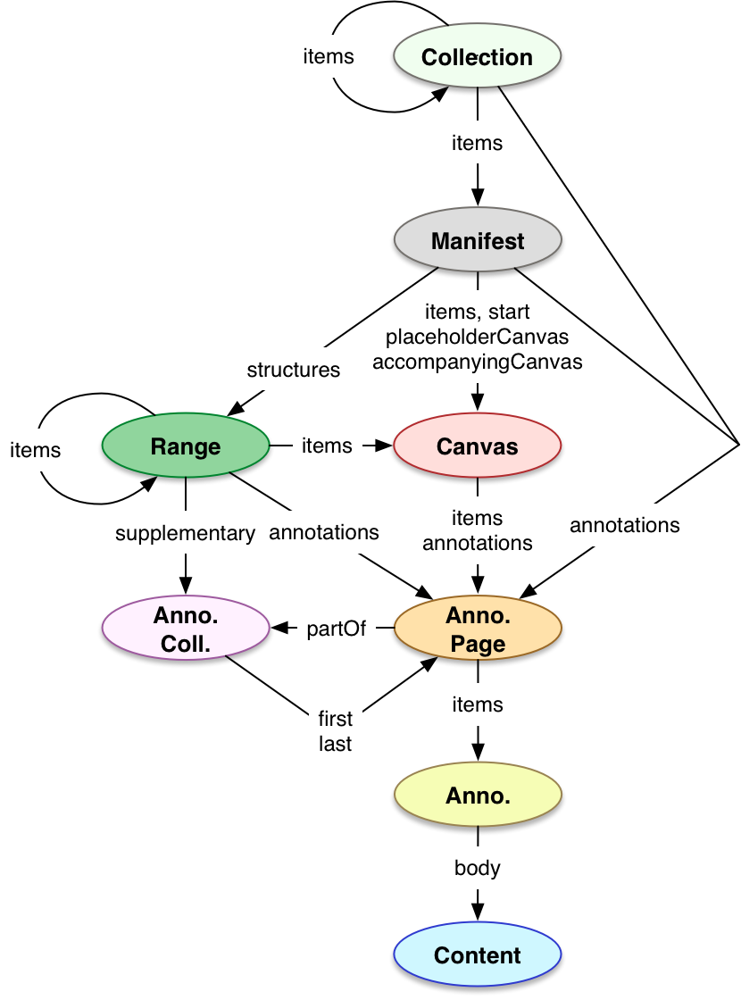

## Status of this Document
{:.no_toc}
__This Version:__ {{ page.major }}.{{ page.minor }}.{{ page.patch }}-{{ page.pre }}

__Latest Stable Version:__ [{{ site.presentation_api.stable.major }}.{{ site.presentation_api.stable.minor }}.{{ site.presentation_api.stable.patch }}][prezi-stable-version]

__Previous Version:__ [2.1.1][prezi21]

**Editors:**

  * **[Michael Appleby](https://orcid.org/0000-0002-1266-298X)** [](https://orcid.org/0000-0002-1266-298X), [_Yale University_](http://www.yale.edu/)
  * **[Tom Crane](https://orcid.org/0000-0003-1881-243X)** [](https://orcid.org/0000-0003-1881-243X), [_Digirati_](http://digirati.com/)
  * **[Robert Sanderson](https://orcid.org/0000-0003-4441-6852)** [](https://orcid.org/0000-0003-4441-6852), [_J. Paul Getty Trust_](http://www.getty.edu/)
  * **[Jon Stroop](https://orcid.org/0000-0002-0367-1243)** [](https://orcid.org/0000-0002-0367-1243), [_Princeton University Library_](https://library.princeton.edu/)
  * **[Simeon Warner](https://orcid.org/0000-0002-7970-7855)** [](https://orcid.org/0000-0002-7970-7855), [_Cornell University_](https://www.cornell.edu/)
  {: .names}



__Status Warning__
This is a work in progress and may change without any notices. Implementers should be aware that this document is not stable. Implementers are likely to find the specification changing in incompatible ways. Those interested in implementing this document before it reaches beta or release stages should join the [mailing list][iiif-discuss] and take part in the discussions, and follow the [emerging issues][github-milestone-prezi-3] on Github.
{: .warning}

----

## Table of Contents
{:.no_toc}

* Table of Discontent (will be replaced by macro)
{:toc}

##  1. Introduction

There are many different types of digitized or digital compound objects: ancient scrolls, paintings, letters, books, newspapers, films, operas, albums, field recordings, and computer generated animations. These resources often bear the written or spoken word, and this linguistic content is often as important as the visual or audible representation.

Access to these representations is a fundamental requirement for many research activities, the transmission of cultural knowledge, and for the daily pursuits of every web citizen. Digital content is the primary mode of transmission for access to cultural heritage, science, and entertainment. Collections of both digitized physical objects and much born-digital content benefit from a standardized description of their structure, layout, and presentation mode.

This document specifies this standardized description. Many different rich and dynamic user experiences can be implemented, presenting content from across collections and institutions.

A composite object may comprise a series of pages, surfaces, or extents of time; for example the single view of a painting, the two sides of a photograph, four cardinal views of a statue, the many pages of an edition of a newspaper or book, or the duration of an act of an opera. The primary requirements of this specification are to provide an order for these views or extents, the resources needed to present them, and the descriptive information needed to allow the user to understand what is being seen or heard.

The principles of [Linked Data][org-linked-data] and the [Architecture of the Web][org-w3c-webarch] are adopted in order to provide a distributed and interoperable framework. The [Shared Canvas data model][shared-canvas] and [JSON-LD][org-w3c-json-ld] are leveraged to create an easy-to-implement, JSON-based format.

Please send feedback to [iiif-discuss@googlegroups.com][iiif-discuss]

### 1.1. Objectives and Scope

The objective of the IIIF (pronounced "Triple-Eye-Eff") Presentation API is to provide the information necessary to allow a rich, online viewing environment for structured digital objects to be presented to a human user, often in conjunction with the [IIIF Image API][image-api]. This is the sole purpose of the API and therefore descriptive information is given in a way that is intended for humans to read, but not semantically available to machines. In particular, it explicitly does __not__ aim to provide metadata that would allow a search engine to index digital objects.

Implementations of this specification will be able to:

  * display to the user digitized images, video, audio, and other content types associated with a particular physical or born-digital object;
  * allow the user to navigate between multiple views or time extents of the object, either sequentially or hierarchically;
  * display descriptive information about the object, view or navigation structure to provide context to the user;
  * and provide a shared environment in which both publishers and users can annotate the object and its content with additional information.

The following are __not__ in scope:

  * Provision of metadata for harvesting and discovery is not directly supported. Properties to reference further descriptive resources are available, and their use is encouraged.
  * Search within the object, which is described by the [IIIF Content Search API][search-api].

This document is accompanied by the [Presentation API Cookbook][annex-cookbook], which demonstrates motivating use cases for IIIF and contains examples showing how the objectives may be achieved.

### 1.2. Terminology

This specification uses the following terms:

* __embedded__: When a resource (A) is embedded within an embedding resource (B), the complete JSON representation of resource A is present within the JSON representation of resource B, and dereferencing the URI of resource A will not result in additional information. Example: Canvas A is embedded in Manifest B.
* __referenced__: When a resource (A) is referenced from a referencing resource (B), an incomplete JSON representation of resource A is present within the JSON representation of resource B, and dereferencing the URI of resource A will result in additional information. Example:  Manifest A is referenced from Collection B.
* __HTTP(S)__: The HTTP or HTTPS URI scheme and internet protocol.

The terms _array_, _JSON object_, _number_, _string_, and _boolean_ in this document are to be interpreted as defined by the [Javascript Object Notation (JSON)][org-rfc-8259] specification.

The key words _MUST_, _MUST NOT_, _REQUIRED_, _SHALL_, _SHALL NOT_, _SHOULD_, _SHOULD NOT_, _RECOMMENDED_, _MAY_, and _OPTIONAL_ in this document are to be interpreted as described in [RFC 2119][org-rfc-2119].

##  2. Resource Type Overview

The objectives require a model in which one can characterize the object (via the _Manifest_ resource) and the individual views of the object (_Canvas_ resources). Each view may have images, audio, video and other content resources associated with it (content resources) to allow the view to be rendered to the user appropriately. An object may also have sections; for example, a book may have chapters of several pages, or a play might be divided into acts and scenes (_Range_ resources) and there may be groups of objects (_Collection_ resources). These resource types, along with their properties, make up the IIIF Presentation API.

This section provides an overview of the resource types (or classes) that are used in the specification. They are each presented in more detail in [Section 5][prezi30-resource-structure].

### 2.1. Defined Types

This specification defines the following resource types:

<p style="float: right">
  <br/>
</p>

##### Collection
{: #overview-collection}

An ordered list of Manifests, and/or further Collections. Collections allow easy navigation among the Manifests in a hierarchical structure, potentially each with its own descriptive information. Collections might be used to model dynamic result sets from a search, fixed sets of related resources, or other groupings of Manifests for presentation.

##### Manifest
{: #overview-manifest}

The overall description of the structure and properties of the digital representation of an object. It carries information needed for the client to present the content to the user, such as a title and other descriptive information about the object or the intellectual work that it conveys. Each Manifest describes how to present a single object such as a book, a statue or a music album.

##### Canvas
{: #overview-canvas}

A virtual container that represents a particular view of the object and has content resources associated with it or with parts of it. The Canvas provides a frame of reference for the layout of the content, both spatially and temporally. The concept of a Canvas is borrowed from standards like PDF and HTML, or applications like Photoshop and PowerPoint, where an initially blank display surface has images, video, text and other content "painted" on to it by Annotations, collected in Annotation Pages.

##### Range
{: #overview-range}

An ordered list of Canvases, and/or further Ranges. Ranges allow Canvases, or parts thereof, to be grouped together in some way. This could be for content-based reasons, such as might be described in a table of contents or the set of scenes in a play. Equally, physical features might be important such as page gatherings in an early book, or when recorded music is split across different physical carriers such as two CDs.

### 2.2. Additional Types

This specification makes use of the following types, defined in the [Web Annotation Data Model][org-w3c-webanno] specification:

##### Annotation Page
{: #overview-annotationpage}

An ordered list of Annotations that is typically associated with a Canvas but may be referenced from other resource types as well. Annotation Pages collect and order lists of Annotations, which in turn provide commentary about a resource or content that is part of a Canvas.

##### Annotation
{: #overview-annotation}

Annotations associate content resources with Canvases. The same mechanism is used for the visible and/or audible resources as is used for transcriptions, commentary, tags and other content. This provides a single, unified method for aligning information, and provides a standards-based framework for distinguishing parts of resources and parts of Canvases. As Annotations can be added later, it promotes a distributed system in which publishers can align their content with the descriptions created by others.

##### Content
{: #overview-content}

Web resources such as images, audio, video, or text which are associated with a Canvas via an Annotation, or provide a representation of any resource.

##### Annotation Collection
{: #overview-annotationcollection}

An ordered list of Annotation Pages. Annotation Collections allow higher level groupings of Annotations to be recorded. For example, all of the English translation Annotations of a medieval French document could be kept separate from the transcription or an edition in modern French, or the director's commentary on a film can be separated from the script.

##  3. Resource Properties

Most of the properties defined by this specification may be associated with any of the resource types described above, and may have more than one value. Properties relate to the resource with which they are associated, so the `label` property on a Manifest is the human readable label of the Manifest, whereas the same `label` property on a Canvas is the human readable label for that particular view.

The requirements for which classes have which properties are summarized in [Appendix A][prezi30-appendixa].

Other properties are allowed, either via local extensions or those endorsed by the IIIF community. If a client discovers properties that it does not understand, then it _MUST_ ignore them. See the [Linked Data Context and Extensions][prezi30-ldce] section for more information about extensions.

This section also defines processing requirements for clients for each of the combinations of class and property.  These requirements are for general purpose client implementations that are intended to be used to render the entire resource to the user, and not necessarily for consuming applications with specialized use or individual component implementations that might be used to construct a client. The inclusion of these requirements gives publishers a baseline expectation for how they can expect implementations advertised as compliant with this specification to behave when processing their content.

###  3.1. Descriptive Properties

These properties describe or represent the resource they are associated with, and are typically rendered to the user.

##### label

A human readable label, name or title. The `label` property is intended to be displayed as a short, textual surrogate for the resource if a human needs to make a distinction between it and similar resources, for example between objects, pages, or options for a choice of images to display. The `label` property can be fully internationalized, and each language can have multiple values.  This pattern is described in more detail in the [languages][prezi30-languages] section.

The value of the property _MUST_ be a JSON object, as described in the [languages][prezi30-languages] section.

 * A Collection _MUST_ have the `label` property with at least one entry.<br/>
   Clients _MUST_ render `label` on a Collection.
 * A Manifest _MUST_ have the `label` property with at least one entry.<br/>
   Clients _MUST_ render `label` on a Manifest.
 * A Canvas _SHOULD_ have the `label` property with at least one entry.<br/>
   Clients _MUST_ render `label` on a Canvas, and _SHOULD_ generate a `label` for Canvases that do not have them.
 * A content resource _MAY_ have the `label` property with at least one entry. If there is a Choice of content resource for the same Canvas, then they _SHOULD_ each have at least the `label` property with at least one entry.<br/>
   Clients _MAY_ render `label` on content resources, and _SHOULD_ render them when part of a Choice.
 * A Range _SHOULD_ have the `label` property with at least one entry. <br/>
   Clients _MUST_ render `label` on a Range.
 * An Annotation Collection _SHOULD_ have the `label` property with at least one entry.<br/>
   Clients _SHOULD_ render `label` on an Annotation Collection.
 * Other resource types _MAY_ have the `label` property with at least one entry.<br/>
   Clients _MAY_ render `label` on other resource types.

``` json-doc
{ "label": { "en": [ "Example Object Title" ] } }
```

##### metadata

An ordered list of descriptions to be displayed to the user when they interact with the resource, given as pairs of human readable `label` and `value` entries. The content of these entries is intended for presentation only; descriptive semantics _SHOULD NOT_ be inferred. An entry might be used to convey information about the creation of the object, a physical description, ownership information, or other purposes.

The value of the `metadata` property _MUST_ be an array of JSON objects, where each item in the array has both `label` and `value` properties. The values of both `label` and `value` _MUST_ be JSON objects, as described in the [languages][prezi30-languages] section.

 * A Collection _SHOULD_ have the `metadata` property with at least one item. <br/>
   Clients _MUST_ render `metadata` on a Collection.
 * A Manifest _SHOULD_ have the `metadata` property with at least one item.<br/>
   Clients _MUST_ render `metadata` on a Manifest.
 * A Canvas _MAY_ have the `metadata` property with at least one item.<br/>
   Clients _SHOULD_ render `metadata` on a Canvas.
 * Other resource types _MAY_ have the `metadata` property with at least one item.<br/>
   Clients _MAY_ render `metadata` on other resource types.

Clients _SHOULD_ display the entries in the order provided. Clients _SHOULD_ expect to encounter long texts in the `value` property, and render them appropriately, such as with an expand button, or in a tabbed interface.

``` json-doc
{
  "metadata": [
    {
      "label": { "en": [ "Creator" ] },
      "value": { "en": [ "Anne Artist (1776-1824)" ] }
    }
  ]
}
```

##### summary

A short textual summary intended to be conveyed to the user when the `metadata` entries for the resource are not being displayed. This could be used as a brief description for item level search results, for small-screen environments, or as an alternative user interface when the `metadata` property is not currently being rendered. The `summary` property follows the same pattern as the `label` property described above.

The value of the property _MUST_ be a JSON object, as described in the [languages][prezi30-languages] section.

 * A Collection _SHOULD_ have the `summary` property with at least one entry.<br/>
   Clients _SHOULD_ render `summary` on a Collection.
 * A Manifest _SHOULD_ have the `summmary` property with at least one entry.<br/>
   Clients _SHOULD_ render `summary` on a Manifest.
 * A Canvas _MAY_ have the `summary` property with at least one entry.<br/>
   Clients _SHOULD_ render `summary` on a Canvas.
 * Other resource types _MAY_ have the `summary` property with at least one entry.<br/>
   Clients _MAY_ render `summary` on other resource types.

``` json-doc
{ "summary": { "en": [ "This is a summary of the object." ] } }
```

##### requiredStatement

Text that _MUST_ be displayed when the resource is displayed or used. For example, the `requiredStatement` property could be used to present copyright or ownership statements, an acknowledgement of the owning and/or publishing institution, or any other text that the organization deems critical to display to the user. Given the wide variation of potential client user interfaces, it will not always be possible to display this statement to the user in the client's initial state. If initially hidden, clients _MUST_ make the method of revealing it as obvious as possible.

The value of the property _MUST_ be a JSON object, that has the `label` and `value` properties, in the same way as a `metadata` property entry. The values of both `label` and `value` _MUST_ be JSON objects, as described in the [languages][prezi30-languages] section.

 * Any resource type _MAY_ have the `requiredStatement` property.<br/>
   Clients _MUST_ render `requiredStatement` on every resource type.

``` json-doc
{
  "requiredStatement": {
    "label": { "en": [ "Attribution" ] },
    "value": { "en": [ "Provided courtesy of Example Institution" ] }
  }
}
```

##### rights

A string that identifies a license or rights statement that applies to the content of the resource, such as the JSON of a Manifest or the pixels of an image. The value _MUST_ be drawn from the set of [Creative Commons][org-cc-licenses] licenses, the [RightsStatements.org][org-rs-terms] rights statements, or those added via the [extension][prezi30-ldce] mechanism. The inclusion of this property is informative, and for example could be used to display an icon representing the rights assertions.

If displaying rights information directly to the user is the desired interaction, or a publisher-defined label is needed, then it is _RECOMMENDED_ to include the information using the `requiredStatement` property or in the `metadata` property.

The value _MUST_ be a string. If the value is drawn from Creative Commons or RightsStatements.org, then the string _MUST_ be a URI defined by that specification.

 * Any resource type _MAY_ have the `rights` property.<br/>
   Clients _MAY_ render `rights` on any resource type.

``` json-doc
{ "rights": "https://creativecommons.org/licenses/by/4.0/" }
```

##### thumbnail

An external content resource, such as a small image or short audio clip, that represents the resource that has the `thumbnail` property. It is _RECOMMENDED_ that a [IIIF Image API][image-api] service be available for images to enable manipulations such as resizing. A resource _MAY_ have multiple thumbnail resources that have the same or different `type` and `format`.

The value _MUST_ be an array of JSON objects, where each item in the array has an `id` property and _SHOULD_ have at least one of the `type` and `format` properties.

 * A Collection _SHOULD_ have the `thumbnail` property with at least one item.<br/>
   Clients _SHOULD_ render `thumbnail` on a Collection.
 * A Manifest _SHOULD_ have the `thumbnail` property with at least one item.<br/>
   Clients _SHOULD_ render `thumbnail` on a Manifest.
 * A Canvas _MAY_ have the `thumbnail` property with at least one item. A Canvas _SHOULD_ have the `thumbnail` property if there are multiple resources that make up the representation.<br/>
   Clients _SHOULD_ render `thumbnail` on a Canvas.
 * A content resource _MAY_ have the `thumbnail` property with at least one item. Content resources _SHOULD_ have the `thumbnail` property with at least one item if it is an option in a Choice of resources.<br/>
   Clients _SHOULD_ render `thumbnail` on a content resource.
 * Other resource types _MAY_ have the `thumbnail` property with at least one item.<br/>
   Clients _MAY_ render `thumbnail` on other resource types.

``` json-doc
{ "thumbnail": [ { "id": "https://example.org/img/thumb.jpg", "type": "Image" } ] }
```

##### navDate

A date that clients may use for navigation purposes when presenting the resource to the user in a time-based user interface, such as a calendar or timeline. More descriptive date ranges, intended for display directly to the user, _SHOULD_ be included in the `metadata` property for human consumption. If the resource contains Canvases that have the `duration` property, the datetime given corresponds to the navigation datetime of the start of the resource. For example, a Range that includes a Canvas that represents a set of video content recording a historical event, the `navDate` is the datetime of the first moment of the recorded event.

The value _MUST_ be an [XSD dateTime literal][org-w3c-xsd-datetime]. The value _MUST_ have a timezone, and _SHOULD_ be given in UTC with the `Z` timezone indicator, but _MAY_ instead be given as an offset of the form `+hh:mm`.

 * A Collection, Manifest, Range or Canvas _MAY_ have the `navDate` property.<br/>
   Clients _MAY_ render `navDate` on Collections, Manifests, Ranges, and Canvases.
 * Other resource types _MUST NOT_ have the `navDate` property.<br/>
   Clients _SHOULD_ ignore `navDate` on other resource types.

``` json-doc
{ "navDate": "2010-01-01T00:00:00Z" }
```

##### posterCanvas

A single Canvas that provides additional content for use when rendering the resource that has the `posterCanvas` property. Examples include an image to show while a duration-only Canvas is playing audio; images, text and sound standing in for video content before the user initiates playback; or a film poster to attract user attention. The content provided by `posterCanvas` differs from a thumbnail: a client might use `thumbnail` to summarize and navigate multiple resources, then show content from `posterCanvas` as part of the presentation of a single resource. A poster Canvas is likely to have different dimensions to those of the Canvas(es) of the resource that has the `posterCanvas` property.

Clients _MAY_ display the content of a linked poster Canvas when presenting the resource. When more than one poster Canvas is available, for example if `posterCanvas` is provided for the currently selected Range and the current Manifest, the client _SHOULD_ pick the one most specific to the content. Publishers _SHOULD NOT_ assume that the poster Canvas will be processed by all clients. Clients _SHOULD_ take care to avoid conflicts between time-based media in the rendered poster Canvas and the content of the resource that has the `posterCanvas` property.

The value _MUST_ be a JSON object with the `id` and `type` properties, and _MAY_ have other properties of Canvases.

  * A Collection _MAY_ have the `posterCanvas` property.<br/>
   Clients _MAY_ render `posterCanvas` on a Collection.
  * A Manifest _MAY_ have the `posterCanvas` property.<br/>
   Clients _MAY_ render `posterCanvas` on a Manifest.
  * A Canvas _MAY_ have the `posterCanvas` property.<br/>
   Clients _MAY_ render `posterCanvas` on a Canvas.
  * A Range _MAY_ have the `posterCanvas` property.<br/>
   Clients _MAY_ render `posterCanvas` on a Range.
  * Other resource types _MUST NOT_ have the `posterCanvas` property.<br/>
   Clients _SHOULD_ ignore `posterCanvas` on other resource types.

``` json-doc
{
  "posterCanvas": {
    "id": "https://example.org/iiif/1/canvas/poster",
    "type": "Canvas",
    "height": 1400,
    "width": 1200
    // ...
  }
}
```

###  3.2. Technical Properties

These properties describe technical features of the resources, and are typically processed by the client to understand how to render the resource.

##### id

The URI that identifies the resource. If the resource is only available embedded  within another resource (see the [terminology section][prezi30-terminology] for an explanation of "embedded"), such as a Range within a Manifest, then the URI _MAY_ be the URI of the embedding resource with a unique fragment on the end. This is not true for Canvases, which _MUST_ have their own URI without a fragment.

The value _MUST_ be a string, and the value _MUST_ be an HTTP(S) URI for resources defined in this specification. If the resource is retrievable via HTTP(S), then the URI _MUST_ be the URI at which it is published. External resources, such as profiles, _MAY_ have non-HTTP(S) URIs defined by other communities.

 * A Collection _MUST_ have the `id` property. <br/>
   Clients _SHOULD_ render `id` on a Collection.
 * A Manifest _MUST_ have the `id` property.<br/>
   Clients _SHOULD_ render `id` on a Manifest.
 * A Canvas _MUST_ have the `id` property.<br/>
   Clients _SHOULD_ render `id` on a Canvas.
 * A content resource _MUST_ have the `id` property.<br/>
   Clients _MAY_ render `id` on content resources.
 * A Range _MUST_ have the `id` property.<br/>
   Clients _MAY_ render `id` on a Range.
 * An Annotation Collection _MUST_ have the `id` property.<br/>
   Clients _MAY_ render `id` on an Annotation Collection.
 * An Annotation Page _SHOULD_ have the `id` property.<br/>
   Clients _MAY_ render `id` on an Annotation Page.
 * An Annotation _MUST_ have the `id` property.<br/>
   Clients _MAY_ render `id` on an Annotation.

``` json-doc
{ "id": "https://example.org/iiif/1/manifest" }
```

##### type

The type or class of the resource. For types defined by this specification, the value of `type` will be described in the sections below describing the individual classes. For external resources, the type is drawn from other specifications. Recommendations for basic types such as image, text or audio are given in the table below.

The value _MUST_ be a string.

 * All resource types _MUST_ have the `type` property.<br/>
   Clients _MUST_ process, and _MAY_ render, `type` on any resource type.

> | Class         | Description                      |
| ------------- | -------------------------------- |
| `Application` | Software intended to be executed |
| `Dataset`     | Data not intended to be rendered to humans directly |
| `Image`       | Two dimensional visual resources primarily intended to be seen, such as might be rendered with an &lt;img> HTML tag |
| `Sound`       | Auditory resources primarily intended to be heard, such as might be rendered with an &lt;audio> HTML tag |
| `Text`        | Resources primarily intended to be read |
| `Video`       | Moving images, with or without accompanying audio, such as might be rendered with a &lt;video> HTML tag |
{: .api-table #table-type}

``` json-doc
{ "type": "Dataset" }
```

##### format

The specific media type (often called a MIME type) for a content resource, for example `image/jpeg`. This is important for distinguishing different formats of the same overall type of resource, such as distinguishing text in XML from plain text.

The value _MUST_ be a string, and it _SHOULD_ be the value of the `Content-Type` header returned when the resource is dereferenced.

 * A content resource _SHOULD_ have the `format` propety.<br/>
   Clients _MAY_ render the `format` of any content resource.
 * Other resource types _MUST NOT_ have the `format` property.<br/>
   Clients _SHOULD_ ignore `format` on other resource types.

Note that this is different to the `formats` property in the [Image API][image-api], which gives the extension to use within that API. It would be inappropriate to use in this case, as `format` can be used with any content resource, not just images.

``` json-doc
{ "format": "application/xml" }
```

##### language

The language or languages used in the content of this external resource. This property is already available from the Web Annotation model for content resources that are the body or target of an Annotation, however it _MAY_ also be used for resources referenced (see the [terminology section][prezi30-terminology] for an explanation of "referenced") from `homepage`, `rendering`, `rights`, and `partOf`.

The value _MUST_ be an array of strings. Each item in the array _MUST_ be a valid language code, as described in the [languages section][prezi30-languages].

 * An external resource _SHOULD_ have the `language` property with at least one item.<br/>
   Clients _SHOULD_ process the `language` of external resources.
 * Other resource types _MUST NOT_ have the `language` property.<br/>
   Clients _SHOULD_ ignore `language` on other resource types.

``` json-doc
{ "language": [ "en" ] }
```

##### profile

A schema or named set of functionality available from the resource. The profile can further clarify the `type` and/or `format` of an external resource or service, allowing clients to customize their handling of the resource that has the `profile` property.

The value _MUST_ be a string, either taken from the [service registry][registry-services] or a URI.

* Resources referenced by the `seeAlso` or `service` properties _SHOULD_ have the `profile` property.
  Clients _SHOULD_ process the `profile` of a service or external resource.
* Other resource types _MAY_ have the `profile` property.
  Clients _MAY_ process the `profile` of other resource types.

``` json-doc
{ "profile": "https://example.org/profile/statuary" }
```

##### height

The height of the Canvas or external content resource. For content resources, the value is in pixels. For Canvases, the value does not have a unit. In combination with the width, it conveys an aspect ratio for the space in which content resources are located.

The value _MUST_ be a positive integer.

 * A Canvas _MAY_ have the `height` property. If it has a `height`, it _MUST_ also have a `width`.<br/>
   Clients _MUST_ process `height` on a Canvas.
 * Content resources _MAY_ have the `height` property, with the value given in pixels, if appropriate.<br/>
   Clients _SHOULD_ process `height` on content resources.
 * Other resource types _MUST NOT_ have the `height` property.<br/>
   Clients _SHOULD_ ignore `height` on other resource types.

``` json-doc
{ "height": 1800 }
```

##### width

The width of the Canvas or external content resource. For content resources, the value is in pixels. For Canvases, the value does not have a unit. In combination with the height, it conveys an aspect ratio for the space in which content resources are located.

The value _MUST_ be a positive integer.

 * A Canvas _MAY_ have the `width` property. If it has a `width`, it _MUST_ also have a `height`.<br/>
   Clients _MUST_ process `width` on a Canvas.
 * Content resources _MAY_ have the `width` property, with the value given in pixels, if appropriate.<br/>
   Clients _SHOULD_ process `width` on content resources.
 * Other resource types _MUST NOT_ have the `width` property.<br/>
   Clients _SHOULD_ ignore `width` on other resource types.

``` json-doc
{ "width": 1200 }
```

##### duration

The duration of the Canvas or external content resource, given in seconds.  

The value _MUST_ be a positive floating point number.

 * A Canvas _MAY_ have the `duration` property.<br/>
   Clients _MUST_ process `duration` on a Canvas.
 * Content resources _MAY_ have the `duration` property.<br/>
   Clients _SHOULD_ process `duration` on content resources.
 * Other resource types _MUST NOT_ have a `duration`.<br/>
   Clients _SHOULD_ ignore `duration` on other resource types.

``` json-doc
{ "duration": 125.0 }
```

##### viewingDirection

The direction in which a set of Canvases _SHOULD_ be displayed to the user. This specification defines four direction values in the table below. Others may be defined externally [as an extension][prezi30-ldce].

The value _MUST_ be a string.

 * A Collection _MAY_ have the `viewingDirection` property.<br/>
   Clients _SHOULD_ process `viewingDirection` on a Collection.
 * A Manifest _MAY_ have the `viewingDirection` property.<br/>
   Clients _SHOULD_ process `viewingDirection` on a Manifest.
 * A Range _MAY_ have the `viewingDirection` property.<br/>
   Clients _MAY_ process `viewingDirection` on a Range.
 * Other resource types _MUST NOT_ have the `viewingDirection` property.<br/>
   Clients _SHOULD_ ignore `viewingDirection` on other resource types.

> | Value | Description |
| ----- | ----------- |
| `left-to-right` | The object is displayed from left to right. The default if not specified. |
| `right-to-left` | The object is displayed from right to left. |
| `top-to-bottom` | The object is displayed from the top to the bottom. |
| `bottom-to-top` | The object is displayed from the bottom to the top. |
{: .api-table #table-direction}

``` json-doc
{ "viewingDirection": "left-to-right" }
```

##### behavior

A set of user experience features that the publisher of the content would prefer the client to use when presenting the resource. This specification defines the values in the table below. Others may be defined externally as an [extension][prezi30-ldce].

The value _MUST_ be an array of strings.

 * Any resource type _MAY_ have the `behavior` property with at least one item.<br/>
   Clients _SHOULD_ process `behavior` on any resource type.

> | Value | Description |
| ----- | ----------- |
| `auto-advance` | Valid on Collections, Manifests, Canvases, and Ranges that include or are Canvases with at least the `duration` dimension. When the client reaches the end of a Canvas with a duration dimension that has (or is within a resource that has) this behavior, it _SHOULD_ immediately proceed to the next Canvas and render it. If there is no subsequent Canvas in the current context, then this behavior should be ignored. When applied to a Collection, the client should treat the first Canvas of the next Manifest as following the last Canvas of the previous Manifest, respecting any `start` property specified. |
| `continuous` | Valid on Manifests and Ranges, which include Canvases that have at least `height` and `width` dimensions. Canvases included in resources that have this behavior are partial views and an appropriate rendering might display all of the Canvases virtually stitched together, such as a long scroll split into sections. This behavior has no implication for audio resources. The `viewingDirection` of the Manifest will determine the appropriate arrangement of the Canvases. |
| `facing-pages` | Valid only on Canvases, where the Canvas has at least `height` and `width` dimensions. Canvases that have this behavior, in a Manifest that has the `behavior` value `paged`, _MUST_ be displayed by themselves, as they depict both parts of the opening. If all of the Canvases are like this, then page turning is not possible, so simply use `individuals` instead. |
| `individuals` | Valid on Collections, Manifests, and Ranges. For Collections that have this behavior, each of the included Manifests are distinct objects. For Manifest, and Range, the included Canvases are distinct views, and _SHOULD NOT_ be presented in a page-turning interface. This is the default behavior if none are specified. |
| `multi-part` | Valid only on Collections. Collections that have this behavior consist of multiple Manifests that each form part of a logical whole, such as multi-volume books or a set of journal issues. Clients might render the Collection as a table of contents, rather than with thumbnails. |
| `no-nav` | Valid only on Ranges. Ranges that have this behavior _MUST NOT_ be displayed to the user in a navigation hierarchy. This allows for Ranges to be present that capture unnamed regions with no interesting content, such as the set of blank pages at the beginning of a book, or dead air between parts of a performance, that are still part of the Manifest but do not need to be navigated to directly. |
| `non-paged` | Valid only on Canvases, where the Canvas has at least `height` and `width` dimensions. Canvases that have this behavior _MUST NOT_ be presented in a page turning interface, and _MUST_ be skipped over when determining the page order. This behavior _MUST_ be ignored if the current Manifest does not have the `behavior` value `paged`. |
| `hidden` | Valid on Annotation Collections, Annotation Pages, Annotations, Specific Resources and Choices. If this behavior is provided, then the client _SHOULD NOT_ render the resource by default, but allow the user to turn it on and off. |
| `paged` | Valid on Manifests and Ranges, which include Canvases that have at least `height` and `width` dimensions. Canvases included in resources that have this behavior represent views that _SHOULD_ be presented in a page-turning interface if one is available. The first canvas is a single view (the first recto) and thus the second canvas likely represents the back of the object in the first canvas. If this is not the case, see the `behavior` value `non-paged`. |
| `repeat` | Valid on Collections and Manifests, that include Canvases that have at least the `duration` dimension. When the client reaches the end of the duration of the final Canvas in the resource, and the `behavior` value `auto-advance` is also in effect, then the client _SHOULD_ return to the first Canvas in the resource that has the `behavior` value `repeat` and start playing again. If the `behavior` value `auto-advance` is not in effect, then the client _SHOULD_ render a navigation control for the user to manually return to the first Canvas. |
| `sequence` | Valid only on Ranges, where the Range is referenced in the `structures` property of a Manifest. Ranges that have this behavior represent different orderings of the Canvases listed in the `items` property of the Manifest, and user interfaces that interact with this order _SHOULD_ use the order within the selected Range, rather than the default order of `items`. |
| `thumbnail-nav` | Valid only on Ranges. Ranges that have this behavior _MAY_ be used by the client to present an alternative navigation or overview based on thumbnails, such as regular keyframes along a timeline for a video, or sections of a long scroll. Clients _SHOULD NOT_ use them to generate a conventional table of contents. Child Ranges of a Range with this behavior _MUST_ have a suitable `thumbnail` property. |
| `together` | Valid only on Collections. A client _SHOULD_ present all of the child Manifests to the user at once in a separate viewing area with its own controls. Clients _SHOULD_ catch attempts to create too many viewing areas. This behavior _SHOULD NOT_ be interpreted as applying to the members of any child resources. |
| `unordered` | Valid on Manifests and Ranges. The Canvases included in resources that have this behavior have no inherent order, and user interfaces _SHOULD_ avoid implying an order to the user. |
{: .api-table #table-behavior}

``` json-doc
{ "behavior": [ "auto-advance", "individuals" ] }
```

##### timeMode

A mode associated with an Annotation that is to be applied to the rendering of any time-based media, or otherwise could be considered to have a duration, used as a body resource of that Annotation. Note that the association of `timeMode` with the Annotation means that different resources in the body cannot have different values. This specification defines the values specified in the table below. Others may be defined externally as an [extension][prezi30-ldce].

The value _MUST_ be a string.

* An Annotation _MAY_ have the `timeMode` property.<br/>
  Clients _SHOULD_ process `timeMode` on an Annotation.

> | Value | Description |
| ----- | ----------- |
| `trim` | (default, if not supplied) If the content resource has a longer duration than the duration of portion of the Canvas it is associated with, then at the end of the Canvas's duration, the playback of the content resource _MUST_ also end. If the content resource has a shorter duration than the duration of the portion of the Canvas it is associated with, then, for video resources, the last frame _SHOULD_ persist on-screen until the end of the Canvas portion's duration. For example, a video of 120 seconds annotated to a Canvas with a duration of 100 seconds would play only the first 100 seconds and drop the last 20 second. |
| `scale` | Fit the duration of content resource to the duration of the portion of the Canvas it is associated with by scaling. For example, a video of 120 seconds annotated to a Canvas with a duration of 60 seconds would be played at double-speed. |
| `loop` | If the content resource is shorter than the `duration` of the Canvas, it _MUST_ be repeated to fill the entire duration. Resources longer than the `duration` _MUST_ be trimmed as described above. For example, if a 20 second duration audio stream is annotated onto a Canvas with duration 30 seconds, it will be played one and a half times. |
{: .api-table #table-timemode}

``` json-doc
{ "timeMode": "trim" }
```

###  3.3. Linking Properties

These properties are references or links between resources, and split into external references where the linked object is outside of the IIIF space, and internal references where the linked object is a IIIF resource.  Clients typically create a link to the resource that is able to be activated by the user, or interact directly with the linked resource to improve the user's experience.

#### 3.3.1. External Links

##### homepage

An external web page that is about the object represented by the resource that has the `homepage` property. The web page is usually published by the organization responsible for the object, and might be generated by a content management system or other cataloging system. The external resource _MUST_ be able to be displayed directly to the user. External resources that are related, but not home pages, _MUST_ instead be added into the `metadata` property, with an appropriate `label` or `value` to describe the relationship.

The value _MUST_ be a JSON object, which _MUST_ have the `id`, `type`, and `label` properties, and _SHOULD_ have a `format` property.

 * Any resource type _MAY_ have the `homepage` property.<br/>
   Clients _SHOULD_ render `homepage` on a Collection, Manifest or Canvas, and _MAY_ render `homepage` on other resource types.

``` json-doc
{
  "homepage": {
    "id": "https://example.com/info/",
    "type": "Text",
    "label": { "en": [ "Homepage for Example Object" ] },
    "format": "text/html"
  }
}
```


##### logo

A small external image resource that represents an individual or organization associated with the resource that has the `logo` property. This could be the logo of the owning or hosting institution. The logo _MUST_ be clearly rendered when the resource is displayed or used, without cropping, rotating or otherwise distorting the image. It is _RECOMMENDED_ that a [IIIF Image API][image-api] service be available for this image for other manipulations such as resizing.

The value _MUST_ be an array of JSON objects, each of which _MUST_ have an `id` and _SHOULD_ have at least one of `type` and `format`.

 * Any resource type _MAY_ have the `logo` property with at least one item.<br/>
   Clients _MUST_ render `logo` on every resource type.

``` json-doc
{ "logo": [ { "id": "https://example.org/img/logo.jpg", "type": "Image" } ] }
```

##### rendering

An external resource that is an alternative, non-IIIF representation of the resource that has the `rendering` property. Such representations typically cannot be painted onto a single Canvas, as they either include too many views, have incompatible dimensions, or are composite resources requiring additional rendering functionality. The external resource _MUST_ be able to be displayed directly to a human user, although the presentation may be outside of the IIIF client. The external resource _MUST NOT_ have a splash page or other interstitial resource that mediates access to it. If access control is required, then the [IIIF Authentication API][iiif-auth] is _RECOMMENDED_. Examples include a rendering of a book as a PDF or EPUB, a slide deck with images of a building, or a 3D model of a statue.

The value _MUST_ be an array of JSON objects. Each item _MUST_ have the `id`, `type` and `label` properties, and _SHOULD_ have a `format` property.

 * Any resource type _MAY_ have the `rendering` property with at least one item.<br/>
   Clients _SHOULD_ render `rendering` on a Collection, Manifest or Canvas, and _MAY_ render `rendering` on other resource types.

``` json-doc
{
  "rendering": [
    {
      "id": "https://example.org/1.pdf",
      "type": "Text",
      "label": { "en": [ "PDF Rendering of Book" ] },
      "format": "application/pdf"
    }
  ]
}
```

##### service

An external service that the client might interact with directly and gain additional information or functionality for using the resource that has the `service` property, such as from an Image to the base URI of an associated [IIIF Image API][image-api] service. The service resource _SHOULD_ have additional information associated with it in order to allow the client to determine how to make appropriate use of it. Please see the [Service Registry][registry-services] document for the details of currently known service types.

The value _MUST_ be an array of JSON objects. Each object will have properties depending on the service's definition, but _MUST_ have either the `id` or `@id` and `type` or `@type` properties. Each object _SHOULD_ have a `profile` property.

 * Any resource type _MAY_ the `service` property with at least one item.<br/>
   Clients _MAY_ process `service` on any resource type, and _SHOULD_ process the IIIF Image API service.

``` json-doc
{
  "service": [
    {
      "id": "https://example.org/service",
      "type": "Service",
      "profile": "https://example.org/docs/service"
    }
  ]
}
```

For cross-version consistency, this specification defines the following values for the `type` or `@type` property for backwards compatibility with other IIIF APIs. Future versions of these APIs will define their own types. These `type` values are necessary extensions for compatibility of the older versions.

| Value                | Specification |
| -------------------- | ------------- |
| ImageService1        | [Image API version 1][image11]  |
| ImageService2        | [Image API version 2][image21]  |
| SearchService1       | [Search API version 1][search1] |
| AutoCompleteService1 | [Search API version 1][search1-autocomplete] |
| AuthCookieService1   | [Authentication API version 1][auth1-cookie-service] |
| AuthTokenService1    | [Authentication API version 1][auth1-token-service] |
| AuthLogoutService1   | [Authentication API version 1][auth1-logout-service] |
{: .api-table #table-service-types}

Implementations _SHOULD_ be prepared to recognize the `@id` and `@type` property names used by older specifications, as well as `id` and `type`. Note that the `@context` key _SHOULD_ not be present within the `service`, but instead included at the beginning of the document. The example below includes both version 2 and version 3 IIIF Image API services.

``` json-doc
{
  "service": [
    {
      "@id": "https://example.org/iiif2/image1/identifier",
      "@type": "ImageService2",
      "profile": "http://iiif.io/api/image/2/level2.json"
    },
    {
      "id": "https://example.org/iiif3/image1/identifier",
      "type": "ImageService3",
      "profile": "level2"
    }
  ]
}
```

##### seeAlso

An external, machine-readable resource such as an XML or RDF description that is related to the resource that has the `seeAlso` property. Properties of the external resource should be given to help the client select between multiple descriptions (if provided), and to make appropriate use of the document. If the relationship between the resource and the document needs to be more specific, then the document should include that relationship rather than the IIIF resource. Other IIIF resources, such as a related Manifest, are valid targets for `seeAlso`. The URI of the document _MUST_ identify a single representation of the data in a particular format. For example, if the same data exists in JSON and XML, then separate resources should be added for each representation, with distinct `id` and `format` properties.

The value _MUST_ be an array of JSON objects. Each item _MUST_ have the `id` and `type` properties, and _SHOULD_ have the `label`, `format` and `profile` properties.

 * Any resource type _MAY_ have the `seeAlso` property with at least one item.<br/>
   Clients _MAY_ process `seeAlso` on any resource type.

``` json-doc
{
  "seeAlso": [
    {
      "id": "https://example.org/library/catalog/book1.xml",
      "type": "Dataset",
      "format": "text/xml",
      "profile": "https://example.org/profiles/bibliographic"
    }
  ]
}
```

#### 3.4.2. Internal Links

##### partOf

A containing resource that includes the resource that has the `partOf` property. When a client encounters the `partOf` property, it might retrieve the containing resource, if it is not embedded in the current representation, in order to contribute to the processing of the contained resource. For example, the `partOf` property can be used to link from a Canvas to its containing Manifest in order to enable the discovery of further relevant information. Similarly, a Manifest can be linked to a containing Collection using `partOf` to aid in navigation.

The value _MUST_ be an array of JSON objects. Each item _MUST_ have the `id` and `type` properties, and _SHOULD_ have the `label` property.

 * Any resource type _MAY_ have the `partOf` property with at least one item<br/>
   Clients _MAY_ render `partOf` on any resource type.

``` json-doc
{ "partOf": [ { "id": "https://example.org/iiif/1", "type": "Manifest" } ] }
```

##### start

A Canvas, or part of a Canvas, which the client _SHOULD_ show on initialization for the resource that has the `start` property. The reference to part of a Canvas is handled in the same way that Ranges reference parts of Canvases. This property allows the client to begin with the first Canvas that contains interesting content rather than requiring the user to manually navigate to find it.

The value _MUST_ be a JSON object, which _MUST_ have the `id` and `type` properties.  The object _MUST_ be either a Canvas (as in the first example below), or a Specific Resource with a Selector and a `source` property where the value is a Canvas (as in the second example below).

 * A Manifest or Range _MAY_ have the `start` property.
   Clients _SHOULD_ process `start` on a Manifest or Range.
 * Other resource types _MUST NOT_ have the `start` property.
   Clients _SHOULD_ ignore `start` on other resource types.

``` json-doc
{ "start": { "id": "https://example.org/iiif/1/canvas/1", "type": "Canvas" } }
```

``` json-doc
{
  "start": {
    "type": "SpecificResource",
    "source": "https://example.org/iif/1/canvas/1",
    "selector": {
      "type": "PointSelector",
      "t": 14.5
    }
  }
}
```

##### supplementary

A link from this Range to an Annotation Collection that includes the `supplementing` Annotations of content resources for the Range. Clients might use this to present additional content to the user from a different Canvas when interacting with the Range, or to jump to the next part of the Range within the same Canvas.  For example, the Range might represent a newspaper article that spans non-sequential pages, and then uses the `supplementary` property to reference an Annotation Collection that consists of the Annotations that record the text, split into Annotation Pages per newspaper page.

The value _MUST_ be a JSON object, which _MUST_ have the `id` and `type` properties, and the `type` _MUST_ be `AnnotationCollection`.

 * A Range _MAY_ have the `supplementary` property.<br/>
   Clients _MAY_ process `supplementary` on a Range.
 * Other resource types _MUST NOT_ have the `supplementary` property.<br/>
   Clients _SHOULD_ ignore `supplementary` on other resource types.

``` json-doc
{ "supplementary": { "id": "https://example.org/iiif/1/annos/1", "type": "AnnotationCollection" } }
```

### 3.4. Structural Properties

These properties define the structure of the object being represented in IIIF by allowing the inclusion of child resources within parents, such as a Canvas within a Manifest, or a Manifest within a Collection. The majority of cases use `items`, however there are two special cases for different sorts of structures.

##### items

Much of the functionality of the IIIF Presentation API is simply recording the order in which child resources occur within a parent resource, such as Collections or Manifests within a parent Collection, or Canvases within a Manifest. All of these situations are covered with a single property, `items`.

The value _MUST_ be an array of JSON objects. Each item _MUST_ have the `id` and `type` properties. The items will be resources of different types, as described below.

* A Collection _MUST_ have the `items` property. Each item _MUST_ be either a Collection or a Manifest.<br/>
  Clients _MUST_ process `items` on a Collection.
* A Manifest _MUST_ have the `items` property with at least one item. Each item _MUST_ be a Canvas.<br/>
  Clients _MUST_ process `items` on a Manifest.
* A Canvas _SHOULD_ have the `items` property with at least one item. Each item _MUST_ be an Annotation Page.<br/>
  Clients _MUST_ process `items` on a Canvas.
* An Annotation Page _SHOULD_ have the `items` property with at least one item. Each item _MUST_ be an Annotation.<br/>
  Clients _MUST_ process `items` on an Annotation Page.
* A Range _MUST_ have the `items` property with at least one item. Each item _MUST_ be a Range, a Canvas or a Specific Resource where the source is a Canvas.<br/>
  Clients _SHOULD_ process `items` on a Range.
* Other resource types _MUST NOT_ have the `items` property.<br/>
  Clients _SHOULD_ ignore `items` on other resource types.

```json-doc
{
  "items": [
    {
      "id": "https://example.org/iiif/manifest1",
      "type": "Manifest"
    },
    {
      "id": "https://example.org/iiif/collection1",
      "type": "Collection"
    },
    // ...
  ]
}
```

##### structures

The structure of an object represented as a Manifest can be described using a hierarchy of Ranges. Ranges can be used to describe the "table of contents" of the object or other structures that the user can interact with beyond the order given by the `items` property of the Manifest. The hierarchy is built by nesting the child Range resources in the `items` array of the higher level Range. The top level Ranges of these hierarchies are given in the `structures` property.

The value _MUST_ be an array of JSON objects. Each item _MUST_ have the `id` and `type` properties, and the `type` _MUST_ be `Range`.

* A Manifest _MAY_ have the `structures` property.<br/>
  Clients _SHOULD_ process `structures` on a Manifest. The first hierarchy _SHOULD_ be presented to the user by default, and further hierarchies _SHOULD_ be able to be selected as alternative structures by the user.
* Other resource types _MUST NOT_ have the `structures` property.<br/>
  Clients _SHOULD_ ignore `structures` on other resource types.

```json-doc
{
  "structures": [
    {
      "id": "https://example.org/iiif/range/1",
      "type": "Range",
      "items": [ { ... } ]
    }
  ]
}
```

##### annotations

An ordered list of Annotation Pages that contain commentary or other Annotations about this resource, separate from the Annotations that are used to paint content on to a Canvas. The `motivation` of the Annotations _MUST NOT_ be `painting`, and the target of the Annotations _MUST_ include this resource or part of it.

The value _MUST_ be an array of JSON objects. Each item _MUST_ have at least the `id` and `type` properties.

* A Collection, Manifest, Canvas, Range or content resource _MAY_ have the `annotations` property with at least one item.<br/>
  Clients _SHOULD_ process `annotations` on a Collection, Manifest, Canvas, Range or content resource.
* Other resource types _MUST NOT_ have the `annotations` property.<br/>
  Clients _SHOULD_ ignore `annotations` on other resource types.

```json-doc
{
  "annotations": [
    {
      "id": "https://example.org/iiif/annotationPage/1",
      "type": "AnnotationPage",
      "items": [ { ... } ]
    }
  ]
}
```

### 3.6. Values


##### Values for motivation

This specification defines two values for the Web Annotation property of `motivation`, or `purpose` when used on a Specific Resource or Textual Body.

While any resource _MAY_ be the `target` of an Annotation, this specification defines only motivations for Annotations that target Canvases. These motivations allow clients to determine how the Annotation should be rendered, by distinguishing between Annotations that provide the content of the Canvas, from ones with externally defined motivations which are typically comments about the Canvas.

Additional motivations may be added to the Annotation to further clarify the intent, drawn from [extensions][prezi30-ldce] or other sources. Clients _MUST_ ignore motivation values that they do not understand. Other motivation values given in the Web Annotation specification _SHOULD_ be used where appropriate, and examples are given in the [Presentation API Cookbook][annex-cookbook].

> | Value | Description |
| ----- | ----------- |
| `painting` | Resources associated with a Canvas by an Annotation that has the `motivation` value `painting`  _MUST_ be presented to the user as the representation of the Canvas. The content can be thought of as being _of_ the Canvas. The use of this motivation with target resources other than Canvases is undefined. For example, an Annotation that has the `motivation` value `painting`, a body of an Image and the target of the Canvas is an instruction to present that Image as (part of) the visual representation of the Canvas. Similarly, a textual body is to be presented as (part of) the visual representation of the Canvas and not positioned in some other part of the user interface.|
| `supplementing` | Resources associated with a Canvas by an Annotation that has the `motivation` value `supplementing`  _MAY_ be presented to the user as part of the representation of the Canvas, or _MAY_ be presented in a different part of the user interface. The content can be thought of as being _from_ the Canvas. The use of this motivation with target resources other than Canvases is undefined. For example, an Annotation that has the `motivation` value `supplementing`, a body of an Image and the target of part of the Canvas is an instruction to present that Image to the user either in the Canvas's rendering area or somewhere associated with it, and could be used to present an easier to read representation of a diagram. Similar, a textual body is to be presented either in the targeted region of the Canvas or otherwise associated with it, and might be a transcription of handwritten text or captions for what is being said in a Canvas with audio content. |
{: .api-table #table-motivations}


##  4. JSON-LD Considerations

This section describes features applicable to all of the Presentation API content. For the most part, these are features of the JSON-LD specification that have particular uses within the API and recommendations about URIs to use.

### 4.1. Resource Representations

Resource descriptions _SHOULD_ be embedded within the JSON description of parent resources, and _MAY_ also be available via separate requests from the HTTP(S) URI given in the resource's `id` property. Links to resources _MUST_ be given as a JSON object with the `id` property and at least one other property, typically either `type`, `format` or `profile` to give a hint as to what sort of resource is being referred to.

``` json-doc
{
  "rendering": [
    {
      "id": "https://example.org/content/book.pdf",
      "type": "Text",
      "label": "Example Book (pdf)",
      "format": "application/pdf"
    }   
  ]
}
```

### 4.2. Properties with Multiple Values

Any of the properties in the API that can have multiple values _MUST_ always be given as an array of values, even if there is only a single item in that array.

``` json-doc
{
  "thumbnail": [
    { "id": "https://example.org/images/thumb1.jpg", "type": "Image" }
  ]
}
```

### 4.3. Language of Property Values

Language _MAY_ be associated with strings that are intended to be displayed to the user for the `label` and `summary` properties, plus the `label` and `value` properties of the `metadata` and `requiredStatement` objects.

The values of these properties _MUST_ be JSON objects, with the keys being the [RFC 5646][org-rfc-5646] language code for the language, or if the language is either not known or the string does not have a language, then the key must be the string `@none`. The associated values _MUST_ be arrays of strings, where each item is the content in the given language.

``` json-doc
{
  "label": {
    "en": [
      "Whistler's Mother",
      "Arrangement in Grey and Black No. 1: The Artist's Mother"
    ],
    "fr": [
      "Arrangement en gris et noir no 1",
      "Portrait de la mère de l'artiste",
      "La Mère de Whistler"
    ],
    "@none": [ "Whistler (1871)" ]
  }
}
```

Note that [RFC 5646][org-rfc-5646] allows the script of the text to be included after a hyphen, such as `ar-latn`, and clients should be aware of this possibility.

In the case where multiple values are supplied, clients _MUST_ use the following algorithm to determine which values to display to the user.  

* If all of the values are associated with the `@none` key, the client _MUST_ display all of those values.
* Else, the client should try to determine the user's language preferences, or failing that use some default language preferences. Then:
  * If any of the values have a language associated with them, the client _MUST_ display all of the values associated with the language that best matches the language preference.
  * If all of the values have a language associated with them, and none match the language preference, the client _MUST_ select a language and display all of the values associated with that language.
  * If some of the values have a language associated with them, but none match the language preference, the client _MUST_ display all of the values that do not have a language associated with them.

Note that this does not apply to embedded textual bodies in Annotations, which use the Web Annotation pattern of `value` and `language` as separate properties.

### 4.4. HTML Markup in Property Values

Minimal HTML markup _MAY_ be included for processing in the `summary` property and the `value` property in the `metadata` and `requiredStatement` objects. It _MUST NOT_ be used in `label` or other properties. This is included to allow content publishers to add links and simple formatting instructions to blocks of text. The content _MUST_ be well-formed XML and therefore must be wrapped in an element such as `p` or `span`. There _MUST NOT_ be whitespace on either side of the HTML string, and thus the first character in the string _MUST_ be a '<' character and the last character _MUST_ be '>', allowing a consuming application to test whether the value is HTML or plain text using these. To avoid a non-HTML string matching this, it is _RECOMMENDED_ that an additional whitespace character be added to the end of the value in situations where plain text happens to start and end this way.

In order to avoid HTML or script injection attacks, clients _MUST_ remove:

  * Tags such as `script`, `style`, `object`, `form`, `input` and similar.
  * All attributes other than `href` on the `a` tag, `src` and `alt` on the `img` tag.
  * All `href` attributes that start with the strings other than "http:", "https:", and "mailto:"
  * CData sections.
  * XML Comments.
  * Processing instructions.

Clients _SHOULD_ allow only `a`, `b`, `br`, `i`, `img`, `p`, `small`, `span`, `sub` and `sup` tags. Clients _MAY_ choose to remove any and all tags, therefore it _SHOULD NOT_ be assumed that the formatting will always be rendered.  Note that publishers _MAY_ include arbitrary HTML content for processing using customized or experimental applications, and the requirements for clients assume an untrusted or unknown publisher.

``` json-doc
{ "summary": { "en-latn": [ "<p>Short <b>summary</b> of the resource.</p>" ] } }
```

### 4.5. Linked Data Context and Extensions

The top level resource in the response _MUST_ have the `@context` property, and it _SHOULD_ appear as the very first key/value pair of the JSON representation. This tells Linked Data processors how to interpret the document. The IIIF Presentation API context, below, _MUST_ occur once per response in the top-most resource, and thus _MUST NOT_ appear within embedded resources. For example, when embedding a Canvas within a Manifest, the Canvas will not have the `@context` property.

The value of the `@context` property _MUST_ be an array, and the __last__ two values _MUST_ be the Web Annotation context and the Presentation API context, in that order. Further contexts, such as those for local or [registered extensions][annex-registry], _MUST_ be added at the beginning of the array.


``` json-doc
{
  "@context": [
    "http://www.w3.org/ns/anno.jsonld",
    "http://iiif.io/api/presentation/{{ page.major }}/context.json"
  ]
}
```

Any additional properties beyond those defined in this specification or the Web Annotation Data Model _SHOULD_ be mapped to RDF predicates using further context documents. These extensions _SHOULD_ be added to the top level `@context` property, and _MUST_ be added before the above contexts. The JSON-LD 1.1 functionality of predicate specific context definitions, known as [scoped contexts][org-w3c-json-ld-scoped-contexts], _MUST_ be used to minimize cross-extension collisions. Extensions intended for community use _SHOULD_ be [registered in the extensions registry][annex-registry], but registration is not mandatory.

The JSON representation _MUST NOT_ include the `@graph` key at the top level. This key might be created when serializing directly from RDF data using the JSON-LD 1.0 compaction algorithm. Instead, JSON-LD framing and/or custom code should be used to ensure the structure of the document is as defined by this specification.

##  5. Resource Structure

This section provides detailed description of the resource types used in this specification. [Section 2][prezi30-type-overview] provides an overview of the resource types and figures illustrating allowed relationships between them, and [Appendix A][prezi30-appendixa] provides summary tables of the property requirements.

### 5.1. Collection

Collections are used to list the Manifests available for viewing. Collections _MAY_ include both other Collections and Manifests, in order to form a tree-structured hierarchy.  Collections might align with the curated management of cultural heritage resources in sets, also called "collections", but may have absolutely no such similarity.

The intended usage of Collections is to allow clients to:

  * Load a pre-defined set of Manifests at initialization time.
  * Receive a set of Manifests, such as search results, for rendering.
  * Visualize lists or hierarchies of related Manifests.
  * Provide navigation through a list or hierarchy of available Manifests.

Collections _MAY_ be embedded inline within other Collections, such as when the Collection is used primarily to subdivide a larger one into more manageable pieces, however Manifests _MUST NOT_ be embedded within Collections. An embedded Collection _SHOULD_ also have its own URI from which the JSON description is available.

Manifests or Collections _MAY_ be referenced from more than one Collection. For example, an institution might define four Collections: one for modern works, one for historical works, one for newspapers and one for books. The Manifest for a modern newspaper would then appear in both the modern Collection and the newspaper Collection. Alternatively, the institution may choose to have two separate newspaper Collections, and reference each as a sub-Collection of modern and historical.

Collections with an empty `items` property are allowed but discouraged.  For example, if the user performs a search that matches no Manifests, then the server _MAY_ return a Collection response with no Manifests.

Collections or Manifests referenced in the `items` property _MUST_ have the `id`, `type` and `label` properties. They _SHOULD_ have the `thumbnail` property.

An example Collection document:

``` json-doc
{
  "@context": [
    "http://www.w3.org/ns/anno.jsonld",
    "http://iiif.io/api/presentation/{{ page.major }}/context.json"
  ],
  "id": "https://example.org/iiif/collection/top",
  "type": "Collection",
  "label": { "en": [ "Collection for Example Organization" ] },
  "summary": { "en": [ "Short summary of the Collection" ] },
  "requiredStatement": {
    "label": { "en": [ "Attribution" ] },
    "value": { "en": [ "Provided by Example Organization" ] }
  },

  "items": [
    {
      "id": "https://example.org/iiif/1/manifest",
      "type": "Manifest",
      "label": { "en": "Example Manifest 1" },
      "thumbnail": [
        {
          "id": "https://example.org/manifest1/thumbnail.jpg",
          "type": "Image"
        }
      ]
    }
  ]
}
```

Note that while the Collection _MAY_ reference Collections or Manifests from previous versions of the API, the information included in this document _MUST_ follow the current version requirements, not the requirements of the target document. This is in contrast to the requirements of `service`, as there is no way to distinguish a version 2 Manifest from a version 3 Manifest by its `type`.

### 5.2. Manifest

The Manifest resource typically represents a single object and any intellectual work or works embodied within that object. In particular it includes descriptive, rights and linking information for the object. The Manifest embeds the Canvases that should be rendered as views of the object and contains sufficient information for the client to initialize itself and begin to display something quickly to the user.

The identifier in `id` _MUST_ be able to be dereferenced to retrieve the JSON description of the Manifest, and thus _MUST_ use the HTTP(S) URI scheme.

The Manifest _MUST_ have an `items` property, which is an array of JSON-LD objects. Each object is a Canvas, with requirements as described in the next section. The Manifest _MAY_ also have a `structures` property listing one or more [Ranges][prezi30-range] which describe additional structure of the content, such as might be rendered as a table of contents. The Manifest _MAY_ have an `annotations` property, which includes Annotation Page resources where the Annotations have the Manifest as their `target`. These will typically be comment style Annotations, and _MUST NOT_ have `painting` as their `motivation`.

``` json-doc
{
  // Metadata about this manifest file
  "@context": [
    "http://www.w3.org/ns/anno.jsonld",
    "http://iiif.io/api/presentation/{{ page.major }}/context.json"
  ],
  "id": "https://example.org/iiif/book1/manifest",
  "type": "Manifest",

  // Descriptive metadata about the object/work
  "label": { "en": [ "Book 1" ] },
  "metadata": [
    {
      "label": { "en": [ "Author" ] },
      "value": { "@none": [ "Anne Author" ] }
    },
    {
      "label": { "en": [ "Published" ] },
      "value": {
        "en": [ "Paris, circa 1400" ],
        "fr": [ "Paris, environ 1400" ]
      }
    },
    {
      "label": { "en": [ "Notes" ] },
      "value": {
        "en": [
          "Text of note 1",
          "Text of note 2"
        ]
      }
    },
    {
      "label": { "en": [ "Source" ] },
      "value": { "@none": [ "<span>From: <a href=\"https://example.org/db/1.html\">Some Collection</a></span>" ] }
    }
  ],
  "summary": { "en": [ "Book 1, written be Anne Author, published in Paris around 1400." ] },

  "thumbnail": [
    {
      "id": "https://example.org/images/book1-page1/full/80,100/0/default.jpg",
      "type": "Image",
      "service": [
        {
          "id": "https://example.org/images/book1-page1",
          "type": "ImageService3",
          "profile": "level1"
        }
      ]
    }
  ],

  // Presentation Information
  "viewingDirection": "right-to-left",
  "behavior": [ "paged" ],
  "navDate": "1856-01-01T00:00:00Z",

  // Rights Information
  "rights": "https://creativecommons.org/licenses/by/4.0/",
  "requiredStatement": {
    "label": { "en": [ "Attribution" ] },
    "value": { "en": [ "Provided by Example Organization" ] }
  },
  "logo": {
    "id": "https://example.org/logos/institution1.jpg",
    "type": "Image",
    "service": [
      {
        "id": "https://example.org/service/inst1",
        "type": "ImageService3",
        "profile": "level2"
      }
    ]
  },

  // Links
  "homepage": {
    "id": "https://example.org/info/book1/",
    "type": "Text",
    "label": { "en": [ "Home page for Book 1" ] },
    "format": "text/html"
  },
  "service": [
    {
      "id": "https://example.org/service/example",
      "type": "Service",
      "profile": "https://example.org/docs/example-service.html"
    }
  ],
  "seeAlso": [
    {
      "id": "https://example.org/library/catalog/book1.xml",
      "type": "Dataset",
      "format": "text/xml",
      "profile": "https://example.org/profiles/bibliographic"
    }
  ],
  "rendering": [
    {
      "id": "https://example.org/iiif/book1.pdf",
      "type": "Text",
      "label": { "en": [ "Download as PDF" ] },
      "format": "application/pdf"
    }
  ],
  "partOf": [
    {
      "id": "https://example.org/collections/books/",
      "type": "Collection"
    }
  ],
  "start": {
    "id": "https://example.org/iiif/book1/canvas/p2",
    "type": "Canvas"
  },

  // List of Canvases
  "items": [
    {
      "id": "https://example.org/iiif/book1/canvas/p1",
      "type": "Canvas",
      "label": { "@none": [ "p. 1" ] }
      // ...
    }
  ],

  // structure of the resource, described with Ranges
  "structures": [
    {
      "id": "https://example.org/iiif/book1/range/top",
      "type": "Range"
      // Ranges members should be included here
    }
    // Any additional top level Ranges can be included here
  ],

  // Commentary Annotations on the Manifest
  "annotations": [
    {
      "id": "https://example.org/iiif/book1/annotations/p1",
      "type": "AnnotationPage",
      "items": [
        // Annotations about the Manifest are included here
      ]
    }
  ]
}
```

###  5.3. Canvas

The Canvas represents an individual page or view and acts as a central point for assembling the different content resources that make up the display. Canvases _MUST_ be identified by a URI and it _MUST_ be an HTTP(S) URI. The URI of the canvas _MUST NOT_ contain a fragment (a `#` followed by further characters), as this would make it impossible to refer to a segment of the Canvas's area using the [media fragment syntax][org-w3c-media-frags] of `#xywh=` for spatial regions, and/or `#t=` for temporal segments. Canvases _MAY_ be able to be dereferenced separately from the Manifest via their URIs as well as being embedded.

Every Canvas _SHOULD_ have a `label` to display. If one is not provided, the client _SHOULD_ automatically generate one for use based on the Canvas's position within the `items` property.

Content resources are associated with the Canvas via Web Annotations. Content that is to be rendered as part of the Canvas _MUST_ be associated by an Annotation that has the `motivation` value `painting`. These Annotations are recorded in the `items` of one or more Annotation Pages, referred to in the `items` array of the Canvas. Annotations that do not have the `motivation` value `painting` _MUST NOT_ be in pages referenced in `items`, but instead in the `annotations` property. Referenced, external Annotation Pages _MUST_ have the `id` and `type` properties.

Content that is derived from the Canvas, such as a transcription of text in an image or the words spoken in an audio representation, _MUST_ be associated by an Annotation that has the `motivation` value `supplementing`. Annotations _MAY_ have any other `motivation` values as well. Thus content of any type may be associated with the Canvas via an Annotation that has the `motivation` value `painting`, meaning the content is part of the Canvas; an Annotation that has the `motivation` value `supplementing`, meaning the content is from the Canvas but not necessarily part of it; or an Annotation with another `motivation` meaning that it is somehow about the Canvas.

A Canvas _MUST_ have a rectangular aspect ratio (described with the `height` and `width` properties) and/or a `duration` to provide an extent in time. These dimensions allow resources to be associated with specific regions of the Canvas, within the space and/or time extents provided. Content _MUST NOT_ be associated with space or time outside of the Canvas's dimensions, such as at coordinates below 0,0, greater than the height or width, before 0 seconds, or after the duration. Content resources that have dimensions which are not defined for the Canvas _MUST NOT_ be associated with that Canvas by an Annotation that has the `motivation` value `painting`. For example, it is valid to use an Annotation that has the `motivation` value `painting` to associate an Image (which has only height and width) with a Canvas that has all three dimensions, but it is an error to associate a Video resource (which has height, width and duration) with a Canvas that does not have all three dimensions. Such a resource _SHOULD_ instead be referenced using the `rendering` property, or by Annotations that have a `motivation` value other than `painting` in the `annotations` property.

Parts of Canvases _MAY_ be described using a Specific Resource with a Selector, following the patterns defined in the [Web Annotation][org-w3c-webanno] data model. The use of the FragmentSelector class is _RECOMMENDED_ by that specification, as it allows for refinement by other Selectors and for consistency with use cases that cannot be represented using a URI fragment directly. Parts of Canvases can be referenced from Ranges, as the `body` or `target` of Annotations, or in the `start` property.

Parts of Canvases _MAY_ also be identified by appending a fragment to the Canvas's URI, and these parts are still considered to be Canvases: their `type` value is the string `Canvas`. Rectangular spatial parts of Canvases _MAY_ also be described by appending an `xywh=` fragment to the end of the Canvas's URI. Similarly, temporal parts of Canvases _MAY_ be described by appending a `t=` fragment to the end of the Canvas's URI. Spatial and temporal fragments _MAY_ be combined, using an `&` character between them, and the temporal dimension _SHOULD_ come first. It is an error to select a region using a dimension that is not defined by the Canvas, such as a temporal region of a Canvas that only has height and width dimensions.

Canvases _MAY_ be treated as content resources for the purposes of annotating on to other Canvases. For example, a Canvas (Canvas A) with a video resource and Annotations representing subtitles or captions may be annotated on to another Canvas (Canvas B). This pattern maintains the correct spatial and temporal alignment of Canvas A's content relative to Canvas B's dimensions.

Renderers _MUST_ scale content into the space represented by the Canvas, and _SHOULD_ follow any `timeMode` value provided for time-based media. If the Canvas represents a view of a physical object, the spatial dimensions of the Canvas _SHOULD_ be the same scale as that physical object, and content _SHOULD_ represent only the object.

``` json-doc
{
  // Metadata about this canvas
  "id": "https://example.org/iiif/book1/canvas/p1",
  "type": "Canvas",
  "label": { "@none": [ "p. 1" ] },
  "height": 1000,
  "width": 750,

  "items": [
    {
      "id": "https://example.org/iiif/book1/page/p1/1",
      "type": "AnnotationPage",
      "items": [
        // Content Annotations on the Canvas are included here
      ]
    }
  ]
}
```

###  5.4. Range

Ranges are used to represent structure within an object beyond the default order of the Canvases in the `items` property of the Manifest, such as newspaper sections or articles, chapters within a book, or movements within a piece of music. Ranges can include Canvases, parts of Canvases, or other Ranges, creating a tree structure like a table of contents.

The intent of adding a Range to the Manifest is to allow the client to display a linear or hierarchical navigation interface to enable the user to quickly move through the object's content. Clients _SHOULD_ present only Ranges that have the `label` property and do not have a `behavior` value `no-nav` to the user. Clients _SHOULD NOT_ render Canvas labels as part of the navigation, and a Range that wraps the Canvas _MUST_ be created if this is the desired presentation.

If there is no Range that has the `behavior` value `sequence`, and the Manifest does not have the `behavior` value `unordered`, then the client _SHOULD_ treat the order of the Canvases in the Manifest's `items` array as the default order. If there is one Range that has the `behavior` value `sequence`, then the client _MUST_ instead use this Range for the ordering. If there is more than one Range that has the `behavior` value `sequence`, for example a second Range to represent an alternative ordering of the pages of a manuscript, the first Range _SHOULD_ be used as the default and the others _SHOULD_ be able to be selected. Ranges that have the `behavior` value `sequence` _MUST_ be directly within the `structures` property of the Manifest, and _MUST NOT_ be embedded or referenced within other Ranges. These Ranges may have limited hierarchical nesting, but clients are not expected to traverse very deep structures in determining the default order. If this Range includes parts of Canvases, then these parts are the content to render by default and would generate separate entries in a navigation display. This allows for the Canvas to include content outside of the default view, such as a color bar or ruler.

Ranges _MUST_ have URIs and they _SHOULD_ be HTTP(S) URIs. Top level Ranges are embedded or externally referenced within the Manifest in a `structures` property. These top level Ranges then embed or reference other Ranges, Canvases or parts of Canvases in the `items` property. Each entry in the `items` property _MUST_ be a JSON object, and it _MUST_ have the `id` and `type` properties. If a top level Range needs to be dereferenced by the client, then it _MUST NOT_ have the `items` property, such that clients are able to recognize that it should be retrieved in order to be processed.

All of the Canvases or parts that should be considered as being part of a Range _MUST_ be included within the Range's `items` property, or a descendant Range's `items`.

The Canvases and parts of Canvases need not be contiguous or in the same order as in the Manifest's `items` property or any other Range. Examples include newspaper articles that are continued in different sections, a chapter that starts half way through a page, or time segments of a single canvas that represent different sections of a piece of music.

Ranges _MAY_ link to an Annotation Collection that has the content of the Range using the `supplementary` property. The referenced Annotation Collection will contain Annotations that target areas of Canvases within the Range and link content resources to those Canvases.


``` json-doc
{
  "@context": [
    "http://www.w3.org/ns/anno.jsonld",
    "http://iiif.io/api/presentation/{{ page.major }}/context.json"
  ],
  "id": "https://example.org/iiif/book1/manifest",
  "type": "Manifest",
  // Metadata here ...

  "items": [
    // Canvases here ...
  ],

  "structures": [
    {
      "id": "https://example.org/iiif/book1/range/r0",
      "type": "Range",
      "label": { "en": [ "Table of Contents" ] },
      "items": [
        {
          "id": "https://example.org/iiif/book1/canvas/cover",
          "type": "Canvas"
        },
        {
          "id": "https://example.org/iiif/book1/range/r1",
          "type": "Range",
          "label": { "en": [ "Introduction" ] },
          "supplementary": {
            "id": "https://example.org/iiif/book1/annocoll/introTexts",
            "type": "AnnotationCollection"
          },
          "items": [
            {
              "id": "https://example.org/iiif/book1/canvas/p1",
              "type": "Canvas"
            },
            {
              "id": "https://example.org/iiif/book1/canvas/p2",
              "type": "Canvas"
            },
            {
              "type": "SpecificResource",
              "source": "https://example.org/iiif/book1/canvas/p3",
              "selector": {
                "type": "FragmentSelector",
                "value": "xywh=0,0,750,300"
              }
            }  
          ]
        },
        {
          "id": "https://example.org/iiif/book1/canvas/backCover",
          "type": "Canvas"
        }
      ]
    }
  ]
}
```

###  5.5. Annotation Page

Association of Images and other content with their respective Canvases is done via Annotations. Traditionally Annotations are used for associating commentary with the resource the Annotation's text or body is about, the [Web Annotation][org-w3c-webanno] model allows any resource to be associated with any other resource, or parts thereof, and it is reused for both commentary and painting resources on the Canvas. Other resources beyond images might include the full text of the object, musical notations, musical performances, diagram transcriptions, commentary Annotations, tags, video, data and more.

These Annotations are collected together in Annotation Page resources, which are included in the `items` property from the Canvas. Each Annotation Page can be embedded in its entirety, if the Annotations should be processed as soon as possible when the user navigates to that Canvas, or a reference to an external page. This reference _MUST_ include `id` and `type`, _MUST NOT_ include `items` and _MAY_ include other properties, such as `behavior`. All of the Annotations in the Annotation Page _SHOULD_ have the Canvas as their `target`. Embedded Annotation Pages _SHOULD_ be processed by the client first, before externally referenced pages.

Clients _SHOULD_ process the Annotation Pages and their items in the order given in the Canvas.

An Annotation Page _MUST_ have an HTTP(S) URI given in `id`, and _MAY_ have any of the other properties defined in this specification or the Web Annotation specification. The Annotations are listed in the `items` property of the Annotation Page.

__Incompatibility Warning__
In part due to the timing of the release of the JSON-LD and Web Annotation specifications, the definition of `label` in the Web Annotation specification does not produce JSON conformant with the structure defined in this specification. Given the absolute requirement for internationalized labels and the strong desire for consistently handling properties, the `label` property on Annotation Pages, Annotations, content resources referenced from Annotations, and Annotation Collections does not conform to the string requirement of the Web Annotation Data Model.  This [issue has been filed with the W3C][github-webanno-437] and will hopefully be addressed in a future version of the standard.
{: .warning}

``` json-doc
{
  "@context": [
    "http://www.w3.org/ns/anno.jsonld",
    "http://iiif.io/api/presentation/{{ page.major }}/context.json"
  ],
  "id": "https://example.org/iiif/book1/annopage/p1",
  "type": "AnnotationPage",

  "items": [
    {
      "id": "https://example.org/iiif/book1/annopage/p1/a1",
      "type": "Annotation"
      // ...
    },
    {
      "id": "https://example.org/iiif/book1/annopage/p1/a2",
      "type": "Annotation"
      // ...
    }
  ]
}
```

### 5.6. Annotation

Annotations follow the [Web Annotation][org-w3c-webanno] data model. The description provided here is a summary plus any IIIF specific requirements. The W3C standard is the official documentation.

Annotations _MUST_ have their own HTTP(S) URIs, conveyed in the `id` property. The JSON-LD description of the Annotation _SHOULD_ be returned if the URI is dereferenced, according to the [Web Annotation Protocol][org-w3c-webanno-protocol].

When Annotations are used to associate content resources with a Canvas, the content resource is linked in the `body` of the Annotation. The URI of the Canvas _MUST_ be repeated in the `target` property of the Annotation, or the `source` property of a Specific Resource used in the `target` property.

Note that the Web Annotation data model defines different patterns for the `value` property, when used within an Annotation. The value of a Textual Body or a Fragment Selector, for example, are strings rather than JSON objects with languages and values. Care must be taken to use the correct string form in these cases.

Additional features of the Web Annotation data model _MAY_ also be used, such as selecting a segment of the Canvas or content resource, or embedding the comment or transcription within the Annotation. The use of these advanced features sometimes results in situations where the `target` is not a content resource, but instead a SpecificResource, a Choice, or other non-content object. Implementations should check the `type` of the resource and not assume that it is always content to be rendered.

``` json-doc
{
  "@context": [
    "http://www.w3.org/ns/anno.jsonld",
    "http://iiif.io/api/presentation/{{ page.major }}/context.json"
  ],
  "id": "https://example.org/iiif/book1/annotation/p0001-image",
  "type": "Annotation",
  "motivation": "painting",
  "body": {
    "id": "https://example.org/iiif/book1/res/page1.jpg",
    "type": "Image"
  },
  "target": "https://example.org/iiif/book1/canvas/p1"
}
```

### 5.7. Content Resources

Content resources are external web resources that are referenced from within the Manifest or Collection. This includes images, video, audio, data, web pages or any other format. They can be referenced from `thumbnail`, `homepage`, `logo`, `rendering`, and `seeAlso` properties, as well as the `body` property of Annotations.

Content resources _MUST_ have an `id` property, with the value being the URI at which it can be obtained. A Canvas _MAY_ be treated as a content resource for the purposes of annotating it on to other Canvases. In this situation, the Canvas _MAY_ be embedded within the Annotation, or require dereferencing to obtain its description.

The type of the content resource _MUST_ be included, and _SHOULD_ be taken from the table listed under the definition of `type`. The `format` of the resource _SHOULD_ be included and, if so, _SHOULD_ be the media type that is returned when the resource is dereferenced. The `profile` of the resource, if it has one, _SHOULD_ also be included. Content resources in appropriate formats _MAY_ also have the `language`, `height`, `width`, and `duration` properties. Content resources _MAY_ also have descriptive and linking properties, as defined in [section 3][prezi30-resource-properties].

If the content resource is an Image, and a IIIF Image service is available for it, then the URI _MAY_ be a complete URI to any particular representation made available, such as `https://example.org/image1/full/1000,/0/default.jpg`, but _MUST NOT_ be just the URI of the IIIF Image service. Its `type` value _MUST_ be the string `Image`. Its media type _MAY_ be listed in `format`, and its height and width _MAY_ be given as integer values for `height` and `width` respectively. The Image _SHOULD_ have the service referenced from it using the `service` property.

If there is a need to distinguish between content resources, then the resource _SHOULD_ have the `label` property. As noted above, this produces a slight inconsistency with the Web Annotation specification.

``` json-doc
{
  "@context": [
    "http://www.w3.org/ns/anno.jsonld",
    "http://iiif.io/api/presentation/{{ page.major }}/context.json"
  ],
  "id": "https://example.org/iiif/book1/annotation/p0001-image",
  "type": "Annotation",
  "motivation": "painting",
  "body": {
    "id": "https://example.org/iiif/book1/res/page1.jpg",
    "type": "Image",
    "label": {"en": ["Page 1"], "es": ["Página 1"]},
    "format": "image/jpeg",
    "service": [
      {
        "id": "https://example.org/images/book1-page1",
        "type": "ImageService3",
        "profile": "level2"
      }
    ],
    "height": 2000,
    "width": 1500
  },
  "target": "https://example.org/iiif/book1/canvas/p1"
}
```


### 5.8. Annotation Collection

Annotation Collections represent groupings of Annotation Pages that should be managed as a single whole, regardless of which Canvas or resource they target. This allows, for example, all of the Annotations that make up a particular translation of the text of a book to be collected together. A client might then present a user interface that allows all of the Annotations in an Annotation Collection to be displayed or hidden according to the user's preference.

Note that the Web Annotation Data Model uses the JSON-LD 1.0 specification and defines the use of `label` on an Annotation Collection to be one or more strings, rather than a JSON object with languages as keys. Clients _SHOULD_ accept both forms.

Annotation Collections _MUST_ have a URI, and it _SHOULD_ be an HTTP(S) URI. They _SHOULD_ have a `label` and _MAY_ have any of the other descriptive, linking or rights properties.

``` json-doc
{
  "@context": [
    "http://www.w3.org/ns/anno.jsonld",
    "http://iiif.io/api/presentation/{{ page.major }}/context.json"
  ],
  "id": "https://example.org/iiif/book1/annocoll/transcription",
  "type": "AnnotationCollection",
  "label": [ "Diplomatic Transcription" ],

  "first": { "id": "https://example.org/iiif/book1/annopage/l1", "type": "AnnotationPage" },
  "last": { "id": "https://example.org/iiif/book1/annopage/l120", "type": "AnnotationPage" }
}
```

For Annotation Collections with many Annotations, there will be many pages. The Annotation Collection refers to the first and last page, and then the pages refer to the previous and next pages in the ordered list.  Each page is part of the Annotation Collection.

``` json-doc
{
  "@context": [
    "http://www.w3.org/ns/anno.jsonld",
    "http://iiif.io/api/presentation/{{ page.major }}/context.json"
  ],
  "id": "https://example.org/iiif/book1/annopage/l1",
  "type": "AnnotationPage",
  "partOf": {
    "id": "https://example.org/iiif/book1/annocoll/transcription",
    "type": "AnnotationCollection"
  },
  "next": {
    "id": "https://example.org/iiif/book1/annopage/l2",
    "type": "AnnotationPage"
  },
  "items": [
    {
      "id": "https://example.org/iiif/book1/annopage/p1/a1",
      "type": "Annotation"
      // ...
    }
  ]
}
```


## 6. HTTP Requests and Responses

This section describes the _RECOMMENDED_ request and response interactions for the API. The REST and simple HATEOAS approach is followed where an interaction will retrieve a description of the resource, and additional calls may be made by following links obtained from within the description. All of the requests use the HTTP GET method; creation and update of resources is not covered by this specification.

### 6.1. URI Recommendations

While any HTTP(S) URI is technically acceptable for any of the resources in the API, there are several best practices for designing the URIs for the resources.

* The URI _SHOULD_ use the HTTPS scheme, not HTTP.
* The URI _SHOULD NOT_ include query parameters or fragments.
* Once published, they _SHOULD_ be as persistent and unchanging as possible.
* Special characters _MUST_ be encoded.

###  6.2. Requests

Clients _MUST NOT_ attempt to construct resource URIs by themselves, instead they _MUST_ follow links from within retrieved descriptions or elsewhere.

###  6.3. Responses

The format for all responses is JSON, as described above. The different requirements for which resources _MUST_ provide a response is summarized in [Appendix A][prezi30-appendixa]. While some resources do not require their URI to provide the description, it is good practice if possible.

The HTTP `Content-Type` header of the response _SHOULD_ have the value `application/ld+json` (JSON-LD) with the `profile` parameter given as the context document: `http://iiif.io/api/presentation/3/context.json`.

``` none
Content-Type: application/ld+json;profile="http://iiif.io/api/presentation/3/context.json"
```
{: .urltemplate}

If this cannot be generated due to server configuration details, then the content-type _MUST_ instead be `application/json` (regular JSON), without a `profile` parameter.

``` none
Content-Type: application/json
```
{: .urltemplate}

The HTTP server _MUST_ follow the [CORS requirements][org-w3c-cors] to enable browser-based clients to retrieve the descriptions. If the server receives a request with one of the content types above in the Accept header, it _SHOULD_ respond with that content type following the rules of [content negotiation][org-rfc-7231-conneg]. Recipes for enabling CORS and conditional Content-Type headers are provided in the [Apache HTTP Server Implementation Notes][notes-apache].

Responses _SHOULD_ be compressed by the server as there are significant performance gains to be made for very repetitive data structures.

## 7. Authentication

It may be necessary to restrict access to the descriptions made available via the Presentation API. As the primary means of interaction with the descriptions is by web browsers using XmlHttpRequests across domains, there are some considerations regarding the most appropriate methods for authenticating users and authorizing their access. The approach taken is described in the [Authentication][iiif-auth] specification, and requires requesting a token to add to the requests to identify the user. This token might also be used for other requests defined by other APIs.

It is possible to include Image API service descriptions within the Manifest, and within those it is also possible to include links to the Authentication API's services that are needed to interact with the image content. The first time an Authentication API service is included within a Manifest, it _MUST_ be the complete description. Subsequent references _SHOULD_ be just the URI of the service, and clients are expected to look up the details from the full description by matching the URI. Clients _MUST_ anticipate situations where the Authentication service description in the Manifest is out of date: the source of truth is the Image Information document, or other system that references the Authentication API services.

## Appendices

### A. Summary of Metadata Requirements

| Icon                       | Meaning     |
| -------------------------- | ----------- |
| ![required][icon3-req]      | Required    |
| ![recommended][icon3-rec]   | Recommended |
| ![optional][icon3-opt]      | Optional    |
| ![not allowed][icon3-na]    | Not Allowed |
{: .api-table #table-reqs-icons}


__Descriptive and Rights Properties__

|                      | label                    | metadata                 | summary                  | thumbnail                | posterCanvas            | requiredStatement     | rights                | navDate                  | language                 |
| -------------------- | ----------------------   | ------------------------ | ------------------------ | ------------------------ | ----------------------- | --------------------- | --------------------- | ------------------------ | ------------------------ | 
| Collection           | ![required][icon3-req]    | ![recommended][icon3-rec] | ![recommended][icon3-rec] | ![recommended][icon3-rec] | ![optional][icon3-opt]   | ![optional][icon3-opt] | ![optional][icon3-opt] | ![optional][icon3-opt]    | ![not allowed][icon3-na]  |
| Manifest             | ![required][icon3-req]    | ![recommended][icon3-rec] | ![recommended][icon3-rec] | ![recommended][icon3-rec] | ![optional][icon3-opt]   | ![optional][icon3-opt] | ![optional][icon3-opt] | ![optional][icon3-opt]    | ![not allowed][icon3-na]  |
| Canvas               | ![recommended][icon3-rec] | ![optional][icon3-opt]    | ![optional][icon3-opt]    | ![optional][icon3-opt]    | ![optional][icon3-opt]   | ![optional][icon3-opt] | ![optional][icon3-opt] | ![optional][icon3-opt]    | ![not allowed][icon3-na]  |
| Annotation           | ![optional][icon3-opt]    | ![optional][icon3-opt]    | ![optional][icon3-opt]    | ![optional][icon3-opt]    | ![not allowed][icon3-na] | ![optional][icon3-opt] | ![optional][icon3-opt] | ![not allowed][icon3-na]  | ![not allowed][icon3-na]  |
| AnnotationPage       | ![optional][icon3-opt]    | ![optional][icon3-opt]    | ![optional][icon3-opt]    | ![optional][icon3-opt]    | ![not allowed][icon3-na] | ![optional][icon3-opt] | ![optional][icon3-opt] | ![not allowed][icon3-na]  | ![not allowed][icon3-na]  |
| Range                | ![recommended][icon3-rec] | ![optional][icon3-opt]    | ![optional][icon3-opt]    | ![optional][icon3-opt]    | ![optional][icon3-opt]   | ![optional][icon3-opt] | ![optional][icon3-opt] | ![optional][icon3-opt]    | ![not allowed][icon3-na]  |
| AnnotationCollection | ![recommended][icon3-rec] | ![optional][icon3-opt]    | ![optional][icon3-opt]    | ![optional][icon3-opt]    | ![not allowed][icon3-na] | ![optional][icon3-opt] | ![optional][icon3-opt] | ![not allowed][icon3-na]  | ![not allowed][icon3-na]  |
| Content Resources    | ![optional][icon3-opt]    | ![optional][icon3-opt]    | ![optional][icon3-opt]    | ![optional][icon3-opt]    | ![not allowed][icon3-na] | ![optional][icon3-opt] | ![optional][icon3-opt] | ![not allowed][icon3-na]  | ![recommended][icon3-rec] |
{: .api-table #table-reqs-1}


__Technical Properties__

|                       | id                       | type                  | format                  | profile                 | height                  | width                   | duration                 | viewingDirection        | behavior              | timeMode                |
| --------------------  | ------------------------ | --------------------- | ----------------------- | ----------------------- | ----------------------- | ----------------------- | ------------------------ | ----------------------- | --------------------- | ----------------------- |
| Collection            | ![required][icon3-req]    | ![required][icon3-req] | ![not allowed][icon3-na] | ![not allowed][icon3-na] | ![not allowed][icon3-na] | ![not allowed][icon3-na] | ![not allowed][icon3-na]  | ![optional][icon3-opt]   | ![optional][icon3-opt] | ![not allowed][icon3-na] |
| Manifest              | ![required][icon3-req]    | ![required][icon3-req] | ![not allowed][icon3-na] | ![not allowed][icon3-na] | ![not allowed][icon3-na] | ![not allowed][icon3-na] | ![not allowed][icon3-na]  | ![optional][icon3-opt]   | ![optional][icon3-opt] | ![not allowed][icon3-na] |
| Canvas                | ![required][icon3-req]    | ![required][icon3-req] | ![not allowed][icon3-na] | ![not allowed][icon3-na] | ![optional][icon3-opt]   | ![optional][icon3-opt]   | ![optional][icon3-opt]    | ![not allowed][icon3-na] | ![optional][icon3-opt] | ![not allowed][icon3-na] |
| Annotation            | ![required][icon3-req]    | ![required][icon3-req] | ![not allowed][icon3-na] | ![not allowed][icon3-na] | ![not allowed][icon3-na] | ![not allowed][icon3-na] | ![not allowed][icon3-na]  | ![not allowed][icon3-na] | ![optional][icon3-opt] | ![optional][icon3-opt]   |
| Annotation Page       | ![recommended][icon3-rec] | ![required][icon3-req] | ![not allowed][icon3-na] | ![not allowed][icon3-na] | ![not allowed][icon3-na] | ![not allowed][icon3-na] | ![not allowed][icon3-na]  | ![not allowed][icon3-na] | ![optional][icon3-opt] | ![not allowed][icon3-na] |
| Range                 | ![required][icon3-req]    | ![required][icon3-req] | ![not allowed][icon3-na] | ![not allowed][icon3-na] | ![not allowed][icon3-na] | ![not allowed][icon3-na] | ![not allowed][icon3-na]  | ![optional][icon3-opt]   | ![optional][icon3-opt] | ![not allowed][icon3-na] |
| Annotation Collection | ![required][icon3-req]    | ![required][icon3-req] | ![not allowed][icon3-na] | ![not allowed][icon3-na] | ![not allowed][icon3-na] | ![not allowed][icon3-na] | ![not allowed][icon3-na]  | ![not allowed][icon3-na] | ![optional][icon3-opt] | ![not allowed][icon3-na] |
| Content Resources     | ![required][icon3-req]    | ![required][icon3-req] | ![optional][icon3-opt]   | ![optional][icon3-opt]   | ![optional][icon3-opt]   | ![optional][icon3-opt]   | ![optional][icon3-opt]    | ![not allowed][icon3-na] | ![optional][icon3-opt] | ![not allowed][icon3-na] |
{: .api-table #table-reqs-2}


__Linking Properties__

|                       | seeAlso                | service                | logo                  | homepage              | rendering             | partOf                | start                   | supplementary           |
| --------------------  | ---------------------- | ---------------------- | --------------------- | --------------------- | --------------------- | --------------------- | ----------------------- | ----------------------- |
| Collection            | ![optional][icon3-opt]  | ![optional][icon3-opt]  | ![optional][icon3-opt] | ![optional][icon3-opt] | ![optional][icon3-opt] | ![optional][icon3-opt] | ![not allowed][icon3-na] | ![not allowed][icon3-na] |
| Manifest              | ![optional][icon3-opt]  | ![optional][icon3-opt]  | ![optional][icon3-opt] | ![optional][icon3-opt] | ![optional][icon3-opt] | ![optional][icon3-opt] | ![optional][icon3-opt]   | ![not allowed][icon3-na] |
| Canvas                | ![optional][icon3-opt]  | ![optional][icon3-opt]  | ![optional][icon3-opt] | ![optional][icon3-opt] | ![optional][icon3-opt] | ![optional][icon3-opt] | ![not allowed][icon3-na] | ![not allowed][icon3-na] |
| Annotation            | ![optional][icon3-opt]  | ![optional][icon3-opt]  | ![optional][icon3-opt] | ![optional][icon3-opt] | ![optional][icon3-opt] | ![optional][icon3-opt] | ![not allowed][icon3-na] | ![not allowed][icon3-na] |
| Annotation Page       | ![optional][icon3-opt]  | ![optional][icon3-opt]  | ![optional][icon3-opt] | ![optional][icon3-opt] | ![optional][icon3-opt] | ![optional][icon3-opt] | ![not allowed][icon3-na] | ![not allowed][icon3-na] |
| Range                 | ![optional][icon3-opt]  | ![optional][icon3-opt]  | ![optional][icon3-opt] | ![optional][icon3-opt] | ![optional][icon3-opt] | ![optional][icon3-opt] | ![optional][icon3-opt]   | ![optional][icon3-opt]   |
| Annotation Collection | ![optional][icon3-opt]  | ![optional][icon3-opt]  | ![optional][icon3-opt] | ![optional][icon3-opt] | ![optional][icon3-opt] | ![optional][icon3-opt] | ![not allowed][icon3-na] | ![not allowed][icon3-na] |
| Content Resources     | ![optional][icon3-opt]  | ![optional][icon3-opt]  | ![optional][icon3-opt] | ![optional][icon3-opt] | ![optional][icon3-opt] | ![optional][icon3-opt] | ![not allowed][icon3-na] | ![not allowed][icon3-na] |
{: .api-table #table-reqs-3}


__Structural Properties__

|                       | items                     | structures                | annotations               |
| --------------------- | ------------------------- | ------------------------- | ------------------------- |
| Collection            | ![required][icon3-req]     | ![not allowed][icon3-na]   | ![optional][icon3-opt]     |
| Manifest              | ![required][icon3-req]     | ![optional][icon3-opt]     | ![optional][icon3-opt]     |
| Canvas                | ![recommended][icon3-rec]  | ![not allowed][icon3-na]   | ![optional][icon3-opt]     |
| Annotation            | ![not allowed][icon3-na]   | ![not allowed][icon3-na]   | ![not allowed][icon3-na]   |
| Annotation Page       | ![recommended][icon3-rec]  | ![not allowed][icon3-na]   | ![not allowed][icon3-na]   |
| Range                 | ![required][icon3-req]     | ![not allowed][icon3-na]   | ![optional][icon3-opt]     |
| Annotation Collection | ![not allowed][icon3-na]   | ![not allowed][icon3-na]   | ![not allowed][icon3-na]   |
| Content Resources     | ![not allowed][icon3-na]   | ![not allowed][icon3-na]   | ![optional][icon3-opt]     |
{: .api-table #table-reqs-4}


__Protocol Behavior__

|                       | id is dereferenceable     |
| --------------------  | ------------------------- |
| Collection            | ![required][icon3-req]     |
| Manifest              | ![required][icon3-req]     |
| Canvas                | ![recommended][icon3-rec]  |
| Annotation            | ![recommended][icon3-rec]  |
| Annotation Page       | ![required][icon3-req]     |
| Range                 | ![optional][icon3-opt]     |
| Annotation Collection | ![optional][icon3-opt]     |
| Content Resources     | ![required][icon3-req]     |
{: .api-table #table-reqs-deref}


### B. Example Manifest Response

```
{
  "@context": [
    "http://www.w3.org/ns/anno.jsonld",
    "http://iiif.io/api/presentation/{{ page.major }}/context.json"
  ],
  "id": "https://example.org/iiif/book1/manifest",
  "type": "Manifest",
  "label": { "en": [ "Book 1" ] },
  "metadata": [
    {
      "label": { "en": [ "Author" ] },
      "value": { "@none": [ "Anne Author" ] }
    },
    {
      "label": { "en": [ "Published" ] },
      "value": {
        "en": [ "Paris, circa 1400" ],
        "fr": [ "Paris, environ 1400" ]
      }
    },
    {
      "label": { "en": [ "Notes" ] },
      "value": {
        "en": [
          "Text of note 1",
          "Text of note 2"
        ]
      }
    },
    {
      "label": { "en": [ "Source" ] },
      "value": { "@none": [ "<span>From: <a href=\"https://example.org/db/1.html\">Some Collection</a></span>" ] }
    }
  ],
  "summary": { "en": [ "Book 1, written be Anne Author, published in Paris around 1400." ] },

  "thumbnail": [
    {
      "id": "https://example.org/images/book1-page1/full/80,100/0/default.jpg",
      "type": "Image",
      "service": [
        {
          "id": "https://example.org/images/book1-page1",
          "type": "ImageService3",
          "profile": "level1"
        }
      ]
    }
  ],

  "viewingDirection": "right-to-left",
  "behavior": [ "paged" ],
  "navDate": "1856-01-01T00:00:00Z",

  "rights": "https://creativecommons.org/licenses/by/4.0/",
  "requiredStatement": {
    "label": { "en": [ "Attribution" ] },
    "value": { "en": [ "Provided by Example Organization" ] }
  },
  "logo": {
    "id": "https://example.org/logos/institution1.jpg",
    "type": "Image",
    "service": [
      {
        "id": "https://example.org/service/inst1",
        "type": "ImageService3",
        "profile": "level2"
      }
    ]
  },

  "homepage": {
    "id": "https://example.org/info/book1/",
    "type": "Text",
    "label": { "en": [ "Home page for Book 1" ] },
    "format": "text/html"
  },
  "service": [
    {
      "id": "https://example.org/service/example",
      "type": "Service",
      "profile": "https://example.org/docs/example-service.html"
    }
  ],
  "seeAlso": [
    {
      "id": "https://example.org/library/catalog/book1.xml",
      "type": "Dataset",
      "format": "text/xml",
      "profile": "https://example.org/profiles/bibliographic"
    }
  ],
  "rendering": [
    {
      "id": "https://example.org/iiif/book1.pdf",
      "type": "Text",
      "label": { "en": [ "Download as PDF" ] },
      "format": "application/pdf"
    }
  ],
  "partOf": [
    {
      "id": "https://example.org/collections/books/",
      "type": "Collection"
    }
  ],
  "start": {
    "id": "https://example.org/iiif/book1/canvas/p2",
    "type": "Canvas"
  },

  "items": [
    {
      "id": "https://example.org/iiif/book1/canvas/p1",
      "type": "Canvas",
      "label": { "@none": [ "p. 1" ] },
      "height": 1000,
      "width": 750,
      "items": [
        {
          "id": "https://example.org/iiif/book1/page/p1/1",
          "type": "AnnotationPage",
          "items": [
            {
              "id": "https://example.org/iiif/book1/annotation/p0001-image",
              "type": "Annotation",
              "motivation": "painting",
              "body": {
                "id": "https://example.org/iiif/book1/res/page1.jpg",
                "type": "Image",
                "format": "image/jpeg",
                "service": [
                  {
                    "id": "https://example.org/images/book1-page1",
                    "type": "ImageService3",
                    "profile": "level2"
                  }
                ],
                "height": 2000,
                "width": 1500
              },
              "target": "https://example.org/iiif/book1/canvas/p1"
            }
          ]
        }
      ]
    },
    {
      "id": "https://example.org/iiif/book1/canvas/p2",
      "type": "Canvas",
      "label": { "@none": [ "p. 2" ] },
      "height": 1000,
      "width": 750,
      "items": [
        {
          "id": "https://example.org/iiif/book1/page/p2/1",
          "type": "AnnotationPage",
          "items": [
            {
              "id": "https://example.org/iiif/book1/annotation/p0002-image",
              "type": "Annotation",
              "motivation": "painting",
              "body": {
                "id": "https://example.org/iiif/book1/res/page2.jpg",
                "type": "Image",
                "format": "image/jpeg",
                "service": [
                  {
                    "id": "https://example.org/images/book1-page2",
                    "type": "ImageService3",
                    "profile": "level2"
                  }
                ],
                "height": 2000,
                "width": 1500
              },
              "target": "https://example.org/iiif/book1/canvas/p2"
            }
          ]
        }
      ]
    }    
  ],

  "structures": [
    {
      "id": "https://example.org/iiif/book1/range/r0",
      "type": "Range",
      "label": { "en": [ "Table of Contents" ] },
      "items": [
        {
          "id": "https://example.org/iiif/book1/range/r1",
          "type": "Range",
          "label": { "en": [ "Introduction" ] },
          "supplementary": {
            "id": "https://example.org/iiif/book1/annocoll/introTexts",
            "type": "AnnotationCollection"
          },
          "items": [
            {
              "id": "https://example.org/iiif/book1/canvas/p1",
              "type": "Canvas"
            },
            {
              "type": "SpecificResource",
              "source": "https://example.org/iiif/book1/canvas/p2",
              "selector": {
                "type": "FragmentSelector",
                "value": "xywh=0,0,750,300"
              }
            }  
          ]
        }
      ]
    }
  ],

  "annotations": [
    {
      "id": "https://example.org/iiif/book1/page/manifest/1",
      "type": "AnnotationPage",
      "items": [
        {
          "id": "https://example.org/iiif/book1/page/manifest/a1",
          "type": "Annotation",
          "motivation": "commenting",
          "body": {
            "type": "TextualBody",
            "language": "en",
            "value": "I love this manifest!"
          },
          "target": "https://example.org/iiif/book1/manifest"
        }
      ]
    }
  ]
}
```

### C. Versioning

Starting with version 2.0, this specification follows [Semantic Versioning][org-semver]. See the note [Versioning of APIs][notes-versioning] for details regarding how this is implemented.

### D. Acknowledgements

Many thanks to the members of the [IIIF community][iiif-community] for their continuous engagement, innovative ideas, and feedback.

Many of the changes in this version are due to the work of the [IIIF AV Technical Specification Group][groups-av], chaired by Jason Ronallo (North Carolina State University), Jon Dunn (Indiana University) and Tom Crane (Digirati). The IIIF Community thanks them for their leadership, and the members of the group for their tireless work.


### E. Change Log

| Date       | Description           |
| ---------- | --------------------- |
| 2018-04-18 | Version 3.0 ALPHA [View change log][prezi30-change-log] |
| 2017-06-09 | Version 2.1.1 [View change log][prezi211-change-log] |
| 2016-05-12 | Version 2.1 (Hinty McHintface) [View change log][prezi21-change-log] |
| 2014-09-11 | Version 2.0 (Triumphant Giraffe) [View change log][prezi20-change-log] |
| 2013-08-26 | Version 1.0 (unnamed) |
| 2013-06-14 | Version 0.9 (unnamed) |
{: .api-table #table-changelog}



