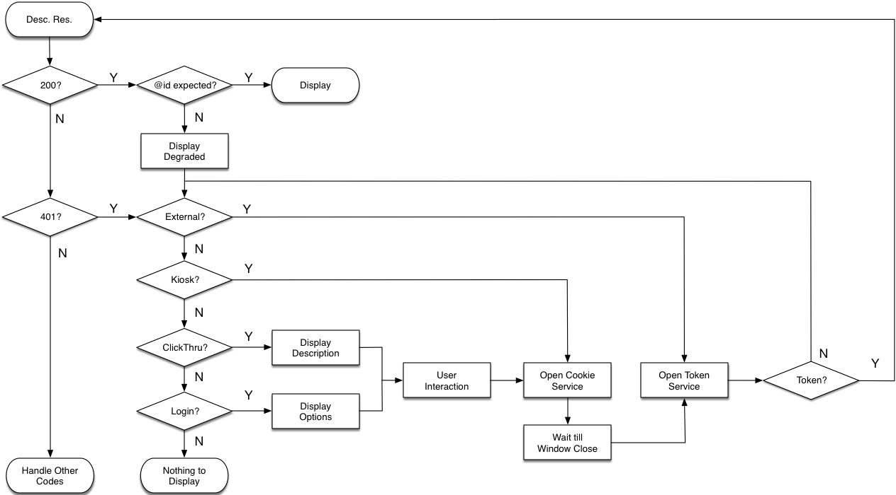

## Status of this Document
{:.no_toc}

__This Version:__ {{ page.major }}.{{ page.minor }}.{{ page.patch }}-{{ page.pre }}

__Latest Stable Version:__ [{{ site.data.apis.auth.latest.major }}.{{ site.data.apis.auth.latest.minor }}.{{ site.data.apis.auth.latest.patch }}][auth-stable-version]

__Previous Version:__ [1.0.0][auth1]

**Editors:**





----

## 1. Introduction
{: #introduction}

The IIIF (pronounced "Triple-Eye-Eff") specifications are designed to support uniform and rich access to resources hosted around the world. Open access to content is desirable, but internal policies, legal regulations, business models, and other constraints can require users to authenticate and be authorized to interact with some resources. The authentication process could range from a simple restriction by IP address or a click-through agreement, to a multi-factor scheme with a secure identity provider.

Content providers that need to restrict access to their resources may offer tiered access to alternative versions that go beyond a simple all-or-nothing proposition. These alternative versions could be degraded based on resolution, watermarking, or compression, for example, but are often better than no access at all.

Providing interoperable access to restricted content through client applications running in a web browser poses many challenges:

* A single IIIF Presentation API manifest can reference content resources at multiple institutions and hence from multiple domains.
* Each version of a resource must have a distinct URI to prevent web caches from providing the wrong version.
* Institutions have different existing access control systems.
* Most IIIF viewers are client-side JavaScript applications, and may be served from a domain that is different from, and thus untrusted by, the image services that it is required to load.
* Similarly, the domain of the authentication services may be different from that of a viewer or the IIIF-based content. Therefore, the authorizing server must not require any prior knowledge of the domain hosting the viewer.
<!-- 
How true is this? ^^^ The domain of the token service must be the same as the content!
The access service _could_ be different, but would need to visit the content domain at some point to set a cookie.
 -->

Additionally, the IIIF community has the following goals for this specification:

* A IIIF client should not accept credentials and authenticate the user itself; the server hosting the content must be responsible for capturing credentials from a user and the IIIF viewer needs no knowledge of or access to this exchange.
* A browser-based IIIF client must be able to maintain its own internal state during an authentication flow. That is, it must be able to stay running while the user interacts with third parties in another tab.
* A registry of trusted domains should not be required; anyone should be able to create any kind of viewer and run it from anywhere.
* Institutions should be able to use their existing authentication systems without modification: this specification can provide a bridge to existing systems without requiring that the systems themselves be changed.

To meet these challenges and goals, the IIIF Authentication specification describes a set of workflows for guiding the user through an _existing_ access control system. The process of authenticating and authorising the user is mostly outside the scope of the specification and may involve a round-trip to a CAS server, or an OAuth2 provider, or a bespoke login system. In this sense, IIIF Authentication is not the same as a protocol like CAS; it is a pattern for interacting with arbitrary third party protocols.

IIIF Authentication provides a link to a user interface for logging in, and services that provide credentials, modeled after elements of the OAuth2 workflow. Together they act as a bridge to the access control system in use on the server, without the client requiring knowledge of that system.

In summary, the specification describes how to:

* From within a viewer, initiate an interaction with an access control system so that a user can acquire any credentials they need to view restricted content.
* Give the client just enough knowledge of the user's state with respect to the content provider to ensure a good user experience.

Please send feedback to [iiif-discuss@googlegroups.com][iiif-discuss].

### 1.1. Terminology
{: #terminology}

This specification distinguishes between __Content Resources__, such as images or videos, and __Description Resources__ which conform to IIIF specifications, such as [Image API][image-api] image information (info.json) and [Presentation API][prezi-api] collection or manifest resources. From the point of view of a browser-based application, Content Resources are loaded indirectly via browser interpretation of HTML elements, whereas Description Resources are typically loaded directly by JavaScript using the `XMLHttpRequest` interface or `fetch` API. The [Cross Origin Resource Sharing][org-w3c-cors] (CORS) specification describes the different security rules that apply to the interactions with these two types of resource.

Two additional concepts, the __access cookie__ and __access token__, are described below.

The key words _MUST_, _MUST NOT_, _REQUIRED_, _SHALL_, _SHALL NOT_, _SHOULD_, _SHOULD NOT_, _RECOMMENDED_, _MAY_, and _OPTIONAL_ in this document are to be interpreted as described in [RFC 2119][org-rfc-2119].

### 1.2. Authentication for Content Resources
{: #authentication-for-content-resources}

Content Resources, such as images or video, are generally secondary resources embedded in a web page or application. Content Resources may also be linked to and requested directly, such as a link to a PDF. In the case of web pages, images might be included via the HTML `img` tag, and loaded via additional HTTP requests made by the browser. When a user is not authorized to load a web page, the server can redirect the user to another page and offer the opportunity to authenticate. This redirection is not possible for embedded Content Resources, and the user is simply presented with a broken image icon. If the image is access controlled, the browser must avoid broken images by sending whatever credential the server is expecting that grants access to the image. In the most common case the credential is an __access cookie__, and this specification describes the process by which the user acquires this __access cookie__. The credential may be some other aspect of the request (such as IP address), and this specification describes the process by which the client application learns that the user has this valid aspect. In either case, the client is never aware of what that aspect is, the flow is the same.

### 1.3. Authentication for Description Resources
{: #authentication-for-description-resources}

Description Resources, such as a Presentation API manifest or an Image API information document (info.json), give the client application the information it needs to have the browser request the Content Resources. <!-- not true for manifest referencing content: -->A Description Resource must be on the same domain as the Content Resource it describes, but there is no requirement that the executing client code is also hosted on this domain.

For some types of authorisation, such as IP address range, the information required for the server to authorise the request is present in the requests the browser makes indirectly for Content Resources and in the requests the client code makes directly for Description Resources using `XMLHttpRequest` or `fetch`. This is not true for cross-domain requests that include credentials. A browser running JavaScript retrieved from one domain cannot load a Description Resource from another domain and include that domain's cookies in the request, without violating the requirement introduced above that the client must work when _untrusted_. In both cases, the client sends an __access token__, technically a type of [bearer token][org-rfc-6570-1-2]. This acts as a proxy for the access cookie. <!-- and other forms of credential later --> The client does not know what the server is using to authorise the request, so always sends this token it has obtained from the token service, even when for some types of authorisation it is not technically required. 

This specification describes how, once the browser has been given the chance to acquire any required credentials such as an access cookie, the client then acquires the access token to use when making direct requests for Description Resources.

The server on the Resource Domain treats the access token as a representation of, or proxy for, any credential that gains access to the Content Resources. When the client makes requests for the Description Resources and presents the access token, the responses tell the client what will happen when the browser requests the corresponding content resources with the credential the access token represents. These responses let the client decide what user interface and/or Content Resources to show to the user.

Thus the access token usually represents an access cookie, but may represent other forms of credential or aspects of the request. The client does not know what the token represents.

### 1.4. Security
{: #security}

The purpose of this specification to support access-control for IIIF resources and hence security is a core concern. To prevent misuse, cookies and bearer tokens described in this specification need to be protected from disclosure in storage and in transport. Implementations _SHOULD_ use [HTTP over TLS][org-rfc-2818], commonly known as HTTPS, for all communication. Furthermore, all IIIF clients that interact with access-controlled resources _SHOULD_ also be run from pages served via HTTPS. All references to HTTP in this specification should be read assuming the use of HTTPS.

This specification protects Content Resources such as images by making the access token value available to the script of the client application, for use in requesting Description Resources. Knowledge of the access token is of no value to a malicious client, because the access _cookie_ (which the client cannot see) is the credential accepted for Content Resources, and a Description Resource is of no value on its own. However, the interaction patterns introduced in this specification will in future versions be extended to support write operations on IIIF resources, for example creating annotations in an annotation server, or modifying the `structures` element in a manifest. For these kinds of operations, the access token _is_ the credential, and the flow introduced below may require one or more additional steps to establish trust between client and server. However, it is anticipated that these changes will be backwards compatible with version {{ page.major }}.{{ page.minor }}.

Further discussion of security considerations can be found in the [Implementation Notes][auth2-implementation-notes].

## 2. Authentication Services
{: #authentication-services}

Authentication services follow the pattern described in the IIIF [Linking to External Services][annex-services] note, and are referenced in one or more `service` blocks from the descriptions of the resources that are protected. There is a primary service profile for authenticating users and granting access, and it has related services nested within its description.  The related services include a mandatory access token service, and an optional logout service.

### 2.1. Access Service
{: #access-service}

The client typically uses this service to obtain a credential (usually a cookie) that will be used when interacting with content such as images, and with the access token service. There are three different interaction patterns in which the client will use this service, based on the user interface that must be rendered for the user. The different patterns are indicated by the `profile` property. The client obtains the link to the access cookie service from a service block in a description of the protected resource, then opens that URI in a new browser tab.

The purpose of the access service is to set any required cookie(s) during the user's interaction with the content server, so that when the client then makes image requests to the content server, the requests will succeed. The client has no knowledge of what the user does at the access service, and it cannot see any cookies set for the content domain during the user's interaction there. The browser may be redirected one or more times but this is invisible to the client application. The final response in the opened tab _SHOULD_ contain JavaScript that will attempt to close the tab, in order to trigger the next step in the workflow.

The access service is not required to set a cookie. Many authorisation mechanisms are possible; it may be that access to content resources will be determined by other aspects of the request. In some scenarios, what happens at the access service may have no affect on subsequent steps, but the client does not know this and should always follow the same flow.

#### 2.1.1. Service Description
{: #service-description}

There are three interaction patterns by which the client can use the access service, each identified by a different value of the `profile` property. These patterns are described in more detail in the following sections.

| Pattern      | `profile` value | Description |
| ------------ | ----------- | ----------- |
| Interactive  | `interactive` | The user will be required to visit the user interface of an external authentication system in a separate tab (or window) opened by the client. This user interface might prompt for credentials, or require acceptance of a usage agreement, or validate the user's IP address. |
| Kiosk        | `kiosk` | The user will not be required to interact with an authentication system, the client is expected to use the access cookie service automatically. |
| External     | `external` | The user is expected to have already acquired the appropriate cookie, and the access cookie service will not be used at all. |
{: .api-table .first-col-normal }

The service description is included in the Description Resource and has the following technical properties:

| Property     | Required?   | Description |
| ------------ | ----------- | ----------- |
| @context     | _REQUIRED_    | The context document that describes the IIIF Authentication API. The value _MUST_ be `http://iiif.io/api/auth/{{ page.major }}/context.json`. If the Access service is embedded within an Image API 3.0 service, or a Presentation API 3.0 resource, the `@context` key _SHOULD NOT_ be present within the service, but instead _SHOULD_ be included in the list of values for `@context` at the beginning of that image service or Presentation API resource.  
| id          | _see description_ | It is _REQUIRED_ with the Interactive and Kiosk patterns, in which the client opens the URI in order to obtain an access cookie or other credential. It is _OPTIONAL_ with the External pattern, as the user is expected to have obtained a credential by other means and any value provided is ignored. |
| type         | _REQUIRED_    | The value _MUST_ be the string `AuthAccessService2` |
| profile      | _REQUIRED_    | The profile for the service _MUST_ be one of the profile values from the table above.|
| service      | _REQUIRED_    | References to access token and other related services, described below.|

The service description also includes the following descriptive properties, all of which are JSON objects conforming to the section [Language of Property Values][prezi3-languages] in the Presentation API. In the case where multiple language values are supplied, clients must use the algorithm in that section to determine which values to display to the user.

| Property     | Required?   | Description |
| ------------ | ----------- | ----------- |
| label        | _REQUIRED_    | The text to be shown to the user to initiate the loading of the authentication service when there are multiple services required. The value _MUST_ include the domain or institution to which the user is authenticating. |
| confirmLabel | _RECOMMENDED_ | The text to be shown to the user on the button or element that triggers opening of the access service. If not present, the client supplies text appropriate to the interaction pattern if needed. |
| header       | _RECOMMENDED_ | A short text that, if present, _MUST_ be shown to the user as a header for the description, or alone if no description is given. |
| description  | _RECOMMENDED_ | Text that, if present, _MUST_ be shown to the user before opening the access service. |
| failureHeader | _OPTIONAL_ | A short text that, if present, _MAY_ be shown to the user as a header after failing to receive a token, or using the token results in an error. |
| failureDescription | _OPTIONAL_ | Text that, if present, _MAY_ be shown to the user after failing to receive a token, or using the token results in an error. |
{: .api-table}

#### 2.1.2. Interaction with the Access Service
{: #interaction-with-the-access-service}

The client _MUST_ append the following query parameter to all requests to an access service URI, regardless of the interaction pattern, and open this URI in a new window or tab.

| Parameter | Description |
| --------- | ----------- |
| origin    | A string containing the origin of the page in the window, consisting of a protocol, hostname and optionally port number, as described in the [postMessage API][org-mozilla-postmessage] specification.  |
{: .api-table}

For example, given an access service URI of `https://authentication.example.org/login`, a client instantiated by the page `https://client.example.com/viewer/index.html` would make its request to:


```
https://authentication.example.org/login?origin=https://client.example.com/
```

The server _MAY_ use this information to validate the origin supplied in subsequent requests to the access token service, for example by encoding it in the cookie returned.

#### 2.1.3. Interactive Access Service Pattern
{: #login-interaction-pattern}

This pattern requires the user to interact with the content provider's user interface in the opened tab. Typical scenarios are:

* The user interface presents a login process, in which the user provides credentials to the content provider and the content provider sets an access cookie.
* The user interface presents a usage agreement, or a content advisory notice, or some other form of _Clickthrough_ interaction in which credentials are not required, but deliberate confirmation of terms is required, to set an access cookie.
* The service validates some other aspect of the HTTP request, such as origin IP address, but does not set an access cookie.

The value of the `id` property is the URI of this user interface.

The interaction has the following steps:

* If the `header` and/or `description` properties are present, before opening the provider's authentication interface, the client _SHOULD_ display the values of the properties to the user.  The properties will describe what is about to happen when they click the element with the `confirmLabel`.
* When the `confirmLabel` element is activated, the client _MUST_ then open the URI from `id` with the added `origin` query parameter. This _MUST_ be done in a new window or tab to help prevent spoofing attacks. Browser security rules prevent the client from knowing what is happening in the new tab, therefore the client can only wait for and detect the closing of the opened tab.
* After the opened tab is closed, the client _MUST_ then use the related access token service, as described below.

With out-of-band knowledge, authorized non-user-driven clients _MAY_ use POST to send the pre-authenticated user’s information to the service. As the information required depends on authorization logic, the details are not specified by this API.

An example service description for the Login interaction pattern:


``` json-doc
{
  // ...
  "service" : {
    "@context": "http://iiif.io/api/auth/{{ page.major }}/context.json",
    "id": "https://authentication.example.org/login",
    "type": "AuthAccessService2",
    "profile": "login",
    "label": { "en": [ "Login to Example Institution" ] },
    "header": { "en": [ "Please Log In" ] },
    "description": { "en": [ "Example Institution requires that you log in with your example account to view this content." ] },
    "confirmLabel": { "en": [ "Login" ] },
    "failureHeader": { "en": [ "Authentication Failed" ] },
    "failureDescription": { "en": [ "<a href=\"http://example.org/policy\">Access Policy</a>" ] },
    "service": [
      // Access token and Logout services ...
    ]
  }
}
```

When the service is embedded within the resource it applies to, the `@context` _SHOULD_ be declared at the beginning of that resource and not within the service:


``` json-doc
{
  "@context": [
    "http://iiif.io/api/image/3/context.json",
    "http://iiif.io/api/auth/{{ page.major }}/context.json"
  ],
  "id": "https://example.org/image-service/abcd12345",
  "type": "ImageService3",
    // other image service properties ...
  "service": [
    {    
      "id": "https://authentication.example.org/login",
      "type": "AuthAccessService2",
      // other auth service properties ...
    }
  ]
}
```

#### 2.1.3.1 User interaction at the Access Service and third party cookies

While it is possible for the access service to immediately set a cookie in the response and generate client-side script that closes the opened tab, this behavior will likely result in browsers failing to send that cookie on subsequent requests for the token service or content resources if the client is hosted on a different domain from them. In this scenario, the user has not interacted with the access service origin in a _first party context_ as defined in the [Storage Access API][org-mozilla-storageaccess], and therefore that origin does not have access to _first party storage_, which means that any cookies for that origin are not included in requests to that origin.

For this reason, if the subsequent token service and access to content resources require the presence of a cookie, the user interface of the access service _MUST_ involve a [user gesture][org-whatwg-user-gesture] such as a click or a tap. Logging in with credentials, or clicking acceptance of a usage agreement, typically meet the definition of a user gesture.

If the token service and content resources will depend on some other aspect of the request, such as IP address, then the Access Service tab _MAY_ be closed without user interaction.

#### 2.1.4. Kiosk Access Service Pattern
{: #kiosk-interaction-pattern}

For the Kiosk interaction pattern, the value of the `id` property is the URI of a service that _MUST_ set an access cookie and then immediately close its window or tab without user interaction.  The interaction has the following steps:

* There is no user interaction before opening the Access Service URI, and therefore any of the `label`, `header`, `description` and `confirmLabel` properties are ignored if present.
* The client _MUST_ immediately open the URI from `id` with the added `origin` query parameter. This _SHOULD_ be done in a new window or tab. Browser security rules prevent the client from knowing what is happening in the new tab, therefore the client can only wait for and detect the closing of the opened window or tab or frame.
* After the opened tab is closed, the client _MUST_ then use the related access token service, as described below.

Non-user-driven clients simply access the URI from `id` to obtain any access cookie, and then use the related access token service, as described below.

__Warning__<br/>
If the content resources and access service are on a different origin from the client, and the authorisation is based on an access cookie, the Kiosk pattern will likely fail unless the user has recently interacted with the access service origin in a first party context as described in section 2.1.3.1. above. 
{: .alert}

An example service description for the Kiosk interaction pattern:


``` json-doc
{
  // ...
  "service" : {
    "@context": "http://iiif.io/api/auth/{{ page.major }}/context.json",
    "id": "https://authentication.example.org/cookiebaker",
    "type": "AuthAccessService2",
    "profile": "kiosk",
    "label": { "en": [ "Internal cookie granting service" ] },
    "failureHeader": { "en": [ "Ooops!" ] },
    "failureDescription": { "en": [ "Call Bob at ext. 1234 to reboot the cookie server" ] },
    "service": {
      // Access token service ...
    }
  }
}
```

When the service is embedded within the resource it applies to, the `@context` _SHOULD_ be declared at the beginning of that resource and not within the service, as in the second example in Section 2.1.3.

#### 2.1.5. External Access Service Pattern
{: #external-interaction-pattern}

For the External interaction pattern, the user already has whatever aspect of the request the token service and content resources are expecting. This may be a cookie acquired "out-of-band" in a separate interaction, such as a normal login outside the scope of this specification. This pattern is also suitable for authorisation that is based on non-cookie aspects of the request, such as a user's IP address. If the user lacks the expected aspect of the request (is missing the cookie, or the wrong IP address) the user will receive the failure messages. The interaction has the following steps:

* There is no user interaction before opening the __access token__ service URI, and therefore any of the `label`, `header`, `description` and `confirmLabel` properties are ignored if present.
* There is no access service. Any URI specified in the `id` property _MUST_ be ignored.
* The client _MUST_ immediately use the related access token service, as described below.

Non-user-driven clients simply use the related access token service, typically with a previously acquired access cookie, as described below.

__Warning__<br/>
If the content resources and token service are on a different origin from the client, and the authorisation is based on an access cookie, the External pattern will likely fail unless the user has recently interacted with the token service origin in a first party context as described in section 2.1.3.1. above. 
{: .alert}

An example service description for the External interaction pattern:


``` json-doc
{
  // ...
  "service" : {
    "@context": "http://iiif.io/api/auth/{{ page.major }}/context.json",
    "type": "AuthAccessService2",
    "profile": "external",
    "label": { "en": [ "External Authentication Required" ] },
    "failureHeader": { "en": [ "Restricted Material" ] },
    "failureDescription": { "en": [ "This material is not viewable without prior agreement" ] },
    "service": {
      // Access token service ...
    }
  }
}
```

When the service is embedded within the resource it applies to, the `@context` _SHOULD_ be declared at the beginning of that resource and not within the service, as in the second example in Section 2.1.3.

### 2.2. Access Token Service
{: #access-token-service}

The client uses this service to obtain an access token which it then uses when requesting Description Resources. If authorisation for the content resources is based on cookies, a request to the access token service must include any cookies for the content domain acquired from the user's interaction with the corresponding access service, so that the server can issue the access token.

#### 2.2.1. Service Description
{: #service-description-1}

The access service description _MUST_ include an access token service description following the template below:


``` json-doc
{
  // Access Service
  "service" : {
    "@context": "http://iiif.io/api/auth/{{ page.major }}/context.json",
    "id": "https://authentication.example.org/login",
    "type": "AuthAccessService2",
    "profile": "login",
    "label": { "en": [ "Login to Example Institution" ] },

    // Access Token Service
    "service": [
      {
        "id": "https://authentication.example.org/token",
        "type": "AuthTokenService2"
      }
    ]
  }
}
```

The `id` property of the access token service _MUST_ be present, and its value _MUST_ be the URI from which the client can obtain the access token. The `type` property _MUST_ be present and its value _MUST_ be `AuthTokenService2` to distinguish it from other services. 

There are no other properties for this service.

#### 2.2.2. The JSON Access Token Response
{: #the-json-access-token-response}

If the request satisfies the same demands that requests for Content Resources must meet (such as having a valid cookie that the server recognises as having been issued by the access service, or originating from a permitted IP Address range), the access token service response _MUST_ include a JSON (not JSON-LD) object with the following structure:


``` json-doc
{
  "accessToken": "TOKEN_HERE",
  "expiresIn": 3600
}
```

The `accessToken` property is _REQUIRED_, and its value is the access token to be passed back in future requests. The `expiresIn` property is _OPTIONAL_ and, if present, the value is the number of seconds in which the access token will cease to be valid.

Once obtained, the access token _MUST_ be passed back to the server on all future requests for Description Resources by adding an `Authorization` request header, with the value `Bearer` followed by a space and the access token, such as:

```
Authorization: Bearer TOKEN_HERE
```

This authorization header _SHOULD_ be added to all requests for resources from the same domain and subdomains that have a reference to the service, regardless of which API is being interacted with. It _MUST NOT_ be sent to other domains.

#### 2.2.3. Interaction for Non-Browser Client Applications
{: #interaction-for-non-browser-client-applications}

The simplest access token request comes from a non-browser client that can send cookies across domains, where the CORS restrictions do not apply. An example URI:


```
https://authentication.example.org/token
```
{: .urltemplate}

Would result in the HTTP Request:


```
GET /token HTTP/1.1
Cookie: <cookie-acquired-during-login>
```
{: .urltemplate}

The response is the JSON access token object with the media type `application/json`:


``` json-doc
{
  "accessToken": "TOKEN_HERE",
  "expiresIn": 3600
}
```

#### 2.2.4. Interaction for Browser-Based Client Applications
{: #interaction-for-browser-based-client-applications}

If the client is a JavaScript application running in a web browser, it needs to make a direct request for the access token and store the result. The client can't use `XMLHttpRequest` or `fetch` because it can't include any access cookie in a cross-domain request. Instead, the client _MUST_ open the access token service in a frame using an `iframe` element and be ready to receive a message posted by script in that frame using the [postMessage API][org-mozilla-postmessage]. To trigger this behavior, the client _MUST_ append the following query parameters to the access token service URI, and open this new URI in the frame.

| Parameter | Description |
| --------- | ----------- |
| messageId | A string that both prompts the server to respond with a web page instead of JSON, and allows the client to match access token service requests with the messages received.  If a client has no need to interact with multiple token services, it can use a dummy value for the parameter, e.g., `messageId=1`. |
| origin    | A string containing the origin of the page in the window, consisting of a protocol, hostname and optionally port number, as described in the [postMessage API][org-mozilla-postmessage] specification. |
{: .api-table}

For example, a client instantiated by the page at `https://client.example.com/viewer/index.html` would request:


```
https://authentication.example.org/token?messageId=1&origin=https://client.example.com/
```

When the server receives a request for the access token service with the `messageId` parameter, it _MUST_ respond with an HTML web page rather than raw JSON. The web page _MUST_ contain script that sends a message to the opening page using the postMessage API. The message body is the JSON access token object, with the value of the supplied `messageId` as an extra property, as shown in the examples in the next section.  

The server _MAY_ use the origin information for further authorization logic, even though the user is already authenticated. For example, the server may trust only specific domains for certain actions like creating or deleting resources compared to simply reading them. If the client sends an incorrect value, it will not receive the posted response, as the postMessage API will not dispatch the event. The `targetOrigin` parameter of the `postMessage()` function call _MUST_ be the origin provided in the request.

The frame _SHOULD NOT_ be shown to the user. It is a mechanism for cross-domain messaging. The client _MUST_ register an event listener to receive the message that the token service page in the frame will send. The client can reuse the same listener and frame for multiple calls to the access token service, or it can create new ones for each invocation.

The exact implementation will vary but _MUST_ include features equivalent to the following steps.

The client must first register an event listener to receive a cross domain message:


``` javascript
window.addEventListener("message", receive_message);

function receive_message(event) {
    data = event.data;
    var token, error;
    if (data.hasOwnProperty('accessToken')) {
        token = data.accessToken;
    } else {
        // handle error condition
    }
    // ...
}
```
It can then open the access token service in a frame:


``` javascript
document.getElementById('messageFrame').src =
  'https://authentication.example.org/token?messageId=1234&origin=https://client.example.com/';
```

The server response will then be a web page with a media type of `text/html` that can post a message to the registered listener:


``` html
<html>
<body>
<script>    
    window.parent.postMessage(
      {
        "messageId": "1234",
        "accessToken": "TOKEN_HERE",
        "expiresIn": 3600
      },
      'https://client.example.com/'
    );    
</script>
</body>
</html>
```

#### 2.2.5. Using the Access Token
{: #using-the-access-token}

The access token is sent on all subsequent requests for Description Resources. For example, a request for the image information in the Image API would look like:


```
GET /iiif/identifier/info.json HTTP/1.1
Authorization: Bearer TOKEN_HERE
```
{: .urltemplate}

#### 2.2.6. Access Token Error Conditions
{: #access-token-error-conditions}

The response from the access token service may be an error. The error _MUST_ be supplied as a JSON-LD resource of type `AuthTokenError2`, as in the following template. For browser-based clients using the postMessage API, the error object must be sent to the client via JavaScript, in the same way the access token is sent. For direct requests the response body is the raw JSON.


``` json-doc
{
  "@context": "http://iiif.io/api/auth/{{ page.major }}/context.json",
  "type": "AuthTokenError2",
  "error": "ERROR_TYPE_HERE",
  "description": { "en": [ "Error message here" ] }
}
```

The error resource _MAY_ have an `id` property, but clients will likely ignore it.

The value of the `error` property _MUST_ be one of the types in the following table:  

| Type | Description |
| ---- | ----------- |
| `invalidRequest`     | The service could not process the information sent in the body of the request. |
| `missingCredentials` | The request did not have the credentials required. |
| `invalidCredentials` | The request had credentials that are not valid for the service. |
| `expiredCredentials` | The request had credentials that are no longer valid for the service. |
| `invalidOrigin`      | The request came from a different origin than that specified in the access service request, or an origin that the server rejects for other reasons. |
| `unavailable`        | The request could not be fulfilled for reasons other than those listed above, such as scheduled maintenance. |
{: .api-table}

The `description` property is _OPTIONAL_ and may give additional human-readable information about the error. The value of the `description` property is a JSON-LD Language Map conforming to the section [Language of Property Values][prezi3-languages] in the Presentation API.

When returning JSON directly, the service _MUST_ use the appropriate HTTP status code for the response to describe the error (for example 400, 401 or 503).  The postMessage web page response _MUST_ use the 200 HTTP status code to ensure that the body is received by the client correctly.

If the error is `expiredCredentials`, the client _SHOULD_ first try to acquire another token from the token service, before sending the user to the login service again. The client _MAY_ also do this for `invalidCredentials`.

### 2.3. Logout Service
{: #logout-service}

In the case of the Interactive Access Service pattern, the client may need to know if and where the user can go to log out. For example, the user may wish to close their session on a public terminal, or to log in again with a different account.

#### 2.3.1. Service Description
{: #service-description-2}

If the authentication system supports users intentionally logging out, there _SHOULD_ be a logout service associated with the access service following the template below:


``` json-doc
{
  // ...
  "service" : {
    "@context": "http://iiif.io/api/auth/{{ page.major }}/context.json",
    "id": "https://authentication.example.org/login",
    "type": "AuthAccessService2",
    "profile": "login",
    "label": { "en": [ "Login to Example Institution" ] },
    "service" : [
      {
        "id": "https://authentication.example.org/token",
        "type": "AuthTokenService2"
      },
      {
        "id": "https://authentication.example.org/logout",
        "type": "AuthLogoutService2"
        "label": { "en": [ "Logout from Example Institution" ] }
      }
    ]
  }
}
```

The value of the `type` property _MUST_ be `AuthLogoutService2`.


#### 2.3.2. Interaction
{: #interaction}

The client _SHOULD_ present the results of an HTTP `GET` request on the service's URI in a separate tab or window with an address bar.  At the same time, the client _SHOULD_ discard any access token that it has received from the corresponding service. The server _SHOULD_ reset the user's logged in status when this request is made and delete any access cookie previously set.

### 2.4. Example Description Resource with Authentication Services
{: #example-description-resource-with-authentication-services}

The example below is a complete image information response for an example image with all of the authentication services.


``` json-doc
{
  "@context" : [
    "http://iiif.io/api/image/3/context.json",
    "http://iiif.io/api/auth/{{ page.major }}/context.json"
  ],
  "id" : "https://www.example.org/images/image1",
  "type": "ImageService3",
  "protocol" : "http://iiif.io/api/image",
  "width" : 6000,
  "height" : 4000,
  "maxWidth": 3000,
  "sizes" : [
    {"width" : 150, "height" : 100},
    {"width" : 600, "height" : 400}
  ],
  "profile" : "level2",
  "service" : {
    "id": "https://authentication.example.org/login",
    "type": "AuthAccessService2",
    "profile": "login",
    "label": { "en": [ "Login to Example Institution" ] },
    "service" : [
      {
        "id": "https://authentication.example.org/token",
        "type": "AuthTokenService2"
      },
      {
        "id": "https://authentication.example.org/logout",
        "type": "AuthLogoutService2",
        "label": { "en": [ "Logout from Example Institution" ] }
      }
    ]
  }
}
```


## 3. Interaction with Access-Controlled Resources
{: #interaction-with-access-controlled-resources}

This section describes how clients use the services above when interacting with Content Resources and Description Resources.

These interactions rely on requests for Description Resources returning HTTP status codes `200`, `302`, and `401` in different circumstances. In cases other than `302`, the body of the response _MUST_ be a valid Description Resource because the client needs to see the Authentication service descriptions in order to follow the appropriate workflow. Any response with a `302` status code will never be seen by browser-based client script interacting via the `XMLHttpRequest` API. The reported response will be the final one in the chain, and therefore the body of redirection responses is not required to be the Description Resource's representation.

### 3.1. All or Nothing Access
{: #all-or-nothing-access}

If the server does not support multiple tiers of access to a Content Resource, and the user is not authorized to access it, then the server _MUST_ return a response with a `401` (Unauthorized) HTTP status code for the corresponding Description Resource.

If the user is authorized for a Description Resource, the client can assume that requests for the described Content Resources will also be authorized. Requests for the Content Resources rely on an access cookie to convey the authorization state, or on other aspects of the request such as IP address.

### 3.2. Tiered Access
{: #tiered-access}

If a Content Resource supports multiple tiers of access, then it _MUST_ use a different URI for each Description Resource and its corresponding Content Resource(s). For example, there _MUST_ be different Image Information documents (`/info.json`) at different URIs for each tier. When refering to Description Resources that have multiple tiers of access, systems _SHOULD_ use the URI of the version that an appropriately authorized user should see. For example, when refering to an Image service from a Manifest, the reference would normally be to the highest quality image version rather than a degraded version. 

When a server receives an HTTP GET request for a Description Resource, and the user is not authorized to access it, and there are lower tiers available, the server _MUST_ issue a `302` (Found) HTTP status response to redirect to the Description Resource of a lower tier. Please note that the server _MUST_ return a 200 (OK) HTTP status response to an HTTP OPTIONS request, regardless of the user's access, as this is the required response for a successful CORS Preflight request.

When there are no lower tiers and the user is not authorized to access the current Description Resource, the server _MUST_ issue a `401` (Unauthorized) response. The client _SHOULD_ present information about the Access Service included in the Description Resource to allow the user to attempt to authenticate.

Different tiers of access _MAY_ be published on different hosts, and/or use different image server identifiers. 

## 4. Workflow from the Browser Client Perspective
{: #workflow-from-the-browser-client-perspective}

<table class="ex_table">
  <tbody>
    <tr>
      <td>
        
        <p><strong>1</strong> Client Authentication Workflow</p>
      </td>
    </tr>
  </tbody>
</table>


Browser-based clients will perform the following workflow in order to access access controlled resources:

* The client requests the Description Resource and checks the status code of the response.
* If the response is a 200,
  * The client checks whether the `id` property in the response is the same URI as was requested.  
  * If it is, then the client can proceed to request the Content Resource.
  * If the URIs are different, then the resource is from a different tier from the requested one. The 200 status implies that the resource is available to be used, and the client can therefore render the resource. At the same time, the client checks for authentication services in the JSON received.
* If the response is a 401,
  * The client does not have access to the Content Resource, and thus the client checks for authentication services in the JSON received.
* If the response is neither 200 nor 401, the client must handle other HTTP status codes

* When the client checks for authentication services:
  * First it looks for a External access service pattern as this does not require any user interaction.  If present, it opens the Access Token service to see if a cookie has already been obtained, or if some other aspect of the request meets the authorisation requirement.
  * If no External service is present, the client checks for a Kiosk access service pattern as it does not involve user interaction. If present, it opens the Access Service in a separate window.
  * If no Kiosk access service is present, the client presents any Interactive Access Service patterns available and prompts the user to interact with one of them. When the user selects the realm to interact with, which takes the Access Service role, it opens that realm's user interface in a separate tab (or window).
  * When the Access service window closes, either automatically or by the user, the client Opens the Access Token Service.

* After the Access Token service has been requested, if the client receives a token, it tries again to read the Description Resource with the newly acquired credentials.
  * If the client instead receives an error, it returns to look for further authentication services to interact with.
  * If there are no further authentication services, then the user does not have the credentials to interact with any of the Content Resource versions, and the client cannot display anything.

Please note that the server implementation involves providing `302` status responses to redirect the client from the requested tier to another tier if the user is not yet authorized to see the resource.  The browser-based client does not see these responses, and hence tests whether the identifier of the resource is the same as the one requested, rather than for the HTTP status code.

## Appendices

### A. Implementation Notes

Guidance for implementers is provided in a separate [Implementation Notes][implementation-notes] document. The notes cover many details relating to implementation of this specification in browser-based JavaScript applications, and additional security considerations, as well as highlighting relevant [Cookbook Recipes][annex-cookbook].

### B. Versioning

Starting with version 0.9.0, this specification follows [Semantic Versioning][org-semver]. See the note [Versioning of APIs][notes-versioning] for details regarding how this is implemented.

###  C. Acknowledgments

Many thanks to the members of the [IIIF Community][iiif-community] for their continuous engagement, innovative ideas and feedback.

###  D. Change Log

| Date       | Description |
| ---------- | ----------- |
| 2022-      | Version 2.0-alpha |
| 2017-01-19 | Version 1.0 (Alchemical Key) |
| 2016-10-05 | Version 0.9.4 (Incrementing Integer) add to security notes |
| 2016-08-22 | Version 0.9.3 (Wasabi KitKat) separate profiles, remove client identity service, add query parameters |
| (unreleased) | Version 0.9.2 (unnamed) postMessage instead of JSONP |
| 2015-10-30 | Version 0.9.1 (Table Flip) add missing @context, clarifications |
| 2015-07-28 | Version 0.9.0 (unnamed) draft |
{: .api-table .first-col-normal}



