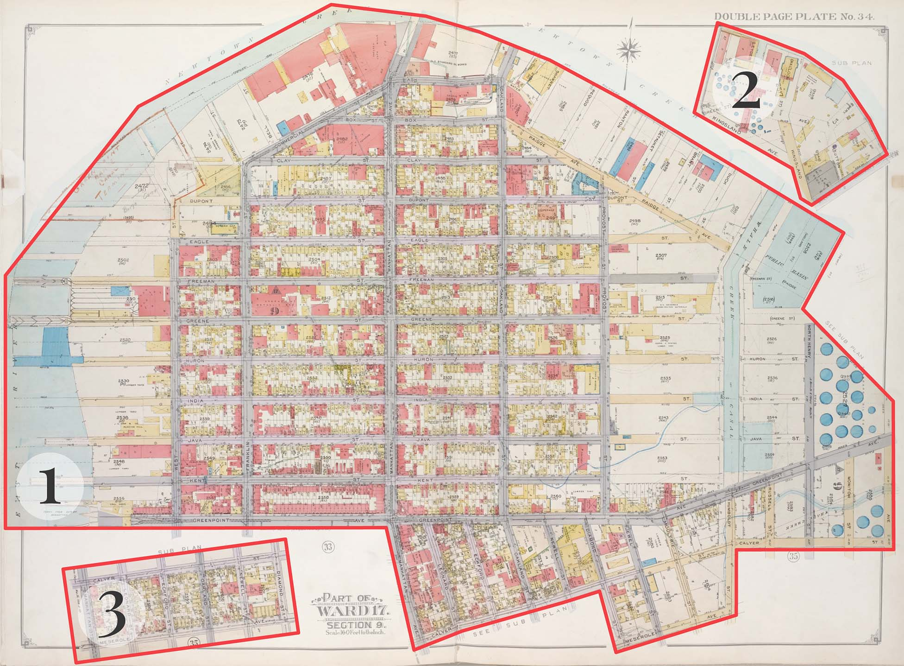
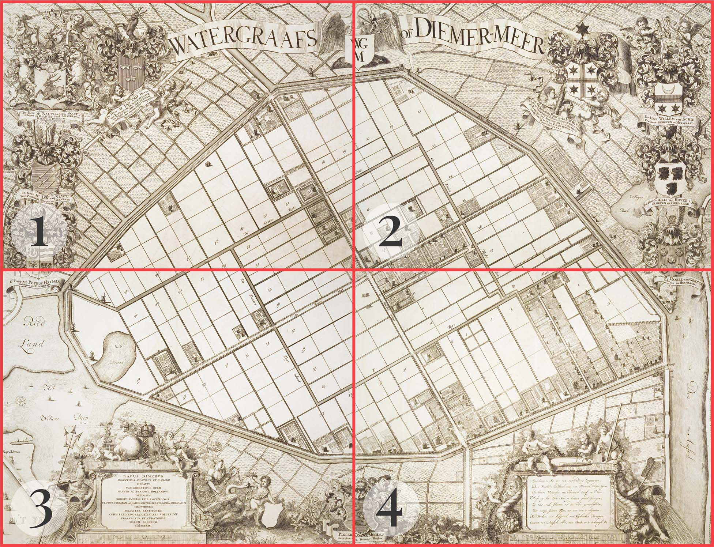

## Status of this Document
{:.no_toc}

This document is not subject to [semantic versioning][notes-versioning].
Changes will be tracked within the document.



## 1. Introduction

This document describes a way to store the metadata needed to georeference a IIIF resource in a _Georeference Annotation_. Georeference Annotations can be used to convert images such as digitized maps and aerial photographs to geospatial assets.

The [IIIF Presentation API](https://iiif.io/api/presentation/3.0/) has the capability to support complex Web Annotations which can provide detailed and specific information regarding IIIF resources. You can see various use cases which implement such Web Annotations in the [IIIF Cookbook](https://iiif.io/api/cookbook/). Through the work of the [IIIF Maps Community Group](https://iiif.io/community/groups/maps/) and [IIIF Maps TSG](https://iiif.io/community/groups/maps-tsg/), a commonality of techniques to georeference IIIF Canvases and Images in the context of a global map became evident, and a desire to have standards and best practices for georeferencing became known.

### 1.1 Objectives and Scope

This document will supply vocabulary and a linked data 1.1 context allowing for a JSON-LD pattern by which to extend Web Annotation and the IIIF Presentation API to support georeferencing. This pattern promotes interoperability for georeferenced maps across different georeferencing platforms, even those which focus on georeferencing for a specific use case such as those listed in the [Motivating Use Cases](#12-motivating-use-cases) section below.

The [existing GeoJSON specification](https://datatracker.ietf.org/doc/html/rfc7946) is adopted for its linked data vocabulary and context for geographic coordinates. This means coordinates are expressed through the [WGS84](http://www.w3.org/2003/01/geo/wgs84_pos) coordinate reference system. As such, expressing the location of extraterrestrial entities is not supported by this technique.

Further, the following use cases are not in scope:

- Geotagging of (non-aerial) photographs. This extension is aimed at georeferencing cartographic IIIF resources containing two-dimensional representations of the three-dimensional surface of the globe. Usage may extent to other representations that can be mapped to geospatial coordinates, such as orthographic plan projections or vertical aerial photographs. Geotagging photographs is out of scope because this requires a different set of datapoints and relates to other use cases. Please refer to the [navPlace Extension](https://iiif.io/api/extension/navplace/) for an alternative solution.
- Georeferencing altitude or elevation. Although the GeoJSON specifications support a third position element indicating the "height in meters above or below the WGS 84 reference ellipsoid", this is not included in the extension. Adding a third position element will however not result in an invalid Georeference Annotation, and it might be supported in future versions of the extension.
- Specifying the original map projection and related coordinate reference system (CRS) of a IIIF resource. When selecting a transformation method in order to warp a map, it can be useful to know the original map projection of a IIIF resource, such as Mercator or Lambert. Including this in the Georeference Annotation would require a complex taxonomy, which is out of scope. A solution is to include this information in the metadata of the IIIF Manifest, or in a machine readable format referenced through the [seeAlso](https://iiif.io/api/presentation/3.0/#seealso) property.

### 1.2 Motivating Use Cases

- Adding IIIF resources as map layers to dynamic web maps or in GIS applications. Based on georeference data, clients can transform IIIF resources by scaling, skewing, rotating and stretching them. This process, also called _warping_, can be carried out through various methods.
- The previous use case also supports stitching together multiple map sheets, each represented by a single IIIF resource, to form a composite map. Alternatively, it can be used to compare different versions of the same map or a collection of maps of the same area.
- Geospatial exploration of IIIF resources. Georeference data can be used to compute the geospatial areas depicted on IIIF resources. This enables geospatial indexing and harvesting by geospatial search engines.
- The same method can be used to convert IIIF Web Annotations to geographic formats such as GeoJSON, and vice versa. This can be used to display IIIF annotations as vectors in a map interface or to paint geographic data as IIIF annotations on a Canvas.
- Calculating the scale (in pixels per unit of length) and orientation (compass direction) of IIIF resources. This can be used to improve user experiences when viewing IIIF resources or for indexing.
- Converting IIIF resources to a variety of raster map formats such as GeoTIFF and XYZ map tiles. This allows resources to be used in conventional GIS software.

### 1.3 Terminology

This extension uses the following terms:

* __embedded__: When a resource (A) is embedded within an embedding resource (B), the complete JSON representation of resource A is present within the JSON representation of resource B, and dereferencing the URI of resource A will not result in additional information. Example: Canvas A is embedded in Manifest B.
* __referenced__: When a resource (A) is referenced from a referencing resource (B), an incomplete JSON representation of resource A is present within the JSON representation of resource B, and dereferencing the URI of resource A will result in additional information. Example: Manifest A is referenced from Collection B.
* __HTTP(S)__: The HTTP or HTTPS URI scheme and internet protocol.

The terms _array_, _JSON object_, _number_, _string_, and _boolean_ in this document are to be interpreted as defined by the [Javascript Object Notation (JSON)][org-rfc-8259] specification.

The key words _MUST_, _MUST NOT_, _REQUIRED_, _SHALL_, _SHALL NOT_, _SHOULD_, _SHOULD NOT_, _RECOMMENDED_, _MAY_, and _OPTIONAL_ in this document are to be interpreted as described in [RFC 2119][org-rfc-2119].

## 2. Georeferencing IIIF Resources

### 2.1 Georeferencing

Georeferencing is the process of mapping internal coordinates of an image to geographic coordinates. For the purposes of this extension, references to _IIIF resource_ equates to a IIIF Presentation API [Canvas](https://iiif.io/api/presentation/3.0/#53-canvas) or [Image Service](https://iiif.io/api/presentation/3.0/#service). To qualify for georeferencing, the IIIF resource must include one or more regions that can be mapped to geographic coordinates such as cartographic material, aerial photographs, archaeological drawings, and building plans. In this specification, each of these regions is called a _map_.

In order to be georeferenced with a single Georeference Annotation, the image information of the IIIF resource must be accessible with a single, continuous cartesian coordinate system. This is why a Georeferencing Annotation can be used to georeference a Canvas or Images Service, but not a [Manifest](https://iiif.io/api/presentation/3.0/#52-manifest) or [Range](https://iiif.io/api/presentation/3.0/#54-range). To georeference a Manifest or Range, multiple Georeference Annotations are needed, one for each Canvas or Image Service in the Manifest or Range.

### 2.2 Georeferencing Process

The process of georeferencing consists of the following steps:

1. Selecting a IIIF resource. When a resource depicts multiple maps (such as inset maps) or when the resource contains non-cartographic parts (such as legends or borders), a polygonal selector is used to select the region of the resource that contains a single map. The shape of a polygonal selector can vary from a simple rectangle to a more complex polygon. This step is called _cropping_ or _masking_ in other georeferencing software.
2. Defining a mapping between coordinates on the IIIF resource and corresponding geographic WGS84 coordinates. This mapping consists of pairs of resource coordinates and geographic coordinates. Each pair of coordinates is called a Ground Control Point (GCP). At least three GCPs are needed to enable clients to warp a map.
3. Optionally, a preferred transformation algorithm is defined that clients can use to turn the discrete set of GCPs into a function that interpolates any of the IIIF resource coordinates to geographic coordinates, and vice versa.

In Georeference Annotations, these steps are encoded as follows:

| Data                     | Georeference Annotation                                             |
|--------------------------|---------------------------------------------------------------------|
| Resource and selector    | IIIF Presentation API Canvas or Image API Image Service with an optional [SVG Selector](https://www.w3.org/TR/annotation-model/#svg-selector) or [Image API Selector](https://iiif.io/api/annex/openannotation/#iiif-image-api-selector) |
| GCPs                     | A GeoJSON Feature Collection where each GCP is stored as a GeoJSON Feature with a Point geometry and a `resourceCoords` property in the Feature's `properties` object |
| Transformation algorithm | A `transformation` property defined on the GeoJSON Feature Collection that holds the GCPs |
{: .api-table #table-critical-data-for-georeferencing}

__Target Projection__<br/>
Please note that, at this time, the Georeference Extension does not provide a property for specifying which geographic projection should be targeted when warping a IIIF resource. Most commonly, IIIF resources will be warped to the [WGS84 / Pseudo Mercator](https://epsg.io/?q=3857) projection (EPSG:3857), which is the current *de facto* standard for web mapping interfaces. Targeting another projection, even while using the same set of GCPs, will produce a different result. A property for specifying a target projection may be added in future versions of the extension.
{: .note}

## 3. Web Annotations for Georeferencing

The combined information described in Section 2 is stored in a Georeference Annotation which is modelled on the Web Annotation Data Model. This section details the structure of a Georeference Annotation and its relationship to the IIIF Presentation API and Image API. It includes examples of the different properties and options.

### 3.1 Embedded vs. Referenced Annotations

Georeference Annotations can be included in a IIIF Presentation API response as part of an [Annotation Page](https://iiif.io/api/presentation/3.0/#annotations) under the `annotations` property of a Canvas. Alternatively, Georeference Annotations can exist independent of the targeted IIIF resource.

For Georeference Annotations included in a Canvas, implementers _MUST_ have at least one Annotation Page in the `annotations` property of the targeted Canvas. Implementers have the option to [reference or embed](https://iiif.io/api/presentation/3.0/#12-terminology) those Annotation Pages. For the purposes of this extension, implementers _SHOULD_ embed the Annotation Pages in the `annotations` property as opposed to referencing them. See the Cookbook entry [Embedded or referenced Annotations](https://iiif.io/api/cookbook/recipe/0269-embedded-or-referenced-annotations/) for a close look at the difference.

Embedding resources reduces the need to make HTTP calls. It also ensures the availability of resources when URIs do not resolve. In those cases it would otherwise not be possible to display or use those resources in client applications.

### 3.2 Georeference Annotation `motivation`

The `motivation` property declares the reason for creating the Georeference Annotation. The `motivation` property _SHOULD_ be included on all Georeference Annotations and when included it _MUST_ have the value `georeferencing`.

Note that the [linked data context]({{ site.api_url | absolute_url }}/extension/georef/1/context.json) provided with this document includes the formal linked data 1.1 motivation extension, and the [vocabulary]({{ site.api_url | absolute_url }}/extension/georef/vocab/georef-terms.md) provided with this document contains the formal vocabulary for the `georeferencing` motivation discussed above.

### 3.3 Georeference Annotation `target`

The `target` property describes the resource that the Georeference Annotation applies to. The value for `target` _MUST_ either be a single and full IIIF resource, or a single region within a IIIF resource represented as a [Specific Resource](https://www.w3.org/TR/annotation-model/#specific-resources).

For Georeference Annotations embedded in the `annotations` property of a Canvas, the `target` _MUST_ be the Canvas URI. When the desired target is a part of a Canvas represented by a Specific Resource, the `source` _MUST_ be the Canvas URI. For Georeference Annotations that are external to the IIIF resource they target, implementers _SHOULD_ embed the IIIF resource in the `target` property instead of referencing it.

Clients processing the georeferencing information require the original height and width of the resources in order to have the proper aspect ratios. Implementers _SHOULD_ add the `height` and `width` properties to their embedded resources for consistency.

Sometimes the targeted resource exists within a parent resource, such as a targeted Canvas that exists embedded in some Manifest. In these cases, it is important to maintain the link between them to access useful contextual information. Implementers _MAY_ use the `partOf` property to reference the parent resource.

#### 3.3.1 Targeting the Full Resource

Example of a Georeference Annotation `target` that is an entire Canvas:


```json-doc
"target": {
  "id" : "http://www.example.org/canvas1.json"
  "type": "Canvas",
  "height": 2000,
  "width": 1000
  ...
}
```

#### 3.3.2 Targeting a Specific Region of the Resource

When a [Specific Resource](https://www.w3.org/TR/annotation-model/#specific-resources) is used as a `target`, the `source` property supplies the resource and the `selector` property indicates the region of the resource that the annotation applies to. To select a rectangular or polygonal region, a [IIIF Image API Selector](https://iiif.io/api/annex/openannotation/#iiif-image-api-selector) or an [SVG Selector](https://www.w3.org/TR/annotation-model/#svg-selector) can be used. An SVG Selector can be used on both Canvas and ImageService resources and is the preferred technique.

Example of a Georeference Annotation `target` with a [SVG Selector](https://www.w3.org/TR/annotation-model/#svg-selector) on a Canvas:


```json-doc
"target": {
  "id": "http://www.example.org/canvas-specific-resource.json",
  "type": "SpecificResource",
  "source": {
    "id": "http://www.example.org/canvas2.json",
    "type": "Canvas",
    "height": 2514,
    "width": 5965
  },
  "selector": {
    "type": "SvgSelector",
    "value": "<svg><polygon points=\"59,84 44,2329 5932,2353 5920,103 \" /></svg>"
  }
}
```

There are some limitations to the type of SVG Selectors you can use to ensure that each map is a single shape without holes:

- The `svg` element _MUST_ contain a single child element.
- This single child element _MUST_ either be a [`<polygon>`](https://developer.mozilla.org/en-US/docs/Web/SVG/Element/polygon) or a [`<rect>`](https://developer.mozilla.org/en-US/docs/Web/SVG/Element/rect).
- When a `rect` element is used, the `rx` and `ry` attributes _MUST NOT_ be used.
- The [`viewBox`](https://developer.mozilla.org/en-US/docs/Web/SVG/Attribute/viewBox) attribute _MUST NOT_ be used on the `svg` element.
- The `svg` element _MAY_ include `width` and `height` attributes. When these attributes are included, they _MUST_ be equal to the width and height of the targeted resource and they _MUST_ be numbers without units.
- The [`transform`](https://developer.mozilla.org/en-US/docs/Web/SVG/Attribute/transform) attribute _MUST NOT_ be used on any of the SVG Selector's elements.

#### 3.3.3 Content Variants

##### Multiple Maps Depicted on a Single IIIF Resource

It is common that a single IIIF resource depicts multiple maps, such as an image of a map with additional inset maps. Such a resource can be georeferenced by using multiple Georeference Annotations, each with their own SVG Selector and GCPs.

<figure>
  
  <figcaption>Three maps depicted and selected on a single IIIF resource: <a href="https://digitalcollections.nypl.org/items/69582cf7-d6cd-ba72-e040-e00a18065eba">Brooklyn, Vol. 1, 2nd Part, Double Page Plate No. 34; Part of Ward 17, Section 9</a>, from the New York Public Library</figcaption>
</figure>

##### A Canvas with multiple painting Annotations

It is also possible for a Canvas to contain multiple painting Annotations, each of a separate map. When the maps on the Canvas align properly, such a Canvas can be georeferenced at once, using a single Georeference Annotation.

<figure>
  
  <figcaption>Four map sheets painted on a single Canvas: <a href="https://tudelft.on.worldcat.org/oclc/708029770">Watergraafs of Diemer-meer</a>, from Delft University of Technology Library.</figcaption>
</figure>

More Georeference Annotation examples with robust implementation guidance will be available through the IIIF Cookbook. This document will be updated with links to those recipes as they become available.

### 3.4 Georeference Annotation `body`

The `body` of a Georeference Annotation contains the geospatial information about the resource that is referenced or embedded in the `target` property. For the purposes of this extension the `body` contains the GCPs. The value for `body` _MUST_ be a GeoJSON Feature Collection. The Feature Collection _MUST_ only contain Features with [Point](https://www.rfc-editor.org/rfc/rfc7946#section-3.1.2) geometries and _SHOULD_ contain at least three Point Features.

All commonly used transformation algorithms (including the ones described below) that are used to warp images require at least three GCPs. Algorithms exist that only need two GCPs, but they require information about the coordinate reference system (CRS) of the map. This specification does not support adding information about a map's CRS, as explained in [Section 1.1](#11-objectives-and-scope).

Still, a Georeference Annotation that contains less than three GCPs is valid. These annotations hold geospatial information that can be used in geospatial databases or GIS applications. Supporting annotations with less than three GCPs is also useful for crowdsourcing; incomplete annotations can be finished by someone else while intermediary results still comply to the specification.

An example of the Georeference Annotation `body`:


```json-doc
{
  "body": {
    "id": "http://www.example.org/feature-collection.json",
    "type": "FeatureCollection",
    "transformation": {
      ...
    },
    "features": [
      ...
    ]
  }
}
```

### 3.5 The `resourceCoords` Property

The `resourceCoords` property is defined by this document in order to supply the coordinates from the IIIF resource together with the WGS84 `coordinates` in a Feature to form a single GCP. Each Feature in the Feature Collection _MUST_ have the `resourceCoords` property in the `properties` property. The value is an array representing a resource coordinate at (x, y) and _MUST_ be exactly in that order.

An example of a Feature with the `resourceCoords` property:


```json-doc
{
  "type": "Feature",
  "properties": {
    "resourceCoords": [5085, 782]
  },
  "geometry": {
    "type": "Point",
    "coordinates": [4.4885839, 51.9101828]
  }
}
```

__Coordinate System of GCP Resource Coordinates__<br/>
The `resourceCoords` property uses the same cartesian coordinate system as the targeted IIIF resource. When this is a IIIF Presentation API Canvas or Image API Image Service (either the full resource or using an SVG Selector), this means that `resourceCoords` value (x, y) corresponds to coordinates (x, y) on the resource. However, when an [Image API Selector](https://iiif.io/api/annex/openannotation/#iiif-image-api-selector) is used, this means that `resourceCoords` value (x, y) corresponds to the _translated_, _resized_ and _rotated_ coordinates according to the Selector's [region](https://iiif.io/api/image/3.0/#41-region), [size](https://iiif.io/api/image/3.0/#42-size) and [rotation](https://iiif.io/api/image/3.0/#43-rotation) parameters.
{: .note}

### 3.6 The `transformation` Property

The `transformation` property is defined by this document in order to supply the preferred transformation algorithm that is used to create a complete mapping from pixel coordinates to geographic coordinates (and vice versa) based on a list of GCPs. The value for `transformation` is a JSON object which includes the properties `type` and `options`. The property _MAY_ be added to the Feature Collection used in the Georeference Annotation `body` and clients _MAY_ use the information in the object.

If a transformation algorithm is not provided, clients _SHOULD_ use their default algorithm. Similarly, if the supplied transformation algorithm is not supported by a client, that client _SHOULD_ use their default algorithm.

The name of the preferred transformation algorithm is stored in the `type` property inside the `transformation` JSON object. Typical values include but are not limited to:

| Transformation type          | Description                                                       | Options  |
|------------------------------|-------------------------------------------------------------------|----------|
| `polynomial`                 | 1st, 2nd or 3rd order polynomial transformation                   | `order`  |
| `thinPlateSpline`            | Thin plate spline transformation, also known as _rubber sheeting_ | N/A      |
{: .api-table #table-transformation-types}

The `options` property is used to supply additional parameters related to the selected transformation type. If a transformation type does not have or require options, implementers _SHOULD NOT_ include the `options` property.

The table below describes the different possible `order` values for the `polynomial` transformation type.

| Value | Description                                     |
|-------|-------------------------------------------------|
| `1`   | 1st order (linear) polynomial transformation    |
| `2`   | 2nd order (quadratic) polynomial transformation |
| `3`   | 3nd order (cubic) polynomial transformation     |

Other properties within `options`, including other transformation types not defined in this document, _SHOULD_ be described either by [registered IIIF API extensions](https://iiif.io/api/extension/) or [local linked data contexts](https://www.w3.org/TR/json-ld11/#dfn-local-context). If a client is not able to process properties it _MUST_ ignore them.

Example of a `transformation` JSON object:


```json-doc
{
  "transformation": {
    "type": "polynomial",
    "options": {
      "order": 1
    }
  }
}
```

## 4. Full Examples

### 4.1 Full Canvas Example


```json-doc
{
  "@context": [
    "http://iiif.io/api/extension/georef/1/context.json",
    "http://iiif.io/api/presentation/3/context.json"
  ],
  "id": "http://www.example.org/georeferenced-canvas.json",
  "type": "Canvas",
  "label": {
    "nl": ["River Nieuwe Maas and Rotterdam's Havens"],
    "en": ["Guide to the New-Waterway"]
  },
  "height": 2514,
  "width": 5965,
  "items": [
    {
      "id": "http://www.example.org/contentPage.json",
      "type": "AnnotationPage",
      "items": [
        {
          "id": "http://www.example.org/content.json",
          "type": "Annotation",
          "motivation": "painting",
          "body": {
            "id": "https://cdm21033.contentdm.oclc.org/digital/iiif/krt/2891/full/full/0/default.jpg",
            "type": "Image",
            "format": "image/jpeg",
            "height": 2514,
            "width": 5965,
            "service": [
              {
                "@id": "https://cdm21033.contentdm.oclc.org/digital/iiif/krt/2891",
                "type": "ImageService2"
              }
            ]
          },
          "target": "http://www.example.org/georeferenced-canvas.json"
        }
      ]
    }
  ],
  "annotations": [
    {
      "id": "http://www.example.org/annotationPage.json",
      "type": "AnnotationPage",
      "items": [
        {
          "id": "http://www.example.org/canvas-annotation.json",
          "type": "Annotation",
          "motivation": "georeferencing",
          "target": "http://www.example.org/georeferenced-canvas.json",
          "body": {
            "id": "http://www.example.org/feature-collection.json",
            "type": "FeatureCollection",
            "transformation": {
              "type": "polynomial",
              "options": {
                "order": 1
              }
            },
            "features": [
              {
                "type": "Feature",
                "properties": {
                  "resourceCoords": [5085, 782]
                },
                "geometry": {
                  "type": "Point",
                  "coordinates": [4.4885839, 51.9101828]
                }
              },
              {
                "type": "Feature",
                "properties": {
                  "resourceCoords": [5467, 1338]
                },
                "geometry": {
                  "type": "Point",
                  "coordinates": [4.5011785, 51.901595]
                }
              },
              {
                "type": "Feature",
                "properties": {
                  "resourceCoords": [2006, 374]
                },
                "geometry": {
                  "type": "Point",
                  "coordinates": [4.405981, 51.9091596]
                }
              }
            ]
          }
        }
      ]
    }
  ],
  "partOf": [{
    "id": "http://example.org/manifest/1",
    "type": "Manifest"
  }]
}
```

### 4.2 Full Georeference Annotation Example


```json-doc
{
  "@context": [
    "http://iiif.io/api/extension/georef/1/context.json",
    "http://iiif.io/api/presentation/3/context.json"
  ],
  "id": "http://www.example.org/canvas-annotation.json",
  "type": "Annotation",
  "motivation": "georeferencing",
  "target": {
    "id": "http://www.example.org/canvas.json",
    "type": "Canvas",
    "label": {
      "nl": ["River Nieuwe Maas and Rotterdam's Havens"],
      "en": ["Guide to the New-Waterway"]
    },
    "height": 2514,
    "width": 5965,
    "items": [
      {
        "id": "http://www.example.org/contentPage.json",
        "type": "AnnotationPage",
        "items": [
          {
            "id": "http://www.example.org/content.json",
            "type": "Annotation",
            "motivation": "painting",
            "body": {
              "id": "https://cdm21033.contentdm.oclc.org/digital/iiif/krt/2891/full/full/0/default.jpg",
              "type": "Image",
              "format": "image/jpeg",
              "height": 2514,
              "width": 5965,
              "service": [
                {
                  "@id": "https://cdm21033.contentdm.oclc.org/digital/iiif/krt/2891",
                  "type": "ImageService2"
                }
              ]
            },
            "target": "http://www.example.org/canvas.json"
          }
        ]
      }
    ],
    "partOf": [{
      "id": "http://example.org/manifest/1",
      "type": "Manifest"
    }]
  },
  "body": {
    "id": "http://www.example.org/feature-collection.json",
    "type": "FeatureCollection",
    "transformation": {
      "type": "polynomial",
      "options": {
        "order": 1
      }
    },
    "features": [
      {
        "type": "Feature",
        "properties": {
          "resourceCoords": [5085, 782]
        },
        "geometry": {
          "type": "Point",
          "coordinates": [4.4885839, 51.9101828]
        }
      },
      {
        "type": "Feature",
        "properties": {
          "resourceCoords": [5467, 1338]
        },
        "geometry": {
          "type": "Point",
          "coordinates": [4.5011785, 51.901595]
        }
      },
      {
        "type": "Feature",
        "properties": {
          "resourceCoords": [2006, 374]
        },
        "geometry": {
          "type": "Point",
          "coordinates": [4.405981, 51.9091596]
        }
      }
    ]
  }
}
```

## 5. Linked Data Context

- The URI of this extension's linked data context is
`http://iiif.io/api/extension/georef/1/context.json`
- The URI of the IIIF Presentation API linked data context is
`http://iiif.io/api/presentation/3/context.json`

The linked data context of this extension _MUST_ be included before the IIIF Presentation API linked data context on the top-level object. The extension linked data context file includes the [GeoJSON-LD context](https://geojson.org/geojson-ld/geojson-context.jsonld) through [context scoping](https://www.w3.org/TR/json-ld11/#dfn-scoped-context). This means the GeoJSON-LD context URI does not have to be explicitly included on the top level object. Note that since the IIIF Presentation API linked data context has the JSON-LD `@version` set to 1.1, all linked data contexts are processed as JSON-LD 1.1. It is also worth noting the linked data context for this extension also has `@version` set to 1.1. If this context is used in another setting, it will have the same behavior. JSON-LD 1.0 processors will throw a version error.

Consult the [Linked Data Context and Extensions section of IIIF Presentation API](https://iiif.io/api/presentation/3.0/#46-linked-data-context-and-extensions) for further guidance on use of the `@context` property.

## 6. Appendices

### A. Open Source Implementations

GCP-based image georeferencing is a common task that's available in many GIS applications. For example, the following open source applications provide this functionality:

- [GDAL](https://gdal.org/programs/gdaltransform.html)
- [QGIS](https://docs.qgis.org/3.22/en/docs/user_manual/working_with_raster/georeferencer.html)
- [Map Warper](https://github.com/timwaters/mapwarper)

Note that none of the tools listed above currently support georeferencing IIIF resources using Georeference Annotations.

### B. Acknowledgements

This extension was produced by the IIIF Maps Community Group and IIIF Maps Technical Specification Group. Of course, assistance came from many branches of the IIIF Community. We thank everyone for their time and perseverance given to ensure this extension is as useful as possible.

A grant of [Stichting Pica](https://www.stichtingpica.nl) for the further development of the [Allmaps Viewer](https://viewer.allmaps.org) made possible the completion of this extension.

### C. Change Log




