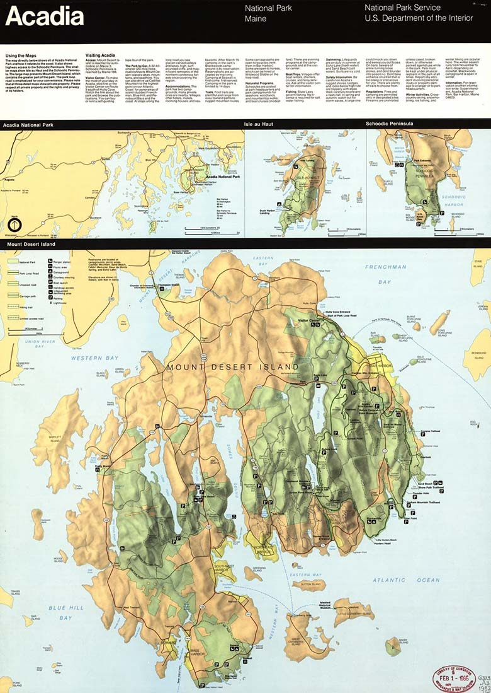
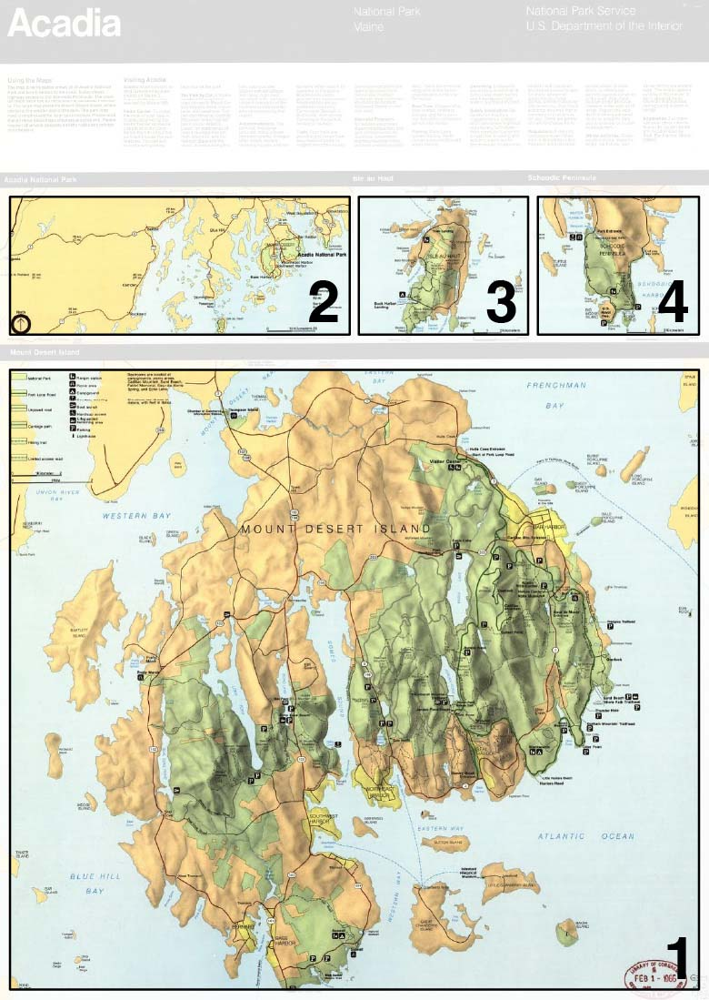

## Status of this Document
{:.no_toc}

This document is not subject to [semantic versioning][notes-versioning].
Changes will be tracked within the document.



## 1. Introduction

The [IIIF Presentation API](https://iiif.io/api/presentation/3.0/) has the capability to support complex Web Annotations which can provide detailed and specific information regarding IIIF resources. You can see various use cases which implement such Web Annotations in the [IIIF Cookbook](https://iiif.io/api/cookbook/). Through the work of the [IIIF Maps](https://iiif.io/community/groups/maps/) and [IIIF Maps TSG](https://iiif.io/community/groups/maps-tsg/) groups, a commonality of techniques to georeference IIIF Canvases and Images in the context of a global map became evident, and a desire to have standards and best practices for georeferencing became known.

### 1.1 Objectives and Scope

This document will supply vocabulary and a linked data 1.1 context allowing for a JSON-LD pattern by which to extend Web Annotation and the IIIF Presentation API to support georeferencing.

We will adopt the [existing GeoJSON specification](https://datatracker.ietf.org/doc/html/rfc7946) for its linked data vocabulary and context for geographic coordinates. This means coordinates are expressed through the [WGS84](http://www.w3.org/2003/01/geo/wgs84_pos) coordinate reference system. As such, expressing the location of extraterrestrial entities is not supported by this technique.

### 1.2 Motivating Use Cases

A georeferencing extension for IIIF resources will enable the following use cases:

- Overlay IIIF image resources on a geographic map by rotating and stretching it. This transforming an image to make it fit on a map is also called _warping_.
- Stitching multiple images of map sheets together to form a single map.
- Georeference data can also be used to compute the exact geospatial area depicted on an image. This will enable geospatial indexing of IIIF resources and enabling them to be found by geospatial search engines.
- A georeferenced IIIF resource can be converted to a variety of GIS formats, like GeoTIFF, GeoJSON and XYZ map tiles.

Situations which are not in scope include:

- 3D spatial representation
- Photo geotagging

### 1.3 Terminology

This extension uses the following terms:

* __embedded__: When a resource (A) is embedded within an embedding resource (B), the complete JSON representation of resource A is present within the JSON representation of resource B, and dereferencing the URI of resource A will not result in additional information. Example: Canvas A is embedded in Manifest B.
* __referenced__: When a resource (A) is referenced from a referencing resource (B), an incomplete JSON representation of resource A is present within the JSON representation of resource B, and dereferencing the URI of resource A will result in additional information. Example: Manifest A is referenced from Collection B.
* __HTTP(S)__: The HTTP or HTTPS URI scheme and internet protocol.

The terms _array_, _JSON object_, _number_, _string_, and _boolean_ in this document are to be interpreted as defined by the [Javascript Object Notation (JSON)][org-rfc-8259] specification.

The key words _MUST_, _MUST NOT_, _REQUIRED_, _SHALL_, _SHALL NOT_, _SHOULD_, _SHOULD NOT_, _RECOMMENDED_, _MAY_, and _OPTIONAL_ in this document are to be interpreted as described in [RFC 2119][org-rfc-2119].

## 2. Georeferencing IIIF Resources

### 2.1 Georeferencing
[Georeferencing](https://en.wikipedia.org/wiki/Georeferencing) is the process of mapping internal coordinates of a resource to geographic coordinates. For the purposes of this extension, references to "resource" equates to a IIIF [Canvas](https://iiif.io/api/presentation/3.0/#53-canvas) or [Image Service](https://iiif.io/api/presentation/3.0/#service) that contains one or more maps. Support extends to other resources with geographic depictions, such as aerial photographs, archaeological drawings, or building plans.


### 2.2 Georeferencing Process

The process of georeferencing consists of the following steps:

1. A pointer to a IIIF Canvas or Image Service, or a part of it. When a resource depicts multiple cartographic projections (such as inset maps) or when the resource contains non-cartographic parts (such as legends or borders), a mask can be used to select the portion of the resource that belongs to a single cartographic projection. The shape of such a mask can vary from a simple rectangle to a more complex polygon.
2. A mapping between the pixel coordinates of the IIIF resource and geographic WGS84 coordinates. This mapping consists of pairs of pixel coordinates and geographic coordinates. Each pair of coordinates is called a Ground Control Point (GCP). At least three GCPs are needed to enable clients to overlay a georeferenced IIIF resource on a map.
3. Optionally, a transformation algorithm can be defined that tells clients what algorithm should be used to turn the discrete set of GCPs into a function that can transform any of the IIIF resource pixel coordinates to geographic coordinates, and vice versa.

### 2.3 Critical Data for Georeferencing

The following encoding is used to store the data needed by the steps above:

| Required data            | Encoding                                                       |
|--------------------------|---------------------------------------------------------------------|
| Resource and mask  | IIIF Presentation API Canvas or Image API Image Service with an optional [SVG Selector](https://www.w3.org/TR/annotation-model/#svg-selector) or [Image API Selector](https://iiif.io/api/annex/openannotation/#iiif-image-api-selector) to specify a mask |
| GCPs                     | A GeoJSON Feature Collection where each GCP is stored as a GeoJSON Feature with a Point geometry and a `resourceCoords` property in the Feature's `properties` object |
| Transformation algorithm | A `transformation` property defined on the GeoJSON Feature Collection that holds the GCPs |
{: .api-table #table-required-data}

## 3. Web Annotations for Georeferencing

Web Annotations can contain all of the required information mentioned in Section 2 and when they do we will refer to them as a "Georeference Annotation". We will describe how each piece of the Georeference Annotation is used and what its job is, followed by a full example.

### 3.1 Embedded vs. Referenced Targets and Resources

To supply a resource with georeferecing information, implementers _MUST_ add at least one Annotation Page to the `annotations` property. Implementers have the option to reference or embed those Annotation Pages. For the purposes of this extension, implementers _SHOULD_ embed the Annotation Pages in the `annotations` property as opposed to referencing them.

Georeferencing Annotations can exist independent of the resource they target and in such cases the resource is often only referenced via its URI in the Georeference Annotation's `target` property. For the purposes of this extension, implementers _SHOULD_ embed the Canvas or Image Service within the Georeference Annotation instead of referencing it.

Embedding resources reduces the need to make HTTP calls and increases the reliability of the included resources. Sometimes URIs do not resolve and in those cases it will not be possible to display or use those resources in georeferencing scenarios. Embedding the resources ensures each resource is available for georeferencing algorithms and viewers and ensures the metadata about the resource, such as height and width, remains consistent.

### 3.2 Georeference Annotation `motivation`

The `motivation` property is used by Georeferencing Annotations to understand the reason why the Annotation was created. The `motivation` property _SHOULD_ be included on all Georeferencing Annotations and when included its value _MUST_ be `georeferencing`.

Note that the linked data context provided with this document includes the formal linked data 1.1 motivation extension, and the vocabulary provided with this document contains the formal vocabulary for the "georeferencing" motivation discussed above.

### 3.3 Georeference Annotation `target`

The Georeference Annotation `target` is the resource to supply the `body` information to. The value for `target` _MUST_ either be a single full IIIF Canvas or Image Service, or a single area of interest within a IIIF Canvas or Image Service represented as a [Specific Resource](https://www.w3.org/TR/annotation-model/#specific-resources). Viewers processing the georeferencing information require the original height and width of the resources in order to have the proper aspect ratios. Implementers _SHOULD_ add the `height` and `width` properties to their embedded resources for consistency.  

#### 3.3.1 Targeting the Full Resource
Sometimes the targeted resource exists within a parent resource, such as a Canvas within a Manifest, and it is important to maintain the link between them to access useful contextual information about the resource.  Implementers _SHOULD_ use the `partOf` property in these cases.

Example of a Georeference Annotation `target` that is an entire Canvas:


```json-doc
"target": {
  "type": "Canvas",
  "height": 2000,
  "width": 1000
  ...
  "partOf": [{
    "id": "http://example.org/manifest/1",
    "type": "Manifest",
    "label": {
      "en": ["Useful Label"]
    }
  }]
}
```

#### 3.3.2 Targeting a Specific Area of the Resource
When a [Specific Resource](https://www.w3.org/TR/annotation-model/#specific-resources) is used as a `target`, the `source` property supplies the resource and the `selector` property indicates the region of the resource that is being georeferenced. This region can be the complete resource, or a rectangular or polygonal area. To select a rectangular or polygonal area, a [IIIF Image API Selector](https://iiif.io/api/annex/openannotation/#iiif-image-api-selector) or an [SVG Selector](https://www.w3.org/TR/annotation-model/#svg-selector) can be used. An SVG Selector can be used on both Canvas and ImageService resources and is the preferred technique.

Example of a Georeference Annotation `target` with an [SVG Selector](https://www.w3.org/TR/annotation-model/#svg-selector) on a Canvas:


```json-doc
"target": {
  "id": "http://iiif.io/api/extension/georef/examples/3/canvas-specific-resource.json",
  "type": "SpecificResource",
  "source": {
    "id": "http://iiif.io/api/extension/georef/examples/3/canvas.json",
    "type": "Canvas",
    "height": 2514,
    "width": 5965
  },
  "selector": {
    "type": "SvgSelector",
    "value": "<svg><polygon points=\"59,84 44,2329 5932,2353 5920,103 \" /></svg>"
  }
}
```

There are some limitations to the type of SVG Selectors you can use:

- The `svg` element _MUST_ contain a single child element.
- The [`viewBox`](https://developer.mozilla.org/en-US/docs/Web/SVG/Attribute/viewBox) attribute _MUST NOT_ be used on the `svg` element.
- The `svg` element _MAY_ include `width` and `height` attributes. When these attributes are included, they _MUST_ be equal to the width and height of the targeted resource and they _MUST_ be numbers without units.
- The single child element _MUST_ either be a [`<polygon>`](https://developer.mozilla.org/en-US/docs/Web/SVG/Element/polygon) or a [`<rect>`](https://developer.mozilla.org/en-US/docs/Web/SVG/Element/rect).
- When a `rect` element is used, the `rx` and `ry` attributes _MUST NOT_ be used.
- The [`transform`](https://developer.mozilla.org/en-US/docs/Web/SVG/Attribute/transform) attribute _MUST NOT_ be used on any of the SVG Selector's elements.

More Specific Resource examples can be found in the examples directory provided with this document.

#### 3.3.3 More Complex Variants

"A Canvas with multiple painting Annotations (painting multiple maps onto the same Canvas)"
"A single resource with multiple maps, selected with multiple Georeference Annotations in a AnnotationPage"
"The example will be a Canvas with multiple sheets of an atlas".
"Geoereference the sheets combined or using multiple fragments"
`[@BERT] optinally add example of Canvas with multiple map sheets of an atlas`

It is valid for a Canvas to have multiple painting Annotations. However, to leverage the most support from viewers this specification encourages using a single painting Annotation to place an Image on a Canvas. The Image within the Canvas and the Canvas itself _SHOULD_ have the same `height` and `width` values.

It is valid for a Canvas to have multiple Annotation Pages within `annotations`, and it is valid that those Annotation Pages have a mix of Georeference Annotations and other Annotations.  However, to leverage the most support from viewers this specification encourages putting all Georeference Annotations in one Annotation Page. Then, multiple Georeference Annotations can target different areas of interest of that Image by targeting different areas of the Canvas.

`[@BERT] need to make a final decision about this scenario.`  It is also valid for an Annotation to have multiple targets where each target is some part of the resource it is embedded in. However, to leverage the most support from viewers this specification encourages using multiple Georeference Annotations with the same target resource instead of one Georeference Annotation with multiple targets where each target selects a fragment of the same resource.

An example where a single painted Image has multiple discrete maps:
<table border="0">
  <tr>
    <td>
      <figure>
        
        <figcaption>Original image (National Park Service map of Acadia National Park, from the <a href="https://www.loc.gov/resource/g3732a.np000049/">Library of Congress</a>)</figcaption>
      </figure>
    </td>
    <td>
      <figure>
        
        <figcaption>The same image with four masks that capture the cartographic projections contained by the image</figcaption>
      </figure>
    </td>
  </tr>
</table>

### 3.4 Georeference Annotation `body`

The `body` of a Georeference Annotation contains geospatial information to apply to the resource noted in the `target` property. For the purposes of this extension the `body` contains the GCPs. The value for `body` _MUST_ be a GeoJSON Feature Collection. The Feature Collection _MUST_ only contain Features with [Point](https://www.rfc-editor.org/rfc/rfc7946#section-3.1.2) geometries _SHOULD_ contain at least three Point Features as prescribed by [Section 2.2](#22-georeferencing-process).

All commonly used transformation algorithms (including the ones described below) that are used to warp images need at least three GCPs. Algorithms exist that only need 2 GCPs, but they require information about the coordinate reference system (CRS) of the georeferenced map. This specification does not support adding information about a map's CRS.

Still, a Georeference Annotation that contains less than three GCPs is valid. These Annotations still hold geospatial information that can be used in geospatial databases or GIS tools. And allowing Annotations with less than three GCPs is useful for crowdsourding purposes: incomplete Annotations can be finished by someone else while the intermediary results are still valid according to this specification.

### 3.5 The `resourceCoords` Property

The `resourceCoords` property is defined by this document in order to supply the resource coordinates from the IIIF Canvas or Image Service with the WGS84 `coordinates` in a Feature to form a single GCP. Each Feature in the Feature Collection _MUST_ have the `resourceCoords` property in the `properties` property. The value is an array representing a resource coordinate at (x, y) and _MUST_ be exactly in that order. Here is an example of a Feature with the `resourceCoords` property:


```json-doc
{
  "type": "Feature",
  "properties": {
    "resourceCoords": [5085, 782]
  },
  "geometry": {
    "type": "Point",
    "coordinates": [4.4885839, 51.9101828]
  }
}
```

### 3.6 The `transformation` Property

The `transformation` property is defined by this document in order to supply the preferred transformation algorithm that is used to create a complete mapping from pixel coordinates to geographic coordinates (and vice versa) based on a list of GCPs. The value for `transformation` is a JSON object which includes the properties `type` and `options`. The property _MAY_ be added to the Feature Collection used in the Georeference Annotation `body` and clients _MAY_ use the information in the object.

If a transformation algorithm is not provided, clients _SHOULD_ use their default algorithm if they are using a Georeference Annotation to transform between pixel coordinates and geographic coordinates. Similarly, if the supplied transformation algorithm is not implemented by a client, the default algorithm _SHOULD_ be used as well.

For more details about different transformation algorithms, see the [Implementation Notes](#6-implementation-notes) section.

The name of the preferred transformation algorithm is stored in the `type` property inside the `transformation` JSON object. Typical values include but are not limited to:

| Transformation type          | Description                                                       | Options  |
|------------------------------|-------------------------------------------------------------------|----------|
| `polynomial`                 | 1st, 2nd or 3rd order polynomial transformation                   | `order`  |
| `thinPlateSpline`            | Thin plate spline transformation, also known as _rubber sheeting_ | N/A      |
{: .api-table #table-transformation-types}

The `options` property is used to supply additional parameters related to the selected transformation type. If a transformation type does not have or need options, implementers _SHOULD NOT_ include the `options` property.

The table below describes all the different possible `order` values for the `polynomial` transformation type.

| Value | Description                                     |
|-------|-------------------------------------------------|
| `1`   | 1st order (linear) polynomial transformation    |
| `2`   | 2nd order (quadratic) polynomial transformation |
| `3`   | 3nd order (cubic) polynomial transformation     |

Other properties within `options`, including other transformation types not defined in this document, _SHOULD_ be described either by [registered IIIF API extensions](https://iiif.io/api/extension/) or [local linked data contexts](https://www.w3.org/TR/json-ld11/#dfn-local-context). If a client discovers properties that it does not understand, then it _MUST_ ignore them.

Example of a `transformation` JSON object:


```json-doc
{
  "transformation": {
    "type": "polynomial",
    "options": {
      "order": 1
    }
  }
}
```

## 4. Full Examples

### 4.1 Full Canvas Example


```json-doc
{
  "@context": [
    "http://iiif.io/api/extension/georef/1/context.json",
    "http://iiif.io/api/presentation/3/context.json"
  ],
  "id": "http://iiif.io/api/extension/georef/examples/3/georeferenced-canvas.json",
  "type": "Canvas",
  "label": {
    "nl": ["River Nieuwe Maas and Rotterdam's Havens"],
    "en": ["Guide to the New-Waterway"]
  },
  "height": 2514,
  "width": 5965,
  "items": [
    {
      "id": "http://iiif.io/api/extension/georef/examples/3/contentPage.json",
      "type": "AnnotationPage",
      "items": [
        {
          "id": "http://iiif.io/api/extension/georef/examples/3/content.json",
          "type": "Annotation",
          "motivation": "painting",
          "body": {
            "id": "https://cdm21033.contentdm.oclc.org/digital/iiif/krt/2891/full/full/0/default.jpg",
            "type": "Image",
            "format": "image/jpeg",
            "height": 2514,
            "width": 5965,
            "service": [
              {
                "@id": "https://cdm21033.contentdm.oclc.org/digital/iiif/krt/2891",
                "type": "ImageService2"
              }
            ]
          },
          "target": "http://iiif.io/api/extension/georef/examples/3/georeferenced-canvas.json"
        }
      ]
    }
  ],
  "annotations": [
    {
      "id": "http://iiif.io/api/extension/georef/examples/3/annotationPage.json",
      "type": "AnnotationPage",
      "items": [
        {
          "id": "http://iiif.io/api/extension/georef/examples/3/canvas-annotation.json",
          "type": "Annotation",
          "motivation": "georeferencing",
          "target": "http://iiif.io/api/extension/georef/examples/3/georeferenced-canvas.json",
          "body": {
            "id": "http://iiif.io/api/extension/georef/examples/3/feature-collection.json",
            "type": "FeatureCollection",
            "transformation": {
              "type": "polynomial",
              "options": {
                "order": 1
              }
            },
            "features": [
              {
                "type": "Feature",
                "properties": {
                  "resourceCoords": [5085, 782]
                },
                "geometry": {
                  "type": "Point",
                  "coordinates": [4.4885839, 51.9101828]
                }
              },
              {
                "type": "Feature",
                "properties": {
                  "resourceCoords": [5467, 1338]
                },
                "geometry": {
                  "type": "Point",
                  "coordinates": [4.5011785, 51.901595]
                }
              },
              {
                "type": "Feature",
                "properties": {
                  "resourceCoords": [2006, 374]
                },
                "geometry": {
                  "type": "Point",
                  "coordinates": [4.405981, 51.9091596]
                }
              }
            ]
          }
        }
      ]
    }
  ],
  "partOf": [{
    "id": "http://example.org/manifest/1",
    "type": "Manifest"
  }]
}
```

### 4.2 Full Georeference Annotation Example


```json-doc
{
  "@context": [
    "http://iiif.io/api/extension/georef/1/context.json",
    "http://iiif.io/api/presentation/3/context.json"
  ],
  "id": "http://iiif.io/api/extension/georef/examples/3/canvas-annotation.json",
  "type": "Annotation",
  "motivation": "georeferencing",
  "target": {
    "id": "http://iiif.io/api/extension/georef/examples/3/canvas.json",
    "type": "Canvas",
    "label": {
      "nl": ["River Nieuwe Maas and Rotterdam's Havens"],
      "en": ["Guide to the New-Waterway"]
    },
    "height": 2514,
    "width": 5965,
    "items": [
      {
        "id": "http://iiif.io/api/extension/georef/examples/3/contentPage.json",
        "type": "AnnotationPage",
        "items": [
          {
            "id": "http://iiif.io/api/extension/georef/examples/3/content.json",
            "type": "Annotation",
            "motivation": "painting",
            "body": {
              "id": "https://cdm21033.contentdm.oclc.org/digital/iiif/krt/2891/full/full/0/default.jpg",
              "type": "Image",
              "format": "image/jpeg",
              "height": 2514,
              "width": 5965,
              "service": [
                {
                  "@id": "https://cdm21033.contentdm.oclc.org/digital/iiif/krt/2891",
                  "type": "ImageService2"
                }
              ]
            },
            "target": "http://iiif.io/api/extension/georef/examples/3/canvas.json"
          }
        ]
      }
    ],
    "partOf": [{
      "id": "http://example.org/manifest/1",
      "type": "Manifest"
    }]
  },
  "body": {
    "id": "http://iiif.io/api/extension/georef/examples/3/feature-collection.json",
    "type": "FeatureCollection",
    "transformation": {
      "type": "polynomial",
      "options": {
        "order": 1
      }
    },
    "features": [
      {
        "type": "Feature",
        "properties": {
          "resourceCoords": [5085, 782]
        },
        "geometry": {
          "type": "Point",
          "coordinates": [4.4885839, 51.9101828]
        }
      },
      {
        "type": "Feature",
        "properties": {
          "resourceCoords": [5467, 1338]
        },
        "geometry": {
          "type": "Point",
          "coordinates": [4.5011785, 51.901595]
        }
      },
      {
        "type": "Feature",
        "properties": {
          "resourceCoords": [2006, 374]
        },
        "geometry": {
          "type": "Point",
          "coordinates": [4.405981, 51.9091596]
        }
      }
    ]
  }
}
```

## 5. Linked Data Context

- The URI of this extension's linked data context is
`http://iiif.io/api/extension/georef/1/context.json`
- The URI of the IIIF Presentation API linked data context is
`http://iiif.io/api/presentation/3/context.json`

The linked data context of this extension _MUST_ be included before the IIIF Presentation API linked data context on the top-level object. The extension linked data context file includes the [GeoJSON-LD context](https://geojson.org/geojson-ld/geojson-context.jsonld) through [context scoping](https://www.w3.org/TR/json-ld11/#dfn-scoped-context). This means the GeoJSON-LD context URI does not have to be explicitly included on the top level object. Note that since the IIIF Presentation API linked data context has the JSON-LD `@version` set to 1.1, all linked data contexts are processed as JSON-LD 1.1. It is also worth noting the linked data context for this extension also has `@version` set to 1.1. If this context is used in another setting, it will have the same behavior. JSON-LD 1.0 processors will throw a version error.

Consult the [Linked Data Context and Extensions section of IIIF Presentation API](https://iiif.io/api/presentation/3.0/#46-linked-data-context-and-extensions) for further guidance on use of the `@context` property.

## 6. Implementation Notes

`[@BERT @JULES @BRYAN]`
This section will likely link back to specific implementation notes as they relate to how the Allmaps viewer is processing this information to display it within a web map.

Briefly explain `transformation` algorithms, why you need 3 or more control points, perhaps examples to show different implementations. Mention IIIF Presentation API 2 and the presi 2 examples?? Mention GeoJSON sections on FeatureCollection, Feature, or position??

## Appendices

## Open source implementations

GCP-based image georeferencing is a common task that's available in many GIS applications. For example, the following open source applications provide this functionality:

- [GDAL](https://gdal.org/programs/gdaltransform.html)
- [QGIS](https://docs.qgis.org/3.22/en/docs/user_manual/working_with_raster/georeferencer.html)
- [Map Warper](https://github.com/timwaters/mapwarper)

Note that none of the tools listed above currently support georeferencing IIIF resources using Georeferencing Annotations.

### A. Acknowledgements

### B. Change Log